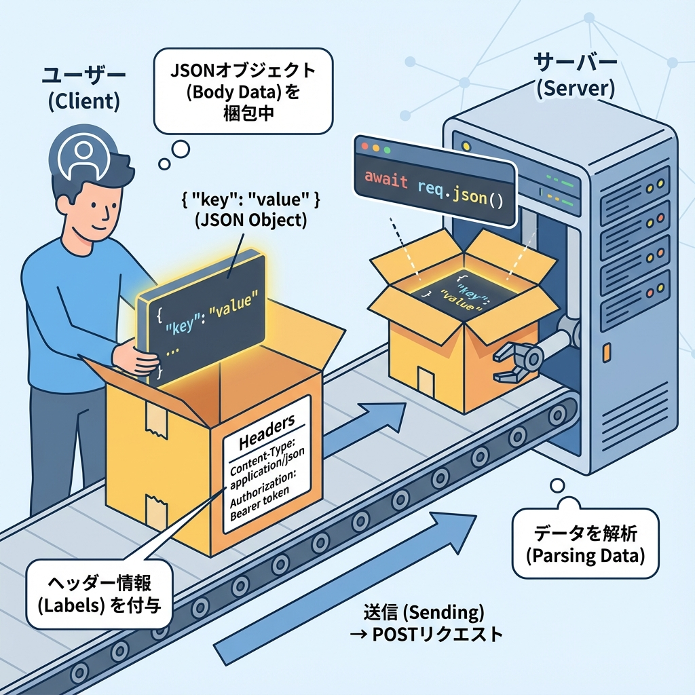
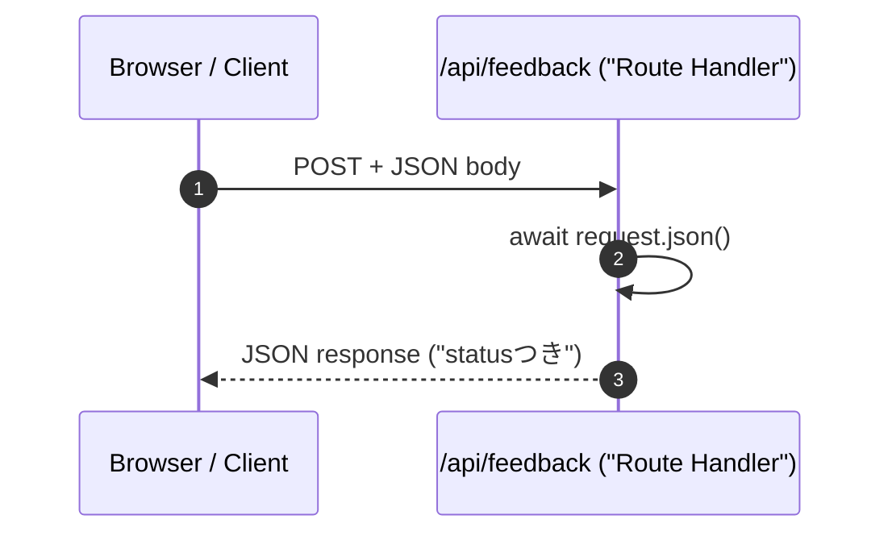
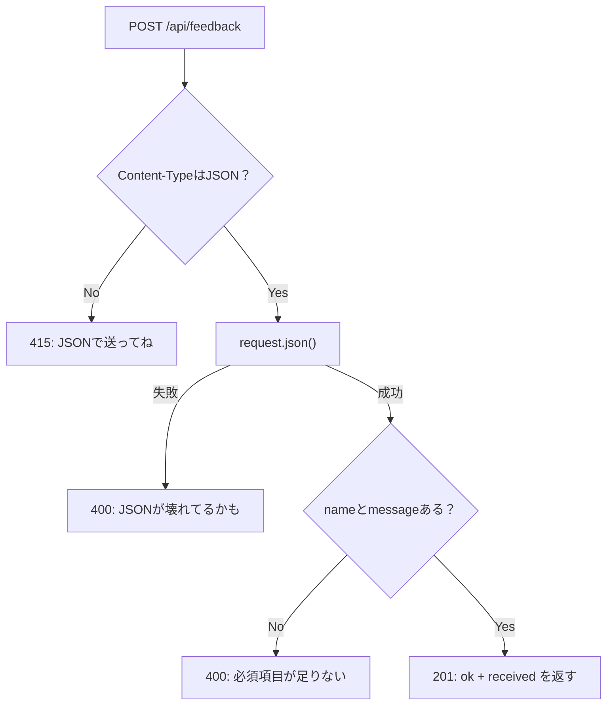

# 第108章：POSTで受ける（body）📥

今回は **Route Handler の POST** で、送られてきたデータ（= body）を受け取って処理する練習だよ〜😊🫶
Route Handler は `app` 配下の `route.ts` で HTTP メソッドごとに関数を用意するだけでOK！ ([Next.js][1])

---

## 🎯 この章のゴール

* `/api/feedback` に **POSTでJSON** を送る
* サーバー側で `request.json()` で受け取る
* **JSONで返す**（成功/失敗の形を作る）✨ ([MDNウェブドキュメント][2])

---

## 🧠 bodyってなに？（超ざっくり）

POSTは「データを送る」イメージ💌
たとえば「お問い合わせ」「新規作成」「ログイン」みたいに、**何かを渡したい**ときに body を使うよ〜😊

---

## 🗺️ 図解：POSTで body が届く流れ（イメージ）📨➡️📦





---

## ✅ 1) `app/api/feedback/route.ts` を作ろう🗂️✨

`app/api/feedback/route.ts` を作って、次を書いてね👇

```ts
import { NextResponse } from "next/server";

type FeedbackBody = {
  name: string;
  message: string;
};

export async function POST(request: Request) {
  // ① Content-Type を軽くチェック（雑でOK🙆‍♀️）
  const contentType = request.headers.get("content-type") ?? "";
  if (!contentType.includes("application/json")) {
    return NextResponse.json(
      { ok: false, error: "JSONで送ってね（Content-Type: application/json）" },
      { status: 415 }
    );
  }

  // ② body を読む（JSON → JSオブジェクト）
  // request.json() は Promise なので await が必要だよ✨ :contentReference[oaicite:2]{index=2}
  let body: FeedbackBody;
  try {
    body = (await request.json()) as FeedbackBody;
  } catch {
    return NextResponse.json(
      { ok: false, error: "JSONの形が壊れてるかも！" },
      { status: 400 }
    );
  }

  // ③ ここでは“超軽い”チェックだけ（本格バリデーションは次章で🛡️）
  if (!body?.name || !body?.message) {
    return NextResponse.json(
      { ok: false, error: "name と message は必須だよ〜🙏" },
      { status: 400 }
    );
  }

  // ④ 受け取った内容を返す（本来はDB保存とかに進む）
  return NextResponse.json(
    {
      ok: true,
      received: {
        name: body.name,
        message: body.message,
      },
    },
    { status: 201 }
  );
}
```

ポイント🌟

* `POST(request: Request)` の `request` は **Web標準の Request** だよ〜！ ([Next.js][1])
* `request.json()` は **body を読み取ってオブジェクトにしてくれる**やつ✨ ([MDNウェブドキュメント][2])
* 返すときは `NextResponse.json(data, { status })` が便利！ ([Next.js][3])

---

## 🧪 2) 動作確認しよう（Windows）🪟💡

開発サーバー起動（もう起動してたらOK！）🚀

```bash
npm run dev
```

### A) `curl.exe` で送る（PowerShellで安全に）🌀

PowerShell だと `curl` が別物なことがあるから、**`curl.exe`** を使うのが安心だよ😊

```bash
curl.exe -X POST "http://localhost:3000/api/feedback" ^
  -H "Content-Type: application/json" ^
  -d "{\"name\":\"Hana\",\"message\":\"Next.jsたのしい！\"}"
```

成功したら、こんな感じが返ってくるはず👇🎉

* `ok: true`
* `received: { name, message }`

### B) PowerShell の `Invoke-RestMethod` で送る🧁

```powershell
Invoke-RestMethod `
  -Method Post `
  -Uri "http://localhost:3000/api/feedback" `
  -ContentType "application/json" `
  -Body '{"name":"Hana","message":"POSTできた！"}'
```

---

## 🧯 よくあるハマりポイント（ここだけ覚えれば勝ち）😆✨

### 1) body が読めない / undefined っぽい🤔

* だいたい **Content-Type が JSON じゃない** or **JSONが壊れてる**
* だから今回みたいに `try/catch` があると安心〜🫶

### 2) `request.json()` を2回呼ぶと…？

bodyは基本「読み切り」なので、**一回で変数に保存**して使うのが安全だよ😊
（何回も必要なら、最初に `const body = await request.json()` して使い回そ〜！） ([MDNウェブドキュメント][2])

---

## 🧭 図解：このPOSTは何をしてる？（分岐の形）🚦



---

## 🏁 ミニ課題（5分）🎀

1. `FeedbackBody` に `email?: string` を追加してみよう📧
2. `email` がある時だけ `received` に入れる（なければ入れない）✨
3. `message` が 200文字以上なら `400` で返す（文言はやさしくね🫶）

---

次の章で「サーバー側のバリデーション（ちゃんと守る🛡️）」に進むと、いよいよAPIっぽさが出てくるよ〜😊💪

[1]: https://nextjs.org/docs/app/getting-started/route-handlers "Getting Started: Route Handlers | Next.js"
[2]: https://developer.mozilla.org/en-US/docs/Web/API/Request/json?utm_source=chatgpt.com "Request: json() method - Web APIs | MDN"
[3]: https://nextjs.org/docs/app/api-reference/functions/next-response "Functions: NextResponse | Next.js"
