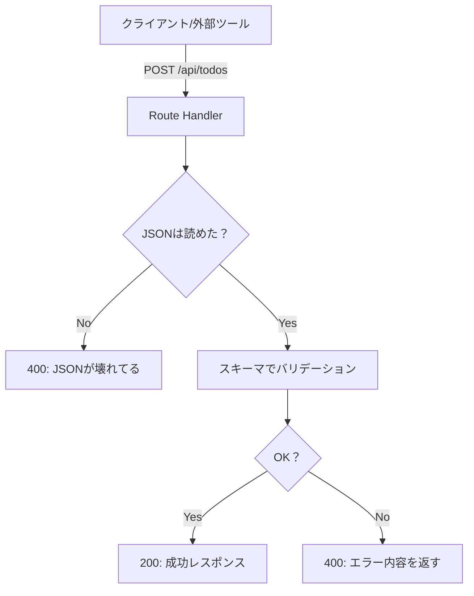
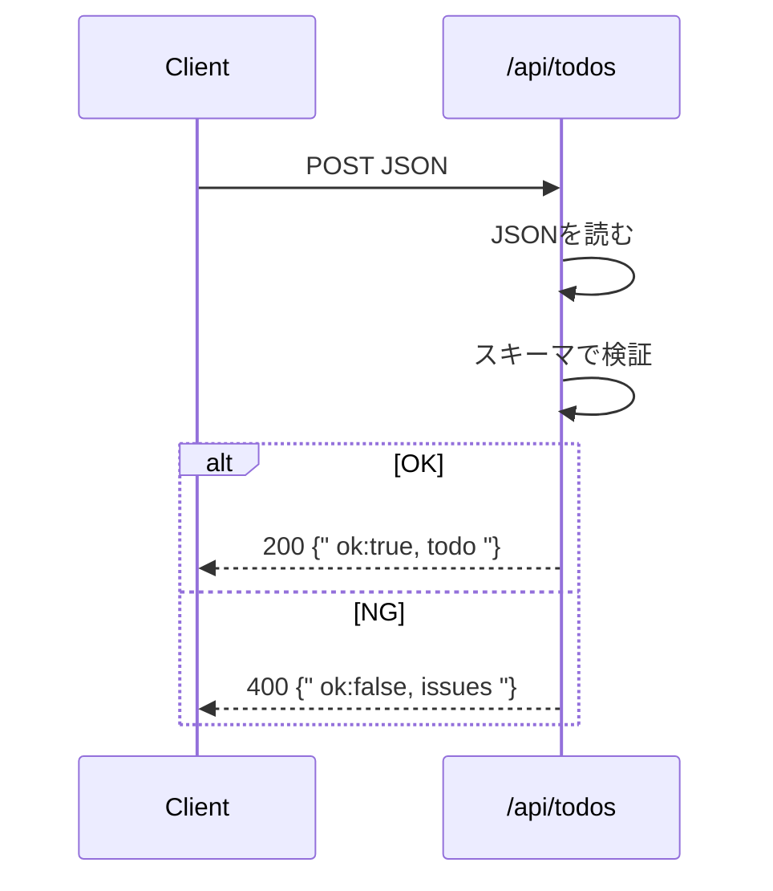

# 第109章：バリデーションはサーバーで絶対やる🛡️

Route Handler（`app/api/.../route.ts`）は **「外から直接叩ける入口」** だよ〜🚪💥
だから、**入力チェック（バリデーション）をサーバー側で必ずやる** のが超大事！🧸🧠

---

## なんで“絶対”サーバーでやるの？🤔

あなたの画面（フォーム）から送る人だけじゃなくて、こんな人も来ます…😇

* ブラウザじゃなくて **Postman / curl** で叩く人🧪
* 変なJSONを投げる人🌀
* 文字数100万とか投げてくる人📦📦📦
* そもそも **あなたのUIを経由しない** リクエスト🕳️

クライアント側のチェックは「親切」🌸
サーバー側のチェックは「防具」🛡️ だよ！

---

## イメージ図（入口でチェック！）🧭




---

## 今回のゴール🎯

**TODO追加API** を例に、サーバーで入力をチェックするよ📋✨
期待する形はこれ👇

* `title`: 必須（1〜50文字）
* `done`: 任意（boolean、なくてもOK）

---

## 1) Zodを入れる（バリデーション用）📦✨

ターミナルで👇（プロジェクト直下）

```bash
npm i zod
```

---

## 2) `app/api/todos/route.ts` を作る🗂️

ここが今回のメインだよ〜！💪💖

```ts
// app/api/todos/route.ts
import { NextResponse } from "next/server";
import { z } from "zod";

// ① 受け取りたい形（スキーマ）を決める🧩
const CreateTodoSchema = z.object({
  title: z
    .string()
    .trim()
    .min(1, "title は必須だよ🙋‍♀️")
    .max(50, "title は50文字までだよ✍️"),
  done: z.boolean().optional(),
});

// ② 型もついでに作れる（便利！）🧷
type CreateTodoInput = z.infer<typeof CreateTodoSchema>;

export async function POST(request: Request) {
  // ③ JSONが壊れてるケースもあるので、まず安全に読む🧯
  let body: unknown;
  try {
    body = await request.json();
  } catch {
    return NextResponse.json(
      { ok: false, error: "JSONの形式が正しくないよ🥺" },
      { status: 400 }
    );
  }

  // ④ safeParseで「落ちずに」チェックする🛡️
  const parsed = CreateTodoSchema.safeParse(body);

  if (!parsed.success) {
    // Zodのエラーを軽く整形して返す🧾
    const issues = parsed.error.issues.map((i) => ({
      path: i.path.join("."),
      message: i.message,
    }));

    return NextResponse.json(
      { ok: false, error: "バリデーション失敗😵", issues },
      { status: 400 }
    );
  }

  // ⑤ ここまで来たら「形が保証された」データだけが残る✨
  const input: CreateTodoInput = parsed.data;

  // 本当はDBに保存…だけど、今は仮で返すよ🧸
  const todo = {
    id: crypto.randomUUID(),
    title: input.title,
    done: input.done ?? false,
    createdAt: new Date().toISOString(),
  };

  return NextResponse.json({ ok: true, todo });
}
```

---

## 返ってくるエラーの形（例）🧾✨

例えば `title: ""` で送ると、こういう感じで返せるよ👇

* `error`: 何が起きたか
* `issues`: どこがダメか（UIに表示しやすい！）

```json
{
  "ok": false,
  "error": "バリデーション失敗😵",
  "issues": [
    { "path": "title", "message": "title は必須だよ🙋‍♀️" }
  ]
}
```

---

## テストしてみる（WindowsのPowerShellでOK）🧪✨

### ✅ 正常ケース

```bash
curl -X POST http://localhost:3000/api/todos ^
  -H "Content-Type: application/json" ^
  -d "{\"title\":\"レポート提出\",\"done\":false}"
```

### ❌ 異常ケース（title空）

```bash
curl -X POST http://localhost:3000/api/todos ^
  -H "Content-Type: application/json" ^
  -d "{\"title\":\"\"}"
```

---

## よくある落とし穴🥲（ここだけ注意！）

* **`request.json()` は失敗することがある**（JSON壊れてると例外！）→ `try/catch` 必須🧯
* **バリデーションは “落とさない” 書き方が大事** → `parse` じゃなくて `safeParse` が安心🛡️
* **クライアント側チェックだけに頼るのはNG**（外から直で叩けるから）🙅‍♀️

---

## 会話の流れ（超ざっくり）💬



---

## ミニ練習💪🌸（この章の範囲で！）

1. `title` を **最大10文字** にしてみよう✍️
2. `done` を送ってきた時、**boolean以外**（例: `"yes"`）だと弾けるか試そう🧪
3. `issues` を見て、**画面に出すとしたらどう表示する？** を想像してみよう😊💭

---

この章はここまで！🎉
サーバーでバリデーションできると、APIが一気に“強くて優しい”感じになるよ〜🛡️🫶✨
