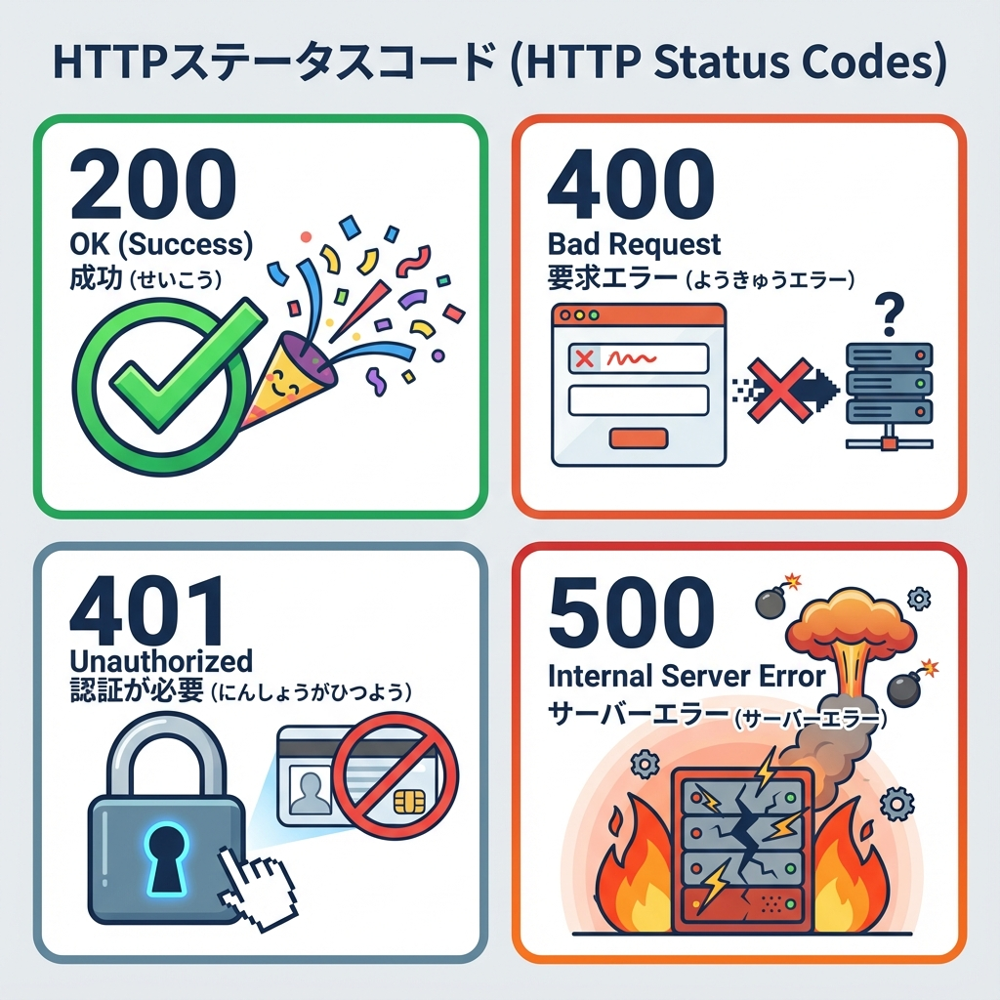
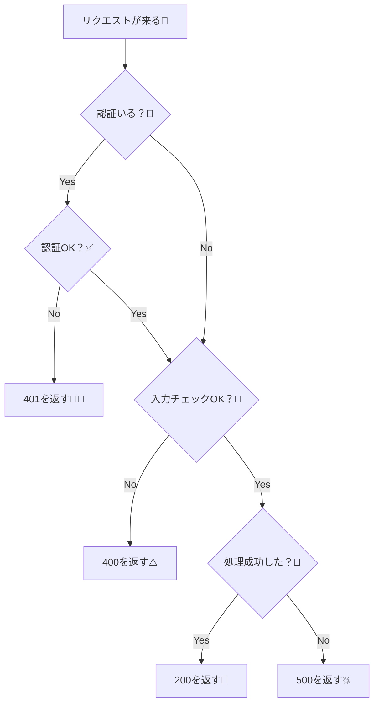

# 第110章：ステータスコードの基本（200/400/401/500）🚦

この章では、**Route Handler（API）で「正しいステータスコード」を返す感覚**をつかむよ〜！😊
ステータスコードがちゃんとしてると、フロント側が「成功？失敗？ログイン必要？」を判断しやすくなって、アプリが一気に作りやすくなるよ🎁✨

---

## この章のゴール🎯

* **200 / 400 / 401 / 500** を「いつ使うか」分かる🧠✨
* Next.js の Route Handler で **status を付けて返せる**ようになる🚀
* エラーを「ユーザーに優しく」返すコツが分かる🫶

---

## ステータスコードってなに？📮

API は基本的に、レスポンスでこの2つを返してるよ👇

* **中身（JSONなど）**：何が起きたか
* **ステータスコード**：成功か失敗か、失敗なら種類はなにか

つまりステータスコードは、**APIが出す「結果の信号」**みたいなもの🚦✨

---

## 4つだけ覚えよう！200 / 400 / 401 / 500 🌟

### ✅ 200 OK：成功🎉

* ちゃんと処理できた！
* データ返せた！
* 保存できた！

例：TODO一覧を返せた📋✨

---

### ⚠️ 400 Bad Request：リクエストが悪い（入力ミス）📝💦

* 必須の値がない
* 形式が変（例：JSON壊れてる）
* バリデーションNG（文字数オーバーなど）

例：「title が空」なのに追加しようとした😵‍💫

---

### 🔐 401 Unauthorized：ログインしてない/認証できない🙅‍♀️🔑

* トークンがない
* トークンが間違ってる
* ログインしてないのに保護APIを叩いた

例：Authorization ヘッダーが無いのに叩いた🚫

※ちょい補足：

* **401** = 認証が必要（あなた誰？）
* **403** = 認証はできてるけど権限がない（あなたはダメ！）
  今回は章の対象が401なので、まずはここまででOK😊👌

---

### 💥 500 Internal Server Error：サーバー側で事故った🚑🔥

* 予期せぬ例外（コードが落ちた）
* DBが死んだ
* 外部APIが落ちた…など

例：try/catch の catch に入った🧯

---

## 図解：Route Handler の判断ルート🚦🧠





---

## Next.js Route Handler で status を付けて返す🛠️✨

`app/api/todos/route.ts` の例だよ👇
（**「成功は200」「入力ミスは400」「未ログインは401」「想定外は500」**の型を作る感じ！）

```ts
import { NextResponse } from "next/server";

export async function POST(req: Request) {
  try {
    // ① 認証チェック（例：超ざっくり）
    const auth = req.headers.get("authorization");
    if (!auth) {
      return NextResponse.json(
        { ok: false, error: { code: "UNAUTHORIZED", message: "ログインが必要です🙇‍♀️" } },
        { status: 401 }
      );
    }

    // ② bodyを読む
    const body = await req.json().catch(() => null);
    if (!body) {
      return NextResponse.json(
        { ok: false, error: { code: "BAD_JSON", message: "JSONの形式が変かも…🥺" } },
        { status: 400 }
      );
    }

    const title = String(body.title ?? "").trim();

    // ③ 入力チェック
    if (!title) {
      return NextResponse.json(
        { ok: false, error: { code: "VALIDATION", message: "title は必須だよ〜📝💦" } },
        { status: 400 }
      );
    }

    // ④ ここで本来はDB保存とかする（今回は成功したことにする）
    const created = { id: crypto.randomUUID(), title };

    // ⑤ 成功
    return NextResponse.json({ ok: true, data: created }, { status: 200 });
  } catch (err) {
    // ⑥ 想定外
    console.error(err);
    return NextResponse.json(
      { ok: false, error: { code: "INTERNAL", message: "サーバーでエラーが起きたよ…🙏" } },
      { status: 500 }
    );
  }
}
```

---

## よくあるミスあるある🧸💡

### ❌ なんでも 200 で返しちゃう

たとえば失敗なのに 200 で `{ ok:false }` だけ返すと、フロント側が混乱しやすいよ😵‍💫
→ **HTTPのstatusと、JSONの中身（ok/error）をセットで整える**のがきれい✨

### ❌ 401 と 400 を逆にしちゃう

* 入力ミス → **400**
* ログイン必要 → **401**

ここだけでも守るとかなり強い💪✨

---

## ミニ練習✏️🌸（5分でOK）

### お題🎯

次の状況なら、どのステータスを返す？（理由も一言で！）

1. `title` が空文字だった
2. Authorization ヘッダーが無い
3. DB接続で例外が出た（catchに入った）
4. 正常にTODOが追加できた

答え👇

* 1. **400**（入力ミス）
* 2. **401**（認証できない）
* 3. **500**（サーバー側の事故）
* 4. **200**（成功）

---

## まとめ📦✨

* **200**：成功🎉
* **400**：入力・リクエストが悪い📝💦
* **401**：認証が必要/できない🔐
* **500**：サーバー側で想定外💥

この4つがちゃんと返せるだけで、APIが一気に「プロっぽい」顔になるよ〜！😆🚀✨
