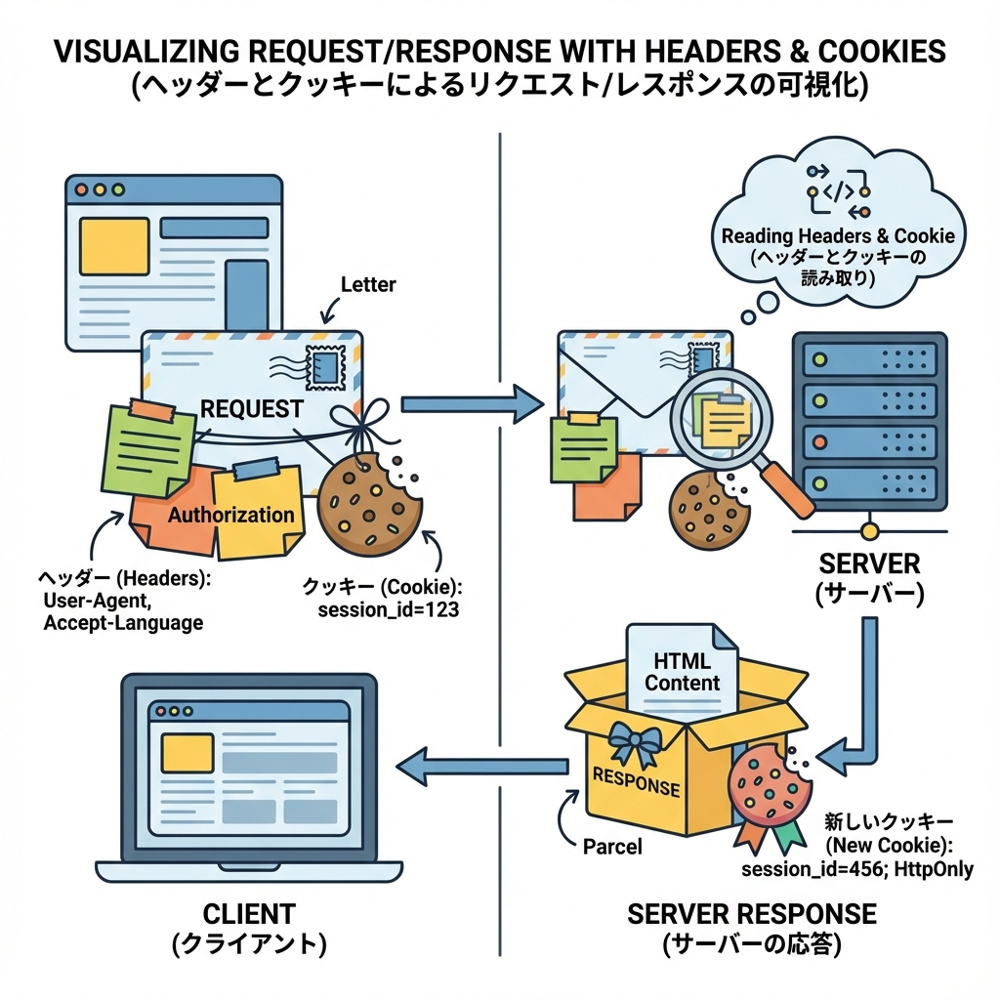
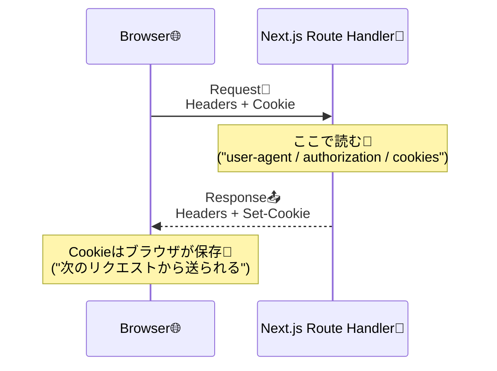

# 第111章：Cookie/Headersの扱い方の雰囲気🍪

この章では「Route Handler（`app/api/.../route.ts`）」で **Cookie と Headers を“読む/返す/ちょい足す”** 感覚をつかむよ〜😊💡
（ガチ実装は後でOK！まずは雰囲気だけ🎈）

---

## 1) まずは超ざっくり図解🧠✨



* **Headers**：リクエスト/レスポンスに付く「追加情報メモ」📎（例：`user-agent`、`authorization`、`content-type`）
* **Cookie**：ブラウザ側に保存される小さなメモ帳🍪
  サーバーは **レスポンスの `Set-Cookie`** で「これ保存してね」とお願いするだけ🙏（保存するのはブラウザ） ([Next.js][1])



---

## 2) Next.js的に覚えること（超重要3つ）✅✨

### ✅ (1) `cookies()` / `headers()` は **await が要る**（最近のNext.js）

`cookies()` と `headers()` は **async** になってて、`await` で取るのが基本だよ〜⏳ ([Next.js][1])

### ✅ (2) Cookieの `.set()` / `.delete()` は **Route Handler か Server Action で**

Cookieを“変更”する操作は、レスポンスヘッダーを作れる場所じゃないと無理！って感じ💪 ([Next.js][1])

### ✅ (3) Cookieは「その場で読めるようになる」わけじゃない

同じリクエスト中に `set` したCookieは、**ブラウザが受け取って保存して、次のリクエストから**反映されるよ🍪🔁 ([Next.js][1])

---

## 3) 実践：Route Handlerで Cookie/Headers を触ってみる🍪📮🎮

### ゴール🎯

* `user-agent`（ヘッダー）を読む👀
* `visit`（Cookie）を増やす➕
* レスポンスに **追加ヘッダー** を付ける📎

### ファイルを作る🗂️

* `app/api/debug/route.ts`
  ※ もし `src/` 構成なら `src/app/api/debug/route.ts` だよ〜🧁

```ts
import { NextRequest, NextResponse } from 'next/server'

export async function GET(request: NextRequest) {
  // ✅ ヘッダーを読む（リクエスト側）
  const userAgent = request.headers.get('user-agent') ?? 'unknown'

  // ✅ Cookieを読む（リクエスト側）
  const current = Number(request.cookies.get('visit')?.value ?? '0')
  const next = current + 1

  // ✅ 返す（レスポンス）
  const res = NextResponse.json({
    message: 'debug ok ✨',
    userAgent,
    visit: next,
  })

  // ✅ ヘッダーを“付ける”（レスポンス側）
  res.headers.set('x-from', 'route-handler')

  // ✅ Cookieを“付ける”（レスポンス側）
  res.cookies.set('visit', String(next), {
    httpOnly: true, // JSから触れない（セキュリティ強め）🛡️
    sameSite: 'lax', // まずはLaxが無難🍀
    secure: process.env.NODE_ENV === 'production', // 本番はHTTPS前提🔒
    path: '/',
    maxAge: 60 * 60 * 24 * 7, // 7日（秒）
  })

  return res
}
```

`NextResponse` は、普通の `Response` を便利にしたやつで、`cookies` などを扱いやすいよ〜🍪✨ ([Next.js][2])

---

## 4) 動作チェック（めちゃ楽）🧪✨

1. 開発サーバ起動：`npm run dev` 🚀
2. ブラウザで開く：
   `http://localhost:3000/api/debug` 🌈
3. リロード連打🔁
   → `visit` の数字が増えたら成功🎉🎉🎉

**Cookieの中身を見たい時**（HttpOnlyでもDevToolsでは見えるよ）
Chromeなら：DevTools → Application → Cookies 🍪

---

## 5) Cookieの属性、ふわっと理解🧷🍪

* `httpOnly: true`：JSから読めなくする（セッション系でよく使う）🛡️
* `secure: true`：HTTPSでだけ送る🔒（※ローカルは例外っぽい挙動もあるよ）
* `sameSite`：別サイトからのリクエスト時に送るかどうか🍀
  `None` を使うなら `Secure` も必要、みたいなルールがあるよ📌 ([MDN Web Docs][3])

---

## 6) よくある「ん？」ポイント2つ😵‍💫➡️😊

### ① `headers()` / `cookies()` はどこでも使えるの？

基本は **サーバー側**（Server Components / Route Handlers / Server Actions）だよ〜☁️ ([Next.js][4])

### ② 「ログイン情報」をCookieに入れていい？

**中身そのもの**（パスワードとか）は絶対NG🙅‍♀️
普通は **セッションID** とか **短命トークン** を `httpOnly` で入れる、みたいな設計にするよ〜🛡️
（Cookieはヘッダーで運ばれるだけ、って意識が大事） ([MDN Web Docs][5])

---

## 7) ミニ練習（5分）⏱️✨

`/api/hello` を作って、こんなJSONを返してみてね👇😊

* `acceptLanguage`：`request.headers.get('accept-language')`
* `hasVisitCookie`：`Boolean(request.cookies.get('visit'))`

できたら完成〜🎉🍪📮

[1]: https://nextjs.org/docs/app/api-reference/functions/cookies "Functions: cookies | Next.js"
[2]: https://nextjs.org/docs/app/api-reference/functions/next-response?utm_source=chatgpt.com "Functions: NextResponse"
[3]: https://developer.mozilla.org/ja/docs/Web/HTTP/Guides/Cookies?utm_source=chatgpt.com "HTTP Cookie の使用 - MDN Web Docs"
[4]: https://nextjs.org/docs/app/api-reference/functions/headers "Functions: headers | Next.js"
[5]: https://developer.mozilla.org/ja/docs/Web/HTTP/Reference/Headers/Set-Cookie?utm_source=chatgpt.com "Set-Cookie ヘッダー - HTTP - MDN Web Docs"
