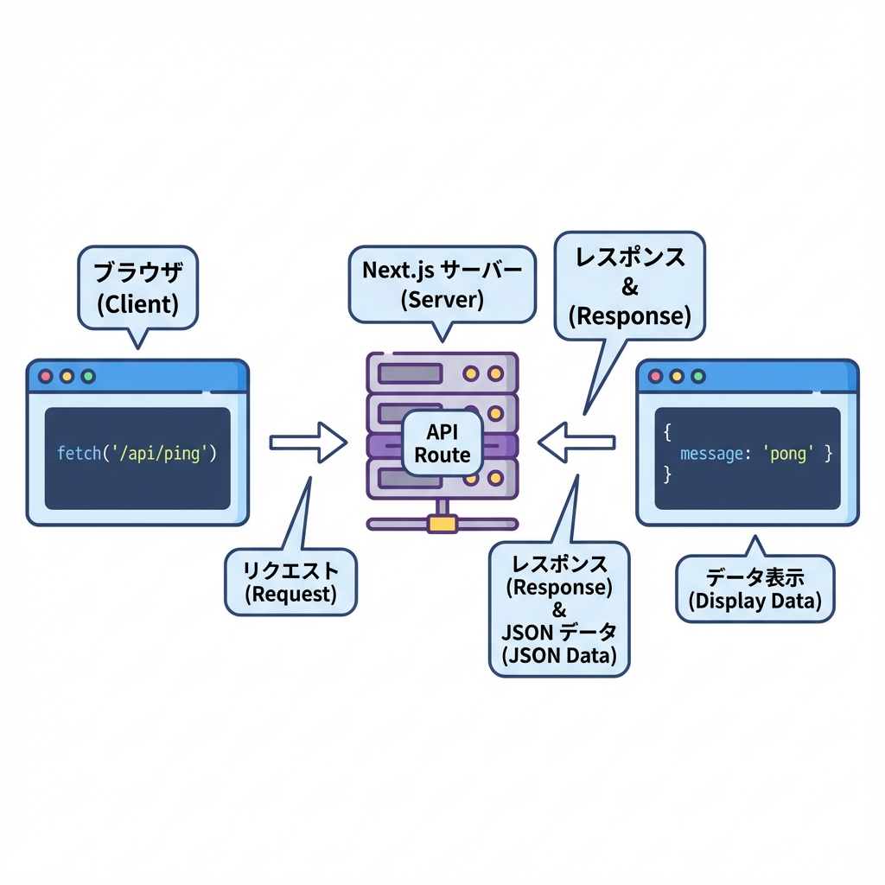
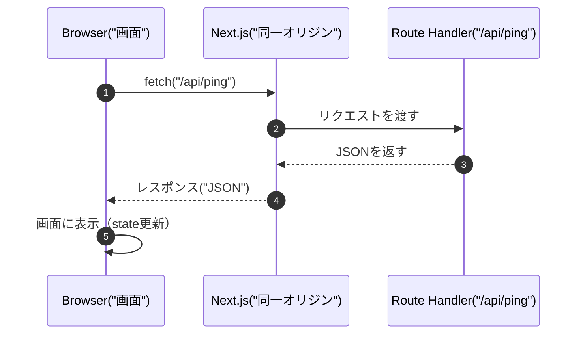

# 第112章：クライアントから叩いてみる（fetch）🎯

この章では、**Next.jsの Route Handler（`/api/...`）を、ブラウザ（クライアント側）から `fetch()` で呼ぶ**ところを体験するよ〜！🥳
「APIを作ったけど、画面からどうやって使うの？」を、ここでスッキリさせよっ💡💕

---

## ゴール🏁

* ✅ 画面（Client Component）から `/api/ping` を `fetch()` で呼べる
* ✅ **Loading / Error / 成功表示**ができる
* ✅ よくあるミス（`"use client"`忘れ等）を回避できる

---

## ざっくり図解🗺️（これがやりたい流れ！）





---

## 1) まずは叩く先（API）を用意する🧪📦

※すでに別のAPIがあるなら、それを叩いてもOKだよ！👌
ここでは動作確認しやすい **`/api/ping`** を作るね✨

### フォルダとファイル📁

```text
app/
  api/
    ping/
      route.ts
```

### `app/api/ping/route.ts`（GETでJSONを返す）📤

```ts
import { NextResponse } from "next/server";

export async function GET() {
  return NextResponse.json(
    {
      ok: true,
      message: "pong 🏓",
      at: new Date().toISOString(),
    },
    { status: 200 }
  );
}
```

✅ これで **`http://localhost:3000/api/ping`** を開くとJSONが見えるはずだよ👀✨
（開発サーバーは `npm run dev` で起動中の想定だよ〜🚀）

---

## 2) 画面（クライアント）から fetch して表示する🎮✨

ポイントはここっ👇

* **Client Component** でやる（＝ファイル先頭に `"use client"` 必須！）⚠️
* `fetch()` → `response.ok` をチェック → `response.json()`
* Loading / Error をちゃんと作る（優しさ💗）

### 例：`app/ping/page.tsx` を作って表示する📄

```tsx
"use client";

import { useEffect, useState } from "react";

type PingResponse =
  | { ok: true; message: string; at: string }
  | { ok: false; error: string };

export default function PingPage() {
  const [data, setData] = useState<PingResponse | null>(null);
  const [loading, setLoading] = useState(false);
  const [error, setError] = useState<string | null>(null);

  async function load() {
    setLoading(true);
    setError(null);

    try {
      const res = await fetch("/api/ping", {
        method: "GET",
        cache: "no-store", // ブラウザのキャッシュを避けたい時のおまじない✨
      });

      if (!res.ok) {
        // 例：500や404の時
        throw new Error(`HTTP ${res.status}`);
      }

      const json = (await res.json()) as { ok: true; message: string; at: string };
      setData(json);
    } catch (e) {
      setData(null);
      setError(e instanceof Error ? e.message : "unknown error");
    } finally {
      setLoading(false);
    }
  }

  // ページを開いた瞬間に1回読み込み（好みで消してもOK👌）
  useEffect(() => {
    load();
  }, []);

  return (
    <main style={{ padding: 16 }}>
      <h1>Ping テスト 🏓</h1>

      <button
        onClick={load}
        disabled={loading}
        style={{ padding: "8px 12px", marginTop: 12, cursor: "pointer" }}
      >
        {loading ? "読み込み中…⏳" : "APIを叩く！🎯"}
      </button>

      {error && (
        <p style={{ marginTop: 12 }}>
          失敗…🥲 <strong>{error}</strong>
        </p>
      )}

      {data && (
        <pre
          style={{
            marginTop: 12,
            padding: 12,
            background: "#f6f6f6",
            borderRadius: 8,
            overflowX: "auto",
          }}
        >
          {JSON.stringify(data, null, 2)}
        </pre>
      )}

      {!loading && !error && !data && <p style={{ marginTop: 12 }}>まだ何もないよ〜🐣</p>}
    </main>
  );
}
```

---

## 3) ここが大事！よくあるミス集🧯😵‍💫

### ❌ `"use client"` を忘れる

* `useState` や `useEffect` を使う＝クライアント
* 忘れるとエラーになったり、動かないよ〜⚠️

### ❌ `res.json()` の前に `res.ok` を見ない

* 404でも500でも `json()` は呼べちゃうことがあるけど、**まず `res.ok`** で分岐するのが安心🍀

### ❌ `/api/...` を絶対URLにしちゃう

* 基本は **`fetch("/api/ping")` みたいに相対パスでOK**🙆‍♀️
* 同一オリジンだからCORS地獄にならないのが嬉しいポイント🎉

---

## 4) ミニ課題🎓✨（10分でできるよ！）

1. `route.ts` のJSONに `name: "Akikun"` を追加してみよ🙂
2. 画面に「今の時刻：xxxx」みたいに表示してみよ⏰
3. わざと `throw new Error("boom")` を入れて、エラー表示が出るか試してみよ🧨（終わったら戻そ！）

---

## まとめ🧡

* Route Handler は **クライアントから `fetch("/api/...")` で呼べる**🎯
* **Client Component（"use client"）** で、Loading / Error をセットで作ると強い💪✨
* 同一オリジンだから、まずは気楽に試せるよ〜🥰🎀
