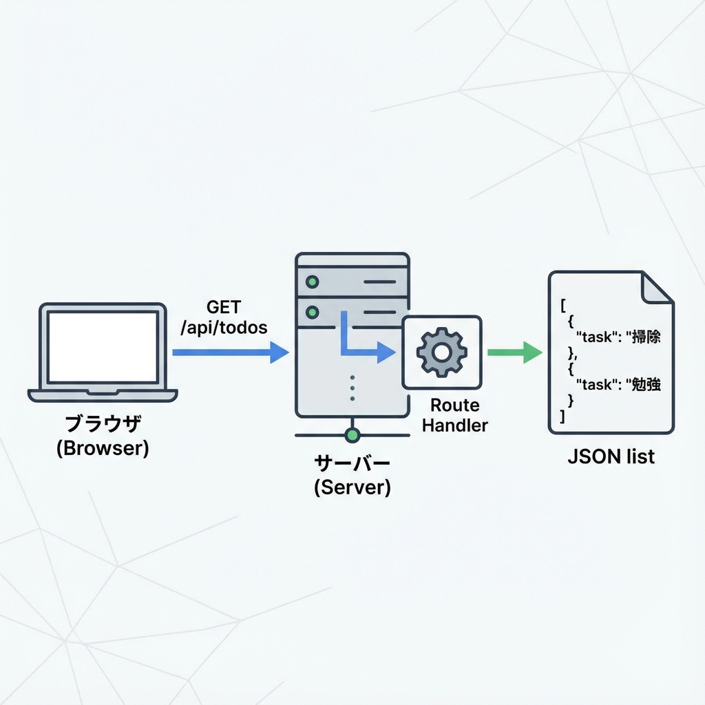
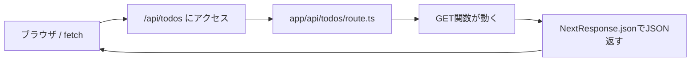

# 第113章：練習：/api/todos を作って一覧返す📋

この章では **Route Handler** を使って、`/api/todos` にアクセスすると **TODO一覧（JSON）** が返ってくるAPIを作ります😊🧪
Route Handlers は `app` ディレクトリ内で `route.ts`（または `route.js`）として作る仕組みだよ〜！ ([Next.js][1])

---

## ゴール🎯

`http://localhost:3000/api/todos` にアクセスすると、こんなJSONが返る✅

```json
{
  "todos": [
    { "id": "1", "title": "レポートの下書き", "done": false, "createdAt": "2025-12-25T00:00:00.000Z" },
    { "id": "2", "title": "ゼミ資料を読む", "done": true, "createdAt": "2025-12-24T00:00:00.000Z" }
  ]
}
```

---

## 図でイメージつかもう🧠🗺️（Mermaid）





---

## 手順①：ファイルを作る📁✨

プロジェクトに `src` があるかで置き場所が変わるよ👇
（どっちか “自分の構成” に合わせてOK😊）

* `src` がある場合：`src/app/api/todos/route.ts`
* `src` がない場合：`app/api/todos/route.ts`

フォルダ構成イメージ👇

```txt
app
└─ api
   └─ todos
      └─ route.ts
```

---

## 手順②：/api/todos の中身を書く✍️📋

`route.ts` を作って、これをコピペでOK〜！😊💡
`NextResponse.json()` がめっちゃ便利で、JSONレスポンスが簡単に返せます✨ ([Zenn][2])

```ts
import { NextResponse } from "next/server";

type Todo = {
  id: string;
  title: string;
  done: boolean;
  createdAt: string; // ISO文字列にしておくと扱いやすいよ✨
};

// 今回は「DBなし」で、固定のダミーデータにするよ📌
const todos: Todo[] = [
  {
    id: "1",
    title: "レポートの下書き",
    done: false,
    createdAt: new Date("2025-12-25").toISOString(),
  },
  {
    id: "2",
    title: "ゼミ資料を読む",
    done: true,
    createdAt: new Date("2025-12-24").toISOString(),
  },
];

// GET /api/todos
export async function GET() {
  return NextResponse.json({ todos }, { status: 200 });
}
```

---

## 手順③：動作チェックする✅🌈

開発サーバー起動（もう起動中ならスキップでOK）🏃‍♀️💨

```bash
npm run dev
```

ブラウザでここへアクセス👇✨
`http://localhost:3000/api/todos`

---

## 手順④：PowerShellでも確認してみる（任意）🪄🖥️

Windowsなら PowerShell でこうすると見やすいよ😊

```powershell
Invoke-RestMethod http://localhost:3000/api/todos | ConvertTo-Json -Depth 10
```

---

## よくあるミスあるある🫠（ここだけ見て！）

* **`route.ts` の置き場所が違う**
  → `app/api/todos/route.ts` になってるか確認👀
* **`route.ts` と同じ場所に `page.tsx` を置いてる**
  → 同じルートセグメントに `page` と `route` は同居できないので、APIは `app/api/...` に分けよう🧹 ([Next.js 16 日本語ドキュメント][3])

---

## できた！🎉 次の章につながるポイント✨

今日は「一覧を返すだけ」だけど、次（第114章）で **POSTで追加**できるようにすると、一気に“APIっぽさ”が出て楽しくなるよ➕😆

[1]: https://nextjs.org/docs/app/getting-started/route-handlers?utm_source=chatgpt.com "Getting Started: Route Handlers"
[2]: https://zenn.dev/begineer/articles/419d63f5451689?utm_source=chatgpt.com "Next.jsのRoute Handlers入門 ─ App RouterでAPIを定義 ..."
[3]: https://nextjsjp.org/docs/app/getting-started/route-handlers?utm_source=chatgpt.com "Route Handlers | Next.js 16 日本語ドキュメント"
