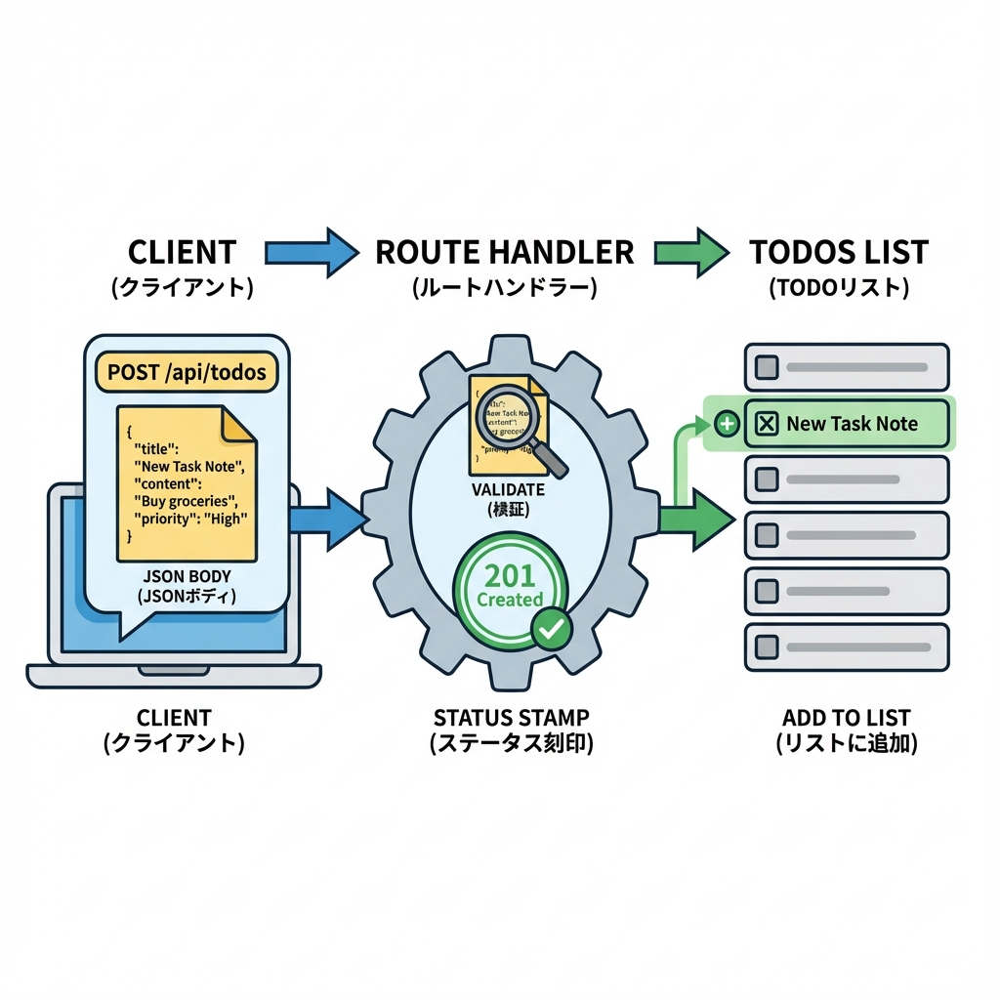
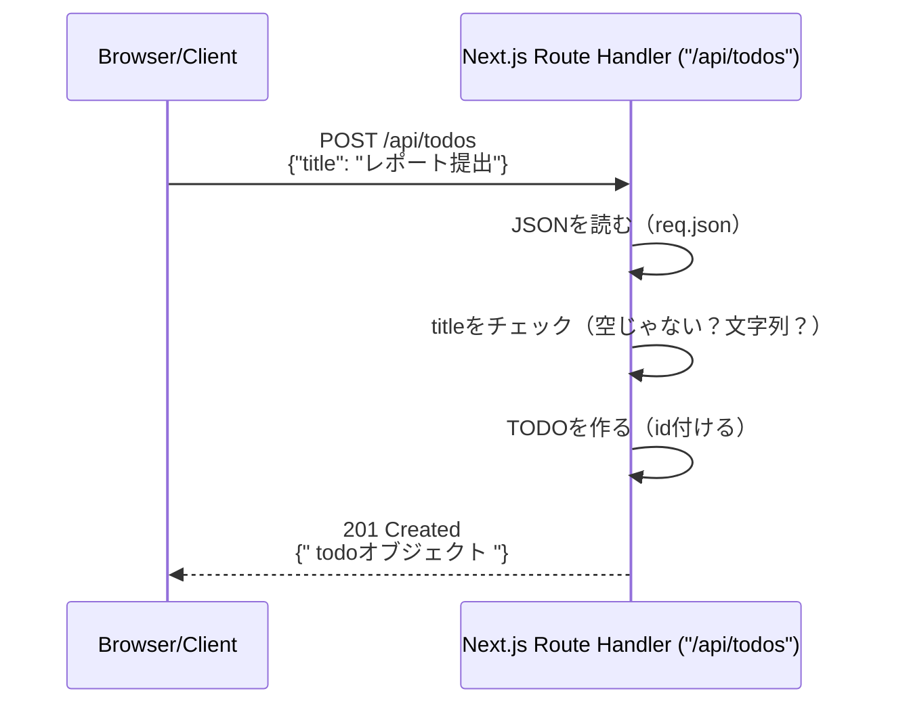

# 第114章：練習：/api/todos に追加POSTする➕

今日は「TODOを追加するAPI」を作るよ〜！🎀
**`POST /api/todos`** に `{ title: "..." }` を送ったら、新しいTODOが返ってくる状態にします💪😊

---

## この章のゴール🎯

* `POST /api/todos` を作れる✨
* リクエストの **body(JSON)** を受け取れる📩
* **最低限のバリデーション**ができる🛡️
* `201 Created` で追加したTODOを返せる✅

---

## まずは図でイメージしよ〜🧠🪄





---

## 実装：`app/api/todos/route.ts` に POST を追加する🛠️💖

> 第113章で `GET` がある前提で、**同じファイルにPOSTも足す**感じでいくよ〜😊

### ✅ 完成形（GET + POST）

```ts
import { NextResponse } from "next/server";

type Todo = {
  id: string;
  title: string;
  done: boolean;
  createdAt: string;
};

// ※練習用：メモリ上のDB（開発サーバー再起動で消えるよ！）
const todos: Todo[] = [
  {
    id: "1",
    title: "最初のTODO",
    done: false,
    createdAt: new Date().toISOString(),
  },
];

export async function GET() {
  return NextResponse.json({ todos });
}

export async function POST(req: Request) {
  try {
    // JSONが壊れてた時に落ちないようにする🌷
    const body: unknown = await req.json().catch(() => null);

    // 形チェック（ゆるく安全に）🛡️
    if (
      !body ||
      typeof body !== "object" ||
      !("title" in body) ||
      typeof (body as any).title !== "string"
    ) {
      return NextResponse.json(
        { error: "title は文字列で必須です 🥺" },
        { status: 400 }
      );
    }

    const title = (body as any).title.trim();

    if (title.length === 0) {
      return NextResponse.json(
        { error: "title は空にできません 🥺" },
        { status: 400 }
      );
    }

    if (title.length > 100) {
      return NextResponse.json(
        { error: "title が長すぎます（100文字まで）🥺" },
        { status: 400 }
      );
    }

    const todo: Todo = {
      id: crypto.randomUUID(),
      title,
      done: false,
      createdAt: new Date().toISOString(),
    };

    // 先頭に追加（新しい順）✨
    todos.unshift(todo);

    // 201 Created で、作ったTODOを返す🎉
    return NextResponse.json({ todo }, { status: 201 });
  } catch {
    return NextResponse.json(
      { error: "サーバー側でエラーが起きました 🙇‍♀️" },
      { status: 500 }
    );
  }
}
```

---

## 動作確認：Windowsで叩いてみよう🎯💻

開発サーバー起動（すでに起動中ならOK）🚀

```bash
npm run dev
```

### ✅ 1) POSTで追加（curl）

```bash
curl -X POST http://localhost:3000/api/todos ^
  -H "Content-Type: application/json" ^
  -d "{\"title\":\"レポート提出\"}"
```

### ✅ 2) POSTで追加（PowerShell）

```powershell
Invoke-RestMethod `
  -Method Post `
  -Uri "http://localhost:3000/api/todos" `
  -ContentType "application/json" `
  -Body '{"title":"ゼミの資料作る"}'
```

### ✅ 3) GETで一覧を見る

```bash
curl http://localhost:3000/api/todos
```

---

## 期待するレスポンス例🎁✨

### POST成功（201）

```json
{
  "todo": {
    "id": "（ランダムなUUID）",
    "title": "レポート提出",
    "done": false,
    "createdAt": "2025-12-25T..."
  }
}
```

### titleが空（400）

```json
{ "error": "title は空にできません 🥺" }
```

---

## よくあるミスあるある🐣💥

* `Content-Type: application/json` を付け忘れて、うまく読めない🌀
* `req.json()` を **2回呼んで**「もう読めないよ！」ってなる（bodyは基本1回だけ）⚠️
* `title` の前後スペースをトリムしてなくて、空文字が通っちゃう😵‍💫

---

## ミニ練習（やってみよ〜！）🎀✨

1. `title` が **重複**してたら 409 を返す（任意）🚦
2. `done` も受け取りたいなら、`boolean` かチェックして反映してみる✅
3. レスポンスに `count`（現在の件数）を入れてみる📦

---

これで **「追加POST」** できたよ〜！🎉➕
次の章（第115章）で、エラーの型をちゃんと決めるとさらに美しくなる✨🧷
