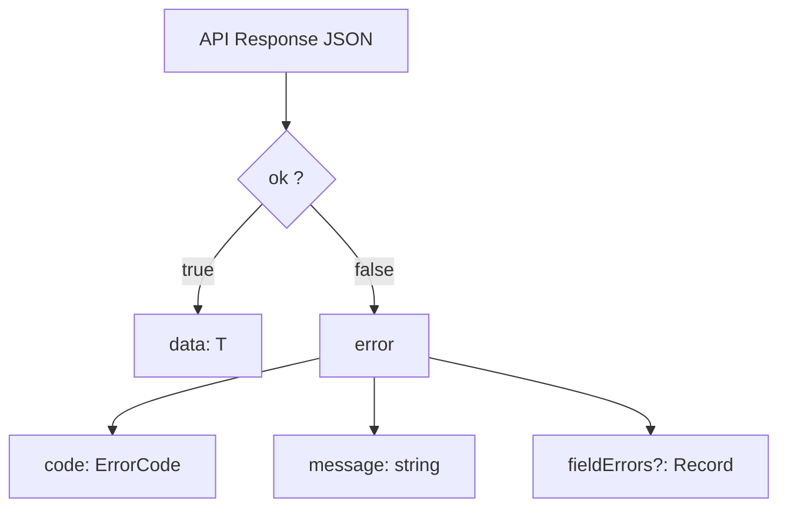
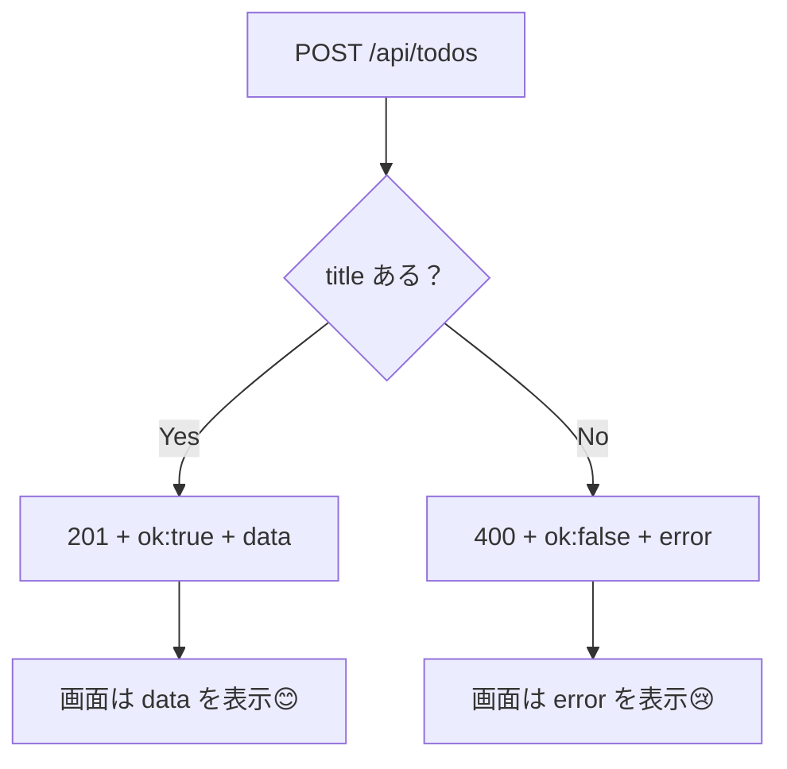

# 第115章：エラーレスポンス設計（型を決める）🧷💥

この章では、**Route Handler（API）で失敗したときの返し方**を「毎回同じ形」にそろえます😊
そうすると、フロント側（画面）での処理がめちゃくちゃラクになります✨

---

## 1. なんで「エラーの形」を決めるの？🤔🧠

APIって、成功のときはだいたい良いんだけど…

* 😵‍💫 エラーのときだけ形がバラバラ
* 😵‍💫 たまにHTMLが返ってくる
* 😵‍💫 messageが無かったり、どこが悪いかわからない

こうなると、画面側で毎回 if 地獄になります🔥

だから最初にこう決めちゃう👇

✅ **「成功でも失敗でも、必ず同じ“外側”の形で返す」**
✅ **TypeScriptで型も固定する**

---

## 2. この章のゴール🎯✨

* ✅ APIの返却は **必ず** `ApiResponse<T>` の形
* ✅ 失敗のときは `ok: false` + `error: {...}` を返す
* ✅ 画面側は **同じ書き方**でエラー表示できる

---

## 3. レスポンスの「固定フォーマット」案📦✨

### ✅ 成功レスポンス（例）

```json
{
  "ok": true,
  "data": { "id": "1", "title": "買い物" }
}
```

### ✅ 失敗レスポンス（例）

```json
{
  "ok": false,
  "error": {
    "code": "VALIDATION_ERROR",
    "message": "title は必須です",
    "fieldErrors": {
      "title": "1文字以上で入力してね"
    }
  }
}
```

---

## 4. 図解：レスポンス構造🧩📌（Mermaid）




---

## 5. 型を作ろう🧷（まずはここ！）

`app/` からも使いやすい場所として、たとえばこんな感じに作ります👇

📁 `lib/api.ts`

```ts
// lib/api.ts

export type ApiErrorCode =
  | "VALIDATION_ERROR"
  | "NOT_FOUND"
  | "UNAUTHORIZED"
  | "INTERNAL_ERROR";

export type ApiError = {
  code: ApiErrorCode;
  message: string;

  // フォームのどこが悪いかを返したい時に便利✨（任意）
  fieldErrors?: Record<string, string>;
};

export type ApiSuccess<T> = {
  ok: true;
  data: T;
};

export type ApiFailure = {
  ok: false;
  error: ApiError;
};

export type ApiResponse<T> = ApiSuccess<T> | ApiFailure;
```

---

## 6. 返す処理を楽にする「ヘルパー」🍱✨

Route Handlerで毎回 `NextResponse.json(...)` を書くのしんどいので、便利関数を作ります😊

📁 `lib/apiResponse.ts`

```ts
// lib/apiResponse.ts
import { NextResponse } from "next/server";
import type { ApiError, ApiResponse } from "./api";

export function jsonOk<T>(data: T, init?: ResponseInit) {
  const body: ApiResponse<T> = { ok: true, data };
  return NextResponse.json(body, init);
}

export function jsonError(error: ApiError, status: number, init?: ResponseInit) {
  const body: ApiResponse<never> = { ok: false, error };
  return NextResponse.json(body, { ...init, status });
}
```

---

## 7. Route Handlerで使ってみよう🚪🧪

例：`/api/todos` の POST を「失敗しても整った形」で返す✨

📁 `app/api/todos/route.ts`

```ts
import { jsonError, jsonOk } from "@/lib/apiResponse";
import type { ApiError } from "@/lib/api";

type Todo = {
  id: string;
  title: string;
};

export async function POST(req: Request) {
  try {
    const body = await req.json().catch(() => null) as unknown;

    // ざっくり型チェック（初心者向けにシンプルに！）
    const title = typeof (body as any)?.title === "string" ? (body as any).title.trim() : "";

    if (!title) {
      const err: ApiError = {
        code: "VALIDATION_ERROR",
        message: "title は必須です",
        fieldErrors: { title: "1文字以上で入力してね" },
      };
      return jsonError(err, 400);
    }

    // 本当はDB保存だけど、ここでは仮で作る🧸
    const todo: Todo = { id: crypto.randomUUID(), title };

    return jsonOk(todo, { status: 201 });
  } catch (e) {
    // ここでは「内部エラー」として統一して返す（詳細はログに出すのが基本）🧯
    const err: ApiError = {
      code: "INTERNAL_ERROR",
      message: "サーバー側で問題が起きました。もう一度試してね🙏",
    };
    return jsonError(err, 500);
  }
}
```

---

## 8. 図解：成功・失敗の分岐🚦✨（Mermaid）



---

## 9. 画面側（クライアント）での受け取り方🎮📥

「HTTPの成功/失敗（status）」と「JSONの `ok`」は別物なので、両方ちゃんと使うと安定します✅

例：ボタン押したらTODO追加（簡易）
📁 `app/todos/page.tsx`（例）

```tsx
"use client";

import { useState } from "react";
import type { ApiResponse } from "@/lib/api";

type Todo = { id: string; title: string };

export default function TodosPage() {
  const [title, setTitle] = useState("");
  const [message, setMessage] = useState<string>("");

  async function addTodo() {
    setMessage("");

    const res = await fetch("/api/todos", {
      method: "POST",
      headers: { "Content-Type": "application/json" },
      body: JSON.stringify({ title }),
    });

    const json = (await res.json()) as ApiResponse<Todo>;

    if (!res.ok || !json.ok) {
      // どっちに転んでも同じ形で扱えるのが強い💪✨
      const errMsg = json.ok ? "不明なエラーです" : json.error.message;
      setMessage("😢 " + errMsg);
      return;
    }

    setMessage("🎉 追加できたよ！ id=" + json.data.id);
    setTitle("");
  }

  return (
    <main style={{ padding: 16 }}>
      <h1>Todos ✨</h1>

      <div style={{ display: "flex", gap: 8, marginTop: 12 }}>
        <input
          value={title}
          onChange={(e) => setTitle(e.target.value)}
          placeholder="例：レポート提出"
        />
        <button onClick={addTodo}>追加➕</button>
      </div>

      {message && <p style={{ marginTop: 12 }}>{message}</p>}
    </main>
  );
}
```

---

## 10. エラーレスポンス設計の「ミニお約束」✅🧼

最低限これを守ると、運用もラクになります😊

* ✅ `ok: false` のときは **必ず** `error.code` と `error.message`
* ✅ **バリデーションエラー**は `fieldErrors` を付けると親切💖
* ✅ **内部エラー（500）**は詳細を返しすぎない（ユーザーには優しい文言）
* ✅ ステータスコードもちゃんと使う（例：`400`, `401`, `404`, `500`）

---

## 11. やってみよう（練習）🎓✨

1. `title` が **200文字以上**なら `VALIDATION_ERROR` を返すようにしてみよう✍️
2. `GET /api/todos` 側も同じ `ApiResponse<T>` 形式で返すようにしてみよう📋
3. 画面側で `fieldErrors.title` があれば、それを優先して表示してみよう👀✨

---

次の章（第116章）では、「APIを作りすぎない」ってどういうこと？を、Server Actionsとも比べながら整理していくよ〜⚖️🚀
