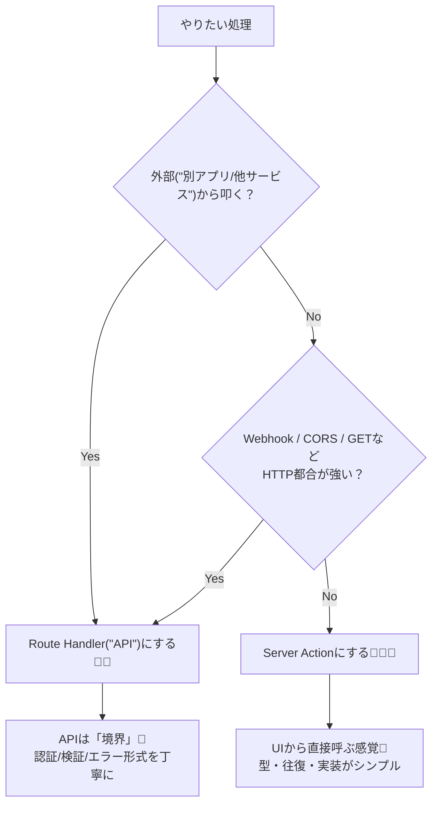
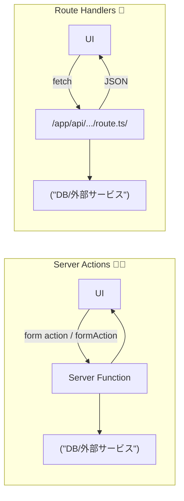

# 第116章：APIを“作りすぎない”方針（Server Actionsとも比較）⚖️

「Next.jsでアプリ内API（Route Handlers）作れるの分かった！…でも、これ全部APIにした方がいいの？🤔」
→ **結論：作りすぎないのが正義**です🙆‍♀️✨
APIは便利だけど、増えるほど **保守・セキュリティ・型管理**がしんどくなるんだよね…🥹💦

---

## この章のゴール🎯

* **Route Handler（`app/api/.../route.ts`）を作るべき場面**が分かる🚪
* **Server Actions（= React Server Functions）で十分な場面**が分かる🧑‍🍳
* 「迷ったときの判断ルール」が手に入る🧭✨

---

## そもそも：APIを増やすと何が増える？📈😵

API（Route Handler）を1個作るたびに、だいたいこういう“宿題”が増えます👇

* 入力チェック（バリデーション）🛡️
* 認証・認可（誰が叩ける？）🔐
* エラー形式の統一（フロントが困る）🧯
* ステータスコード設計（200/400/500…）🚦
* 型の共有（フロントとズレると地獄）🧷
* CORSやWebhook対応（必要なら）🌍🔔
* ドキュメント化（将来の自分に説明）📝

もちろん必要ならやるけど、**内部の画面だけで使う処理まで全部APIにすると、負債が増えがち**です💸😇

---

## Server Actions（Server Functions）って何がうれしいの？🪄

Next.jsでは、データ更新を **ReactのServer Functions（Server Actions）** でやれるようになってます。
Server Actionは **サーバーで動くasync関数**で、`'use server'` で定義します。呼び出しはネットワーク経由なのでasync必須、そして裏側は **POSTで実行される**のがポイントだよ〜📮✨ ([Next.js][1])

さらにNext.jsでは、Actionが動いたあと **UIと新しいデータをまとめて返せる**（キャッシュ設計と統合されてる）ので、フロントがラクになりがちです🫶 ([Next.js][1])
（そしてServer ActionsはNext.js 14で安定機能になって、基本ONです✅） ([Next.js][2])

---

## Route Handlers（API）はどんな時に必要？🚪📡

Route Handlerは `route.ts` に **HTTPメソッド（GET/POST/PUT…）** を書けて、Request/Responseを直接扱えるのが強み！([Next.js][3])
CORSやWebhook受信みたいな「HTTPっぽいこと」も得意です🌍🔔 ([Next.js][3])

---

## 使い分けの超ざっくり結論⚖️✨

### ✅ Server Actions を選びやすい場面🧑‍🍳

* **自分のNext.jsアプリのUIからしか呼ばない**（内部専用）🏠
* **フォーム送信・ボタン操作でDB更新**みたいな“画面の延長”🧾➡️🗃️
* **型を自然に揃えたい**（関数の引数・戻り値で揃う）🧷
* 無駄な `fetch('/api/...')` を減らしてスッキリしたい🧼✨

### ✅ Route Handlers（API）を選ぶべき場面🚪📡

* **外部アプリ（モバイル/別サービス）にも公開するAPI**📱🌍
* **Webhookの受け口が必要**🔔 ([Next.js][3])
* **CORSが必要**（別オリジンから叩かれる）🌍 ([Next.js][3])
* **GETで提供したい**（Server Actionsは呼び出しが基本POST）📤 ([Next.js][1])
* **HTTPの細かい制御が必要**（ステータス/ヘッダー/ストリーミング等）🧪 ([Next.js][3])

---

## 判断フローチャート🧭（迷ったらこれ！）




---

## イメージ図：呼び出しの違い👀✨



---

## ミニ例：内部だけの「TODO追加」はServer Actionで十分💡🫶

### ✅ Server Action（内部専用の追加処理）

```ts
// app/todos/actions.ts
export async function addTodo(formData: FormData) {
  'use server'

  const title = String(formData.get('title') ?? '').trim()
  if (!title) {
    return { ok: false, message: 'タイトル入れてね🙂' }
  }

  // ここでDB追加（例）
  // await db.todo.create({ data: { title } })

  // 画面の再取得（必要なら）
  // revalidatePath('/todos')

  return { ok: true }
}
```

### ✅ ページ側（フォームから直で呼ぶ）

```tsx
// app/todos/page.tsx
import { addTodo } from './actions'

export default function TodosPage() {
  return (
    <main>
      <h1>TODO</h1>

      <form action={addTodo}>
        <input name="title" placeholder="やること" />
        <button type="submit">追加➕</button>
      </form>
    </main>
  )
}
```

この形だと、**わざわざ `/api/todos` を作って fetch して…**っていう回り道が減るよ〜🥳✨
（もちろん「外部にも公開する」ならAPIにするのが正解！）

---

## ありがちな落とし穴⚠️😵‍💫

* 「とりあえず全部APIにしよ！」→ **境界だらけになって管理コスト爆増**💥
* 「API作ったのに、結局アプリ内からしか叩いてない」→ **Server Actionでよかった案件**🥹
* 「外部公開なのにServer Actionで済ませようとする」→ **CORS/Webhook/仕様公開が苦しくなる**🌪️

---

## まとめ🧁✨（この章の結論）

* **内部UIの更新**は、まず **Server Actions（Server Functions）** を第一候補に🧑‍🍳 ([Next.js][1])
* **外部に公開する/HTTP都合が強い**なら **Route Handlers（API）** 🚪 ([Next.js][3])
* APIは便利だけど、**増やすほど“境界の宿題”が増える**ので、必要なときだけ作ろうね🫶✨

[1]: https://nextjs.org/docs/app/getting-started/updating-data "Getting Started: Updating Data | Next.js"
[2]: https://nextjs.org/docs/app/api-reference/config/next-config-js/serverActions "next.config.js: serverActions | Next.js"
[3]: https://nextjs.org/docs/app/api-reference/file-conventions/route "File-system conventions: route.js | Next.js"
