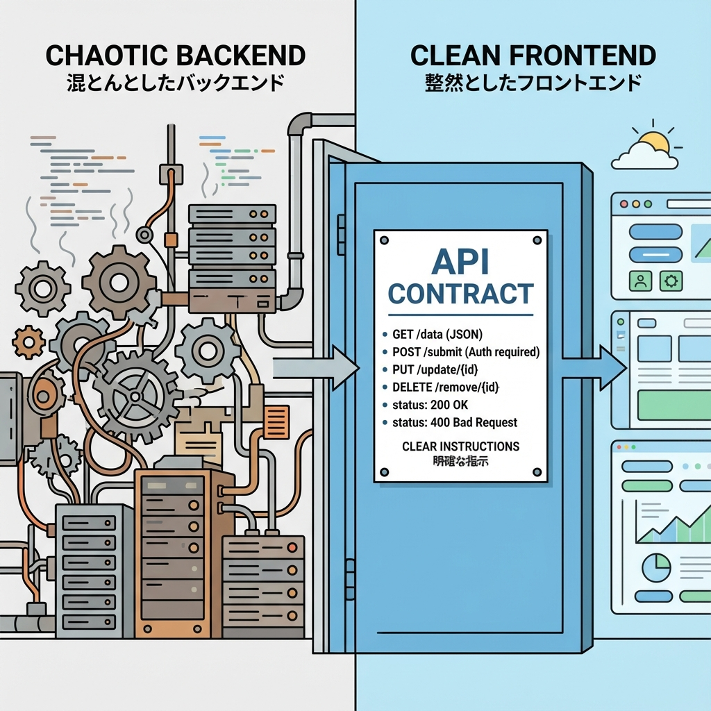
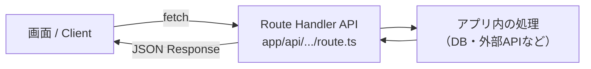

# 第117章：復習：APIは“境界”だからこそ丁寧に🧱

やっほー！今回は **Route Handler（`app/api/.../route.ts`）で作るAPI** を、復習として「境界（きょうかい）」の視点でキレイに整える章だよ〜😊🌷
APIって、アプリの中でも **いちばん“他人（別のコード）に触られる場所”** だから、丁寧さがそのまま強さになるの💪✨

---

## この章でできるようになること🎯

* APIを **「境界」＝契約（ルール）** として考えられる📜✨
* **返す形（レスポンス形式）** を統一できる🧩
* **成功・失敗・バリデーション・想定外** をきれいに分けられる🚦🧯
* 「あとで直す」が激減する **チェックリスト** を持てる✅✅✅

---

## まず結論：APIは“契約書”📜🤝

フロント（画面）や別の機能がAPIを呼ぶとき、こう思ってるの👇

* 「このURL叩いたら、こういうJSONが返るはず！」
* 「失敗したら、こういう形で返ってくるはず！」
* 「このパラメータ必須だよね？」

つまりAPIは **“約束”** なんだよね😊
約束がブレると、呼ぶ側が毎回混乱するし、バグが増える〜😭💥

---

## 図でイメージ：APIは“壁のドア”🚪🧱





この **APIのドア** を開ける人（＝呼ぶ側）は、実装の中身は知らないの。
だからこそ、ドアの前に貼る「案内（レスポンス設計）」が大事📌✨

---

## APIを丁寧にする“3つの基本ルール”🧱🧱🧱

### ① レスポンスの形を統一する🧩

おすすめはこれ👇（超よく使う型！）

* 成功：`{ ok: true, data: ... }`
* 失敗：`{ ok: false, error: { code, message, details? } }`

「いつもこの形」って決めるだけで、呼ぶ側がめちゃラクになるよ😊✨

---

### ② ステータスコードは“意味で選ぶ”🚦

ざっくりでOKだけど、これだけ守ると強い！

* `200`：成功（GET/POSTどっちでもOK）✅
* `201`：作成成功（POSTで作った感を出したい時）🎉
* `400`：入力がダメ（バリデーション失敗）📝❌
* `401`：ログインしてない🔑
* `403`：権限がない🙅‍♀️
* `404`：存在しない🔍
* `500`：想定外（サーバー側の事故）💥

---

### ③ “想定外”をちゃんと分ける🧯

バリデーション失敗（400）と、サーバー事故（500）が同じ扱いだと、デバッグ地獄👹🔥
なので、**失敗の種類を分ける**のが大人のAPI…！😎✨

---

## すぐ使えるテンプレ：統一レスポンスAPI🧰✨

### ✅ `app/api/todos/route.ts`（GETの例）

「一覧を返す」だけでも、設計が整ってると気持ちいいよ〜🌸

```ts
import { NextResponse } from "next/server";

type ApiSuccess<T> = { ok: true; data: T };
type ApiError = {
  ok: false;
  error: {
    code: string;
    message: string;
    details?: unknown;
  };
};

type Todo = { id: string; title: string; done: boolean };

function json<T>(body: ApiSuccess<T> | ApiError, init?: ResponseInit) {
  return NextResponse.json(body, init);
}

export async function GET() {
  try {
    // 本当はDBとかから取る想定（ここではダミー）
    const todos: Todo[] = [
      { id: "1", title: "レポート提出📄", done: false },
      { id: "2", title: "ゼミの資料読む📚", done: true },
    ];

    return json<Todo[]>({ ok: true, data: todos }, { status: 200 });
  } catch (e) {
    // 想定外は500で統一
    return json(
      {
        ok: false,
        error: {
          code: "INTERNAL_ERROR",
          message: "サーバー側で問題が起きたよ…🙏",
        },
      },
      { status: 500 }
    );
  }
}
```

ポイントはここだよ👇😊

* **成功/失敗の形が固定**されてる🧩
* `try/catch` で **500の形も固定**🧯
* 呼ぶ側は `ok` を見れば分岐できる✅

---

## 呼ぶ側（Client）の書き方も“境界”っぽくする🎮✨

```ts
type ApiSuccess<T> = { ok: true; data: T };
type ApiError = { ok: false; error: { code: string; message: string; details?: unknown } };
type ApiResult<T> = ApiSuccess<T> | ApiError;

type Todo = { id: string; title: string; done: boolean };

export async function fetchTodos(): Promise<ApiResult<Todo[]>> {
  const res = await fetch("/api/todos");
  const json = (await res.json()) as ApiResult<Todo[]>;

  // 形が統一されてるから、このまま返してOK✨
  return json;
}
```

これで画面側は超シンプル👇😊

```ts
const result = await fetchTodos();
if (result.ok) {
  console.log("TODO一覧", result.data);
} else {
  alert(result.error.message);
}
```

---

## “境界”チェックリスト✅✨（これだけで強くなる）

APIを書いたら、最後にここだけ見てね👀🌷

* ✅ 成功レスポンスの形は固定？（`ok: true, data`）
* ✅ 失敗レスポンスの形も固定？（`ok: false, error`）
* ✅ `400` と `500` が混ざってない？（入力ミス vs 想定外）
* ✅ エラーメッセージはユーザーに優しい？（責めない）🫶
* ✅ 返すデータに余計な情報（内部事情）入ってない？🔒
* ✅ 仕様が変わったら、呼ぶ側が壊れない？（形の変更は慎重）🧱

---

## ミニ練習（5分）⏱️🌸

今ある `POST /api/todos`（第114章で作ったやつ想定）を、次のルールに寄せてみてね😊

* 成功：`{ ok: true, data: { id: string } }`
* バリデーション失敗（タイトル空など）：`400` ＋ `{ ok: false, error: ... }`
* 想定外：`500` ＋ `{ ok: false, error: ... }`

できたら「呼ぶ側は `ok` だけ見ればいい状態」になってるはず！🎉

---

## まとめ：APIは“境界”だから、やさしくて強いのが正義🧱💕

APIはね、実装力よりも **設計の丁寧さ** が効く場所だよ😊
レスポンスの形を揃えて、失敗の種類を分けるだけで、未来の自分がめちゃ助かる〜！🙌✨
