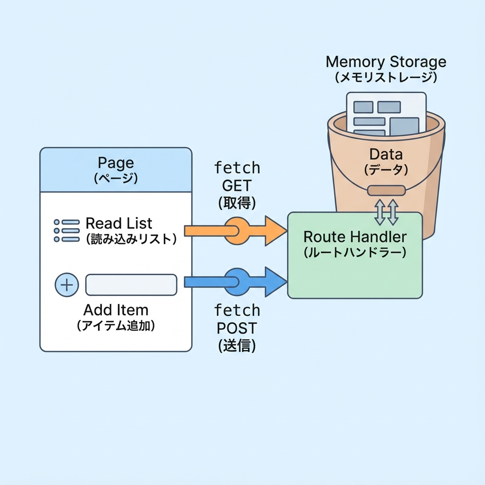
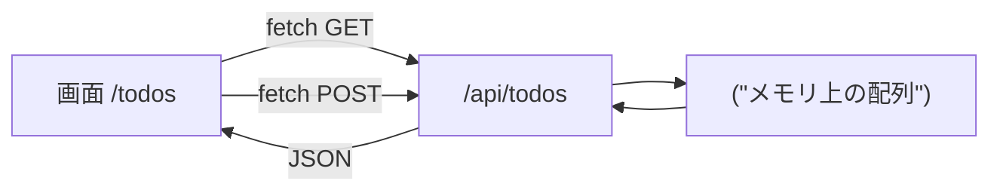
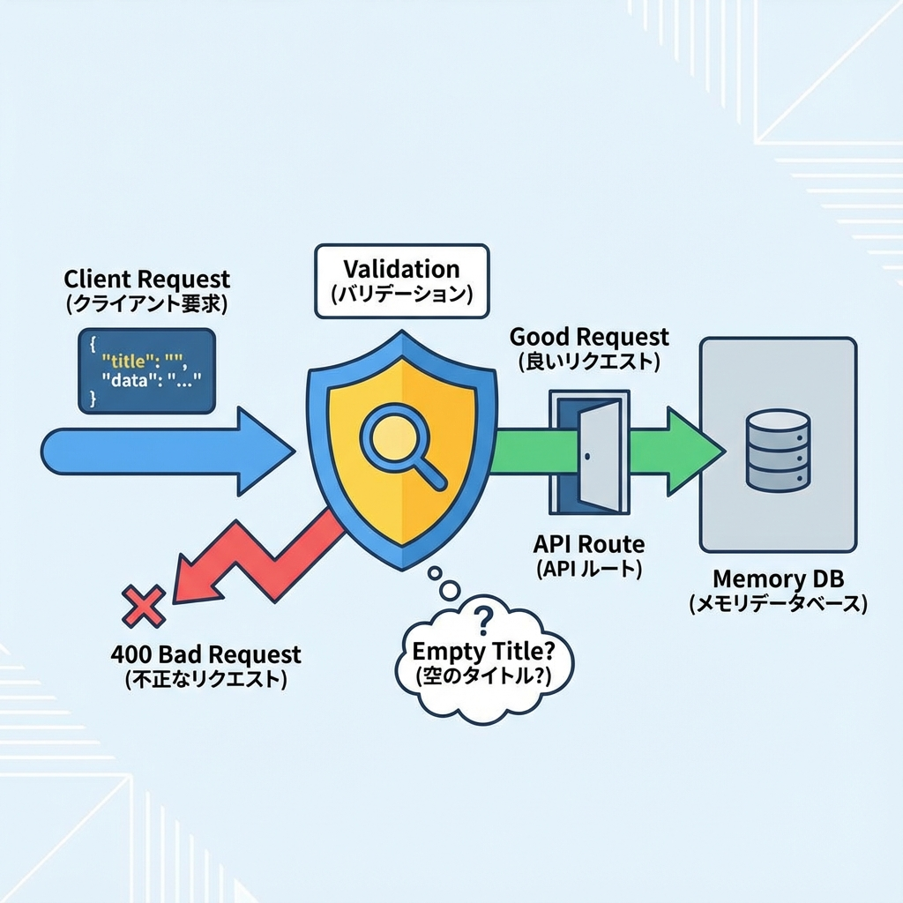

# 第118章：ミニ課題：API付きTODOの土台完成🏗️

この章は「**Route Handlerで作った /api/todos を、画面から実際に使える状態にする**」がゴールだよ〜！🎉
DBはまだ使わないので、まずは **“API ⇄ 画面” がつながる最小構成** を完成させます💪✨

---

## ゴール🎯（この章でできたら勝ち！）

* `/api/todos` が **GET（一覧）** と **POST（追加）** に対応してる✅
* `/todos` 画面で

  * TODO一覧が表示できる📋✨
  * TODOを追加できる➕😊
  * エラーが出たら画面に出せる🧯

---

## まず完成イメージを図で掴も〜🧠✨（Mermaid）





---

## 1) フォルダ構成を作る📁✨

プロジェクト直下で、次を用意するよ👇（なければ作成）

* `app/api/todos/route.ts`
* `app/todos/page.tsx`

こんな形になればOK：

```text
app/
  api/
    todos/
      route.ts
  todos/
    page.tsx
```

---

## 2) Route Handler（/api/todos）を仕上げる🚪🧪




`app/api/todos/route.ts` を作って、下をコピペしてね🧸✨
（この章はDBなしなので、**メモリ配列**で仮運用するよ！）

```ts
// app/api/todos/route.ts
import { NextResponse } from "next/server";

type Todo = {
  id: string;
  title: string;
  done: boolean;
  createdAt: string;
};

type ApiOk<T> = { ok: true; data: T };
type ApiNg = {
  ok: false;
  error: {
    code: "VALIDATION" | "UNKNOWN";
    message: string;
    fields?: Record<string, string>;
  };
};

// ✅ DBの代わり：メモリ上のデータ（※サーバ再起動や更新で消えることがあるよ）
let todos: Todo[] = [
  { id: "t1", title: "Next.jsのRoute Handlerを触る", done: false, createdAt: new Date().toISOString() },
];

function json<T>(data: ApiOk<T> | ApiNg, init?: ResponseInit) {
  return NextResponse.json(data, init);
}

export async function GET() {
  return json<Todo[]>({ ok: true, data: todos });
}

export async function POST(request: Request) {
  try {
    const body = (await request.json()) as { title?: unknown };

    // ✅ 超最低限バリデーション
    if (typeof body.title !== "string") {
      return json(
        { ok: false, error: { code: "VALIDATION", message: "title は文字列で送ってね🥺", fields: { title: "string required" } } },
        { status: 400 }
      );
    }

    const title = body.title.trim();
    if (title.length === 0) {
      return json(
        { ok: false, error: { code: "VALIDATION", message: "title が空だよ〜💦", fields: { title: "empty" } } },
        { status: 400 }
      );
    }
    if (title.length > 50) {
      return json(
        { ok: false, error: { code: "VALIDATION", message: "title は50文字までにしてね🙏", fields: { title: "too long" } } },
        { status: 400 }
      );
    }

    const newTodo = {
      id: crypto.randomUUID(),
      title,
      done: false,
      createdAt: new Date().toISOString(),
    } satisfies Todo;

    // 追加（先頭に入れると新しいのが上に出て気持ちいい✨）
    todos = [newTodo, ...todos];

    return json<Todo>({ ok: true, data: newTodo }, { status: 201 });
  } catch {
    return json(
      { ok: false, error: { code: "UNKNOWN", message: "なんか失敗した…！ごめんね🧯" } },
      { status: 500 }
    );
  }
}
```

---

## 3) 画面（/todos）を作って、APIとつなぐ🪄✨

次に `app/todos/page.tsx` を作るよ！
今回は分かりやすくするために、**このページを Client Component にして** `fetch` で叩きます🎮💡

```tsx
// app/todos/page.tsx
"use client";

import { useEffect, useState } from "react";

type Todo = {
  id: string;
  title: string;
  done: boolean;
  createdAt: string;
};

type ApiOk<T> = { ok: true; data: T };
type ApiNg = {
  ok: false;
  error: { code: string; message: string; fields?: Record<string, string> };
};

export default function TodosPage() {
  const [todos, setTodos] = useState<Todo[]>([]);
  const [title, setTitle] = useState("");
  const [loading, setLoading] = useState(true);
  const [saving, setSaving] = useState(false);
  const [error, setError] = useState<string>("");

  async function loadTodos() {
    setError("");
    setLoading(true);
    try {
      const res = await fetch("/api/todos", { method: "GET" });
      const json = (await res.json()) as ApiOk<Todo[]> | ApiNg;

      if (!res.ok || !json.ok) {
        setError(!json.ok ? json.error.message : "読み込みに失敗したよ🧯");
        return;
      }
      setTodos(json.data);
    } catch {
      setError("通信に失敗したかも…！ネットワークを確認してね📶");
    } finally {
      setLoading(false);
    }
  }

  async function addTodo(e: React.FormEvent) {
    e.preventDefault();
    setError("");
    setSaving(true);

    try {
      const res = await fetch("/api/todos", {
        method: "POST",
        headers: { "Content-Type": "application/json" },
        body: JSON.stringify({ title }),
      });

      const json = (await res.json()) as ApiOk<Todo> | ApiNg;

      if (!res.ok || !json.ok) {
        setError(!json.ok ? json.error.message : "追加に失敗したよ🧯");
        return;
      }

      // ✅ 追加成功：先頭に足す（気持ちいい✨）
      setTodos((prev) => [json.data, ...prev]);
      setTitle("");
    } catch {
      setError("通信に失敗したかも…！📶");
    } finally {
      setSaving(false);
    }
  }

  useEffect(() => {
    loadTodos();
  }, []);

  return (
    <main style={{ padding: 16, maxWidth: 720, margin: "0 auto" }}>
      <h1 style={{ fontSize: 28, fontWeight: 800 }}>TODO（API接続）📋✨</h1>
      <p style={{ marginTop: 8, opacity: 0.8 }}>
        /api/todos を叩いて、一覧表示と追加をするよ〜！🚀
      </p>

      {error && (
        <div
          style={{
            marginTop: 12,
            padding: 12,
            borderRadius: 12,
            border: "1px solid #f5c2c7",
            background: "#f8d7da",
          }}
        >
          <strong>エラー：</strong> {error} 🧯
        </div>
      )}

      <section style={{ marginTop: 18 }}>
        <form onSubmit={addTodo} style={{ display: "flex", gap: 8 }}>
          <input
            value={title}
            onChange={(e) => setTitle(e.target.value)}
            placeholder="例：レポート出す📄"
            style={{
              flex: 1,
              padding: "10px 12px",
              borderRadius: 12,
              border: "1px solid #ccc",
            }}
          />
          <button
            disabled={saving}
            style={{
              padding: "10px 14px",
              borderRadius: 12,
              border: "1px solid #ccc",
              cursor: saving ? "not-allowed" : "pointer",
            }}
          >
            {saving ? "追加中…⏳" : "追加➕"}
          </button>
        </form>
        <p style={{ marginTop: 8, opacity: 0.7 }}>
          ※ 空はNG、50文字までだよ😉
        </p>
      </section>

      <section style={{ marginTop: 22 }}>
        <h2 style={{ fontSize: 20, fontWeight: 700 }}>一覧</h2>

        {loading ? (
          <p style={{ marginTop: 10 }}>読み込み中…⏳</p>
        ) : todos.length === 0 ? (
          <p style={{ marginTop: 10 }}>まだ何もないよ〜🐣</p>
        ) : (
          <ul style={{ marginTop: 10, paddingLeft: 18 }}>
            {todos.map((t) => (
              <li key={t.id} style={{ marginBottom: 8 }}>
                <span style={{ fontWeight: 600 }}>{t.title}</span>{" "}
                <span style={{ opacity: 0.6, fontSize: 12 }}>
                  （{new Date(t.createdAt).toLocaleString()}）
                </span>
              </li>
            ))}
          </ul>
        )}

        <button
          onClick={loadTodos}
          disabled={loading}
          style={{
            marginTop: 14,
            padding: "8px 12px",
            borderRadius: 12,
            border: "1px solid #ccc",
            cursor: loading ? "not-allowed" : "pointer",
          }}
        >
          再読み込み🔄
        </button>
      </section>
    </main>
  );
}
```

---

## 4) 動かして確認しよ〜🚀✅

ターミナルで：

```text
npm run dev
```

ブラウザで：

* `http://localhost:3000/todos`

確認ポイント✅

* 最初に一覧が出る（初期TODOが見える）👀
* 入力して「追加➕」で増える🎉
* 空で送るとエラーが出る🧯
* 51文字以上で送るとエラーが出る🧯

---

## デバッグのコツ🔎✨（詰まったらここ）

* **DevTools（F12）→ Network** で `/api/todos` の通信を見る📡
* **Console** にエラーが出てたら、その文言を最優先で読む👀
* うまくいかないときは「POSTの body が JSONになってるか」をチェック✅

---

## 仕上げのミニ課題🎁（できたら気持ちいい）

できる範囲でOKだよ〜☺️✨

* 入力欄に **Enter** で追加できるのは確認した？⌨️✅（formだからできるはず！）
* 追加成功したら **「追加したよ〜🎉」** みたいな一言を出してみる😊
* `loading` 中はボタンを押せないようにしてある？（今は一応してるよ👌）

---

## まとめ🏁✨

この章で「**画面 ⇄ API（Route Handler）**」がつながって、TODOアプリの**土台**が完成したよ〜！🎉📦
ここまで来たら、次の発展（Middleware / 認証 / DB / Server Actions）に進む準備がバッチリです😆🔥
