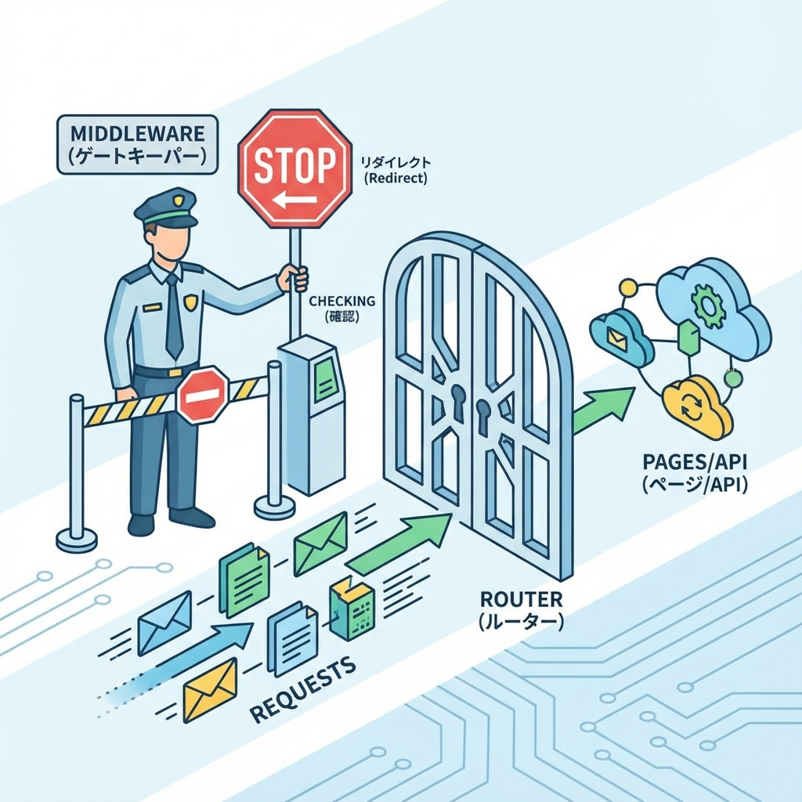
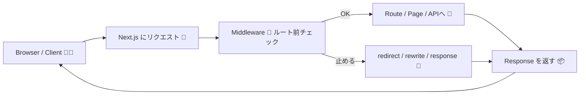

# 第119章：Middlewareってなに？（ルートに入る前の門番）🧤

今日は **Next.jsのMiddleware（ミドルウェア）** を、「なにもの？」ってところから、**動く最小例**までやってみるよ〜！😊💖
結論から言うと、Middlewareは **ページやAPIに入る“直前”に動く、ちいさな門番** です🧤🚦

---

## 1) Middlewareのイメージ（超ざっくり）🧠✨

* ブラウザからリクエストが来る📨
* **ルーティングされる前**にMiddlewareがチェックする🧤
* OKならページへ、ダメならリダイレクトや書き換えができる🚦➡️

「ログインしてないなら `/login` に飛ばす」みたいなのが得意です🔐💨

---

## 2) どこで動くの？いつ動くの？⏱️👀

Middlewareは **プロジェクト直下**に `middleware.ts`（または `middleware.js`）を置くと動きます📁✨
`app/` の中じゃなくて、`app/` と同じ階層に置くのがポイントだよ〜！✅

---

## 3) 図で見る：リクエストの通り道🗺️🧤





---

## 4) 何ができるの？（できることリスト）🧰✨

Middlewareでよくやることはこんな感じ👇😊

* **リダイレクト**：別ページへ飛ばす🚦➡️
* **リライト**：URLはそのまま中身だけ別ルートにする🪄
* **ヘッダー付与**：レスポンス/リクエストにヘッダー追加🧾
* **Cookieを見る**：ログイン判定の材料にする🍪
* **パス判定**：`/admin` だけ守る、みたいな条件分岐🛡️

---

## 5) まず動かしてみよう：最小のMiddleware🧪✨

### ✅ 5-1. ファイルを作る（プロジェクト直下）📁

`middleware.ts` を作って、こう書いてね👇（ログ出すだけの超ミニ版）

```ts
import { NextResponse, type NextRequest } from "next/server";

export function middleware(request: NextRequest) {
  console.log("🧤 middleware:", request.nextUrl.pathname);
  return NextResponse.next(); // このまま通してOK👌
}
```

### ✅ 5-2. 起動して確認（Windows / PowerShellでもOK）🖥️💨

```bash
npm run dev
```

ブラウザで `http://localhost:3000/` を開いて、ターミナルに

* `🧤 middleware: /`

みたいなログが出たら成功〜！🎉✨

---

## 6) “門番っぽい”例：/secret に入ろうとしたら /login へ🚦🔐

「門番感」を出すために、**/secret は強制で /login に飛ばす**例をやってみよ〜！🧤💨

### ✅ 6-1. ページを2つ作る（サンプル）📄✨

`app/login/page.tsx`

```tsx
export default function LoginPage() {
  return (
    <main style={{ padding: 24 }}>
      <h1>ログインページ（仮）🔐</h1>
      <p>ここにログインフォームが入る想定だよ〜😊</p>
    </main>
  );
}
```

`app/secret/page.tsx`

```tsx
export default function SecretPage() {
  return (
    <main style={{ padding: 24 }}>
      <h1>ひみつページ㊙️</h1>
      <p>本当はログインした人だけが見れるやつ！✨</p>
    </main>
  );
}
```

### ✅ 6-2. middleware.ts を“門番”に進化させる🧤🚦

```ts
import { NextResponse, type NextRequest } from "next/server";

export function middleware(request: NextRequest) {
  const pathname = request.nextUrl.pathname;

  console.log("🧤 middleware:", pathname);

  // 例：/secret に来たら /login に飛ばす
  if (pathname.startsWith("/secret")) {
    const url = request.nextUrl.clone();
    url.pathname = "/login";
    url.searchParams.set("from", pathname); // どこから来たかメモ📝
    return NextResponse.redirect(url);
  }

  return NextResponse.next();
}
```

### ✅ 6-3. 動作チェック🎯✨

* `http://localhost:3000/secret` に行く
* 自動で `http://localhost:3000/login?from=%2Fsecret` に飛べたら成功🎉💖

---

## 7) Middlewareの注意点（第119章で最低限ここだけ）⚠️🧤

Middlewareは便利だけど、**“薄く”作る**のがコツだよ〜🪶✨

* 重い処理（ゴリゴリ計算・巨大なDB処理）は置かない🙅‍♀️💦
* **基本は判定して、通す or 飛ばす**くらいが気持ちいい😊
* まずは「ルート前に1回だけ挟める場所がある」って感覚を掴めばOK🫶

---

## 8) まとめ（今日のゴール）🎀✅

* Middlewareは **ルートに入る前の門番**🧤🚪
* `middleware.ts` を **プロジェクト直下**に置くと動く📁
* `NextResponse.next()` で通す / `redirect()` で飛ばす🚦✨
* まずは薄く使うのが正解🪶😊

以上！これが **第119章** だよ〜🎉💖
