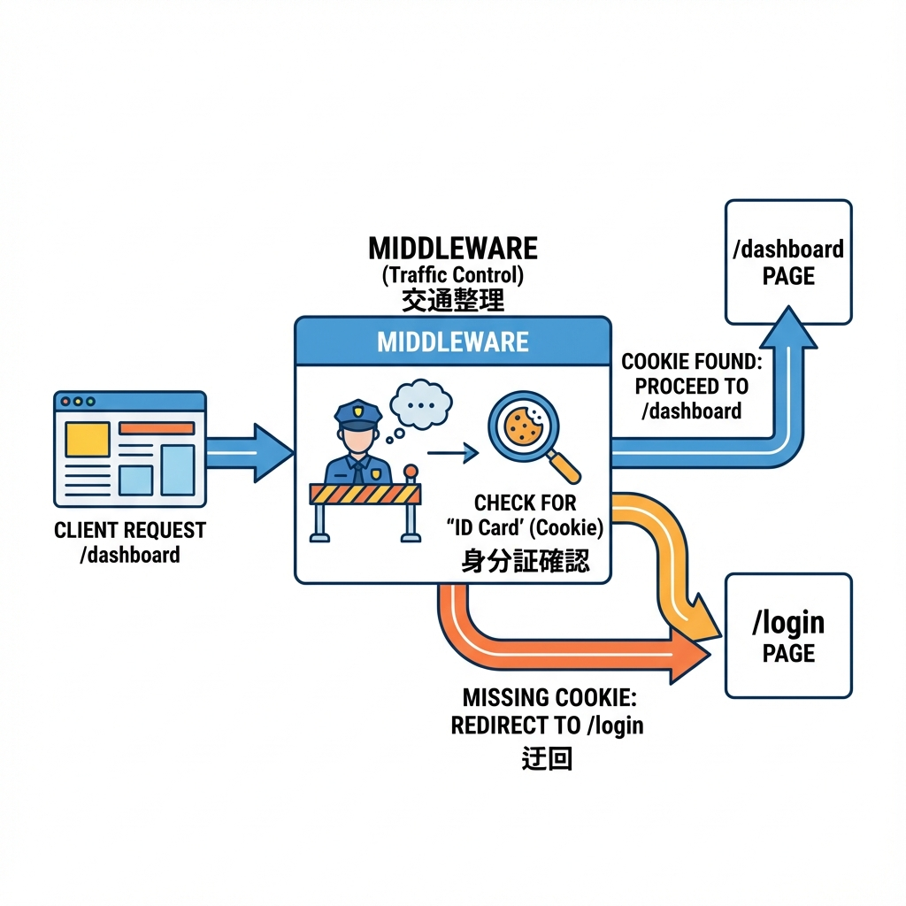
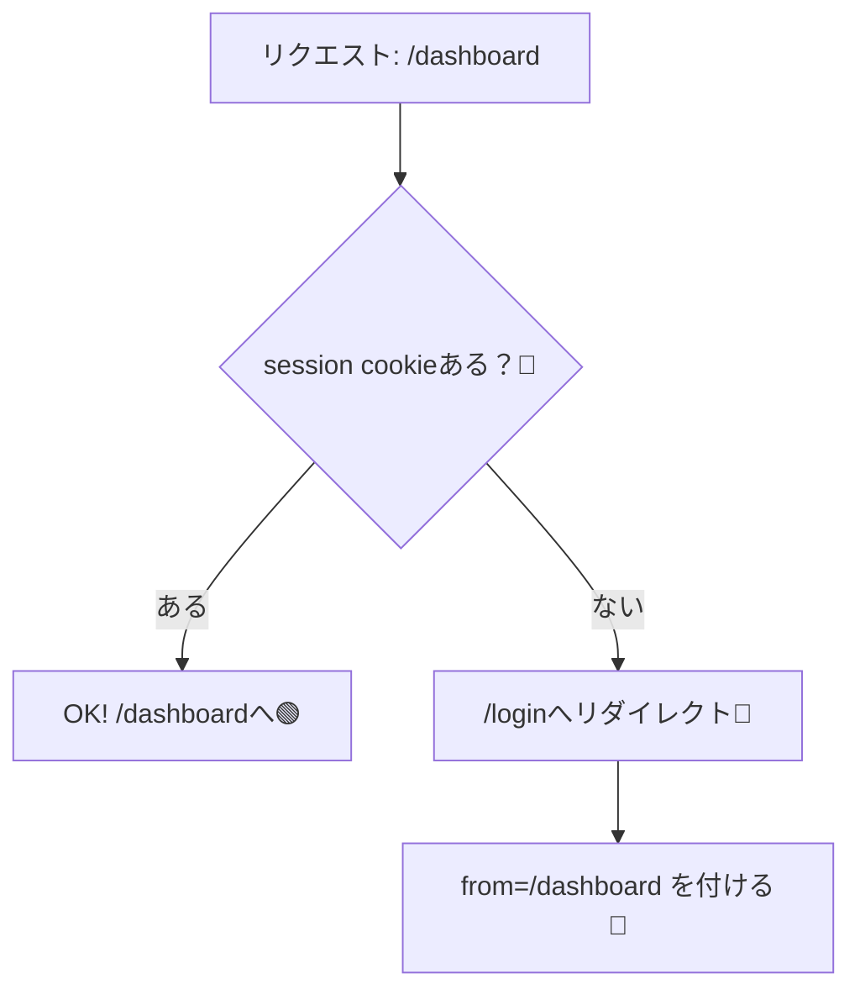
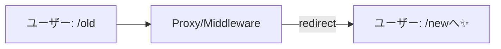

# 第120章：どんな時に使う？（ログイン判定/リダイレクト）🚦

Next.js の **Middleware（最新版だと “Proxy”）** は、ざっくり言うと **「ページに入る前の関所」** だよ〜🧤🏯
リクエストが来た瞬間に、**通す／止める／別の場所へ案内する** を決められるのが強み！ ([Next.js][1])

---

## 1) いちばん多い使い道：ログイン判定（保護ルート）🔐➡️🚪



「/dashboard はログインした人だけね！」みたいなやつ🫶
未ログインなら **/login にリダイレクト**して、ちゃんと案内してあげるのが親切〜☺️✨

### 図解（考え方）🧠



---

## 2) もう1つの王道：リダイレクト（URLお引っ越し）🏠➡️🏠✨

たとえば昔のURLが `/old` で、新しいURLが `/new` になったときに
アクセスしてきた人を **自動で /new に案内**できるよ〜📮🚶‍♀️

### 図解（動き）🧭



---

## 3) “Proxy（Middleware）” が向いてる瞬間チェック✅🌟

次のどれかなら、かなり出番あるよ〜！

* **ログインしてる？** を見て、通す/弾く 🔐
* **古いURL → 新しいURL** に案内する 🧭
* 国/言語/ABテストなど **リクエストの条件で分岐**したい 🌏🎲
* いろんなページで同じルールを **まとめて適用**したい 📦

> ちなみに「固定のリダイレクト一覧」を作るだけなら、`next.config.js` の `redirects` で済むことも多いよ〜（条件分岐が少ないならこっちがラク）🧾✨ ([Next.js][2])

---

## 4) 実装して体験しよ！デモ：/dashboard をログイン必須にする🎀🔐

### ⭐ 4-1. Proxy（最新版） or Middleware（旧名）どっちで書く？📝

**Next.js 16 以降（最新版）**：`proxy.ts` を使う（middleware は deprecated） ([Next.js][1])
**Next.js 15 以前**：`middleware.ts`（中身ほぼ同じ）

この章では **最新版想定で `proxy.ts`** でいくね！✨

---

### ⭐ 4-2. `proxy.ts` を作る（プロジェクト直下）📁

`app/` と同じ階層に `proxy.ts` を作ってね（`src/` 構成なら `src/proxy.ts`） ([Next.js][1])

```ts
import type { NextRequest } from 'next/server'
import { NextResponse } from 'next/server'

export function proxy(request: NextRequest) {
  const { pathname } = request.nextUrl

  // ✅ /dashboard 配下だけ守る
  const isProtected = pathname.startsWith('/dashboard')

  // 🍪 例: session というクッキーがあればログイン済み扱い（デモ）
  const isLoggedIn = Boolean(request.cookies.get('session')?.value)

  if (isProtected && !isLoggedIn) {
    const loginUrl = new URL('/login', request.url)
    loginUrl.searchParams.set('from', pathname) // どこ行きたかったか保存📌
    return NextResponse.redirect(loginUrl)
  }

  return NextResponse.next()
}

// matcher で対象パスを絞る（無駄に全部にかけない）🧹
export const config = {
  matcher: ['/dashboard/:path*'],
}
```

> `matcher` で「どのパスに効かせるか」を絞れるよ〜🧭 ([Next.js][1])

---

### ⭐ 4-3. デモ用：ログイン/ログアウト API（Route Handler）を作る🧪🍪

#### `app/api/mock-login/route.ts`

```ts
import { cookies } from 'next/headers'
import { NextResponse } from 'next/server'

export async function POST() {
  const cookieStore = await cookies()

  cookieStore.set({
    name: 'session',
    value: 'demo',
    httpOnly: true,
    sameSite: 'lax',
    path: '/',
  })

  return NextResponse.json({ ok: true })
}
```

#### `app/api/mock-logout/route.ts`

```ts
import { cookies } from 'next/headers'
import { NextResponse } from 'next/server'

export async function POST() {
  const cookieStore = await cookies()
  cookieStore.set({ name: 'session', value: '', maxAge: 0, path: '/' })
  return NextResponse.json({ ok: true })
}
```

> Route Handler / Server Action で cookie を set/delete できるよ〜🍪 ([Next.js][3])

---

### ⭐ 4-4. 画面を作る：/login と /dashboard 🖥️🎀

#### `app/login/page.tsx`

```tsx
'use client'

import { useRouter, useSearchParams } from 'next/navigation'
import { useState } from 'react'

export default function LoginPage() {
  const router = useRouter()
  const sp = useSearchParams()
  const [loading, setLoading] = useState(false)

  const from = sp.get('from') ?? '/dashboard'

  const onLogin = async () => {
    setLoading(true)
    try {
      await fetch('/api/mock-login', { method: 'POST' })
      router.replace(from) // 行きたかった場所へ戻す🎯
    } finally {
      setLoading(false)
    }
  }

  return (
    <main style={{ padding: 24 }}>
      <h1>ログイン（デモ）🎀</h1>
      <p>ボタンを押すと「ログイン済みクッキー」を作るだけだよ〜🍪</p>
      <button onClick={onLogin} disabled={loading}>
        {loading ? 'ログイン中…⏳' : 'ログインする✨'}
      </button>
    </main>
  )
}
```

#### `app/dashboard/page.tsx`

```tsx
'use client'

import { useRouter } from 'next/navigation'
import { useState } from 'react'

export default function DashboardPage() {
  const router = useRouter()
  const [loading, setLoading] = useState(false)

  const onLogout = async () => {
    setLoading(true)
    try {
      await fetch('/api/mock-logout', { method: 'POST' })
      router.replace('/login')
    } finally {
      setLoading(false)
    }
  }

  return (
    <main style={{ padding: 24 }}>
      <h1>Dashboard 🎉</h1>
      <p>ここはログイン必須エリアだよ〜🔐✨</p>
      <button onClick={onLogout} disabled={loading}>
        {loading ? 'ログアウト中…⏳' : 'ログアウト🚪'}
      </button>
    </main>
  )
}
```

---

## 5) 動作チェック（楽しい瞬間🥳）✅

1. `npm run dev` で起動🌈
2. ブラウザで `http://localhost:3000/dashboard` に行く

   * ✅ 未ログインなら `/login` に飛ばされる🚦
3. ログイン押す

   * ✅ `session` cookie がセットされて `/dashboard` に戻る🍪🎯
4. ログアウト押す

   * ✅ cookie 消えて `/login` へ🚪✨

---

## 6) まとめ（この章のゴール🎯）

* Proxy/Middleware は **「入る前に振り分ける」** のが得意🧤
* **ログイン判定** と **リダイレクト** は鉄板コンビ🚦🔐
* ルールを “一箇所に集約” できるから、運用がラクになるよ〜📦✨

[1]: https://nextjs.org/docs/app/api-reference/file-conventions/proxy "File-system conventions: proxy.js | Next.js"
[2]: https://nextjs.org/docs/pages/guides/redirecting?utm_source=chatgpt.com "Guides: Redirecting"
[3]: https://nextjs.org/docs/app/api-reference/functions/cookies "Functions: cookies | Next.js"
