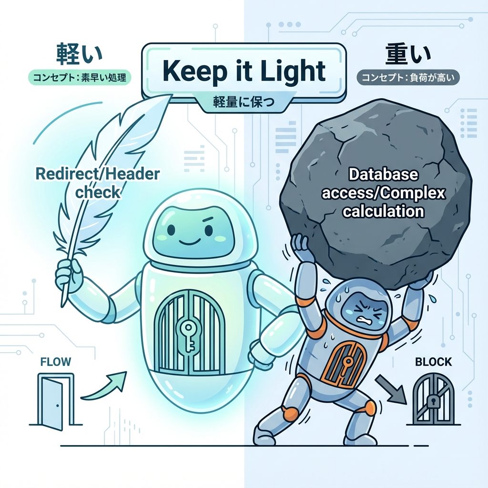
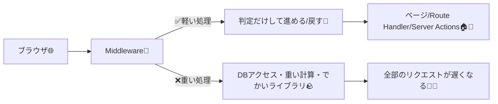
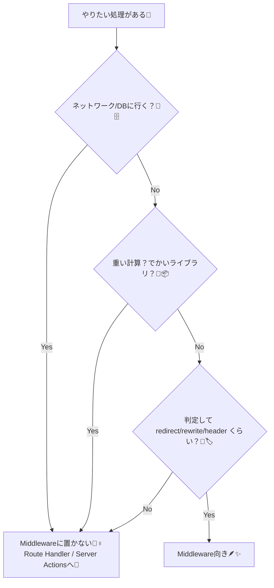

# 第121章：やりすぎ注意：重い処理は置かない🪶

この章のゴールだよ🎯

* Middleware に「置いていい処理 / ダメな処理」を見分けられる👀✨
* “重い処理” をどこに移すと幸せになれるか分かる🚚💨
* 最小の Middleware（軽いガード）を1つ書けるようになる✍️🍪

---

## まず大事な感覚：Middleware は「入口の係員」だよ🚪👮‍♀️

Middleware は **ルートに入る前**に動く“前さばき”みたいなもの✨
ここで時間がかかると、**毎回ぜんぶのリクエストが遅くなる**のが最大の怖さ😱🐢

Next.js の Edge Runtime は「速いけど制約あり」な環境で、**Node.js の全部のAPIが使えるわけじゃない**よ〜という前提もあるよ⚡🧩 ([Next.js][1])

---

## 図で見る：軽い Middleware と、やっちゃいけない Middleware 🪶🪨






---

## 「重い処理」ってなに？（Middleware では避けるやつ）🪨🙅‍♀️

### ❌ Middleware に置かないほうがいい代表例

* DB への問い合わせ（例：セッションをDBで照合）🗄️🔍
* 外部APIへの fetch を毎回する📡💸
* 画像処理・PDF処理・暗号化の重い計算🖼️🧮
* “でかい認証ライブラリ” を丸ごと読み込む（バンドルが膨らむ）📦💥
* ブロッキングっぽい処理（待ちが多い）⏳😵‍💫

「Middleware は軽くするべき」「重い計算はダメ」っていうのは、いろんな解説でも共通の方針だよ🪶✨ ([Contentful][2])

Edge Runtime は **Node.js API の一部が非対応**だったり、環境によっては **サイズ制限**みたいな制約もあるので、「頑張って色々やろう」とすると詰まりやすいよ⚡📦 ([Next.js][1])

---

## ✅ Middleware に向いてる処理（軽い・速い・単純）🪶✨

* リダイレクト（ログインしてないなら `/login` へ）🚦➡️
* URLの書き換え（rewrite）🛣️
* Cookie / Header をちょっと見る・ちょっと付ける🍪🏷️
* 言語判定して `/ja` `/en` に振り分ける🌏💬
* “ざっくりチェック（optimistic check）” ✅

  * 例：`session` cookie が「ある/ない」だけ見る（DB照合はしない）

---

## 判断フロー：迷ったらこれで決めよ🧠🧁



---

## 実例：ダッシュボードは「入口で軽く止める」だけにする🚦🍪

やりたいこと：

* `/dashboard` に来た人が **ログインしてなさそう**なら `/login` に飛ばす💨
* でも **DBで本当のログイン確認**は Middleware ではやらない（重いから）🪨🙅‍♀️

### ✅ middleware.ts（軽い！）

```ts
import { NextRequest, NextResponse } from "next/server";

export function middleware(req: NextRequest) {
  const isDashboard = req.nextUrl.pathname.startsWith("/dashboard");

  if (!isDashboard) return NextResponse.next();

  // ✅ ここでは「ある/ない」だけ見る（optimistic check）
  const session = req.cookies.get("session")?.value;

  if (!session) {
    const url = req.nextUrl.clone();
    url.pathname = "/login";
    // どこから来たか戻れるようにしておくと親切🎀
    url.searchParams.set("from", req.nextUrl.pathname);
    return NextResponse.redirect(url);
  }

  return NextResponse.next();
}

// できれば対象を絞る（静的ファイル等まで毎回動かさない）✨
export const config = {
  matcher: ["/dashboard/:path*"],
};
```

### ❌ やりがちなNG例（重い！）

* middleware の中で「毎回DBで session 確認」
* middleware の中で「毎回 `/api/me` を fetch してユーザー取得」

これをやると、**ダッシュボードに入る前の全員が毎回待たされる**感じになりやすいよ🐢💦
（さらに Edge だと使えないライブラリが出たりもして、ハマりやすい…！）([Next.js][1])

---

## じゃあ「本当のチェック」はどこでやるの？🏠🔐

おすすめはこのへん👇✨

* **Server Component**（ページ側）で「ユーザー取得＋権限チェック」🧊
* **Route Handler**（`app/api/.../route.ts`）で「認証API」🚪
* **Server Actions** で「フォーム送信時に厳密チェック」📨

Middleware は “入口で軽くふるいにかける” くらいがちょうどいいよ🪶😊

---

## ミニ練習🎯（5分）🕔✨

1. 上の `middleware.ts` をプロジェクト直下に作る📄
2. Cookie が無い状態で `/dashboard` にアクセスして、`/login` に飛べたらOK🚦🎉
3. Cookie を適当に付けたら（DevToolsでOK） `/dashboard` が通るのを確認🍪✅
4. 「Middlewareでは通す/止めるだけ。本当の認証はページ側でやる」って意識をメモ📝💗

---

## まとめ：合言葉は「薄く、速く、鋭く」🪶⚡✂️

* Middleware は **入口の前処理**だから、重いことをすると全体が遅くなる🐢
* **DB / 外部通信 / 重い計算 / でかいライブラリ**は置かない🙅‍♀️🪨
* “ある/ない”みたいな **軽い判定だけ**して、詳細はページやAPI側に渡す🚚✨

次の章（Edge Runtime）につながる超大事ポイントなので、この感覚はここで固めちゃおうね〜😊🌸

[1]: https://nextjs.org/docs/app/api-reference/edge?utm_source=chatgpt.com "Edge Runtime - API Reference"
[2]: https://www.contentful.com/blog/next-js-middleware/?utm_source=chatgpt.com "Next.js Middleware guide, tutorial, and code examples"
