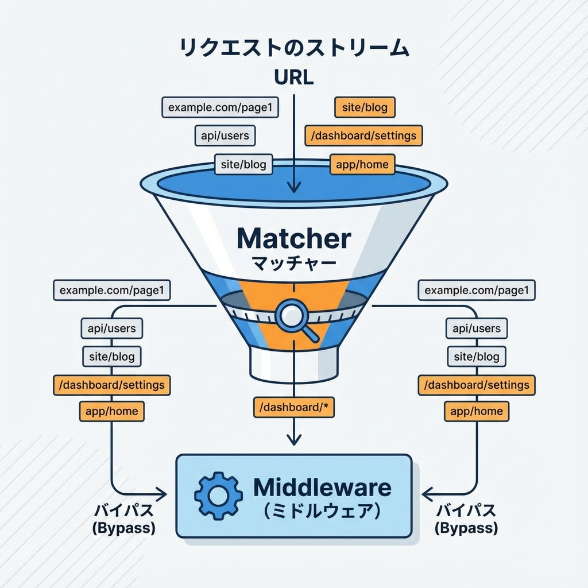
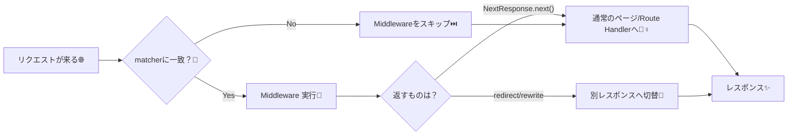

# 第123章：パスごとに適用/除外の設定🧭

Middlewareって便利なんだけど、**全部のリクエストで動いちゃう**と大変…！😵‍💫
だからこの章は「**このURLだけ通す / これは通さない**」をサクッと設定できるようになるのがゴールだよ〜✨

---

### 1) まず結論：`matcher` で「通す範囲」を決めるのが基本✅

Next.jsのMiddlewareは、`middleware.ts` に `export const config = { matcher: ... }` を書くと、**一致したパスだけ**実行されるよ🎯 ([Next.js][1])

---

## 2) いちばん簡単：特定フォルダ配下だけ適用する📁✨

たとえば「`/dashboard` 配下だけログイン必須にしたい！」ってよくあるよね😊
この場合はこれでOK👇

```ts
// middleware.ts（または src/middleware.ts）
import type { NextRequest } from "next/server";
import { NextResponse } from "next/server";

export function middleware(request: NextRequest) {
  const isLoggedIn = request.cookies.get("session")?.value === "1";

  if (!isLoggedIn) {
    const url = request.nextUrl.clone();
    url.pathname = "/login";
    url.searchParams.set("from", request.nextUrl.pathname);
    return NextResponse.redirect(url);
  }

  return NextResponse.next();
}

export const config = {
  matcher: ["/dashboard/:path*"], // /dashboard とその下だけ
};
```

* `:path*` は「その下ぜんぶ」って意味だよ〜🍀
  `/dashboard`、`/dashboard/settings`、`/dashboard/posts/123` みたいに全部ヒットする✨ ([Next.js][1])

---

## 3) 複数指定もできるよ🧺✨

「ダッシュボードと管理画面だけ！」みたいに複数もOK👇

```ts
export const config = {
  matcher: ["/dashboard/:path*", "/admin/:path*"],
};
```

---

## 4) ちょい難しいけど超便利：除外（除外したいものが多い時）🙅‍♀️🧼

「基本は全部に効かせたい！でも **APIや静的ファイルは除外したい**」って時あるよね🤔
そのときは公式でも出てくる **negative lookahead（否定先読み）** の正規表現が便利✨ ([Next.js][1])

```ts
export const config = {
  matcher: [
    "/((?!api|_next/static|_next/image|favicon.ico|sitemap.xml|robots.txt).*)",
  ],
};
```

この意味はざっくりこう👇

* `/api` は除外（APIルート）
* `/_next/static` は除外（ビルドされた静的ファイル）
* `/_next/image` は除外（画像最適化）
* `favicon.ico` や `sitemap.xml` や `robots.txt` も除外（メタ系）

「必要なページだけにMiddlewareを当てて、余計なものに当てない」って感じだね🧤✨ ([Next.js][2])

---

## 5) 「画像（png）も除外したい」みたいな拡張もできる🖼️🚫

例えば「`.png` は全部除外したい」ならこんな感じ👇
（`.png` を正規表現で弾いてるよ〜） ([Next.js][3])

```ts
export const config = {
  matcher: [
    "/((?!api|_next/static|_next/image|.*\\.png$).*)",
  ],
};
```

---

## 6) 図でイメージ：matcherに合う時だけ動く💡






---

## 7) matcher以外のやり方：middleware内で条件分岐する（でも基本はmatcher推し）⚖️

もちろんこういうのも書けるよ👇（`pathname` で分岐）

```ts
export function middleware(request: NextRequest) {
  const { pathname } = request.nextUrl;

  if (!pathname.startsWith("/dashboard")) {
    return NextResponse.next();
  }

  // /dashboardだけ特別処理…
  return NextResponse.next();
}
```

ただし、公式的にも **「matcherで絞る方がムダに呼ばれなくて良い」** ってニュアンスがあるので、基本は `matcher` を使うのがオススメだよ〜🫶 ([Next.js][4])

---

## 8) ミニ練習（3分）🧪✨

### 練習A：`/dashboard` だけログイン必須にする🔐

* さっきのコードでOK！
* ブラウザで

  * `http://localhost:3000/` → そのまま表示😀
  * `http://localhost:3000/dashboard` → `/login` に飛ぶ🚀

### 練習B：`/login` にもMiddlewareが当たって無限リダイレクトしそう…を防ぐ🌀

* `matcher` を `/dashboard/:path*` にしておくと、そもそも `/login` は通らないから安全👍

---

## まとめ🎀

* **パスごとの適用は `config.matcher` が基本**🧤
* **特定フォルダだけ当てたい** → `"/dashboard/:path*"` が最強✨ ([Next.js][1])
* **いろいろ除外したい** → `"/((?!... ).*)"` の形（公式例あり）🙅‍♀️ ([Next.js][2])

次の章（第124章）で、これを使って「/dashboard をログイン必須にする導線」をもっとそれっぽく組めるようになるよ〜！💪💕

[1]: https://nextjs.org/docs/14/app/building-your-application/routing/middleware?utm_source=chatgpt.com "Routing: Middleware"
[2]: https://nextjs.org/docs/15/pages/api-reference/file-conventions/middleware?utm_source=chatgpt.com "File-system conventions: Middleware"
[3]: https://nextjs.org/docs/app/api-reference/file-conventions/proxy?utm_source=chatgpt.com "File-system conventions: proxy.js"
[4]: https://nextjs.org/docs/messages/middleware-upgrade-guide?utm_source=chatgpt.com "Middleware Upgrade Guide"
