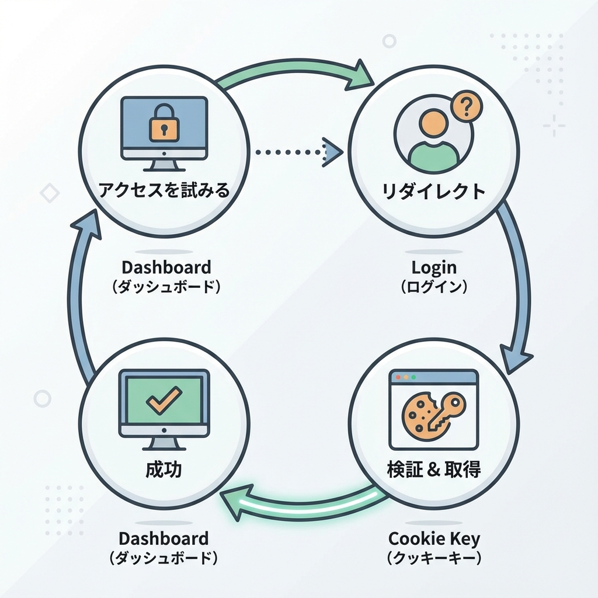
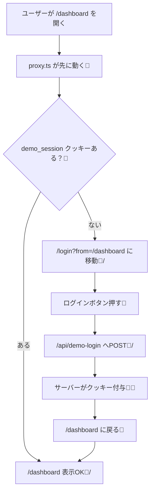

# 第124章：練習：/dashboard をログイン必須にする導線🧱

この章は「**/dashboard に入ろうとしたら、ログインしてない人は /login に飛ばす**」っていう、超よく使う“守り方”を体験する回だよ〜！😆✨
（本物の認証はまだ先でOK！今日は「導線」と「入口ガード」を作る練習だよ🧸）

---

## 🎯 今日のゴール

* `/dashboard` にアクセスしたら…

  * ✅ ログイン済み（クッキーあり）→そのまま表示🎉
  * ❌ 未ログイン（クッキーなし）→ `/login` にリダイレクト🚪➡️🔑
* ログインしたら、元のページ（/dashboard）へ戻れるようにする🧭✨

---

## 🗺️ 導線の図解（全体の流れ）✨






---

## ✅ まず作るもの（ファイル一覧）📁✨

* `proxy.ts`（旧 middleware.ts。最新では `proxy.ts` が推奨だよ〜） ([Next.js][1])
* `app/login/page.tsx`（ログイン画面）
* `app/dashboard/page.tsx`（保護したい画面）
* `app/api/demo-login/route.ts`（ログイン：クッキーを付ける）
* `app/api/demo-logout/route.ts`（ログアウト：クッキー消す）
* `components/LogoutButton.tsx`（ログアウトボタン）

---

## 1) まずは「ログイン画面」と「ダッシュボード」を作る🏠🔑

### ✅ `app/login/page.tsx`

```tsx
'use client'

import { useRouter, useSearchParams } from 'next/navigation'

export default function LoginPage() {
  const router = useRouter()
  const searchParams = useSearchParams()

  const from = searchParams.get('from') ?? '/dashboard'

  const onLogin = async () => {
    await fetch('/api/demo-login', { method: 'POST' })
    router.push(from)
    router.refresh()
  }

  return (
    <main style={{ padding: 24 }}>
      <h1 style={{ fontSize: 24, fontWeight: 700 }}>ログイン🔑✨</h1>
      <p style={{ marginTop: 8 }}>ここは練習用だよ〜！ボタン押したらログイン扱いにするね😺</p>

      <button
        onClick={onLogin}
        style={{
          marginTop: 16,
          padding: '10px 14px',
          borderRadius: 10,
          border: '1px solid #ddd',
          cursor: 'pointer',
        }}
      >
        ログインする🎉
      </button>
    </main>
  )
}
```

### ✅ `app/dashboard/page.tsx`

```tsx
import LogoutButton from '@/components/LogoutButton'

export default function DashboardPage() {
  return (
    <main style={{ padding: 24 }}>
      <h1 style={{ fontSize: 24, fontWeight: 700 }}>Dashboard 📊✨</h1>
      <p style={{ marginTop: 8 }}>ここはログインした人だけが見れるページだよ〜🔐</p>

      <div style={{ marginTop: 16 }}>
        <LogoutButton />
      </div>
    </main>
  )
}
```

### ✅ `components/LogoutButton.tsx`

```tsx
'use client'

import { useRouter } from 'next/navigation'

export default function LogoutButton() {
  const router = useRouter()

  const onLogout = async () => {
    await fetch('/api/demo-logout', { method: 'POST' })
    router.push('/login')
    router.refresh()
  }

  return (
    <button
      onClick={onLogout}
      style={{
        padding: '10px 14px',
        borderRadius: 10,
        border: '1px solid #ddd',
        cursor: 'pointer',
      }}
    >
      ログアウトする🚪🍪
    </button>
  )
}
```

---

## 2) ログイン/ログアウトAPI（クッキーを付ける🍪✨）

Next.js は Route Handler / Server Action から `cookies()` でクッキーを **set/delete** できるよ〜！ ([Next.js][2])

### ✅ `app/api/demo-login/route.ts`

```ts
import { cookies } from 'next/headers'
import { NextResponse } from 'next/server'

export async function POST() {
  const cookieStore = await cookies()

  cookieStore.set('demo_session', 'ok', {
    httpOnly: true,
    sameSite: 'lax',
    path: '/',
    maxAge: 60 * 60, // 1時間（練習用）
  })

  return NextResponse.json({ ok: true })
}
```

### ✅ `app/api/demo-logout/route.ts`

```ts
import { cookies } from 'next/headers'
import { NextResponse } from 'next/server'

export async function POST() {
  const cookieStore = await cookies()
  cookieStore.delete('demo_session')

  return NextResponse.json({ ok: true })
}
```

---

## 3) いよいよ入口ガード！ `proxy.ts` を作る🧤🚦

💡 **ポイント：** `proxy.ts` は「ページが描画される前」に先に動ける“門番”だよ〜！🧱
（昔は `middleware.ts` って呼ばれてたけど、最新では `proxy.ts` が推奨になってるよ） ([Next.js][1])

### ✅ `proxy.ts`（プロジェクトのルート直下）

```ts
import { NextResponse } from 'next/server'
import type { NextRequest } from 'next/server'

export function proxy(request: NextRequest) {
  const hasSession = request.cookies.has('demo_session')

  if (hasSession) {
    return NextResponse.next()
  }

  // 未ログインなら /login へ（from に元のパスを入れておく）
  const url = request.nextUrl.clone()
  url.pathname = '/login'
  url.searchParams.set('from', request.nextUrl.pathname)

  return NextResponse.redirect(url)
}

export const config = {
  matcher: ['/dashboard/:path*'],
}
```

* `matcher: ['/dashboard/:path*']` で **/dashboard とその下全部**（例：`/dashboard/settings`）に適用できるよ🧭 ([Next.js][1])
* `request.cookies.has(...)` でクッキーの有無チェック🍪 ([Next.js][1])
* `NextResponse.redirect(...)` でリダイレクト🚪 ([Next.js][3])

---

## ✅ 動作チェック（ここ楽しいやつ😆🎮）

1. 開発サーバー起動

   ```bash
   npm run dev
   ```

2. ブラウザで `http://localhost:3000/dashboard` を開く🌈

   * クッキーない → `/login?from=/dashboard` に飛ぶ🚪✨

3. ログインボタン押す🎉

   * `/api/demo-login` がクッキーを付ける🍪
   * `/dashboard` に戻る🧭

4. ログアウトボタン押す🚪

   * クッキー消える🍪❌
   * `/login` に戻る🔁

---

## 😵 よくあるハマり（先に潰す🥊✨）

* **`proxy.ts` を置く場所が違う**
  → `app/` と同じ階層（プロジェクトのルート）に置くよ！ ([Next.js][1])

* **`matcher` を広くしすぎて、全部ログイン必須になっちゃう**
  → まずは `['/dashboard/:path*']` だけにして安全運転が◎🧸

* **ログイン後に戻る先がわからない**
  → `from` クエリを使うのがいちばん簡単だよ〜🧭✨

---

## 🎁 できたこと（えらい！👏🥰）

* 「ページを表示する前」に、入口でログイン判定できた🧤🔐
* 未ログインなら `/login` に誘導できた🚪
* ログイン後に元の場所へ戻す導線も作れた🧭✨

この導線ができると、次に“本物の認証”を入れる時も、置き換えるだけで一気に強くなるよ〜！💪🔥

[1]: https://nextjs.org/docs/app/api-reference/file-conventions/proxy "File-system conventions: proxy.js | Next.js"
[2]: https://nextjs.org/docs/app/api-reference/functions/cookies "Functions: cookies | Next.js"
[3]: https://nextjs.org/docs/app/api-reference/functions/next-response?utm_source=chatgpt.com "Functions: NextResponse"
