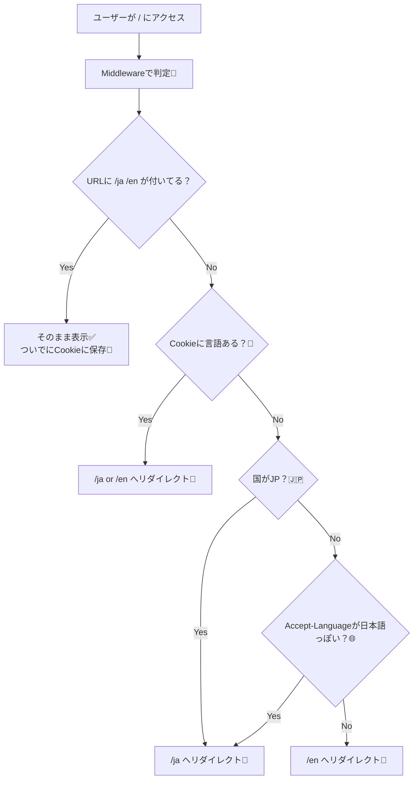

# 第125章：練習：国別/言語別にリダイレクトするイメージ🌏

この章では、**`/` に来た人を「国（JPかどうか）」「ブラウザ言語（Accept-Language）」「前回選んだ言語（Cookie）」で判断して、`/ja` か `/en` に自動で飛ばす**ミニ実装を作るよ〜😊💨
（Next.jsの **Middleware** を使う練習だよ🧤）

---

## 1) 今日のゴール🎯✨

* `http://localhost:3000/` にアクセスしたら…

  * 🇯🇵 **JPなら `/ja`**
  * 🌍 **それ以外は `/en`**
  * ただし、🍪 **Cookieで前回の言語が覚えられてたらそれを優先**
  * それも無ければ 🌐 **Accept-Language（ブラウザ言語）で推測**（日本語っぽければ `/ja`）
* `/ja` と `/en` のページを用意して、切り替えもできるようにする🔁✨

Next.js公式も、ブラウザ言語（`Accept-Language`）を使ってロケールを選ぶのを推奨してるよ〜📌 ([nextjs.org][1])

---

## 2) ざっくり図解🧠🗺️（Mermaid）




---

## 3) 準備：ページを2つ作ろう📁✨

### ✅ `app/ja/page.tsx`

```tsx
import Link from "next/link";

export default function JaPage() {
  return (
    <main style={{ padding: 24, lineHeight: 1.8 }}>
      <h1>こんにちは！🇯🇵✨</h1>
      <p>
        ここは <code>/ja</code> だよ〜😊
      </p>

      <p>
        <Link href="/en">👉 Englishページへ</Link>
      </p>
    </main>
  );
}
```

### ✅ `app/en/page.tsx`

```tsx
import Link from "next/link";

export default function EnPage() {
  return (
    <main style={{ padding: 24, lineHeight: 1.8 }}>
      <h1>Hello! 🌍✨</h1>
      <p>
        You are on <code>/en</code> 🙂
      </p>

      <p>
        <Link href="/ja">👉 日本語ページへ</Link>
      </p>
    </main>
  );
}
```

### ✅ `app/page.tsx`（保険として置いとく🧸）

Middlewareが動いてると基本ここは見えないけど、念のため置いとくと安心☺️

```tsx
export default function Home() {
  return (
    <main style={{ padding: 24 }}>
      <p>Redirecting... ⏳</p>
    </main>
  );
}
```

---

## 4) 本題：`middleware.ts` を作ろう🧤🔥

プロジェクトのルート（`package.json` と同じ階層）に **`middleware.ts`** を作ってね✨

```ts
import { NextRequest, NextResponse } from "next/server";

const SUPPORTED_LOCALES = ["ja", "en"] as const;
type Locale = (typeof SUPPORTED_LOCALES)[number];

const DEFAULT_LOCALE: Locale = "en";
const LOCALE_COOKIE = "pref_locale";

// ローカル確認用：/?__country=JP みたいに付けると国判定を疑似れるよ🧪
const DEBUG_COUNTRY_PARAM = "__country";

function isSupportedLocale(value: string | null | undefined): value is Locale {
  return !!value && (SUPPORTED_LOCALES as readonly string[]).includes(value);
}

function getLocaleFromPathname(pathname: string): Locale | null {
  const first = pathname.split("/")[1]; // "" or "ja" or "en"
  return isSupportedLocale(first) ? first : null;
}

// 例: "ja,en-US;q=0.9,en;q=0.8"
function getLocaleFromAcceptLanguage(header: string | null): Locale | null {
  if (!header) return null;

  const langs = header
    .split(",")
    .map((part) => part.trim().split(";")[0])
    .filter(Boolean);

  for (const lang of langs) {
    const primary = lang.toLowerCase().split("-")[0]; // "ja-JP" -> "ja"
    if (isSupportedLocale(primary)) return primary;
  }
  return null;
}

function getLocaleFromCountry(country: string | undefined): Locale | null {
  if (!country) return null;
  return country.toUpperCase() === "JP" ? "ja" : "en";
}

function redirectToLocale(url: URL, locale: Locale) {
  const nextUrl = new URL(url);

  // / -> /ja , /something -> /ja/something
  nextUrl.pathname = `/${locale}${url.pathname === "/" ? "" : url.pathname}`;

  // デバッグ用パラメータは見た目が汚れるので消す🧼
  nextUrl.searchParams.delete(DEBUG_COUNTRY_PARAM);

  const res = NextResponse.redirect(nextUrl);

  // 次回はCookie優先にできるように記憶🍪
  res.cookies.set(LOCALE_COOKIE, locale, {
    path: "/",
    sameSite: "lax",
  });

  return res;
}

export function middleware(request: NextRequest) {
  const url = request.nextUrl;
  const pathname = url.pathname;

  // 1) すでに /ja や /en ならそのまま通す（ついでにCookieに保存🍪）
  const localeInPath = getLocaleFromPathname(pathname);
  if (localeInPath) {
    const res = NextResponse.next();
    res.cookies.set(LOCALE_COOKIE, localeInPath, {
      path: "/",
      sameSite: "lax",
    });
    return res;
  }

  // 2) Cookieに前回の言語があれば最優先🍪
  const cookieLocale = request.cookies.get(LOCALE_COOKIE)?.value;
  if (isSupportedLocale(cookieLocale)) {
    return redirectToLocale(url, cookieLocale);
  }

  // 3) 国で判定🇯🇵（本番でVercel等なら request.geo が入ることがある）
  // ローカルは undefined になりがちなので、?__country=JP で疑似テストできるようにしてるよ🧪
  const debugCountry = url.searchParams.get(DEBUG_COUNTRY_PARAM) ?? undefined;
  const country = debugCountry ?? request.geo?.country;

  const localeFromCountry = getLocaleFromCountry(country);
  if (localeFromCountry) {
    return redirectToLocale(url, localeFromCountry);
  }

  // 4) ブラウザ言語（Accept-Language）で推測🌐
  const localeFromHeader = getLocaleFromAcceptLanguage(
    request.headers.get("accept-language")
  );
  if (localeFromHeader) {
    return redirectToLocale(url, localeFromHeader);
  }

  // 5) 最後はデフォルトで en 🧸
  return redirectToLocale(url, DEFAULT_LOCALE);
}

// Middlewareを当てたくないパスを除外（静的ファイル等）🧯
// こういうmatcherの書き方は公式例にもあるよ✅ :contentReference[oaicite:1]{index=1}
export const config = {
  matcher: [
    "/((?!api|_next/static|_next/image|favicon.ico|robots.txt|sitemap.xml).*)",
  ],
};
```

* `Accept-Language` で言語を推測する流れは、i18nのガイドでもよく出てくる考え方だよ🌐 ([nextjs.org][1])
* `request.geo` を使った国判定は、ホスティング環境（特にVercel）依存になりやすい点は覚えておくと安心だよ〜⚠️ ([Vercel][2])

---

## 5) 動作確認しよ〜😆✅（Windows）

### ① まず起動🚀

* VSCodeのターミナルで：

```bash
npm run dev
```

### ② 国判定の疑似テスト🧪（ローカルで超便利！）

* ブラウザでこれ開いてみて👇

  * 🇯🇵 JP想定：`http://localhost:3000/?__country=JP` → `/ja` に飛ぶ✨
  * 🌍 US想定：`http://localhost:3000/?__country=US` → `/en` に飛ぶ✨

### ③ Cookieが効いてるかチェック🍪

1回 `/en` を開いたあとに、`/` に戻ると `/en` に飛ぶはず！🔁
（逆も同じで `/ja` を開いたら次回は `/ja` 優先になるよ😊）

---

## 6) ハマりやすいポイント集🪤💦（ここ大事！）

* **無限リダイレクト**になる🥶
  → `/ja` や `/en` みたいに「すでにロケール付きのURLなら素通り」してる？（今回のコードはOK👌）
* **`/_next/static` とかにもMiddlewareが当たって重い**🐢
  → `matcher` で除外しよ〜！（今回やってるよ✅）([nextjs.org][3])
* **ローカルで `request.geo?.country` が取れない**😵
  → それ普通！本番環境依存のことが多いよ〜。だから今回は `?__country=JP` を用意したよ🧪 ([Vercel][2])

---

## 7) ミニ課題🎒✨（できたら強い！）

1. `SUPPORTED_LOCALES` に `"ko"` を足して、`/ko` も作ってみよ🇰🇷✨
2. 国判定ルールをちょい改造してみよ🛠️

   * 例：`JP -> ja`、`KR -> ko`、それ以外 `en` みたいにする🌏
3. Cookie名を変えてもちゃんと動くか試す（理解が深まるよ🍪🧠）

---

ここまでできたら、**「アクセスした瞬間にユーザーに合う入口へ案内する」**って感覚がつかめるはず〜😊🚪✨

[1]: https://nextjs.org/docs/app/guides/internationalization?utm_source=chatgpt.com "Guides: Internationalization"
[2]: https://vercel.com/docs/routing-middleware/api?utm_source=chatgpt.com "Routing Middleware API"
[3]: https://nextjs.org/docs/app/api-reference/file-conventions/proxy?utm_source=chatgpt.com "File-system conventions: proxy.js"
