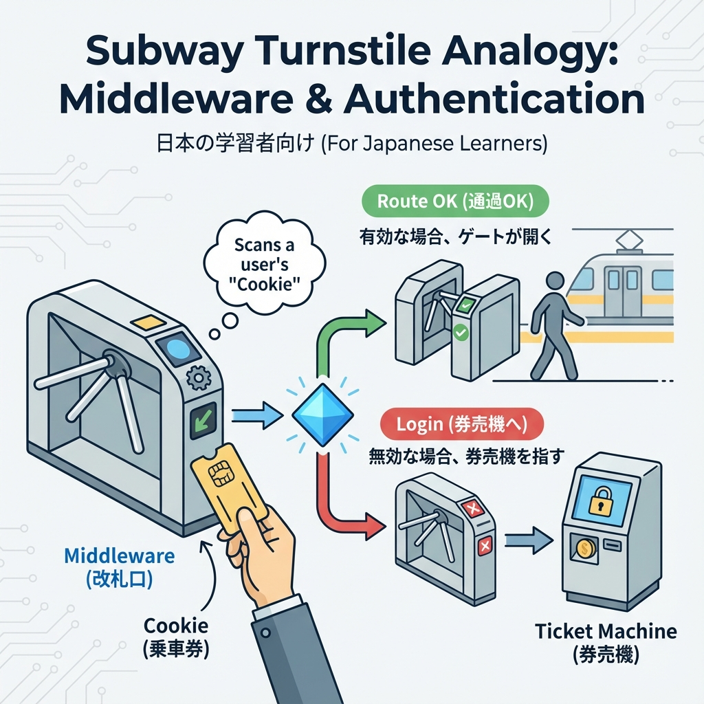
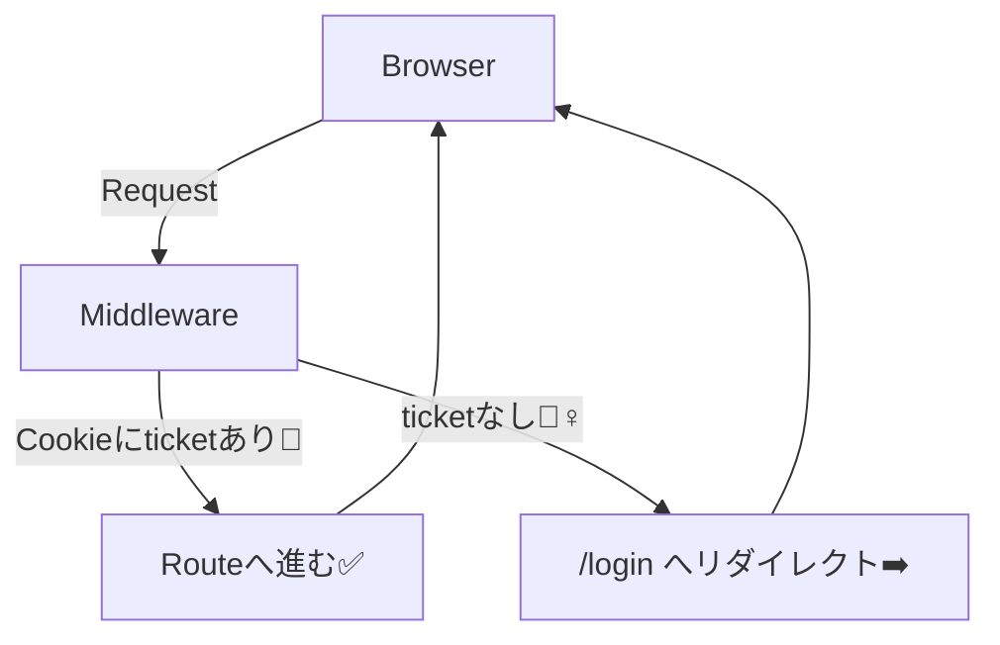

# 第126章：Cookieで“入場券”を見る🍪🎫

## 今日のゴール🏁✨

* Middleware で **Cookie（入場券🎫）** を読んで、ページへの入場OK/NGを分けられるようになる🙆‍♀️🙅‍♀️
* **「/dashboard は入場券がある人だけ」** をミニ実装して体験する💻🌟

---

## まずはイメージ図🧠🍪





Middleware は「ルートに入る前の関所」みたいに動けて、リクエストの **URL / headers / cookies** などを見て分岐できます。 ([Next.js][1])

---

## Cookieってなに？🍪（超ざっくり）

Cookie はブラウザが持つ小さなメモで、**リクエストのたびにサーバーへ送られる**のが強みです📨✨
Next.js では Middleware の `NextRequest` / `NextResponse` に **cookies操作の仕組み**が用意されてます。 ([Next.js][2])

よく「入場券🎫」として使うのはこんな感じ👇

* `ticket=ok` みたいな Cookie がある → 入場OK✅
* ない → /login に誘導➡️

---

## ハンズオン：入場券つきダッシュボードを作ろう🎮🍪

ここからの完成形👇

* `/login`：入場券を発行する（Cookieをセット）🎫
* `/dashboard`：入場券がないと入れない🔐
* `middleware.ts`：Cookieを見て入場チェック👀🍪

---

# 1) /dashboard ページを用意する📄✨

`app/dashboard/page.tsx`

```tsx
export default function DashboardPage() {
  return (
    <main style={{ padding: 24 }}>
      <h1>Dashboard 🎉</h1>
      <p>入場できたよ！Cookieの入場券があるね🍪🎫</p>

      <form action="/api/logout" method="post">
        <button type="submit">ログアウトする🚪</button>
      </form>
    </main>
  );
}
```

---

# 2) Middleware で「ticket Cookie」をチェックする🧤👀

プロジェクト直下に `middleware.ts` を作成します（`app/` と同じ階層）📁

`middleware.ts`

```ts
import { NextResponse } from "next/server";
import type { NextRequest } from "next/server";

export function middleware(request: NextRequest) {
  // Cookieを読む🍪（なければ undefined）
  const ticket = request.cookies.get("ticket")?.value;

  // /dashboard へ来たのに ticket がない → /loginへ
  if (!ticket) {
    const url = new URL("/login", request.url);
    // どこへ行こうとしてたかも付けておく（親切😌）
    url.searchParams.set("next", request.nextUrl.pathname);
    return NextResponse.redirect(url);
  }

  // ticket がある → 通してあげる✅
  return NextResponse.next();
}

// middleware を効かせる場所を限定（大事！）🧭
export const config = {
  matcher: ["/dashboard/:path*"],
};
```

ポイント📌

* `request.cookies.get("ticket")` で Cookie を読めます🍪 ([Next.js][2])
* `matcher` で対象ルートを絞るの大事（全部にかけると重くなりがち）🫶 ([Next.js][1])

---

# 3) /login ページ（入場券を発行する入口）🎫✨

`app/login/page.tsx`

```tsx
export default async function LoginPage({
  searchParams,
}: {
  searchParams: Promise<{ next?: string }>;
}) {
  const { next } = await searchParams;
  const nextPath = next ?? "/dashboard";

  return (
    <main style={{ padding: 24 }}>
      <h1>Login 🔑</h1>
      <p>ここで入場券（Cookie）を発行するよ🍪🎫</p>

      <form action="/api/login" method="post">
        <input type="hidden" name="next" value={nextPath} />
        <button type="submit">入場券を発行して入る🎫➡️</button>
      </form>
    </main>
  );
}
```

---

# 4) Route Handlerで Cookie をセットする（/api/login）🧪🍪

`app/api/login/route.ts`

```ts
import { NextResponse } from "next/server";
import type { NextRequest } from "next/server";

export async function POST(request: NextRequest) {
  const form = await request.formData();
  const nextPath = (form.get("next") as string) || "/dashboard";

  // リダイレクト用レスポンスを作る
  const response = NextResponse.redirect(new URL(nextPath, request.url));

  // Cookie（入場券🎫）をセット🍪
  response.cookies.set("ticket", "ok", {
    httpOnly: true, // JSから読めないように（安全寄り🛡️）
    sameSite: "lax",
    path: "/",
    maxAge: 60 * 60, // 1時間
  });

  return response;
}
```

Cookie は `NextResponse` 側で `set` できます🍪✨ ([Next.js][3])
また、セッションを Cookie に保存するなら **HttpOnly / Secure / SameSite / Max-Age** みたいなオプションが推奨されます🔐 ([Next.js][4])

---

# 5) ログアウト（Cookieを消す /api/logout）🚪🧼

`app/api/logout/route.ts`

```ts
import { NextResponse } from "next/server";
import type { NextRequest } from "next/server";

export async function POST(request: NextRequest) {
  const response = NextResponse.redirect(new URL("/login", request.url));
  response.cookies.delete("ticket");
  return response;
}
```

---

## 動作チェック✅🎉（この順でやると気持ちいい）

1. `http://localhost:3000/dashboard` に行く
   → ticket がないので `/login` に飛ばされるはず➡️😆
2. `/login` のボタンを押す
   → Cookie 発行🍪🎫 → `/dashboard` に入れる！🎉
3. Dashboard の「ログアウト」押す
   → Cookie 削除🧼 → 次はまた入れない🙅‍♀️

---

## よくあるハマりどころ🪤😵‍💫

* **Cookie名の打ち間違い**（`ticket` と `tikcet` とか）🫠
* **matcher を広げすぎ**て、全部のページで middleware が動いてしまう💦
* Cookie を JS から触りたくて `httpOnly: true` にして「あれ読めない！」ってなる
  → それは仕様で、安全寄りの設定だよ🛡️（Middleware では読める🍪）

---

## まとめ🌸

* Middleware は「入る前にチェックできる関所」🧤
* Cookie は「リクエストにくっついてくる入場券」🍪🎫
* `request.cookies.get()` で読んで、なければ `redirect()` で案内➡️
* `response.cookies.set()` で入場券を発行できる🎉 ([Next.js][2])

---

## ミニ課題🎯✨（できたら強い！）

1. ticket が無いとき、`/login?reason=no-ticket` を付けて飛ばしてみよう🍪➡️
2. `/dashboard` だけじゃなく `/settings` も守ってみよう🔐（matcher追加）
3. ticket の値を `"ok"` 以外にして、**値までチェック**してみよう（例：`ticket=vip`）👑🍪

次の章では、Cookieだけじゃなく「直接叩かれる前提で守る」方向へ、もう一段だけセキュリティ感を上げていくよ〜🛡️✨

[1]: https://nextjs.org/docs/14/app/building-your-application/routing/middleware?utm_source=chatgpt.com "Routing: Middleware"
[2]: https://nextjs.org/docs/app/api-reference/functions/next-request?utm_source=chatgpt.com "Functions: NextRequest"
[3]: https://nextjs.org/docs/app/api-reference/functions/next-response?utm_source=chatgpt.com "Functions: NextResponse"
[4]: https://nextjs.org/docs/app/guides/authentication?utm_source=chatgpt.com "Guides: Authentication"
