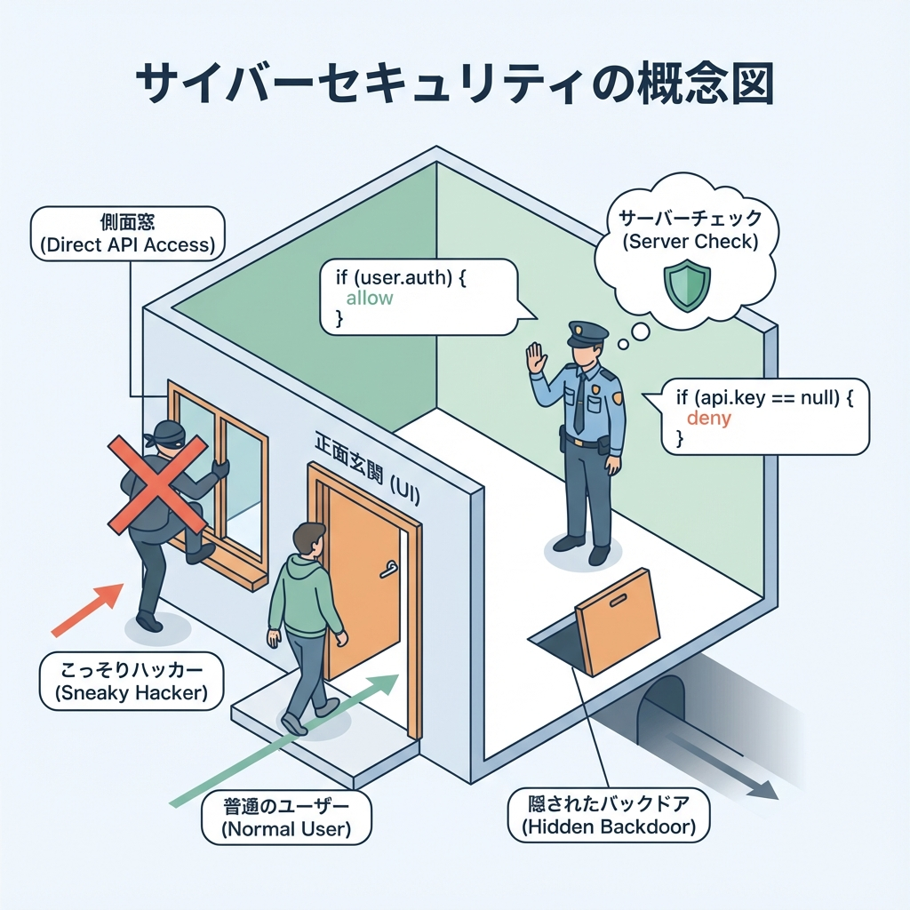
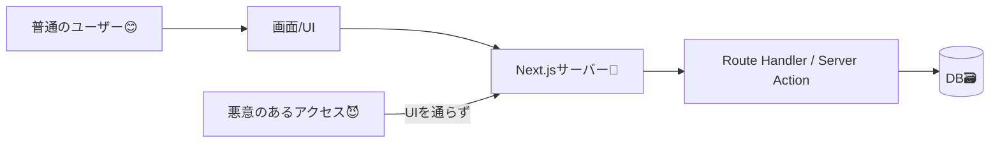

# 第127章：セキュリティ：直接叩かれる前提で守る🛡️

Webアプリってね、**画面（UI）からだけ使われる**…と思いがちだけど、実は違うんだよ〜😳
**APIやページは「直接アクセスされる前提」**で作るのが超大事！🔐✨

---

## 1) 「直接叩かれる」ってどういうこと？🕵️‍♀️💻

たとえば `/api/todos` があるとするよね？
ユーザーは画面のボタンから使うかもだけど…実際は **URLを知ってれば誰でもアクセスできる**（可能性がある）んだよ〜😱

* ブラウザのアドレスバーから直にアクセス🧭
* 別のアプリやツールからアクセス📡（※ここではやらないよ！）
* 画面で隠しててもURLは推測されることがある🔎

---

## 2) イメージ図：UIの外からも来る🚪⚠️（図解）





ポイントはこれ👇
**UIを通らなくても、サーバー(API/DB)に来るルートがある**ってこと！🚨

---

## 3) 守り方の基本：サーバー側で「必ず」チェック✅🔒

### ✅ 絶対やること 3点セット

1. **認証（Authentication）**：ログインしてる？🪪
2. **認可（Authorization）**：その人がそれを操作していい？👑
3. **入力検証（Validation）**：変な値じゃない？🧼

UIでボタンを消すのは「親切」だけど、**セキュリティじゃない**よ🙅‍♀️💦
**本体はサーバーで守る**のが正解！🛡️

---

## 4) Next.jsで「どこを守る？」マップ🗺️✨

* **Middleware**：入口の門番🧤（ざっくり止めるのに強い）
* **Server Component / page.tsx**：ページ表示の時にガードできる🏠
* **Route Handler（app/api/...）**：APIはここが最重要🔥
* **Server Actions**：フォーム送信も、ここで必ずチェック🔥
* **DBアクセス**：最終防衛線（「そのデータはそのユーザーのもの？」）🧱

---

## 5) 実践①：APIを「ログイン必須」にする🔐🍪（Route Handler）

> ここでは学習用に「cookieにログインっぽい印」を入れるだけの例だよ🍪
> 本番は Auth.js などの仕組みを使うのがおすすめ🙏✨

### `app/api/secret/route.ts`（ログインしてないと401）

```ts
import { cookies } from "next/headers";
import { NextResponse } from "next/server";

export async function GET() {
  // 例：cookieに session=1 があったらログイン扱い（学習用）
  const cookieStore = await cookies();
  const session = cookieStore.get("session")?.value;

  if (!session) {
    return NextResponse.json(
      { error: "ログインが必要だよ🍪🔐" },
      { status: 401 }
    );
  }

  return NextResponse.json({ message: "ひみつデータだよ🤫✨" });
}
```

### ためしてみよう🧪

* `http://localhost:3000/api/secret` にアクセス
* cookieが無いなら **401** が返るはず！🚫

---

## 6) 実践②：Middlewareで「入口チェック」もする🧤🚦

Middlewareは「最初に止める」係！
でも注意：**Middlewareだけで安心しない**でね（API側も必須）💡

### `middleware.ts`（/dashboard をログイン必須にする例）

```ts
import { NextResponse } from "next/server";
import type { NextRequest } from "next/server";

export function middleware(req: NextRequest) {
  const session = req.cookies.get("session")?.value;

  const isDashboard = req.nextUrl.pathname.startsWith("/dashboard");
  if (isDashboard && !session) {
    const url = req.nextUrl.clone();
    url.pathname = "/login";
    return NextResponse.redirect(url);
  }

  return NextResponse.next();
}

export const config = {
  matcher: ["/dashboard/:path*"],
};
```

---

## 7) 「認可」こそ命：他人のデータを触れないようにする🧱🗃️

ここ、めちゃ大事！！💥
たとえば `/api/todos/123` があって、ログインしてても…

* ✅ 自分のTodoならOK
* ❌ 他人のTodoなら **絶対にNG** 🙅‍♀️

### 安全な考え方（DBで「自分のもの」だけ取る）

（Prismaっぽい雰囲気の例だよ🧁）

```ts
// "id が一致"だけで取るのは危険になりがち
// "id と userId の両方一致"で取るのが安全✨

const todo = await prisma.todo.findFirst({
  where: {
    id: todoId,
    userId: sessionUserId,
  },
});

if (!todo) {
  return NextResponse.json({ error: "見つからないよ😢" }, { status: 404 });
}
```

この発想で「他人のデータに触れない」を作れるよ🔐✨

---

## 8) セキュリティ思考の合言葉📣💖

### ✅ 「信用しない」チェックリスト

* ユーザー入力は信用しない🧨
* cookie / header / hidden input も信用しない🍪🙅‍♀️
* フロント（UI）は守りじゃない🖥️💭
* **サーバーが最終判断**🧠⚖️
* DB取得は「本人のデータだけ」に絞る🗃️🔒

---

## 9) ミニ課題🎒✨（手を動かすやつ！）

### 課題A：/dashboard を守ろう🧤🏠

1. `middleware.ts` を入れて `/dashboard` を `/login` に飛ばす
2. `/dashboard/page.tsx` も「保険」でガード（ログインなければ `redirect("/login")`）してみよう🚦

### 課題B：/api/todos にも「ログイン必須」を付けよう📋🔐

* `GET /api/todos` で `session` が無かったら 401 にする
* UIを作ってなくてもOK！まずはAPIを固めよう💪✨

---

## まとめ🎀🧠

* **URLやAPIは直接アクセスされる前提**で作るよ🚪💥
* 守るのは **UIじゃなくてサーバー**🛡️
* 必須は **認証・認可・入力検証**の3点セット✅✅✅
* Middlewareは便利だけど、**API側のチェックも必ず**🔥
* DBは「本人のデータだけ取る」で事故を防ぐ🗃️🔒

---

次の章（第128章）で、「アクセス制御はUIじゃなくサーバー🙅」をもっとハッキリ固めていこうね〜！💖🚀
