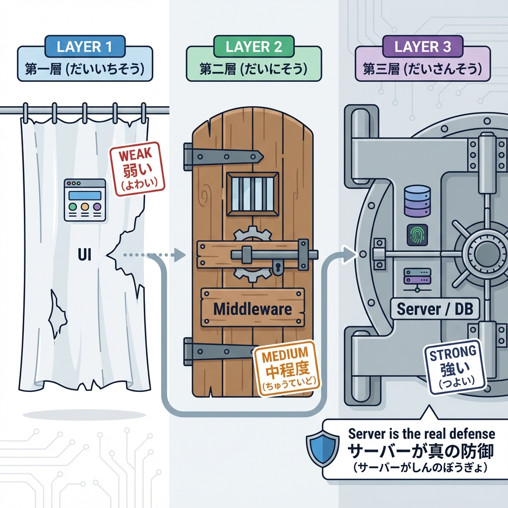
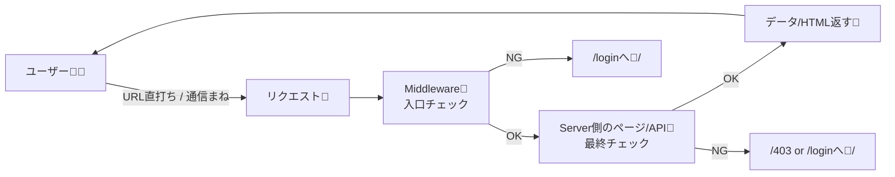
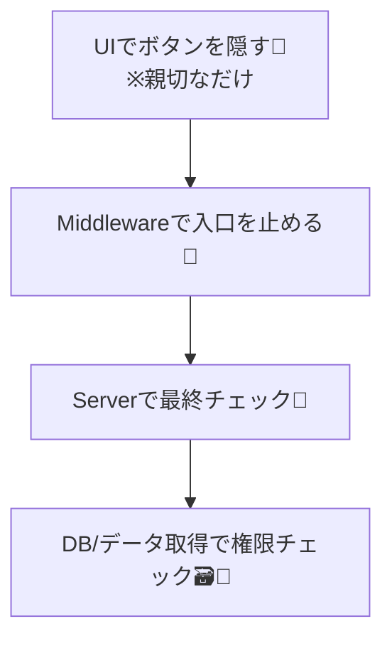

# 第128章：アクセス制御は「UI」じゃなく「サーバー」でやる🙅

「ログインしてない人にはボタンを隠す」「リンクを出さない」…って、見た目で守った気になりがちだよね🥺
でもそれ、**守れてない**ことが多いの…！💥

結論：**アクセス制御は“サーバー側”でやるのが本体**です🛡️✨
（UIは“親切”のため、セキュリティは“サーバー”の仕事だよ〜！）

---

## 1) なんでUIだけだとダメなの？😵‍💫

### UIで隠しても、叩けちゃう問題🔨

たとえば `/dashboard` を「メニューから消す」だけにしても…

* URLを手入力されたら？⌨️
* ブックマークから開かれたら？🔖
* 直接 `/api/xxx` を叩かれたら？🧪
* DevToolsで通信を真似されたら？🕵️‍♀️

**UIは“表示”を変えるだけ**で、**アクセスそのものは止められない**んだよね🥲

---

## 2) 正しい考え方：守る場所は2つ＋α 🧱✨

### ① 入口で止める：Middleware（門番）🧤

→ まず**保護ルートに入る前**に止める🚦

### ② 中でも止める：Server側（ページ/Route Handler/Server Actions）🧊

→ Middlewareをすり抜けても、**最終的にサーバーが拒否**する🙅

### ③ さらに：データアクセスで権限チェック（DB等）🗃️

→ 「ログイン済みでも、他人のデータは見せない」みたいなやつ👑

---

## 3) 図でイメージしよ〜🧠✨（UIは防壁じゃない）





ポイント：**UIは図にすら出てこない**（セキュリティの主戦場じゃない）って感じ😉✨

---

## 4) 例：`/dashboard` をサーバーで守る🔐（Next.js App Router）

ここでは「ログイン済みの証拠」として、超ざっくり **`session` Cookie** がある前提にするね🍪
（本格的には Auth.js などを使うことが多いよ〜）

---

### ✅ 4-1) Middlewareで入口チェック🧤

`middleware.ts`（プロジェクト直下）を作るよ📄

```ts
// middleware.ts
import { NextRequest, NextResponse } from "next/server";

export function middleware(request: NextRequest) {
  const session = request.cookies.get("session")?.value;

  // ログインしてないなら login へ
  if (!session) {
    const url = request.nextUrl.clone();
    url.pathname = "/login";
    // どこから来たかを付けておくと親切✨
    url.searchParams.set("from", request.nextUrl.pathname);
    return NextResponse.redirect(url);
  }

  return NextResponse.next();
}

// どのパスに適用するか（保護したい場所だけ！）
export const config = {
  matcher: ["/dashboard/:path*"],
};
```

✨これで、`/dashboard` に入る前に「門番」が止めてくれる！

---

### ✅ 4-2) Server側でも最終チェック（保険）🧊🛡️

Middlewareがあっても、**サーバー側のページでも“念のため”チェック**するのが強いよ💪
（運用でmiddlewareの設定が変わったり、例外が出たり…そういう時の保険！）

`app/dashboard/page.tsx`：

```tsx
// app/dashboard/page.tsx
import { cookies } from "next/headers";
import { redirect } from "next/navigation";

export default async function DashboardPage() {
  const cookieStore = await cookies();
  const session = cookieStore.get("session")?.value;

  if (!session) {
    redirect("/login");
  }

  return (
    <main>
      <h1>Dashboard 🔐</h1>
      <p>ログインしてる人だけが見れるよ〜✨</p>
    </main>
  );
}
```

✅ これが「アクセス制御はサーバーでやる」の形だよ〜！

---

## 5) 「UIだけガード」が危ない例⚠️（やりがち…！）

例えばClient Componentで「ログインしてないなら表示しない」ってやっても…

```tsx
"use client";

export function SecretPanel() {
  const isLoggedIn = false; // 例：状態で判定してるつもり

  if (!isLoggedIn) return null; // 表示しない

  return <div>秘密情報🤫</div>;
}
```

これって「見えない」だけで、もし裏でAPI叩いてたら…
**APIを直接叩かれたら終わり**なんだよね😇💥

---

## 6) 超重要メモ：`localStorage` を“ログイン証拠”にしない🙅‍♀️🧨

* `localStorage` は **JavaScriptから読める**
* XSSが起きたら **盗まれやすい**
* 「ログイン判定＝localStorage」だと事故りがち🥺

一般的には、ログイン状態は

* **HttpOnly Cookie（JSから読めない）**🍪🔒
* もしくはフレームワーク/ライブラリの仕組み（Auth.js等）
  に寄せることが多いよ✨

---

## 7) まとめ：守る順番はこれ🧱✨



* UI：**案内係**（便利にする）😊
* Middleware：**門番**（入口で止める）🧤
* Server：**本丸**（最終的に拒否できる）🛡️
* DB：**所有者チェック**（他人のデータは出さない）👑

---

## 8) ミニ練習（10分）📝✨

### ✅ お題：保護ルートを作ろう🔐

1. `app/login/page.tsx` を作る（中身は「ログインページだよ」って表示でOK）🚪
2. `app/dashboard/page.tsx` を作る（上の例でOK）📄
3. `middleware.ts` を置いて、`/dashboard` を守る🧤
4. ブラウザで `http://localhost:3000/dashboard` を開く

   * `session` Cookieが無いなら `/login` に飛べば成功🎉

（Cookieを手で付けるのは難しいので、今日は「飛ぶのを確認」できたらOKだよ〜😊）

---

## 9) この章のゴール🏁✨

✅ 「UIを隠す＝守れてる」じゃない！って理解できた
✅ Next.jsでは **Middleware + Server側チェック**で守るのが基本って分かった
✅ “サーバーが最後に拒否できる状態”が最強って体感した🔐💪

---
