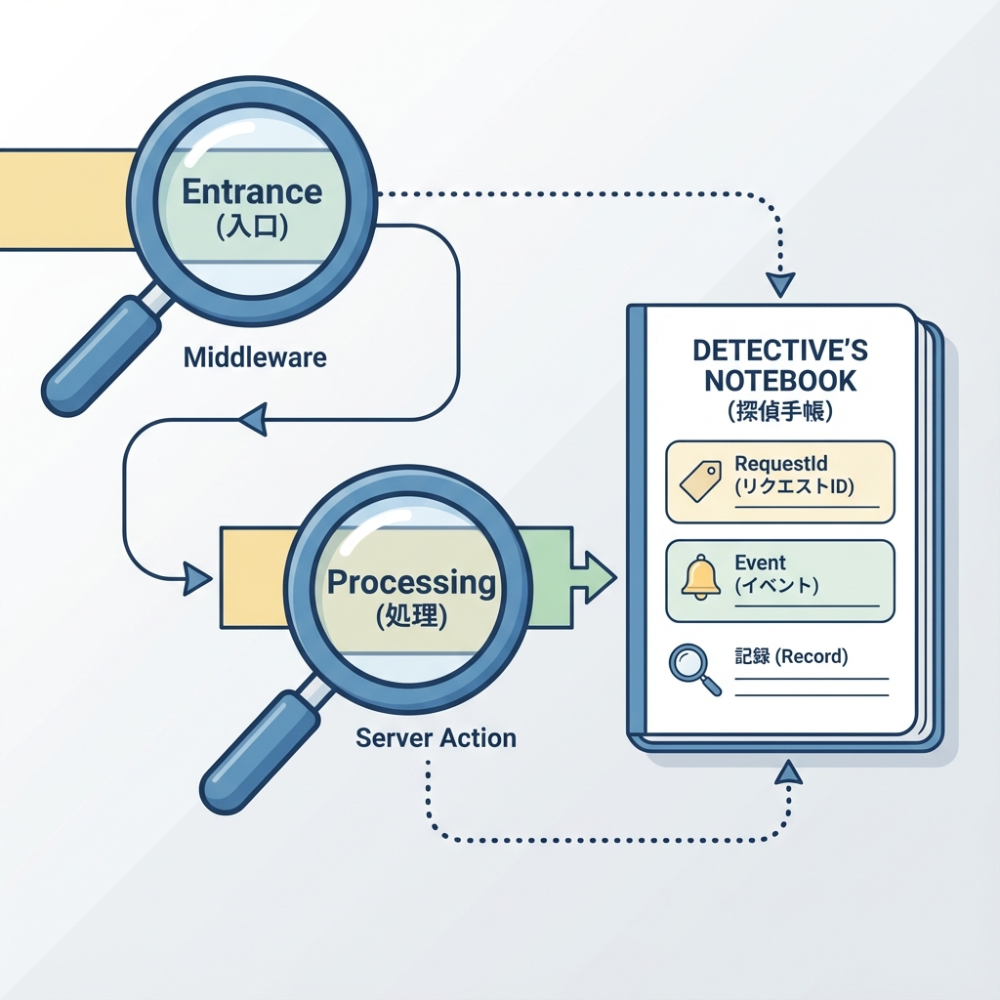
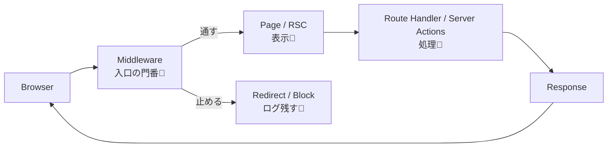

# 第129章：ログの考え方（何を残す？）📝

ログってね、ざっくり言うと **「あとで自分（or チーム）が助かるメモ」** だよ〜📒💕

「なんか動かない😭」ってなったときに、ログがあると **原因に最短でたどり着ける** から、運用ではめちゃ大事！🚑💨

---

## 1) ログを残す目的は3つだけ覚えよっ🧠💡

* **① デバッグ（開発中）**：今どこ通ってる？値どうなってる？👀
* **② 監視（本番）**：エラー増えてない？不正アクセスっぽくない？🚨
* **③ 追跡（調査）**：このユーザーのこの操作、どこで失敗した？🕵️‍♀️

ログが多すぎると逆に探せないから、**「目的→必要な情報だけ」** がコツだよ✂️✨

---

## 2) “残すと強い”ログの最小セット✅🧩

最低限これがあると超つよい💪✨（全部そろえなくてもOKだよ〜）

* **いつ**：`ts`（ISO形式がおすすめ）⏰
* **何が起きた**：`event`（例：`auth_block`）🏷️
* **どのリクエスト**：`requestId`（追跡の命！）🧵
* **どこ**：`pathname`（例：`/dashboard`）🗺️
* **どういう結果**：`allowed/blocked` や `reason` 🚦
* **レベル**：`info / warn / error` 🔥

---

## 3) “残しちゃダメ寄り”のもの🙅‍♀️🔒

ログは本番だと、あとから色んな人が見る可能性あるよね👀💦
だからこれは避けよ〜！

* パスワード、トークン、Cookie丸ごと🍪❌
* 個人情報（メール/電話/住所など）👤❌
* フォームの本文（お問い合わせ内容とか）📝❌

「必要なら **伏せる（マスクする）**」が基本だよ〜🫶✨

---

## 4) Next.js だとログはどこで出す？🧤🧊

* **Middleware（門番）**：通す/止める判断、リダイレクト理由を残すのが強い🚪✨
* **Route Handler（API）**：APIの成功/失敗、入力チェック失敗など📡
* **Server Actions / Server側処理**：DB失敗、バリデーション失敗など🧯

開発中は `console.log()` でも全然OKだよ〜😊
（本番で本格運用するなら、JSON形式で揃えると読みやすい✨）

---

## 図解：どこでログが出ると嬉しい？🗺️📝





---

## 5) 実践：Middlewareで“追跡しやすいログ”を出してみよ🧤🧵✨

### ねらい🎯

* リクエストごとに **requestId** を作る
* 「通した/止めた」を **理由つき** でログに残す
* ついでにレスポンスヘッダに `x-request-id` を付ける（確認しやすい！）🧡

### `middleware.ts`（プロジェクト直下）📄

```ts
import { NextRequest, NextResponse } from "next/server";

export function middleware(req: NextRequest) {
  const requestId = crypto.randomUUID(); // 追跡用ID🧵
  const ts = new Date().toISOString();
  const { pathname } = req.nextUrl;

  // ✅ 入口ログ（まずは「来た」だけ分かればOK）
  console.log(
    JSON.stringify({
      level: "info",
      event: "middleware_request",
      ts,
      requestId,
      method: req.method,
      pathname,
    })
  );

  // 例：/dashboard は “ticket=ok” cookie が無いと入れない想定🍪
  const isDashboard = pathname.startsWith("/dashboard");
  const hasTicket = req.cookies.get("ticket")?.value === "ok";

  if (isDashboard && !hasTicket) {
    console.warn(
      JSON.stringify({
        level: "warn",
        event: "auth_block",
        ts: new Date().toISOString(),
        requestId,
        pathname,
        reason: "missing_ticket",
      })
    );

    const url = req.nextUrl.clone();
    url.pathname = "/login";
    url.searchParams.set("from", pathname); // どこから来たか残す🧭
    return NextResponse.redirect(url);
  }

  // ✅ 通す
  const res = NextResponse.next();
  res.headers.set("x-request-id", requestId); // デバッグしやすい🧡
  return res;
}

// （任意）静的ファイル系を除外したい時に設定することが多いよ〜
// export const config = {
//   matcher: ["/((?!_next/static|_next/image|favicon.ico).*)"],
// };
```

---

## 6) 動作チェック（WindowsでOK）🧪🪟

1. `npm run dev` ▶️
2. `/dashboard` にアクセスしてみる（まだ弾かれるはず）🚫
3. ターミナルにログが出るのを確認👀✨
4. ブラウザの DevTools → Network を見て、**`x-request-id`** が付いてるか確認🔍🧡

---

## 7) 今日のまとめ（これだけ覚えたら勝ち）🏆💕

* ログは **未来の自分を助けるメモ** 📒✨
* **requestId があると追跡が激ラク** 🧵
* 残すのは「いつ・どこ・何が・理由」くらいでOK👌
* **秘密・個人情報はログに出さない** 🔒🙅‍♀️

---

次の章では、このログが「運用」でどう効いてくるか（案内の出し方とか）に繋がっていくよ〜🫶✨
