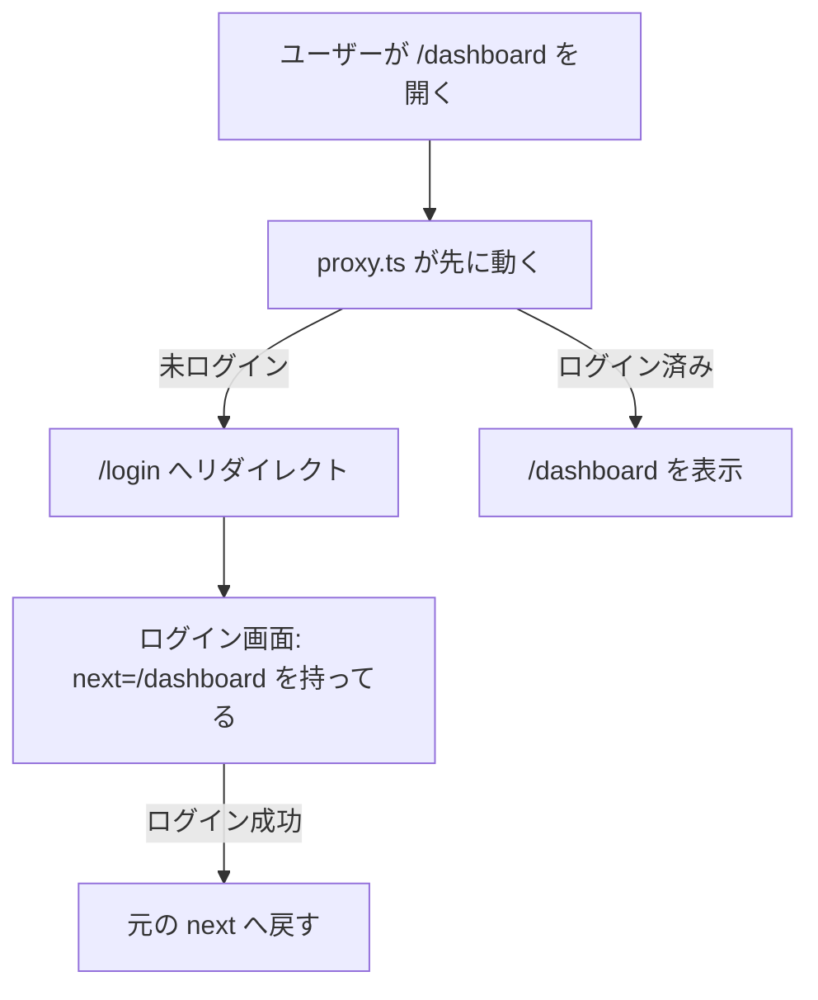

# 第130章：運用で効く：遮断より案内（/loginへ）🫶

この章は「アクセス禁止！😡」って突っぱねるより、**ちゃんと/loginへ案内してあげる**ほうが運用で強いよ〜💪って話です😊
（最近のNext.jsでは **Middleware → Proxy** という呼び名になってるので、ここも最新寄りでいくね！） ([Next.js][1])

---

## 1) 今日のゴール 🎯✨

* 保護したいページ（例：/dashboard）に未ログインで来たら
  👉 **/login へリダイレクト**してあげる🚪💨
* さらに親切に、
  👉 **元々行きたかったURL**（/dashboard など）も一緒に渡して、ログイン後に戻す🔁💞

---

## 2) 「遮断」より「案内」が勝つ理由 🫶📈

たとえば未ログインで /dashboard を開いた時に…

* ❌ 403で真っ白：
  「え？なにこれ…？」で離脱しやすい🥲
* ✅ /loginへ案内：
  「ログインすればいいのね😊」って分かる✨

運用って「例外を減らすゲーム」なので、**ユーザーが迷わない導線**があると問い合わせも減るよ📩⬇️

---

## 3) 全体の流れ（図解）🗺️✨




Proxy（旧Middleware）は「ルートが描画される前」に動くので、こういう案内が得意だよ🧤✨ ([Next.js][1])

---

## 4) 実装：/dashboard は未ログインなら /login へ 🚦🍪

### 4-1) プロジェクト直下に proxy.ts を作る 📄✨

* 置き場所：プロジェクト直下（または src を使ってるなら src 配下）
* 1プロジェクトにつき proxy.ts は基本1つ（中で分割してimportはOK） ([Next.js][1])

```ts
// proxy.ts
import { NextResponse } from 'next/server'
import type { NextRequest } from 'next/server'

export default function proxy(req: NextRequest) {
  const path = req.nextUrl.pathname

  // ✅ 例：/dashboard 配下を「保護ルート」にする
  const isProtected = path.startsWith('/dashboard')

  // ✅ 例：/login は「公開ルート」
  const isLogin = path === '/login'

  // 🍪 超シンプルな「ログイン判定」：cookieがあればログイン扱い（デモ用）
  const session = req.cookies.get('session')?.value

  // (1) 未ログインで保護ルートに来た → /loginへ案内（元のURLも渡す）
  if (isProtected && !session) {
    const loginUrl = new URL('/login', req.nextUrl)

    // 元々行きたかったURL（パス + クエリ）を next に入れる
    const next = req.nextUrl.pathname + req.nextUrl.search
    loginUrl.searchParams.set('next', next)

    return NextResponse.redirect(loginUrl)
  }

  // (2) ログイン済みで /login に来た → そのままでもいいけど、/dashboardへ送ってもOK
  if (isLogin && session) {
    return NextResponse.redirect(new URL('/dashboard', req.nextUrl))
  }

  return NextResponse.next()
}

// ✅ proxy をどこに適用するか（今回は必要最小限でOK）
export const config = {
  matcher: ['/dashboard/:path*', '/login'],
}
```

ポイント🍀

* Proxyは「全ルートで動く」構成にもできるけど、最初は **必要なところだけ**でOK👌
* もし全体に当てる場合は api や _next を除外する matcher を使うのが定番だよ（公式ガイドにも例あり） ([Next.js][2])
* Proxyは「軽く」が大事！DBチェックとか重い処理は避けよ〜🪶（prefetchにも反応しうる） ([Next.js][2])

---

## 5) /login 側：next を受け取って「戻る」🫶🔁

Next.jsの Page は **searchParams を受け取れる**よ（最近は Promise 扱いが基本！） ([Next.js][3])

### 5-1) ログインページ（app/login/page.tsx）📄💞

```tsx
// app/login/page.tsx
type Props = {
  searchParams?: Promise<{ next?: string }>
}

function sanitizeNext(value: unknown) {
  const v = typeof value === 'string' ? value : ''
  // ✅ open redirect対策：相対パスだけ許可（/から始まるもの）
  if (!v.startsWith('/')) return '/dashboard'
  // ✅ "//evil.com" みたいなやつも弾く
  if (v.startsWith('//')) return '/dashboard'
  return v
}

export default async function LoginPage(props: Props) {
  const sp = await props.searchParams
  const next = sanitizeNext(sp?.next)

  return (
    <main style={{ padding: 24 }}>
      <h1>ログイン💖</h1>

      <p>
        この先を見るにはログインが必要だよ😊<br />
        ログインできたら <b>元のページ</b> に戻すね🔁✨
      </p>

      <form action="/api/demo-login" method="POST">
        <input type="hidden" name="next" value={next} />

        <div style={{ marginTop: 12 }}>
          <label>
            メール（デモ）📧：
            <input name="email" type="email" required style={{ marginLeft: 8 }} />
          </label>
        </div>

        <div style={{ marginTop: 12 }}>
          <label>
            パスワード（デモ）🔑：
            <input name="password" type="password" required style={{ marginLeft: 8 }} />
          </label>
        </div>

        <button style={{ marginTop: 16 }} type="submit">
          ログインする🚀
        </button>
      </form>

      <p style={{ marginTop: 16, opacity: 0.7 }}>
        次に戻る先：{next} 🧭
      </p>
    </main>
  )
}
```

---

## 6) ログイン処理（デモ）：cookieをセットして next にリダイレクト 🍪➡️🏃‍♀️

cookieのセットは **Route Handler / Server Action** でやるのが基本だよ（ヘッダーでSet-Cookieを返す必要があるから） ([Next.js][4])

```ts
// app/api/demo-login/route.ts
import { NextResponse } from 'next/server'
import { cookies } from 'next/headers'

function sanitizeNext(value: unknown) {
  const v = typeof value === 'string' ? value : ''
  if (!v.startsWith('/')) return '/dashboard'
  if (v.startsWith('//')) return '/dashboard'
  return v
}

export async function POST(req: Request) {
  const form = await req.formData()
  const next = sanitizeNext(form.get('next'))

  const cookieStore = await cookies()

  // デモ用：本物の認証は別章でやる想定✨
  cookieStore.set({
    name: 'session',
    value: 'demo-session',
    httpOnly: true,
    path: '/',
    // 本番(HTTPS)なら secure: true を検討してね🔒
  })

  return NextResponse.redirect(new URL(next, req.url))
}
```

---

## 7) よくある落とし穴（ここだけ注意しておけばOK）🧯✨

* 🔁 **リダイレクトループ**
  /login 自体を「保護」しちゃうと無限ループになるので、/login は公開ルートにする👌
* 🧨 **open redirect**
  next に “https://…” を入れられると外部へ飛ばされちゃう危険があるので、
  ✅「/から始まる相対パスだけ許可」みたいにガードしよう（上の sanitizeNext みたいに）🛡️
* 🪶 **Proxyは軽く**
  認証の“最終防衛線”にせず、データ取得側でもチェックするのが大事（Proxyはあくまで案内係） ([Next.js][2])

---

## 8) ミニ練習（3分）⏳💡

1. /dashboard/page.tsx を適当に作る（表示だけでOK）
2. 未ログイン状態で /dashboard を開く

   * ✅ /login に飛ぶ
   * ✅ URLに next が付いてる（例：/login?next=/dashboard）
3. ログイン（デモ）する

   * ✅ /dashboard に戻る🎉

---

## まとめ 🎀✨

* 運用で強いのは「禁止！」より「こちらへどうぞ😊」の導線🫶
* Proxy（旧Middleware）で
  ✅ 未ログイン → /login へ案内
  ✅ next を渡して、ログイン後に元のページへ戻す
* next は必ず **相対パスだけ許可**して安全に🛡️

（次に進むと、ここに本物の認証やセッション管理を足していけるよ〜🔐✨）

[1]: https://nextjs.org/docs/app/getting-started/proxy "Getting Started: Proxy | Next.js"
[2]: https://nextjs.org/docs/app/guides/authentication "Guides: Authentication | Next.js"
[3]: https://nextjs.org/docs/app/api-reference/file-conventions/page "File-system conventions: page.js | Next.js"
[4]: https://nextjs.org/docs/app/api-reference/functions/cookies "Functions: cookies | Next.js"
