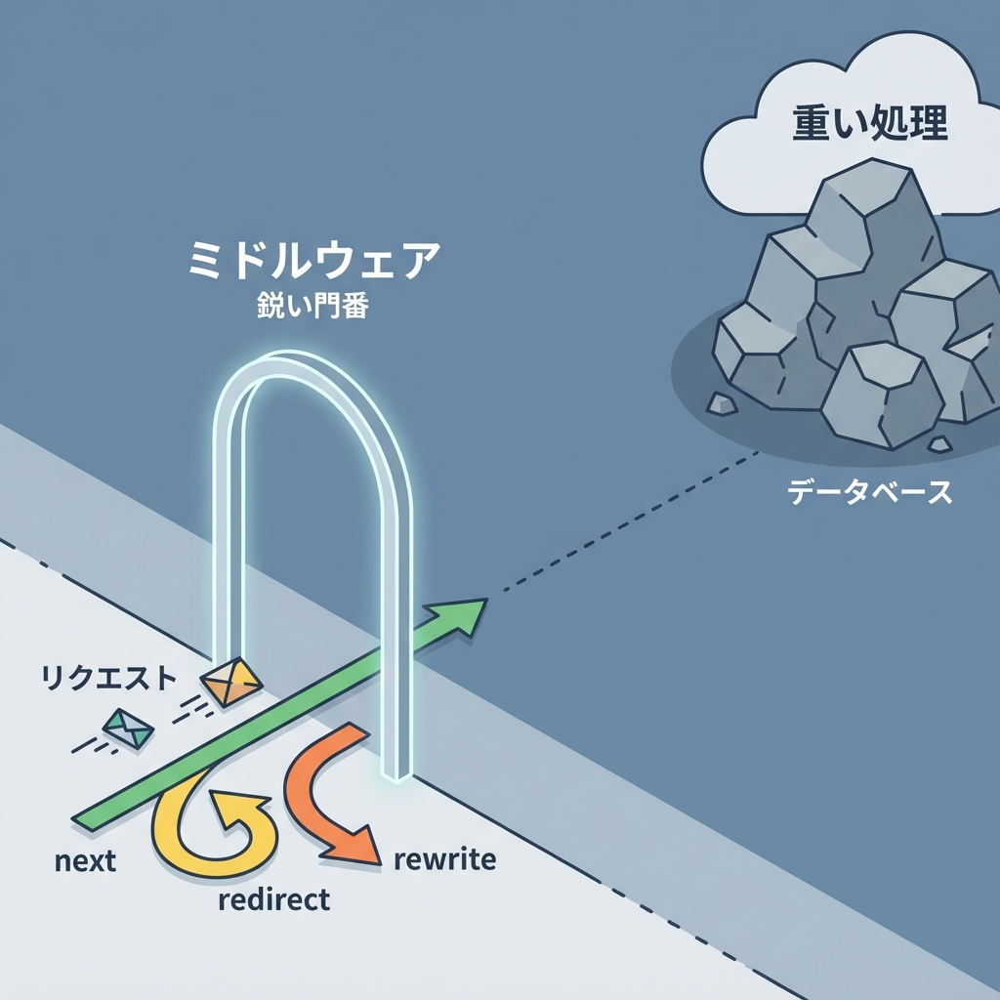
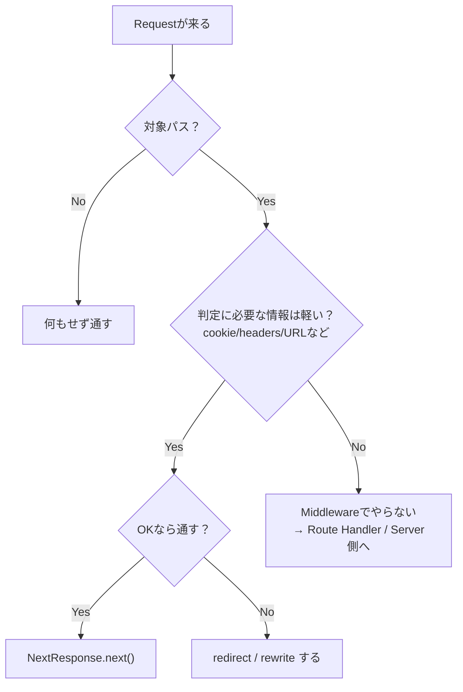

# 第131章：復習：Middlewareは“薄く、鋭く”✂️

Middleware（ミドルウェア）って、**「ルートに入る直前の門番」**でしたよね🧤🚪
第131章は復習として、**“いいMiddlewareの作り方”の型**をガッチリ固めます💪💕

---

## ✅ この章のゴール 🎯✨

* Middlewareで **やるべきこと／やっちゃダメなこと** を瞬時に仕分けできる🧠⚡
* **薄く（軽く）・鋭く（効果的に）** なMiddlewareを書ける✂️✨
* “重くなりがちな罠”を回避できる🪤🙅‍♀️

---

## 🧤 Middlewareの役割は「入口の判定」だけでOK 🚦

Middlewareが得意なのは、だいたいこのへん👇✨

* ✅ **ログイン判定 → リダイレクト**（/dashboard を /login へ）🔐➡️🚪
* ✅ **URLの整理**（末尾スラッシュ、wwwありなし統一など）🧹
* ✅ **言語/国リダイレクト**（/ja /en など）🌏
* ✅ **軽いヘッダー付与**（例：`x-pathname` を付ける）📎
* ✅ **アクセス制御の“前段”**（ルーティング単位のガード）🛡️

つまり…
Middlewareは **「入れていい？どこへ案内する？」** を決める係です🧤🧭✨

---

## ❌ Middlewareでやらないこと（重くなる原因）🪶➡️🐘

MiddlewareはEdgeで動くことも多くて、**制約があったり、重い処理が苦手**です⚡😵‍💫
なので、これは避けたい👇

* ❌ DBアクセス（Prismaとか）🗃️💥
* ❌ 重い外部API呼び出しを毎回やる📡💸
* ❌ 大きいライブラリ読み込み（暗号・画像処理など）📦🐘
* ❌ “本処理”をここでやり始める（実装の中心にする）🙅‍♀️

**門番が中で料理し始めたら渋滞する**、ってイメージです👩‍🍳🚪🚫🚗🚗🚗

---

## 🗺️ 図解：良いMiddlewareの流れ（最短）✨





ポイントはこれ👇✨
**「対象だけ見る」→「軽い情報だけで判定」→「すぐ返す」** 🧤⚡

---

## ✂️ “薄く、鋭く”チェックリスト ✅✨

Middlewareを書く前に、これを自分に質問してみてね🧠💕

* ✅ **判定に必要なのはURL / cookie / headerだけ？**
* ✅ **処理は早い？（1〜2ステップで終わる？）**
* ✅ **やるのは redirect / rewrite / next のどれかだけ？**
* ✅ **対象パスを matcher で絞ってる？**
* ✅ **“この判定”は本当に入口で必要？（Serverで良くない？）**

これにYESが多いほど、いいMiddlewareです💯✨

---

## 🧪 例：ログイン必須ページを守る（薄くて鋭い）🔐✂️

### ✅ やりたいこと

* `/dashboard` に来た
* `session` cookieがなければ `/login` に案内
* あれば通す

```ts
// middleware.ts
import { NextRequest, NextResponse } from "next/server";

export function middleware(req: NextRequest) {
  const { pathname, search } = req.nextUrl;

  // 例: cookie名は "session" とする（実運用では命名はチームで統一）
  const session = req.cookies.get("session")?.value;

  if (!session) {
    const loginUrl = new URL("/login", req.url);
    // 元のURLに戻せるように next を付ける（地味に親切🥹✨）
    loginUrl.searchParams.set("next", `${pathname}${search}`);
    return NextResponse.redirect(loginUrl);
  }

  return NextResponse.next();
}

export const config = {
  matcher: ["/dashboard/:path*"],
};
```

### 👍 えらい点（薄い！鋭い！）

* 見てる情報が **cookieとURLだけ** 🍪🔗
* **分岐してすぐreturn**（だらだらしない）✂️
* matcherで **対象を絞ってる** 🎯

---

## 🪤 よくある“重くなる罠”と直し方 🛠️✨

### 罠1：全部のパスで動かしちゃう 😵

→ **matcherで絞る** 🎯
「守りたい場所だけ」に限定しよう✨

### 罠2：ログを大量に出す 📝💥

→ 入口はアクセス多いので、ログは **最小限** にするか
本番では **レベル制御**（重要だけ）に寄せるのが安心🧯

### 罠3：認証の“本体”までMiddlewareでやる 🔐🐘

→ Middlewareは**“入場チェック”**まで。
ユーザー取得や権限判定の深掘りは **Server側で**🧊✨

---

## 🧩 ミニ練習（5分）⌛🌸

### お題：メンテナンスモードの“案内”を作ろう🧰

* もし `MAINTENANCE="1"` なら
  `/maintenance` に案内（redirect）する
* ただし `/maintenance` 自体はループしないように除外する

ヒント：

* `pathname === "/maintenance"` のときは通す✅
* それ以外は redirect 🚦

（※実際の環境変数の扱いはデプロイ先で変わるので、ここでは**考え方の練習**でOKだよ😊✨）

---

## ✅ まとめ：Middlewareは“門番”、だからこそシンプルに🧤✨

* Middlewareは **入口での判定係** 🚪
* やるのは基本 **redirect / rewrite / next** のどれかだけ✂️
* **重い処理は置かない**（DB・外部API・でかいライブラリ）🪶
* matcherで **対象を絞る** 🎯
* 合言葉は…
  **「薄く、鋭く」✂️✨**
