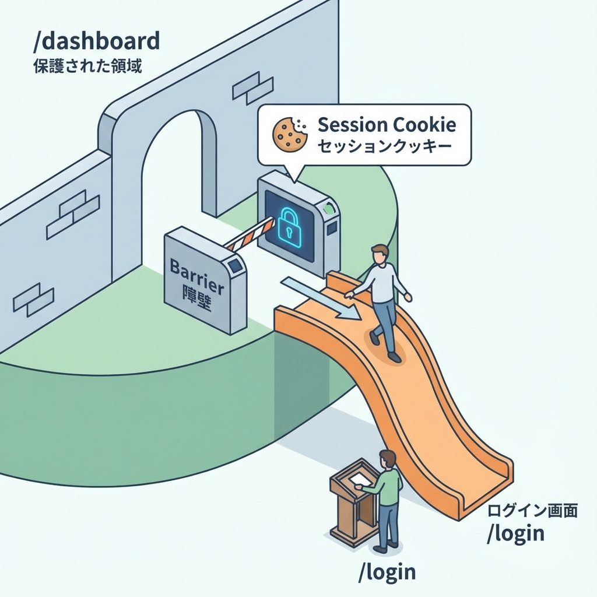
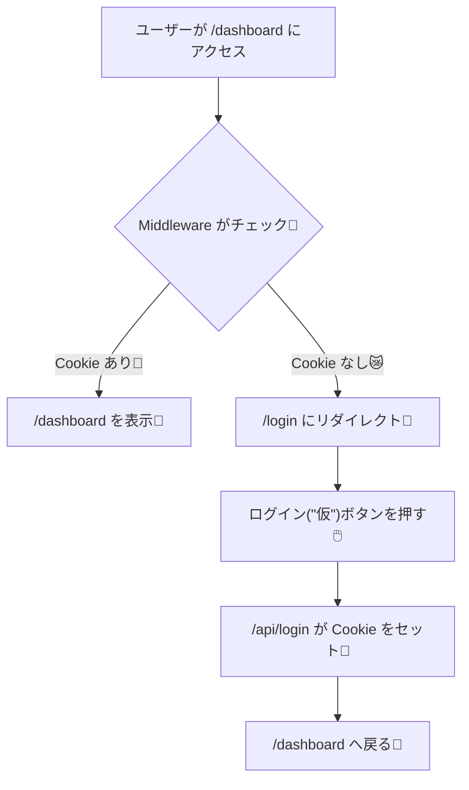

# 第132章：ミニ課題：保護ルートの土台完成🔐

今回は「**/dashboard はログインしてないと入れない**」っていう、超よく使う“守り”を作るよ〜！🧤💪
主役はもちろん **Middleware** 🌐⚡（門番さん）

---

## この章のゴール🎯

* ✅ `/dashboard` に未ログインで行くと → `/login` に飛ばされる
* ✅ `/login` で「ログイン（仮）」すると → `/dashboard` に入れる
* ✅ 「ログアウト」すると → また `/dashboard` は入れなくなる

> ちゃんと“サーバー側で”止めるのがポイントだよ🙅‍♀️🛡️（UIだけで隠すのは弱い！）

---

## まず全体の流れを図で理解しよ🗺️✨（Mermaid）





Middleware は「ルートに入る前」に動くよ〜！というのが超大事ポイント🌟 ([Next.js][1])

---

## 作るファイルたち📦

今回はこの4つでOK！

* `middleware.ts`
* `app/dashboard/page.tsx`
* `app/login/page.tsx`
* `app/api/login/route.ts`
* `app/api/logout/route.ts`

---

## Step 1️⃣ `/dashboard` ページを作る🏠✨

`app/dashboard/page.tsx`

```tsx
export default function DashboardPage() {
  return (
    <main style={{ padding: 24 }}>
      <h1>Dashboard 🔐</h1>
      <p>ログインできてる人だけが見れるページだよ〜🎉</p>

      <form action="/api/logout" method="post">
        <button type="submit">ログアウトする🚪</button>
      </form>
    </main>
  );
}
```

---

## Step 2️⃣ `/login` ページを作る🔑✨

`app/login/page.tsx`

```tsx
type Props = {
  searchParams: Promise<{ from?: string }>;
};

export default async function LoginPage({ searchParams }: Props) {
  const { from: fromParam } = await searchParams;
  const from = fromParam ?? "/dashboard";

  return (
    <main style={{ padding: 24 }}>
      <h1>Login 🔑</h1>
      <p>ここはログインページだよ〜😊</p>

      <form action={`/api/login?from=${encodeURIComponent(from)}`} method="post">
        <button type="submit">ログイン（仮）する🍪</button>
      </form>

      <p style={{ marginTop: 12, opacity: 0.7 }}>
        ※本物の認証じゃなくて「Cookieを入れるだけ」の練習だよ🧁
      </p>
    </main>
  );
}
```

> `from` は「本当は行きたかったページ」を覚えておくためのやつだよ🧭✨
> こうしておくと、ログイン後に元のページへ戻せる〜！

---

## Step 3️⃣ ログインAPI（Cookieをセット）を作る🍪✅

`app/api/login/route.ts`

```ts
import { NextResponse } from "next/server";
import type { NextRequest } from "next/server";

export async function POST(request: NextRequest) {
  const url = new URL(request.url);
  const from = url.searchParams.get("from") ?? "/dashboard";

  const res = NextResponse.redirect(new URL(from, request.url));

  // “ログインしたよ”の目印Cookie（仮）
  res.cookies.set("demo_session", "ok", {
    httpOnly: true,
    sameSite: "lax",
    path: "/",
  });

  return res;
}
```

`NextResponse` は cookies を操作できるよ〜🍪✨ ([Next.js][2])

---

## Step 4️⃣ ログアウトAPI（Cookieを消す）を作る🧹🚪

`app/api/logout/route.ts`

```ts
import { NextResponse } from "next/server";
import type { NextRequest } from "next/server";

export async function POST(request: NextRequest) {
  const res = NextResponse.redirect(new URL("/login", request.url));

  // Cookie削除（maxAge: 0 が簡単）
  res.cookies.set("demo_session", "", {
    httpOnly: true,
    sameSite: "lax",
    path: "/",
    maxAge: 0,
  });

  return res;
}
```

---

## Step 5️⃣ いよいよ本体！Middlewareで `/dashboard` を守る🧤⚡

プロジェクト直下に `middleware.ts` を作ってね
（もし `src/` を使う構成なら `src/middleware.ts` でもOKだよ👍）

`middleware.ts`

```ts
import { NextResponse } from "next/server";
import type { NextRequest } from "next/server";

export function middleware(request: NextRequest) {
  const isLoggedIn = request.cookies.get("demo_session")?.value === "ok";

  if (!isLoggedIn) {
    const url = request.nextUrl.clone();
    url.pathname = "/login";
    url.searchParams.set("from", request.nextUrl.pathname);
    return NextResponse.redirect(url);
  }

  return NextResponse.next();
}

// /dashboard 配下だけ門番する🧤（ここ大事！）
export const config = {
  matcher: ["/dashboard/:path*"],
};
```

`matcher` は「どのパスに Middleware を効かせるか」を指定できるよ🧭 ([Next.js][3])

---

## Step 6️⃣ 動作チェックしよ〜✅🎉

PowerShell で起動（すでに起動してたらそのままでOK）

```bash
npm run dev
```

確認ポイント👇✨

1. `http://localhost:3000/dashboard` に行く

* ✅ `/login` に飛ばされたらOK！🚦😺

2. `/login` の「ログイン（仮）」押す

* ✅ `/dashboard` に入れたらOK！🎉🍪

3. `/dashboard` の「ログアウト」押す

* ✅ `/login` に戻って、また `/dashboard` が弾かれたらOK！🔁🧤

---

## よくあるつまずき😵‍💫→こう直す💡

* **middleware.ts を置く場所が違う**
  → プロジェクト直下（`package.json` と同じ階層）か、構成によっては `src/` の直下に置くよ📌

* **無限リダイレクトになる**
  → `matcher` を `/dashboard/:path*` に絞れてるかチェック！✅
  （`/login` にまで門番が来ると永久ループ😇）

* **Cookie が入ってるのに弾かれる**
  → `demo_session` の名前が一致してるか、`"ok"` になってるか確認🍪🔍

---

## ミニ課題クリア条件🏁✨

* ✅ 未ログインで `/dashboard` → `/login` へ
* ✅ ログイン（仮）で `/dashboard` へ
* ✅ ログアウトでまた弾かれる

ここまでできたら、もう「保護ルートの土台」は完成だよ〜🔐🎉
次はこれを“本物の認証”に置き換えるだけ！（やることが一気に現実っぽくなる😎）

[1]: https://nextjs.org/docs/14/pages/building-your-application/routing/middleware?utm_source=chatgpt.com "Routing: Middleware"
[2]: https://nextjs.org/docs/app/api-reference/functions/next-response?utm_source=chatgpt.com "Functions: NextResponse"
[3]: https://nextjs.org/docs/15/pages/api-reference/file-conventions/middleware?utm_source=chatgpt.com "File-system conventions: Middleware"
