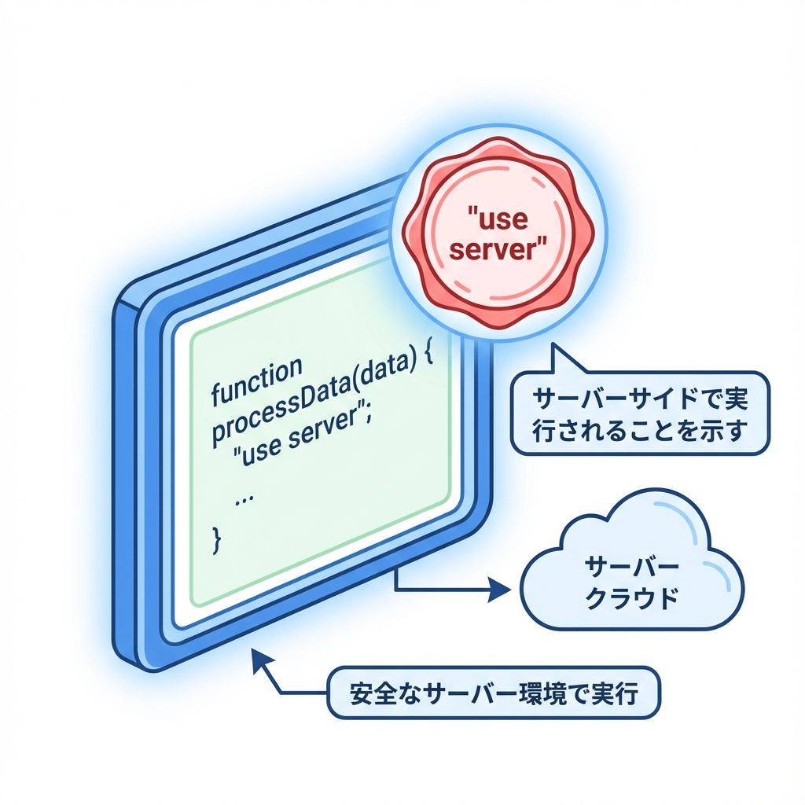
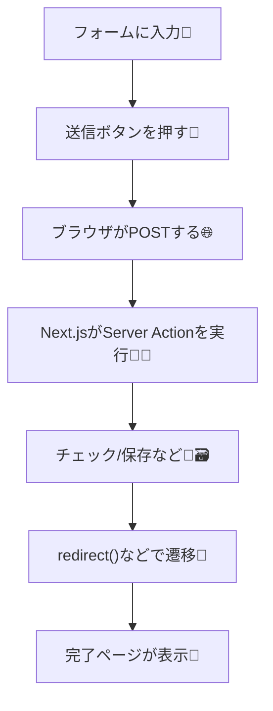

# 第135章：Server Actionの作り方（`"use server"`）🧑‍🍳

この章では、**フォーム送信を「サーバー側の関数」に直結**させる「Server Actions」を作ってみるよ〜！📨
`onSubmit` とか `fetch('/api/...')` を書かなくても、**`<form action={関数}>`** でいけちゃうのが新感覚😳✨（しかも JS がまだ動かなくても送れる＝体験が強い💪）([Next.js][1])

---

## 1) Server Actionってなに？ざっくり 🍵

* **サーバーで動く関数**だよ（ブラウザじゃなくてサーバーで実行）🧊
* `form` の `action` に渡すと、送信時にその関数が呼ばれる📨
* 関数は自動で **`FormData`** を受け取れるよ🧺([Next.js][1])
* `use server` を書くのが合図 ✍️（書いた関数はサーバー専用になる）([Next.js][2])

---

## 2) 図でイメージする（全体の流れ）🗺️





---

## 3) まずは“動く最小”を作ろう（リダイレクトするだけ）🎯

今回は「お問い合わせフォームっぽいもの」を作って、
送ったら **`/contact/thanks` に移動**するところまでやるよ〜！💌✨

### ✅ 作るファイル構成（目標）📁

* `app/actions.ts`
* `app/contact/page.tsx`
* `app/contact/thanks/page.tsx`

※もし `src/` がある構成なら、`src/app/...` に読み替えてね😉

---

## 4) Server Actionを作る（別ファイル方式）🧩

`app/actions.ts` を作って、こう書くよ👇
ポイントは **ファイル先頭の `'use server'`**！これで **このファイルのexportがServer Action扱い**になるよ🧊([Next.js][2])

```ts
'use server'

import { redirect } from 'next/navigation'

export async function submitContact(formData: FormData) {
  const name = String(formData.get('name') ?? '')
  const message = String(formData.get('message') ?? '')

  // ここは「サーバーのコンソール」に出るよ（npm run dev のターミナル側）🖥️
  console.log('contact submit:', { name, message })

  // 本来はここでDB保存など🗃️（今はログだけ）
  redirect('/contact/thanks')
}
```

---

## 5) フォーム側：`action={submitContact}` を付ける 📨✨

`app/contact/page.tsx` を作って👇
**`<form action={submitContact}>`** が超大事！これで送信時にサーバー関数が呼ばれるよ🧑‍🍳([Next.js][1])

```tsx
import { submitContact } from '@/app/actions'

export default function ContactPage() {
  return (
    <main style={{ padding: 24, maxWidth: 560 }}>
      <h1>お問い合わせ💌</h1>

      <form action={submitContact} style={{ display: 'grid', gap: 12 }}>
        <label>
          お名前🌸
          <input name="name" required style={{ display: 'block', width: '100%' }} />
        </label>

        <label>
          メッセージ📝
          <textarea
            name="message"
            required
            rows={4}
            style={{ display: 'block', width: '100%' }}
          />
        </label>

        <button type="submit">送信する📨</button>
      </form>
    </main>
  )
}
```

---

## 6) 完了ページを作る（超シンプルでOK）🎉

`app/contact/thanks/page.tsx`：

```tsx
export default function ThanksPage() {
  return (
    <main style={{ padding: 24 }}>
      <h1>送信ありがとう〜！🎉</h1>
      <p>メッセージ受け取ったよ💌</p>
    </main>
  )
}
```

---

## 7) 動作チェック（ここまででOK）✅✨

1. 開発サーバー起動：`npm run dev` ▶️
2. ブラウザで：`http://localhost:3000/contact` にアクセス🌐
3. 入力して送信📨
4. **`/contact/thanks` に移動**したら成功🎉
5. ターミナル（黒い画面）に `console.log` が出てたら **「サーバーで動いた」証拠**だよ🖥️✨

---

## 8) もう1つの書き方（ページ内に直接書く方式）✍️

Server Component（つまり普通の `page.tsx`）の中で、関数の先頭に `'use server'` を置く書き方もあるよ🧊([Next.js][1])

```tsx
import { redirect } from 'next/navigation'

export default function ContactPage() {
  async function submit(formData: FormData) {
    'use server'
    console.log('submitted:', Object.fromEntries(formData))
    redirect('/contact/thanks')
  }

  return <form action={submit}>...</form>
}
```

✅ 使い分けの目安

* **他でも使い回したい** → 別ファイル（`app/actions.ts`）がおすすめ📦
* **そのページ専用** → ページ内でもOK🧸

---

## 9) ハマりやすいポイント（あるある）🪤

* **`"use server"` を書き忘れる**
  → ただの関数になって動かない/怒られる😵‍💫([Next.js][2])
* **ブラウザ専用APIをServer Actionで使っちゃう**（`window` とか）
  → Server Actionはサーバーで動くから❌
* **入力を信用しすぎる**
  → Server Actionでも、**サーバー側バリデーションは大事**🛡️（Next.jsもデータセキュリティの考え方をガイドしてるよ）([Next.js][3])

---

## 10) ミニ課題（5分）🏃‍♀️💨

`submitContact` の中で👇を追加してみてね✨

* `name` が空なら `redirect('/contact')` に戻す（雑でOK）🔁
* `message` が短すぎたら `console.log('短いよ〜！')` して戻す📝

※「画面にエラーを表示する」キレイなやり方は **第138章（useActionState）** でやるよ〜！🧠([Next.js][1])

---

## まとめ 🎀

* Server Actionは **`"use server"` が合図**🧑‍🍳
* `<form action={serverAction}>` でフォーム送信を直結できる📨✨
* まずは **ログ出す → リダイレクト**までできれば勝ち🎉([Next.js][1])

[1]: https://nextjs.org/docs/app/guides/forms "Guides: Forms | Next.js"
[2]: https://nextjs.org/docs/13/app/api-reference/functions/server-actions "Functions: Server Actions | Next.js"
[3]: https://nextjs.org/docs/app/guides/data-security?utm_source=chatgpt.com "Guides: Data Security"
