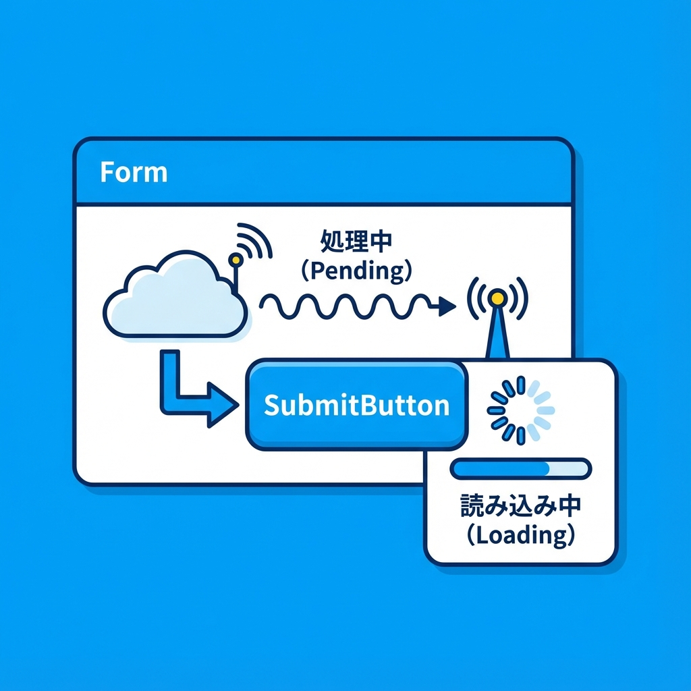
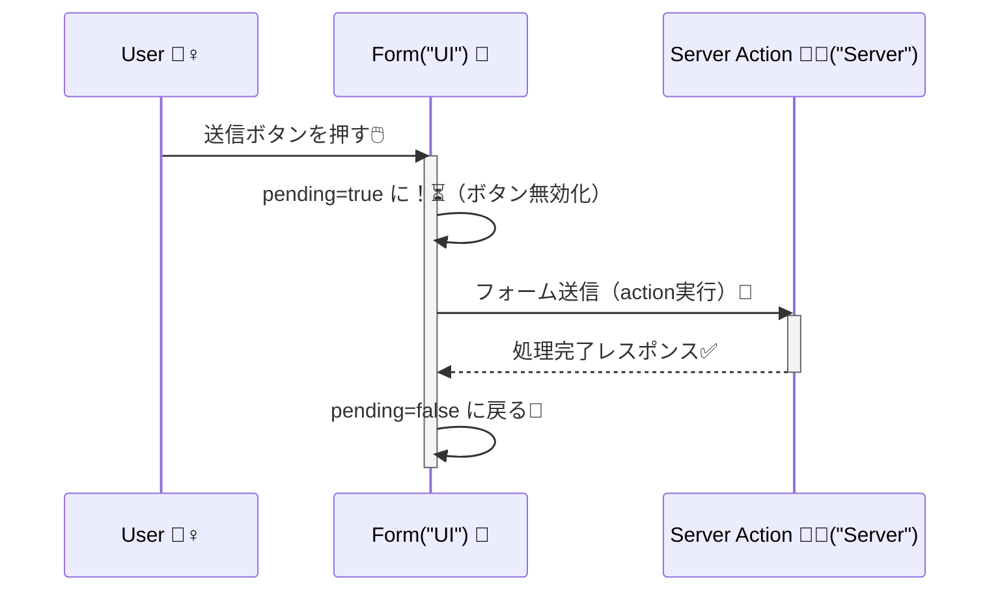

# 第136章：送信中UIを作る（楽にする）⏳

フォームって、押した瞬間なにも起きないと「押せてない？」って不安になって、連打されがち…🥺💥
だから **送信中は「送信中だよ〜！」って見せて、ボタンも押せないようにする**のが超大事だよ✨
（Next.js の Server Actions は `<form action={...}>` で自然に扱えるのが強みだよ〜） ([Next.js][1])

---

## この章でできるようになること ✅✨

* 送信中だけボタンの表示を「送信中…⏳」に変える
* 送信中はボタンを無効化して二重送信を防ぐ🛡️
* `useFormStatus()` で「いま送信中？」を取れるようになる🧩 ([React][2])

---

## まず結論：送信中UIの基本は `useFormStatus()` 🎯

React 19 では、フォーム送信の状態（`pending`）を **フォームの中の子コンポーネント**から取れるよ🫶
これが `useFormStatus()` だよ〜！ ([React][3])

---

## 図でイメージする（送信ボタンが変身する流れ）🪄





---

## ハンズオン：送信中だけボタンを変える（いちばん定番）💌⏳

### 1) Server Action を用意（わざと少し待たせて確認しやすくする）🧑‍🍳

`app/contact/actions.ts`

```ts
'use server';

export async function sendContact(formData: FormData) {
  const name = String(formData.get('name') ?? '');
  const message = String(formData.get('message') ?? '');

  // 送信中UIを確認しやすいように、わざと待つよ⏳（本番では不要）
  await new Promise((r) => setTimeout(r, 1500));

  console.log({ name, message });
}
```

> Server Actions（Server Functions）は「サーバーで更新処理する」ための仕組みだよ🧊 ([Next.js][4])

---

### 2) 送信ボタン（Client Component）を作る 🧩🎮

`app/contact/SubmitButton.tsx`

```tsx
'use client';

import { useFormStatus } from 'react-dom';

export function SubmitButton() {
  const { pending } = useFormStatus();

  return (
    <button
      type="submit"
      disabled={pending}
      aria-disabled={pending}
      aria-busy={pending}
      style={{
        padding: '10px 14px',
        borderRadius: 12,
        border: '1px solid #ccc',
        background: pending ? '#eee' : 'white',
        cursor: pending ? 'not-allowed' : 'pointer',
      }}
    >
      {pending ? '送信中…⏳' : '送信する📨'}
    </button>
  );
}
```

ポイントはこれ👇

* `useFormStatus()` は **フォーム送信の状態**をくれる（`pending` が超大事） ([React][2])
* **`'use client'` が必要**（フックだからね！）🎮
* `disabled` で二重送信を止める🛡️

---

### 3) ページにフォームを置いて、action とボタンをつなぐ🔗

`app/contact/page.tsx`

```tsx
import { sendContact } from './actions';
import { SubmitButton } from './SubmitButton';

export default function ContactPage() {
  return (
    <main style={{ padding: 24, maxWidth: 520 }}>
      <h1>お問い合わせ📮</h1>

      <form action={sendContact} style={{ display: 'grid', gap: 12, marginTop: 16 }}>
        <label style={{ display: 'grid', gap: 6 }}>
          お名前🧸
          <input
            name="name"
            required
            placeholder="例）さくら"
            style={{ padding: 10, borderRadius: 10, border: '1px solid #ccc' }}
          />
        </label>

        <label style={{ display: 'grid', gap: 6 }}>
          メッセージ💬
          <textarea
            name="message"
            required
            placeholder="内容を書いてね…✍️"
            rows={4}
            style={{ padding: 10, borderRadius: 10, border: '1px solid #ccc' }}
          />
        </label>

        <SubmitButton />
      </form>

      <p style={{ marginTop: 12, color: '#666' }}>
        ※ 送信中はボタンが「送信中…⏳」に変わって押せなくなるよ✨
      </p>
    </main>
  );
}
```

この `<form action={sendContact}>` が「Server Actions とフォームが直結してる」感じだよ〜！ ([Next.js][1])

---

## よくあるハマり 🥺🪤（ここだけ見れば助かる）

* **`useFormStatus()` をフォームの外で使ってる**
  → `useFormStatus()` は「そのフォームの中の子」じゃないと状態を取れないよ！ ([React][2])
* **`SubmitButton` に `'use client'` がない**
  → フックが使えなくてエラーになりがち💥
* **「送信中」にならない気がする**
  → 送信が一瞬で終わってるだけかも！章の例みたいに `setTimeout` で 1.5秒待たせると確認しやすいよ⏳✨

---

## ちょい課題（5分）🌸

1. 送信中だけボタンの左に「🔄」を出してみよう
2. 送信中は入力欄も触れないようにしたい人は、`SubmitButton` だけじゃなく「フォーム内部全体」を `pending` で無効化する方法を考えてみよう🧠✨（次章以降でやりやすくなるよ！）

---

ここまでで、第136章は完了だよ〜！おつかれさま〜！！🫶🎉

[1]: https://nextjs.org/docs/app/guides/forms?utm_source=chatgpt.com "How to create forms with Server Actions"
[2]: https://react.dev/reference/react-dom/hooks/useFormStatus?utm_source=chatgpt.com "useFormStatus"
[3]: https://react.dev/blog/2024/12/05/react-19?utm_source=chatgpt.com "React v19"
[4]: https://nextjs.org/docs/app/getting-started/updating-data?utm_source=chatgpt.com "Getting Started: Updating Data"
