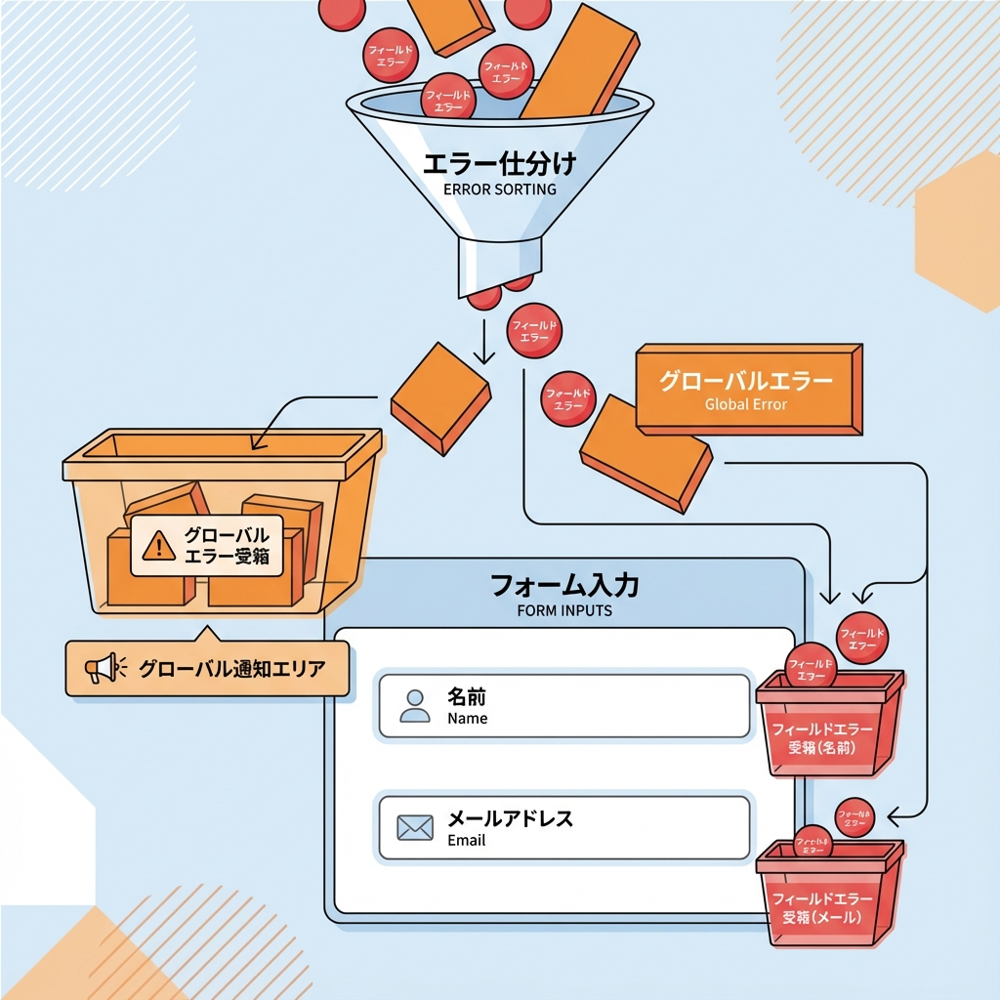
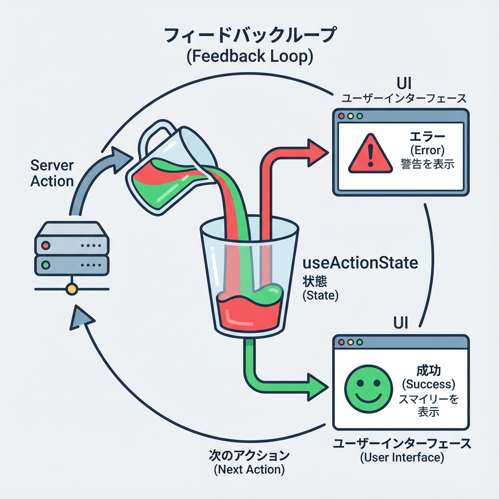
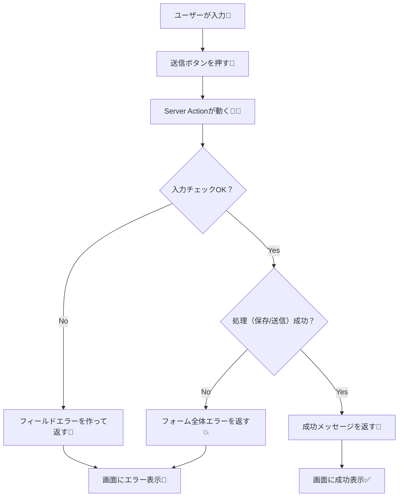

# 第137章：エラーを表示する（ユーザーに優しく）🧯

フォームって「送れたらOK！」だけじゃなくて、**送れなかった時の体験**がめちゃ大事なんだよね…！🥺
この章では **Server Actions で送信した結果（エラー）を、やさしく画面に出す**ところまでやるよ〜🫶💕

---

## この章のゴール🎯✨

* ✅ **入力ミス（バリデーション）**を、各入力欄の近くに表示できる
* ✅ **全体のエラー（サーバー失敗など）**を、フォーム上部に表示できる
* ✅ **“怒らない”エラーメッセージ**にできる（体験が良くなる）🥰

---

## まず、エラーは3種類に分けると迷子にならないよ🧠🧩




1. **フィールドエラー**：入力欄ごとのミス（例：メールが空、形式がおかしい）📩
2. **フォーム全体エラー**：送信はしたけど処理できない（例：サーバー側で失敗）💥
3. **想定外エラー**：落ちた・例外（ユーザーには優しい文言、開発者はログで追う）🧯

---

## 図解：送信 → エラー表示の流れ🧾➡️🧯





---

## 実装してみよう（Next.js / App Router）🛠️✨

ここでは例として **お問い合わせフォーム**を作るよ📮
（既にプロジェクトがある前提でOK！）

### 作るファイル構成📁

```txt
app/
  contact/
    page.tsx
    ContactForm.tsx
    actions.ts
    ContactForm.module.css
```

---

## 1) Server Action を作る（エラー内容を“返す”）🧑‍🍳🧯

`app/contact/actions.ts`

```ts
'use server';

export type ContactFormState = {
  status: 'idle' | 'error' | 'success';
  message?: string; // フォーム全体向けメッセージ
  fieldErrors?: {
    name?: string;
    email?: string;
    body?: string;
  };
  values?: {
    name: string;
    email: string;
    body: string;
  };
};

const initialValues = (formData: FormData) => ({
  name: String(formData.get('name') ?? ''),
  email: String(formData.get('email') ?? ''),
  body: String(formData.get('body') ?? ''),
});

const isEmailLike = (email: string) => {
  // ゆるめチェック（本格的なのはライブラリでもOK👌）
  return /^[^\s@]+@[^\s@]+\.[^\s@]+$/.test(email);
};

export async function submitContact(
  prevState: ContactFormState,
  formData: FormData
): Promise<ContactFormState> {
  const values = initialValues(formData);

  // 前後の空白はよく事故るのでtrimしちゃう✨
  const name = values.name.trim();
  const email = values.email.trim();
  const body = values.body.trim();

  const fieldErrors: ContactFormState['fieldErrors'] = {};

  if (!name) fieldErrors.name = 'お名前を入力してね🙂';
  if (!email) fieldErrors.email = 'メールアドレスを入力してね📩';
  else if (!isEmailLike(email)) fieldErrors.email = 'メールの形がちょっと変かも…！例：a@b.com 🫣';
  if (!body) fieldErrors.body = '内容が空っぽだよ〜🥺';

  if (Object.keys(fieldErrors).length > 0) {
    return {
      status: 'error',
      message: '入力を確認してね🧯（赤いところをチェック！）',
      fieldErrors,
      values: { name, email, body },
    };
  }

  // ここから先は「成功」ルート✨
  try {
    // 例：DB保存 / メール送信など（ここではダミー）
    await new Promise((r) => setTimeout(r, 300));

    return {
      status: 'success',
      message: '送信ありがとう〜！💌 確認して返信するね😊',
      values: { name: '', email: '', body: '' }, // 成功したら空にする作戦🧼
    };
  } catch (err) {
    console.error('submitContact error:', err);

    // ユーザーには“優しい文言”だけ返す（内部情報は出さない🛡️）
    return {
      status: 'error',
      message: 'ごめんね…送信に失敗しちゃった💦 もう一回ためしてね🙏',
      values: { name, email, body },
    };
  }
}
```

ポイント💡

* ✅ **エラーは return で返す**（投げるよりUIが作りやすいことが多いよ）
* ✅ **values を返して、入力を消さない**（これ超やさしい🥹）

---

## 2) フォーム（Client Component）でエラーを表示する🧸🧯

`app/contact/ContactForm.tsx`

```tsx
'use client';

import { useActionState } from 'react';
import styles from './ContactForm.module.css';
import type { ContactFormState } from './actions';
import { submitContact } from './actions';

const initialState: ContactFormState = {
  status: 'idle',
  message: undefined,
  fieldErrors: {},
  values: { name: '', email: '', body: '' },
};

export default function ContactForm() {
  const [state, formAction] = useActionState(submitContact, initialState);

  const v = state.values ?? { name: '', email: '', body: '' };
  const fe = state.fieldErrors ?? {};

  return (
    <form action={formAction} className={styles.form} noValidate>
      {/* フォーム全体メッセージ（成功/失敗どっちもここで出す） */}
      {state.message && (
        <div
          className={`${styles.banner} ${
            state.status === 'success' ? styles.success : styles.error
          }`}
          role="status"
          aria-live="polite"
        >
          {state.message}
        </div>
      )}

      <div className={styles.field}>
        <label htmlFor="name" className={styles.label}>
          お名前<span className={styles.req}>*</span>
        </label>
        <input
          id="name"
          name="name"
          defaultValue={v.name}
          className={`${styles.input} ${fe.name ? styles.inputError : ''}`}
          aria-invalid={fe.name ? true : undefined}
          aria-describedby={fe.name ? 'name-error' : undefined}
          placeholder="例：田中はな"
        />
        {fe.name && (
          <p id="name-error" className={styles.helpError}>
            {fe.name}
          </p>
        )}
      </div>

      <div className={styles.field}>
        <label htmlFor="email" className={styles.label}>
          メール<span className={styles.req}>*</span>
        </label>
        <input
          id="email"
          name="email"
          defaultValue={v.email}
          className={`${styles.input} ${fe.email ? styles.inputError : ''}`}
          aria-invalid={fe.email ? true : undefined}
          aria-describedby={fe.email ? 'email-error' : undefined}
          placeholder="例：hana@example.com"
        />
        {fe.email && (
          <p id="email-error" className={styles.helpError}>
            {fe.email}
          </p>
        )}
      </div>

      <div className={styles.field}>
        <label htmlFor="body" className={styles.label}>
          内容<span className={styles.req}>*</span>
        </label>
        <textarea
          id="body"
          name="body"
          defaultValue={v.body}
          className={`${styles.textarea} ${fe.body ? styles.inputError : ''}`}
          aria-invalid={fe.body ? true : undefined}
          aria-describedby={fe.body ? 'body-error' : undefined}
          placeholder="相談したいことを書いてね😊"
          rows={5}
        />
        {fe.body && (
          <p id="body-error" className={styles.helpError}>
            {fe.body}
          </p>
        )}
      </div>

      <button type="submit" className={styles.button}>
        送信する📨
      </button>
    </form>
  );
}
```

やさしさポイント🫶

* ✅ **エラーは入力欄のすぐ下**に出す（探させない）🔎
* ✅ `aria-invalid` / `aria-describedby` でアクセシビリティもUP♿✨
* ✅ `noValidate` を付けて、ブラウザ標準の警告より“自分の文言”を優先（好みでOK）🎀

---

## 3) ページを作る🏠✨

`app/contact/page.tsx`

```tsx
import ContactForm from './ContactForm';

export default function Page() {
  return (
    <main style={{ maxWidth: 640, margin: '40px auto', padding: '0 16px' }}>
      <h1>お問い合わせ📮</h1>
      <p>気軽に送ってね〜😊（*は必須だよ）</p>
      <ContactForm />
    </main>
  );
}
```

---

## 4) ちょいCSS（エラーが“見てすぐ分かる”）💅🧯

`app/contact/ContactForm.module.css`

```css
.form {
  display: grid;
  gap: 16px;
  margin-top: 16px;
}

.banner {
  padding: 12px 14px;
  border-radius: 10px;
  font-size: 14px;
  line-height: 1.5;
}

.error {
  background: #fff0f0;
  border: 1px solid #ffb3b3;
}

.success {
  background: #effff2;
  border: 1px solid #a9f0b5;
}

.field {
  display: grid;
  gap: 6px;
}

.label {
  font-size: 14px;
  font-weight: 600;
}

.req {
  margin-left: 6px;
  font-weight: 700;
}

.input,
.textarea {
  width: 100%;
  padding: 10px 12px;
  border-radius: 10px;
  border: 1px solid #ccc;
  font-size: 14px;
}

.inputError {
  border-color: #ff6b6b;
}

.helpError {
  margin: 0;
  font-size: 13px;
  color: #cc2b2b;
}

.button {
  padding: 10px 12px;
  border-radius: 10px;
  border: none;
  cursor: pointer;
  font-weight: 700;
}
```

---

## 動作チェック✅🪄

1. `npm run dev` で起動（もう起動してたらそのままOK）🌈
2. `/contact` に行く
3. 何も入れずに送信 → **赤いエラー出る**🧯
4. 正しく入れて送信 → **成功メッセージ出る**🎉

---

## よくあるミスあるある🐣💥（先に潰そ！）

* 😵 `ContactForm.tsx` に **`'use client'`** がない → `useActionState` 使えない
* 😵 input に **`name="..."`** がない → `formData.get()` が取れない
* 😵 エラー文が「不正です」だけ → 何したらいいか分からない🥺

  * ✅ 「メールの形が変かも」「例：[a@b.com](mailto:a@b.com)」みたいに**次の行動を書いてあげる**のが優しさ💕

---

## この章のまとめ🎁✨

* ✅ エラーは **フィールド別** と **全体** を分けるとUIが作りやすい
* ✅ **入力を消さない**だけで体験がめちゃ良くなる🫶
* ✅ ユーザー文言はやさしく、内部エラーはログへ🛡️

---
