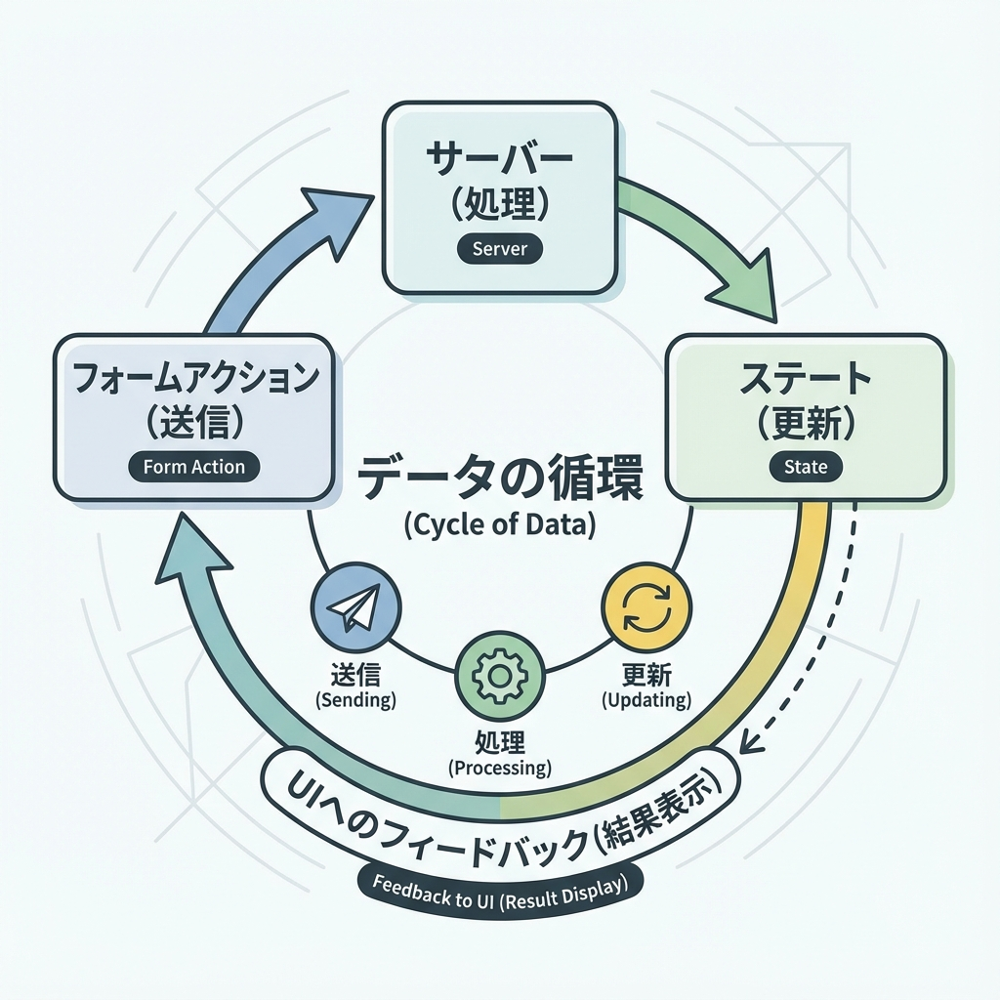
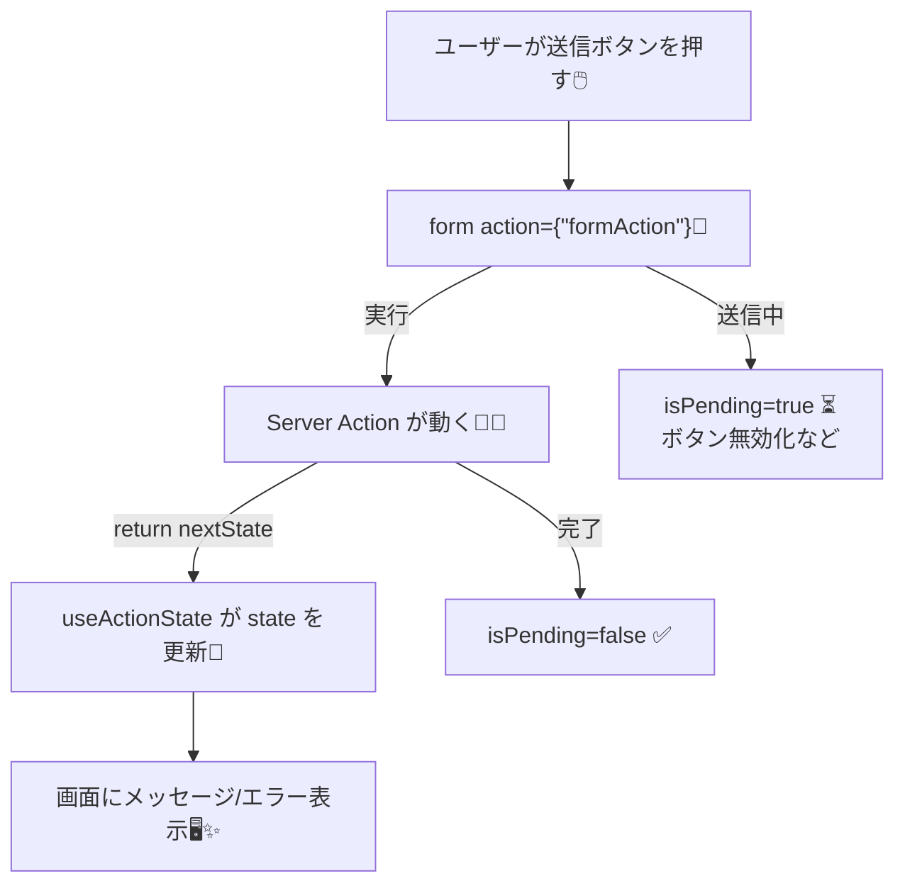

# 第138章：`useActionState` の雰囲気（状態まとめ役）🧠

`useActionState` は、**Server Actionの結果（成功/失敗メッセージや入力エラーなど）を “ひとつのstate” にまとめて受け取る**ためのReactフックだよ〜😊🧺
フォーム送信まわりの「状態管理がごちゃごちゃする問題」をスッキリさせてくれます✨ ([React][1])

---

## この章のゴール🎯✨

* `useActionState` が **何をしてくれるか** ざっくり分かる🧠
* **Server Actionの戻り値**をそのまま state にして表示できるようになる📩
* 送信中の `isPending` を使って「送信中…⏳」を出せるようになる💡 ([React][1])

---

## `useActionState` って何？🤔🧩

ざっくり言うと、

* **フォーム送信（＝アクション）を実行する**
* その **返り値を state として自動で反映する**
* さらに **送信中かどうか（`isPending`）も一緒にくれる**

っていう、フォーム向けの「状態まとめ係」だよ🫶✨ ([React][1])

戻り値はこの3つ👇

* `state`：いまの状態（最初は `initialState`）
* `formAction`：`<form action={...}>` に渡せる関数
* `isPending`：送信中かどうか（true/false） ([React][1])

---

## 図でイメージ📮➡️🧠➡️🖥️（Mermaid）





---

## いちばん大事ポイント⚠️🧷

Next.jsのServer Actionsで `useActionState` を使うとき、**Server Actionの引数がちょっと特殊**になるよ！

* 第1引数：`prevState`（前のstate）
* 第2引数：`formData`（フォームの中身）

こういう形になるのがポイントです🧠✨ ([Next.js][2])

---

## 最小サンプル：お問い合わせ（超ミニ）📮💌

ここでは、**名前が空ならエラー**にして、成功なら「送れたよ✅」って出すだけにします😊✨

### フォルダ構成（今回使う場所）🗂️

* `app/actions.ts`：Server Action（サーバー側）
* `app/contact/ContactForm.tsx`：フォーム（クライアント側）
* `app/contact/page.tsx`：ページ（サーバー側）

---

### 1) Server Action を作る（`app/actions.ts`）🧑‍🍳🔥

```ts
'use server';

export type ContactState = {
  ok: boolean;
  message: string;
  fieldErrors: {
    name?: string;
  };
};

export async function sendContact(prevState: ContactState, formData: FormData): Promise<ContactState> {
  const name = String(formData.get('name') ?? '').trim();

  // 超ミニバリデーション✨
  if (!name) {
    return {
      ok: false,
      message: '入力にエラーがあります🥺',
      fieldErrors: { name: 'お名前は必須だよ〜！🌸' },
    };
  }

  // 本当はここでDB保存やメール送信などをする想定📩
  // await saveToDB(...)

  return {
    ok: true,
    message: `送信できたよ✅（${name}さん、ありがとう〜！）`,
    fieldErrors: {},
  };
}
```

> `prevState` を受け取るのが「useActionState対応の形」だよ🧠
> Next.js公式ガイドでもこの形が説明されてます✨ ([Next.js][2])

---

### 2) フォーム側（Client Component）を作る（`app/contact/ContactForm.tsx`）🎮✨

```tsx
'use client';

import { useActionState } from 'react';
import { sendContact, type ContactState } from '../actions';

const initialState: ContactState = {
  ok: false,
  message: '',
  fieldErrors: {},
};

export function ContactForm() {
  const [state, formAction, isPending] = useActionState(sendContact, initialState);

  return (
    <form action={formAction} style={{ display: 'grid', gap: 12, maxWidth: 420 }}>
      <label style={{ display: 'grid', gap: 6 }}>
        <span>お名前 ✨</span>
        <input name="name" placeholder="例）さくら" />
        {state.fieldErrors.name && (
          <p style={{ margin: 0 }}>{state.fieldErrors.name}</p>
        )}
      </label>

      <button type="submit" disabled={isPending}>
        {isPending ? '送信中…⏳' : '送信する📮'}
      </button>

      {state.message && (
        <p style={{ margin: 0 }}>
          {state.ok ? '🎉 ' : '⚠️ '}
          {state.message}
        </p>
      )}
    </form>
  );
}
```

ここが気持ちいいポイント😍🫶

* `sendContact` が返した `ContactState` が、そのまま `state` になる✨ ([React][1])
* 送信中は `isPending` が `true` になるから、ボタン無効化が超ラク⏳✨ ([React][1])
* 自分で `setState` 連打しなくてよくなる💆‍♀️🌿

---

### 3) ページで表示する（`app/contact/page.tsx`）🏠✨

```tsx
import { ContactForm } from './ContactForm';

export default function Page() {
  return (
    <main style={{ padding: 24 }}>
      <h1>お問い合わせ📮</h1>
      <p>気軽に送ってね〜😊✨</p>
      <ContactForm />
    </main>
  );
}
```

---

## ありがちなつまずきポイント🥺🧯

### ✅ 1) 「Server Actionなのに `'use server'` 書いてない！」

→ `app/actions.ts` の先頭に `'use server'` が必要だよ🧑‍🍳🔥

### ✅ 2) 「`useActionState` を Server Component で使っちゃった」

→ これは **Client Component専用**だから、フォーム部品側（`'use client'`）に置こうね🎮✨ ([Next.js][2])

### ✅ 3) 「Server Actionの引数が (formData) だけになってる」

→ `useActionState` 用は **(prevState, formData)** の形にする！🧠 ([Next.js][2])

---

## まとめ🌸✨

`useActionState` は、

* **フォーム送信の結果を state に自動反映**
* **送信中フラグ（isPending）も一緒に管理**
* **「成功/失敗/入力エラー」をひとまとめにできる**

っていう、フォームの心強い相棒です🫶💕 ([React][1])

次の章（第139章）では、`useFormStatus` で「子コンポーネント側だけ送信中表示」みたいなテクもできるようになるよ〜🧩✨

[1]: https://react.dev/reference/react/useActionState?utm_source=chatgpt.com "useActionState"
[2]: https://nextjs.org/docs/app/guides/forms?utm_source=chatgpt.com "How to create forms with Server Actions"
