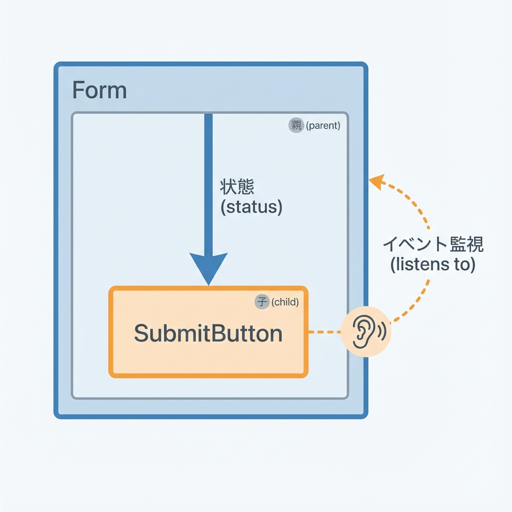
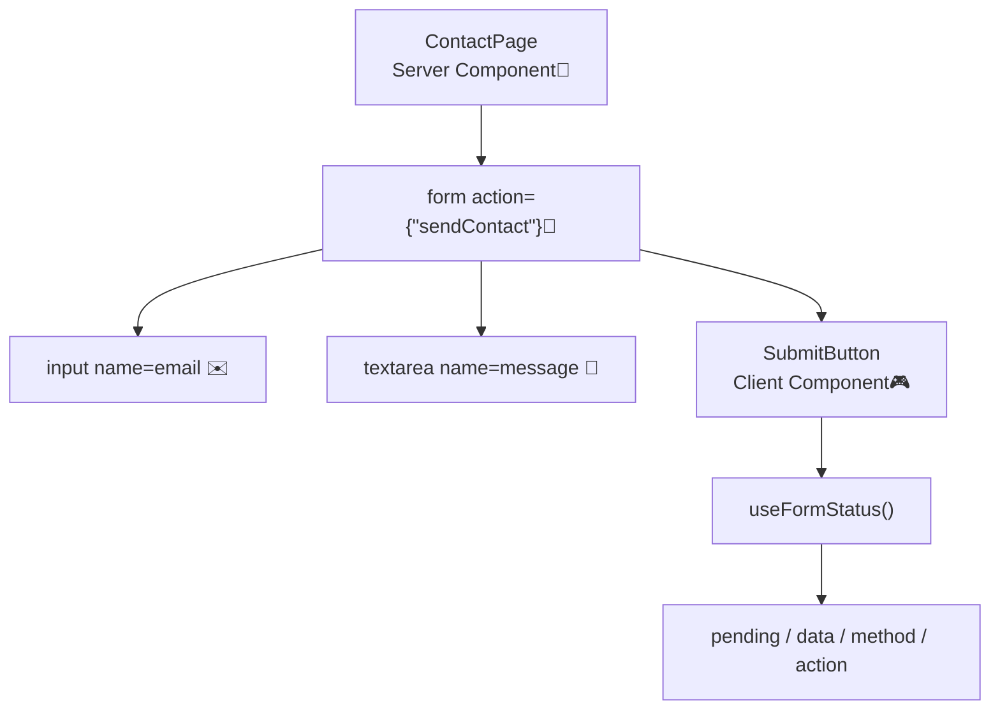
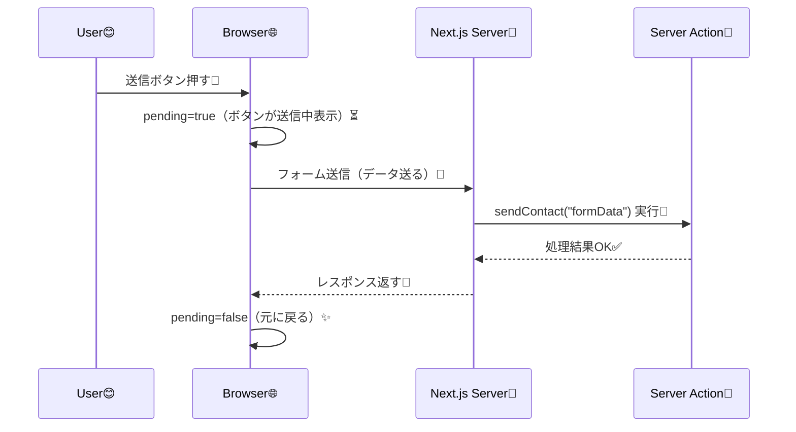

# 第139章：`useFormStatus` の雰囲気（子が送信中を知る）🧩

この章では、**フォームの「送信中…😵‍💫」を“子コンポーネント側”で自然に知る**ための `useFormStatus` を触ります🫶
`<SubmitButton />` みたいな部品が、**親フォームの状態を props なしで勝手に察してくれる**のが最高ポイントです💡 ([React][1])

---

## 1) 今日のゴール🎯💖

* 送信ボタンを **送信中は disabled** にする🛑
* ボタンの文言を **「送信中…」** に変える⏳
* それを **フォームの子コンポーネント（SubmitButton）だけ**で実現する🧸✨ ([React][1])

---

## 2) `useFormStatus` ってなに？🤔🧠

`useFormStatus` は、**直近のフォーム送信の状態**を教えてくれるフックです📨✨
特に使うのはこのへん👇

* `pending`：送信中かどうか（これが一番使う！）⏳
* `data` / `method` / `action`：送信データや送信方法など（必要になったらでOK）🧩 ([React][1])

✅大事ポイント：
`useFormStatus` は **`<form>` の中でレンダーされるコンポーネント**でしか使えません🙅‍♀️
（だから SubmitButton を “フォームの中の部品” にするのが定番です） ([React][1])

---

## 3) 図でつかむ：どこで動くの？🗺️✨





「フォームの中にいる子」だけが、フォームの送信状態を受け取れるイメージです👶💡 ([React][1])

---

## 4) 実装してみよう！📮✨（最小サンプル）

### フォルダ構成（今回使うところだけ）🗂️

* `app/contact/page.tsx`
* `components/SubmitButton.tsx`

---

### (1) `components/SubmitButton.tsx`（送信中を知る子ボタン）🔘⏳

```tsx
'use client'

import { useFormStatus } from 'react-dom'

export function SubmitButton() {
  const { pending } = useFormStatus()

  return (
    <button
      type="submit"
      disabled={pending}
      aria-disabled={pending}
      style={{
        padding: '10px 14px',
        borderRadius: 10,
        border: '1px solid #ddd',
        background: pending ? '#f3f3f3' : 'white',
        cursor: pending ? 'not-allowed' : 'pointer',
      }}
    >
      {pending ? '送信中…⏳' : '送信する📮'}
    </button>
  )
}
```

* `useFormStatus` は **`react-dom` から import** します✅ ([React][1])
* `pending` が `true` の間は **押せない＆表示が変わる**✨

---

### (2) `app/contact/page.tsx`（Server Action付きフォーム）🧊🧾

```tsx
import { SubmitButton } from '@/components/SubmitButton'

export default function ContactPage() {
  async function sendContact(formData: FormData) {
    'use server'

    const email = String(formData.get('email') ?? '')
    const message = String(formData.get('message') ?? '')

    // 本当はDB保存やメール送信などをする想定📦✉️
    console.log({ email, message })

    // わざと少し待って「送信中」を見えやすくする🫧
    await new Promise((r) => setTimeout(r, 1200))
  }

  return (
    <main style={{ maxWidth: 520, margin: '40px auto', padding: 16 }}>
      <h1 style={{ fontSize: 24, marginBottom: 12 }}>お問い合わせ📮</h1>

      <form action={sendContact} style={{ display: 'grid', gap: 12 }}>
        <label style={{ display: 'grid', gap: 6 }}>
          <span>メール✉️</span>
          <input
            name="email"
            type="email"
            required
            placeholder="aki@example.com"
            style={{ padding: 10, borderRadius: 10, border: '1px solid #ddd' }}
          />
        </label>

        <label style={{ display: 'grid', gap: 6 }}>
          <span>内容📝</span>
          <textarea
            name="message"
            required
            rows={5}
            placeholder="こんにちは！相談があります…"
            style={{ padding: 10, borderRadius: 10, border: '1px solid #ddd' }}
          />
        </label>

        <SubmitButton />
      </form>
    </main>
  )
}
```

ポイントはここ👇

* `<form action={sendContact}>` で **Server Action に送る**🧾✨ ([Next.js][2])
* `<SubmitButton />` が **フォームの中にいる**から `pending` を受け取れる🎁 ([React][1])

---

## 5) 送信の流れ（ざっくり）📨➡️🧠



---

## 6) よくあるハマり🔥（ここだけ覚えればOK！）

* **`useFormStatus` をフォームの外で使ってる** → `pending` が反映されない😭
  👉「`<form>` の子」で使う、が鉄則です🧸 ([React][1])

* **`"use client"` を忘れる** → フックが使えない🙅‍♀️
  👉 `SubmitButton.tsx` 側に付けよう🎮 ([Zenn][3])

---

## 7) ミニ課題🎒✨（10〜15分）

1. `SubmitButton` の横に、送信中だけ出るテキストを追加してみてね👇

   * 例：「いま送信してるよ…ちょい待ち🙏」
2. 送信中は `input` と `textarea` も触れないようにしてみよう🧊

   * ヒント：`useFormStatus` を使う **別の小コンポーネント**を作って、`pending` で `disabled` を切り替えるのがやりやすいよ😉

---

必要なら次の章（第140章）につながる形で、`useOptimistic` と「先に表示しちゃう✨」の超ミニ例もセットで作るよ〜😆

[1]: https://react.dev/reference/react-dom/hooks/useFormStatus?utm_source=chatgpt.com "useFormStatus"
[2]: https://nextjs.org/docs/13/app/building-your-application/data-fetching/server-actions-and-mutations?utm_source=chatgpt.com "Data Fetching: Server Actions and Mutations"
[3]: https://zenn.dev/cloud_ace/articles/c799775084bb67?utm_source=chatgpt.com "Server Actions を 使って Next.js で フォーム処理を実装。"
