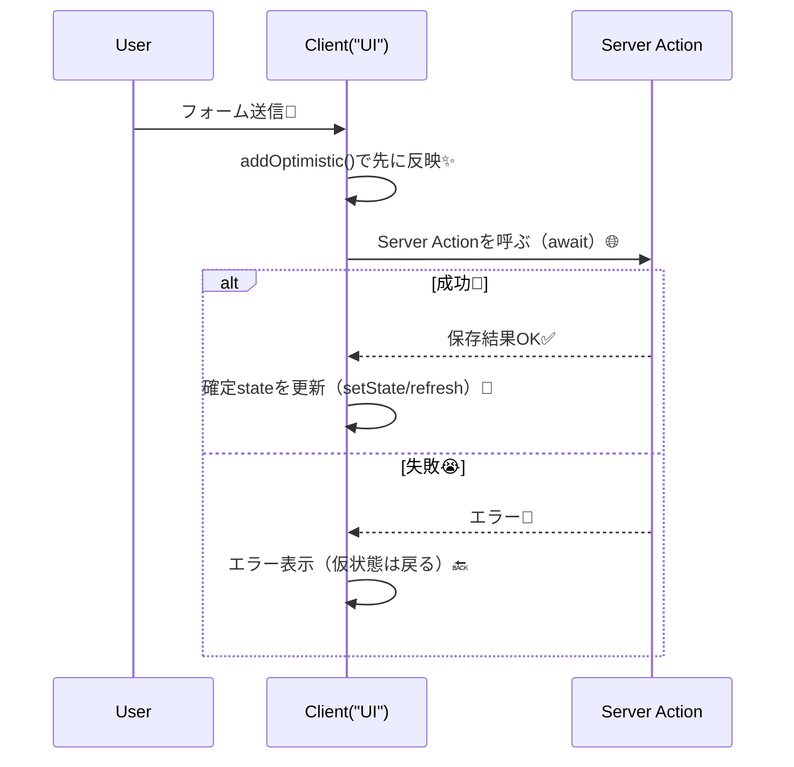

# 第140章：`useOptimistic` の雰囲気（先に反映）✨

この章は「送信ボタン押したのに反応ない…🥲」をなくして、**押した瞬間にUIを先に変える**テクを体験する回だよ〜！🫶✨
（あとからサーバー結果が返ってきたら、ちゃんと整合性を取る👍）

---

## この章のゴール🎯💡

* `useOptimistic(state, updateFn)` の役割がわかる✨ ([React][1])
* フォーム送信で「先に追加されて見える」体験を作れる📮✨
* 失敗したときに「勝手に戻る」挙動のイメージがつく🧯 ([React][1])

---

## `useOptimistic` ってなに？🫧

`useOptimistic` は、**非同期処理（サーバーへ送信とか）中だけ**、UIを「うまくいった想定」で**先に見せる**ためのReactフックだよ✨ ([React][1])

基本形はこれ👇 ([React][1])

```ts
const [optimisticState, addOptimistic] = useOptimistic(state, updateFn);
```

* `state`：いまの確定状態（本物）🧊
* `optimisticState`：処理中だけ上書きされた“仮の状態”🪄
* `addOptimistic(input)`：仮の更新を追加する合図📣
* `updateFn(state, input)`：**仮にどう変える？**を決める関数（できれば純粋関数）🧠✨

---

## 流れを図でつかむ🧠➡️✨（Mermaid）


「送信 → 先に表示 → サーバー結果 → 成功なら確定 / 失敗なら戻る」って感じ！



---

## ミニ実装：ひとこと掲示板（送信した瞬間に追加される）💬✨

今回は「ひとこと」を送ると、**通信待ちでも先にリストに出る**やつを作るよ〜！🥳
※保存先は簡易の“メモリ配列”にするよ（本番はDBにするやつ）🗃️

### 1) ファイル構成📁

* `app/page.tsx`（サーバー側：初期一覧を渡す）
* `app/actions.ts`（サーバーアクション）
* `app/lib/messageStore.ts`（簡易ストア）
* `components/MessageBoard.tsx`（クライアント側：`useOptimistic`）

---

## 2) コード🧩✨

### `app/lib/messageStore.ts`（超簡易ストア）

```ts
export type Message = {
  id: string;
  text: string;
  createdAt: string;
};

const store: Message[] = [];

export function listMessages(): Message[] {
  // 新しい順に見せたい気分なら reverse とかしてOK🙂
  return store;
}

export function addMessageToStore(text: string): Message {
  const msg: Message = {
    id: crypto.randomUUID(),
    text,
    createdAt: new Date().toISOString(),
  };
  store.push(msg);
  return msg;
}
```

### `app/actions.ts`（Server Action）

Next.jsのフォーム周りは公式ガイドにもまとまってるよ🧾✨ ([Next.js][2])

```ts
"use server";

import { addMessageToStore } from "@/app/lib/messageStore";

function sleep(ms: number) {
  return new Promise((r) => setTimeout(r, ms));
}

export async function createMessage(text: string) {
  const clean = text.trim();
  if (!clean) {
    throw new Error("空の投稿はできません🥺");
  }

  // 通信っぽさ演出（待ち時間）⏳
  await sleep(800);

  // ここでDB保存する想定🗃️（今回はメモリに保存）
  const saved = addMessageToStore(clean);
  return saved;
}
```

### `app/page.tsx`（Server Component）

```tsx
import { listMessages } from "@/app/lib/messageStore";
import { createMessage } from "@/app/actions";
import MessageBoard from "@/components/MessageBoard";

export default function Page() {
  const initial = listMessages();

  return (
    <main style={{ maxWidth: 720, margin: "40px auto", padding: 16 }}>
      <h1 style={{ fontSize: 28, marginBottom: 8 }}>ひとこと掲示板💬✨</h1>
      <p style={{ opacity: 0.75, marginBottom: 20 }}>
        送信した瞬間に先に表示されるよ😳💨（あとで確定！）
      </p>

      <MessageBoard initialMessages={initial} createMessage={createMessage} />
    </main>
  );
}
```

### `components/MessageBoard.tsx`（Client Component：主役✨）

```tsx
"use client";

import * as React from "react";
import { useOptimistic } from "react";
import type { Message } from "@/app/lib/messageStore";

type Props = {
  initialMessages: Message[];
  createMessage: (text: string) => Promise<Message>;
};

export default function MessageBoard({ initialMessages, createMessage }: Props) {
  const [messages, setMessages] = React.useState<Message[]>(initialMessages);
  const [error, setError] = React.useState<string>("");

  // 「処理中だけ」先に足したように見せる🪄
  const [optimisticMessages, addOptimistic] = useOptimistic(
    messages,
    (state, optimisticText: string) => {
      const temp: Message = {
        id: "temp-" + crypto.randomUUID(),
        text: optimisticText + "（送信中…）⏳",
        createdAt: new Date().toISOString(),
      };
      return [...state, temp];
    }
  );

  // Reactの<form action={...}>に渡せる「アクション関数」🧾✨
  async function formAction(formData: FormData) {
    setError("");

    const text = String(formData.get("text") ?? "").trim();
    if (!text) {
      setError("なにか文字を入れてね🥺");
      return;
    }

    // ① 先に見せる✨
    addOptimistic(text);

    try {
      // ② サーバーへ送信🌐
      const saved = await createMessage(text);

      // ③ 確定状態を更新🧊（成功したら本物を追加）
      setMessages((prev) => [...prev, saved]);
    } catch (e) {
      setError(e instanceof Error ? e.message : "送信に失敗したよ😭");
      // 失敗したら、確定stateは増えない → optimisticは戻る🔙
    }
  }

  return (
    <section>
      <form action={formAction} style={{ display: "flex", gap: 8, marginBottom: 12 }}>
        <input
          name="text"
          placeholder="ひとこと書いてね✍️"
          style={{
            flex: 1,
            padding: "10px 12px",
            borderRadius: 10,
            border: "1px solid #ccc",
          }}
        />
        <button
          type="submit"
          style={{
            padding: "10px 14px",
            borderRadius: 10,
            border: "1px solid #ccc",
            background: "white",
            cursor: "pointer",
          }}
        >
          送信📮
        </button>
      </form>

      {error && (
        <p style={{ color: "crimson", marginBottom: 10 }}>
          {error} 🧯
        </p>
      )}

      <ul style={{ paddingLeft: 18 }}>
        {optimisticMessages.map((m) => (
          <li key={m.id} style={{ marginBottom: 6 }}>
            {m.text}
          </li>
        ))}
      </ul>
    </section>
  );
}
```

---

## 動かし方（Windows）🪟✨

ターミナルでプロジェクト直下から👇

```bash
npm run dev
```

ブラウザで `http://localhost:3000` にアクセス🌈
→ 送信した瞬間に「（送信中…）⏳」付きで増えたら勝ち！🎉

---

## ここが大事ポイント3つ🧠✨

1. `useOptimistic` は「**処理中だけ**見せる仮UI」だよ🫧 ([React][1])
2. **成功したら確定stateを更新**（DBやサーバー結果に合わせる）🧊
3. **失敗したら確定stateが増えない**ので、仮表示は自然に戻る🔙（エラー表示は別で用意）🧯 ([React][1])

---

## よくあるハマり😵‍💫（先に潰す🧯）

* `useOptimistic` を Server Component で使おうとして動かない
  → これはクライアント側のフックだから、`"use client"` が必要だよ🎮
* `updateFn` の中で配列を `push` しちゃう
  → できれば `return [...state, newItem]` みたいに**新しい配列を返す**のが安全🧼
* 「仮の表示」を信用してサーバー側のバリデーションを省略
  → ダメ🙅 サーバー側チェックは必須だよ🛡️（この章の後半でまたやるやつ！）

---

## ミニ練習🎀（5分）

1. 「（送信中…）⏳」を **薄い文字**にしてみよ〜🙂
2. 成功したら input を空にしたい！

   * ヒント：`form` に `ref` を付けて `formRef.current?.reset()` を呼ぶ✍️

---

次の第141章で、このノリをそのまま「お問い合わせフォーム📮」に持っていくよ〜！🥳✨

[1]: https://react.dev/reference/react/useOptimistic?utm_source=chatgpt.com "useOptimistic"
[2]: https://nextjs.org/docs/app/guides/forms?utm_source=chatgpt.com "How to create forms with Server Actions"
