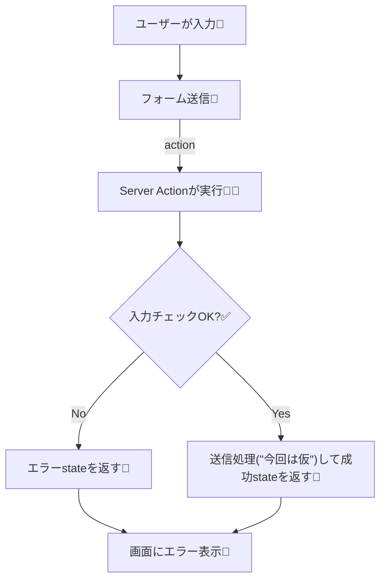

# 第141章：練習：お問い合わせフォームをServer Actionsで作る📮

この章では「**お問い合わせフォーム**」を、Next.jsの**Server Actions**で作っちゃいます😊
ポイントは、`<form action={...}>` で **サーバー側の関数にそのまま送信できる**こと！🔧💕

---

## 完成イメージ🎯💌

* 名前・メール・本文を入力📝
* 送信すると…

  * 入力ミスがあれば **その場でエラー表示**🧯
  * OKなら **「送信できたよ！」表示**🎉

---

## ざっくり仕組み図🧠📨




`useActionState` を使うと、Server Actionが **state（結果）を返して画面に反映**できるようになります✨ ([Next.js][1])

---

## 作るファイル📁✨（この章で触るもの）

* `app/contact/page.tsx`
* `app/contact/ContactForm.tsx`
* `app/contact/actions.ts`
* `app/contact/contact.module.css`

---

## 1) Server Action を作る（サーバー側）🧑‍🍳🔥

`app/contact/actions.ts`

```ts
'use server'

export type ContactState = {
  ok: boolean
  message: string
  fieldErrors?: {
    name?: string
    email?: string
    message?: string
  }
}

// useActionState から呼ぶので、(prevState, formData) という形にするよ✨
export async function submitContact(prevState: ContactState, formData: FormData): Promise<ContactState> {
  const name = String(formData.get('name') ?? '').trim()
  const email = String(formData.get('email') ?? '').trim()
  const message = String(formData.get('message') ?? '').trim()

  const fieldErrors: ContactState['fieldErrors'] = {}

  if (name.length < 2) fieldErrors.name = 'お名前は2文字以上でお願いします🙏'
  if (!email.includes('@')) fieldErrors.email = 'メールアドレスっぽく入力してね📧'
  if (message.length < 10) fieldErrors.message = '本文は10文字以上あると助かるよ〜📝'

  if (Object.keys(fieldErrors).length > 0) {
    return {
      ok: false,
      message: '入力を確認してね🙂‍↕️',
      fieldErrors,
    }
  }

  // 本来はここでメール送信やDB保存をするよ📮
  // 今回は「受け取ったことにする」だけ！
  console.log('[contact]', { name, email, message })

  return {
    ok: true,
    message: '送信ありがとう！📮✨（今回は仮送信だよ）',
  }
}
```

* ファイル先頭の `'use server'` は「これはサーバーで動くよ！」の合図だよ🫶 ([Next.js][2])
* `useActionState` を使うと、Server Action の引数が `(前のstate, formData)` になる感じ！ ([Next.js][1])

---

## 2) フォームUI（クライアント側）を作る🧸✨

`app/contact/ContactForm.tsx`

```tsx
'use client'

import { useActionState } from 'react'
import { useFormStatus } from 'react-dom'
import styles from './contact.module.css'
import { submitContact, type ContactState } from './actions'

const initialState: ContactState = {
  ok: false,
  message: '',
  fieldErrors: {},
}

function SubmitButton() {
  const { pending } = useFormStatus()

  return (
    <button className={styles.button} type="submit" disabled={pending}>
      {pending ? '送信中…⏳' : '送信する📨'}
    </button>
  )
}

export default function ContactForm() {
  const [state, formAction] = useActionState(submitContact, initialState)

  return (
    <div className={styles.card}>
      <form action={formAction} className={styles.form}>
        <div className={styles.field}>
          <label className={styles.label} htmlFor="name">お名前👤</label>
          <input className={styles.input} id="name" name="name" type="text" placeholder="例）さくら" />
          {state.fieldErrors?.name && <p className={styles.error}>⚠️ {state.fieldErrors.name}</p>}
        </div>

        <div className={styles.field}>
          <label className={styles.label} htmlFor="email">メール📧</label>
          <input className={styles.input} id="email" name="email" type="email" placeholder="example@school.jp" />
          {state.fieldErrors?.email && <p className={styles.error}>⚠️ {state.fieldErrors.email}</p>}
        </div>

        <div className={styles.field}>
          <label className={styles.label} htmlFor="message">本文📝</label>
          <textarea className={styles.textarea} id="message" name="message" rows={6} placeholder="お問い合わせ内容をどうぞ〜！" />
          {state.fieldErrors?.message && <p className={styles.error}>⚠️ {state.fieldErrors.message}</p>}
        </div>

        <SubmitButton />

        {state.message && (
          <p className={state.ok ? styles.success : styles.notice}>
            {state.ok ? '✅ ' : 'ℹ️ '}
            {state.message}
          </p>
        )}
      </form>
    </div>
  )
}
```

* `useFormStatus()` は **フォーム送信中かどうか**（`pending`）を見れるよ⏳ ([React][3])
* Server Action は **`'use server'` のファイルに置けば、Client Component から import して呼べる**よ✨ ([Next.js][4])

---

## 3) ページを作る（/contact）🏠📄

`app/contact/page.tsx`

```tsx
import ContactForm from './ContactForm'

export default function ContactPage() {
  return (
    <main style={{ padding: 24 }}>
      <h1 style={{ fontSize: 24, fontWeight: 700 }}>お問い合わせ📮</h1>
      <p style={{ marginTop: 8, opacity: 0.8 }}>
        気軽に送ってね😊✨（この章では“仮送信”だよ）
      </p>

      <div style={{ marginTop: 16 }}>
        <ContactForm />
      </div>
    </main>
  )
}
```

---

## 4) ちょい見た目を整える🎀✨（CSS Modules）

`app/contact/contact.module.css`

```css
.card {
  max-width: 560px;
  margin-top: 16px;
  border: 1px solid #ddd;
  border-radius: 12px;
  padding: 16px;
}

.form {
  display: grid;
  gap: 14px;
}

.field {
  display: grid;
  gap: 6px;
}

.label {
  font-weight: 600;
}

.input,
.textarea {
  width: 100%;
  border: 1px solid #ccc;
  border-radius: 10px;
  padding: 10px 12px;
  font-size: 14px;
}

.button {
  border: none;
  border-radius: 10px;
  padding: 10px 14px;
  font-weight: 700;
  cursor: pointer;
}

.button:disabled {
  opacity: 0.6;
  cursor: not-allowed;
}

.error {
  margin: 0;
  font-size: 13px;
}

.success {
  margin: 0;
  font-weight: 700;
}

.notice {
  margin: 0;
  font-weight: 700;
}
```

---

## 5) 動作チェック✅🧪（Windows）

1. ターミナルで開発サーバー起動
   `npm run dev` ▶️
2. ブラウザで `http://localhost:3000/contact` を開く🌐
3. 空で送信 → エラーが出る🧯
4. ちゃんと入れて送信 → 成功メッセージ🎉
5. ターミナル側に `console.log('[contact]', ...)` が出てたらOKだよ✨

---

## よくあるミス集🪤🙂‍↕️

* `actions.ts` の先頭に **`'use server'`** がない → Server Actionとして動かない💥 ([Next.js][2])
* `ContactForm.tsx` に **`'use client'`** がない → `useActionState` が使えない💦 ([Next.js][5])
* `<input name="email" ...>` の `name` と `formData.get('email')` がズレてる → 値が取れない😵‍💫

---

## ミニ課題🎒✨（できたら強い！）

* `件名（subject）` を追加してみよう📌
* 送信成功したらフォームを空にする（成功時だけ `key` を変える等）🧼
* 本文に「残り文字数」を表示してみる📝✨

[1]: https://nextjs.org/docs/app/guides/forms?utm_source=chatgpt.com "How to create forms with Server Actions"
[2]: https://nextjs.org/docs/app/api-reference/directives/use-server?utm_source=chatgpt.com "Directives: use server"
[3]: https://react.dev/reference/react-dom/hooks/useFormStatus?utm_source=chatgpt.com "useFormStatus"
[4]: https://nextjs.org/docs/app/getting-started/updating-data?utm_source=chatgpt.com "Getting Started: Updating Data"
[5]: https://nextjs.org/docs/app/getting-started/server-and-client-components?utm_source=chatgpt.com "Getting Started: Server and Client Components"
