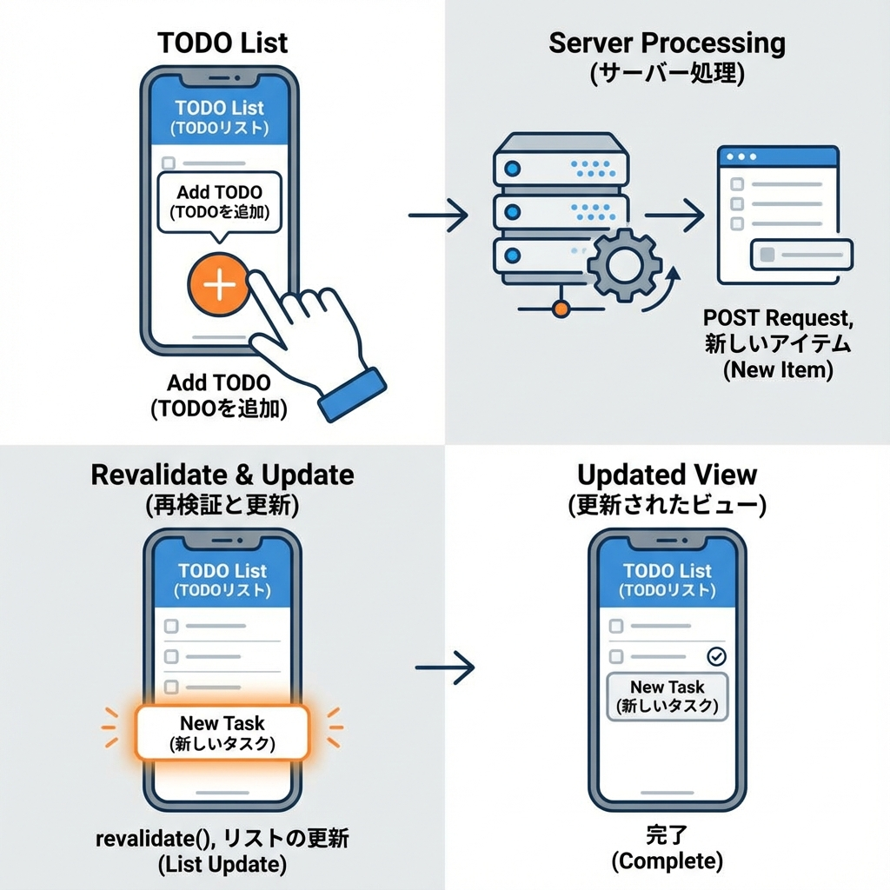

# 第142章：練習：TODO追加をServer Actionsに置き換える➕

今日は「TODO追加」を **`fetch('/api/todos')` でPOSTする方式**から、**Server Actions（`<form action={...}>`）**に置き換えるよ〜！🧁💛
これができると「フォーム送信＝サーバーで処理」になって、作り方がスッキリするよ☺️🫶 ([Next.js][1])

---

## 🎯 今日のゴール

✅ ボタン押したら **Server Action が動く**
✅ 追加後に **`/todos` の表示が更新**される（`revalidatePath`）
✅ 送信中はボタンを **無効化＆文言変更**（`useFormStatus`）

`revalidatePath` は「次に表示するとき新しいデータにしてね！」ってキャッシュを無効化してくれるよ🧊🔁 ([Next.js][2])

---

## 🧭 ざっくり構造（図解）✨

```mermaid
flowchart LR
  U["ユーザーがフォーム送信🖱️"] --> F["<form action=...>"]
  F --> SA["Server Actionがサーバーで実行🧑‍🍳"]
  SA --> STORE["TODOを追加📝"]
  SA --> RV["revalidatePath(#quot;'/todos'#quot;)🔁"]
  RV --> UI["一覧が新しく表示✨"]
```





---

## 🛠️ 手順（この章で作る/直すファイル）

この章では例として `/todos` ページがある前提で進めるね☺️
（Windows＋VSCodeなら、左のエクスプローラーでそのままファイル作ってOK！📁✨）

### ✅ 1) まず「TODOの保存場所」を1つにまとめる（学習用ミニ保存）

`/lib/todos.ts` を作るよ🗃️✨（※学習用なので、サーバー再起動で消えるよ〜）

```ts
// lib/todos.ts
export type Todo = {
  id: string;
  title: string;
  createdAt: number;
};

const todos: Todo[] = [];

export function getTodos(): Todo[] {
  // 新しい順に並べて返す（見やすい✨）
  return [...todos].sort((a, b) => b.createdAt - a.createdAt);
}

export function addTodo(title: string): Todo {
  const todo: Todo = {
    id: crypto.randomUUID(),
    title,
    createdAt: Date.now(),
  };
  todos.push(todo);
  return todo;
}
```

---

### ✅ 2) Server Action を作る（ここが今回の主役🧑‍🍳✨）

`/app/todos/actions.ts` を作るよ！
ポイントは **`'use server'`** と、最後の **`revalidatePath('/todos')`** 🔁

Server Function（Server Action）は **サーバーで動く非同期関数**だよ〜 ☁️✨ ([Next.js][3])

```ts
// app/todos/actions.ts
'use server';

import { revalidatePath } from 'next/cache';
import { addTodo } from '@/lib/todos';

export type AddTodoState = {
  message: string;
};

export async function addTodoAction(
  prevState: AddTodoState,
  formData: FormData
): Promise<AddTodoState> {
  const title = String(formData.get('title') ?? '').trim();

  if (!title) {
    return { message: '⚠️ タイトルを入れてね！' };
  }

  addTodo(title);

  // 追加後に /todos の表示を更新させる✨
  revalidatePath('/todos');

  return { message: '✅ 追加できたよ！' };
}
```

`revalidatePath` の使い方は公式の関数リファレンスにもあるよ🔁 ([Next.js][2])

---

### ✅ 3) フォームを Server Actions 対応に置き換える（`useActionState` 使用）

ここで「fetchでPOST」してた部分を消して、**`<form action={...}>`** にするよ📮✨
`useActionState` を使うと、Server Actionの返り値（今回だと message）をフォーム側で受け取れるよ🧠✨ ([React][4])

`/app/todos/TodoAddForm.tsx` を作成（または置き換え）👇

```tsx
// app/todos/TodoAddForm.tsx
'use client';

import React, { useEffect, useRef } from 'react';
import { useActionState } from 'react';
import { useFormStatus } from 'react-dom';
import { addTodoAction, type AddTodoState } from './actions';

function SubmitButton() {
  const { pending } = useFormStatus(); // 送信中かどうか見れる✨ :contentReference[oaicite:5]{index=5}
  return (
    <button type="submit" disabled={pending}>
      {pending ? '追加中…⏳' : '追加する➕'}
    </button>
  );
}

export default function TodoAddForm() {
  const formRef = useRef<HTMLFormElement>(null);

  const initialState: AddTodoState = { message: '' };
  const [state, action] = useActionState(addTodoAction, initialState);

  // 成功したらフォームを空にする✨
  useEffect(() => {
    if (state.message.startsWith('✅')) {
      formRef.current?.reset();
    }
  }, [state.message]);

  return (
    <div style={{ display: 'grid', gap: 8, maxWidth: 420 }}>
      <form ref={formRef} action={action} style={{ display: 'flex', gap: 8 }}>
        <input
          name="title"
          placeholder="例：レポート提出📄"
          required
          style={{ flex: 1, padding: 8 }}
        />
        <SubmitButton />
      </form>

      {state.message ? (
        <p style={{ margin: 0 }}>{state.message}</p>
      ) : (
        <p style={{ margin: 0, opacity: 0.6 }}>💡 1個追加してみてね！</p>
      )}
    </div>
  );
}
```

`useFormStatus` は「フォーム送信の状態（pendingなど）」を取れるフックだよ〜！⏳✨ ([React][5])

---

### ✅ 4) `/todos` ページでフォーム＋一覧を表示する

`/app/todos/page.tsx` を作成（または更新）👇

```tsx
// app/todos/page.tsx
import { getTodos } from '@/lib/todos';
import TodoAddForm from './TodoAddForm';

export default async function TodosPage() {
  const todos = getTodos();

  return (
    <main style={{ padding: 16, display: 'grid', gap: 16 }}>
      <h1 style={{ margin: 0 }}>TODO 📝✨</h1>

      <TodoAddForm />

      <ul style={{ margin: 0, paddingLeft: 18 }}>
        {todos.map((t) => (
          <li key={t.id}>{t.title}</li>
        ))}
      </ul>
    </main>
  );
}
```

---

## ▶️ 動作確認（Windows）🪟✨

VSCode のターミナルで👇

```bash
npm run dev
```

ブラウザで👇にアクセス：

* `http://localhost:3000/todos`

「追加する➕」を押して、一覧が増えたら成功！🎉✨

---

## 🧨 よくあるハマり（ここ超大事🥺）

* **`'use server'` を actions.ts に書き忘れる** → Server Actionにならない😭 ([Next.js][3])
* **input の `name="title"` と、`formData.get('title')` がズレる** → 空扱いになる😇
* **追加しても一覧が更新されない** → `revalidatePath('/todos')` を忘れてる可能性大🔁 ([Next.js][2])
* **Server Actionは裏でPOSTで呼ばれる**ので、フォームは基本POST扱いだよ🧾 ([Next.js][6])

---

## ✅ できたことまとめ（えらいっ🫶✨）

* `fetch('/api/...')` の **POSTをやめて**、`<form action={...}>` に置き換えた📮
* Server Actionで追加 → `revalidatePath` で表示更新までできた🔁✨ ([Next.js][2])
* `useFormStatus` で送信中UI（追加中…）が作れた⏳💛 ([React][5])

[1]: https://nextjs.org/learn/dashboard-app/mutating-data?utm_source=chatgpt.com "Mutating Data - App Router"
[2]: https://nextjs.org/docs/app/api-reference/functions/revalidatePath?utm_source=chatgpt.com "Functions: revalidatePath"
[3]: https://nextjs.org/docs/app/getting-started/updating-data?utm_source=chatgpt.com "Getting Started: Updating Data"
[4]: https://react.dev/reference/react/useActionState?utm_source=chatgpt.com "useActionState"
[5]: https://react.dev/reference/react-dom/hooks/useFormStatus?utm_source=chatgpt.com "useFormStatus"
[6]: https://nextjs.org/docs/14/app/building-your-application/data-fetching/server-actions-and-mutations?utm_source=chatgpt.com "Server Actions and Mutations - Data Fetching"
