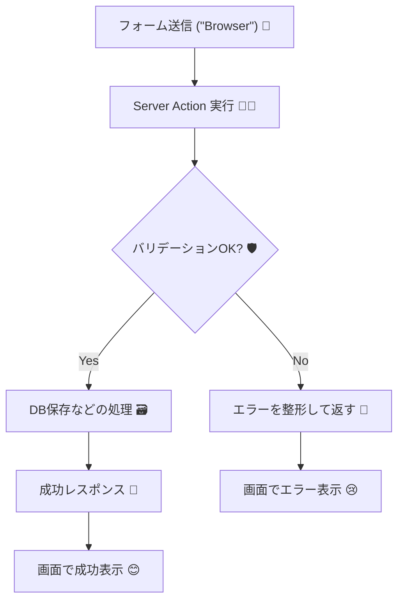

# 第143章：バリデーションはサーバーでも必須🛡️

「Server Actionsでフォーム送信できるなら、もう安心でしょ？😌」
…って思いがちなんだけど、**サーバー側バリデーションは絶対に必要**です‼️🛡️

なぜなら、ブラウザは“正直者”じゃないから…😈💻
（フォームを改造して、変な値を送るのは簡単にできちゃうんだよね）

---

### この章のゴール🎯✨

* ✅ **サーバー側で入力をチェックする理由**がわかる
* ✅ Server Actionで**安全にバリデーション**する形が作れる
* ✅ **エラーを画面に返す**流れがつかめる

---

## 1) なんでサーバーでも必要なの？🤔🛡️

たとえば「TODOのタイトル」を送るフォームがあるとして…

* 空文字（""）を送られる😵
* 10万文字みたいな超長文を送られる📚💥
* 変な型（数値とかオブジェクト）を送られる🧩💣
* 画面を通さず、APIみたいに直接叩かれる🎯

こういうのって、**クライアントの入力欄だけ頑張っても防げません**🙅‍♀️
最終的にデータを受け取って処理するのはサーバーなので、**最後の門番はサーバー**です🧤🚪✨

---

## 2) 図解：Server Actionでのバリデーションの流れ📮➡️🛡️➡️✅




---

## 3) おすすめ：Zodでバリデーションしよう🧩✨

Next.jsのフォームは、**文字列・必須・長さ・形式**みたいなチェックが多いよね💡
そこで便利なのが **Zod**（型っぽく書けるバリデーションライブラリ）です✨

### インストール（Windows / PowerShellでもOK）🪟💻

```bash
npm i zod
```

---

## 4) 実装例：TODO追加のServer Actionにバリデーションを入れる➕🛡️

### ✅ 4-1. Server Action（サーバー側） `app/actions/todo.ts`

* `safeParse` で失敗しても落ちないようにするのがポイント👍
* 返り値を **「成功 or 失敗」**で揃えると画面が作りやすいよ✨

```ts
// app/actions/todo.ts
"use server";

import { z } from "zod";

const TodoSchema = z.object({
  title: z
    .string()
    .trim()
    .min(1, "タイトルは必須だよ✍️")
    .max(50, "タイトルは50文字までだよ📏"),
});

export type AddTodoState =
  | { ok: true }
  | { ok: false; fieldErrors: { title?: string[] }; formError?: string };

export async function addTodoAction(
  _prevState: AddTodoState,
  formData: FormData
): Promise<AddTodoState> {
  // FormDataは何が入ってくるか信用しない！🙅‍♀️
  const rawTitle = formData.get("title");

  // 「文字列じゃなければ即エラー」にしておくと安全🛡️
  if (typeof rawTitle !== "string") {
    return { ok: false, formError: "不正な送信だよ🥲" };
  }

  const parsed = TodoSchema.safeParse({ title: rawTitle });

  if (!parsed.success) {
    return {
      ok: false,
      fieldErrors: parsed.error.flatten().fieldErrors,
    };
  }

  // ここまで来たら validated ✅
  const { title } = parsed.data;

  // 本当はここでDB保存などをする（例：Prismaなど）🗃️
  // await db.todo.create({ data: { title } });

  return { ok: true };
}
```

---

### ✅ 4-2. 画面側（Client Component） `app/todos/page.tsx`

* `useActionState` で **エラーを受け取って表示**できるよ😌✨
* エラーは赤字にしなくてもOK（まず出せれば勝ち！）🏁

```tsx
// app/todos/page.tsx
"use client";

import { useActionState } from "react";
import type { AddTodoState } from "../actions/todo";
import { addTodoAction } from "../actions/todo";

const initialState: AddTodoState = { ok: true };

export default function TodosPage() {
  const [state, formAction, isPending] = useActionState(addTodoAction, initialState);

  const titleErrors = state.ok ? undefined : state.fieldErrors?.title;
  const formError = state.ok ? undefined : state.formError;

  return (
    <main style={{ padding: 16 }}>
      <h1>TODO追加➕</h1>

      <form action={formAction} style={{ display: "grid", gap: 8, maxWidth: 420 }}>
        <label>
          タイトル✍️
          <input
            name="title"
            placeholder="例：レポート提出する📚"
            aria-invalid={Boolean(titleErrors?.length)}
            style={{ width: "100%", padding: 8 }}
            disabled={isPending}
          />
        </label>

        {titleErrors?.length ? (
          <ul style={{ margin: 0, paddingLeft: 18 }}>
            {titleErrors.map((msg, i) => (
              <li key={i}>{msg}</li>
            ))}
          </ul>
        ) : null}

        {formError ? <p>{formError}</p> : null}

        <button type="submit" disabled={isPending} style={{ padding: 10 }}>
          {isPending ? "送信中…⏳" : "追加する➕"}
        </button>

        {!state.ok ? null : (
          <p style={{ opacity: 0.8 }}>
            ※成功したら本当は一覧更新とかするよ😊（ここでは土台だけ！）
          </p>
        )}
      </form>
    </main>
  );
}
```

---

## 5) サーバーバリデーションの「最低ライン」チェックリスト✅🛡️

フォームを受け取るServer Actionには、とりあえずこれ入れると安心度アップ✨

* ✅ **型チェック**（文字列？数値？）
* ✅ **trim**（前後の空白を消す）
* ✅ **必須**（空はダメ）
* ✅ **最大長**（長すぎる入力を防ぐ）
* ✅ **形式**（メール、URLなどがあるなら）

---

## 6) ミニ練習🎒✨（5分でOK）

上の例をちょい改造して👇を追加してみてね😆

* タイトルが **「test」** のときは弾く（例：`refine` を使う）🙅‍♀️
* エラー文言をもう少し優しくする🫶
* `max(50)` を `max(30)` に変えて、長文を試す📏

---

これで「サーバーでもバリデーション必須🛡️」って感覚が掴めたはず！😊✨
次は「クライアント側はどうする？」って話に進むと、さらに使いやすいフォームになるよ〜🌸
