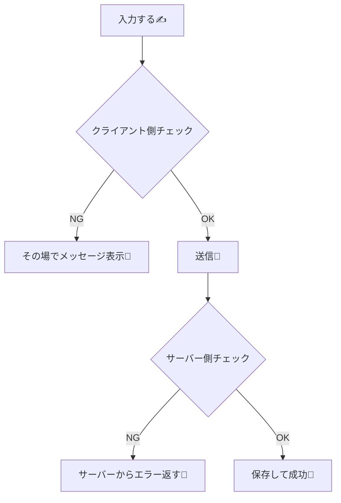

# 第144章：クライアント側バリデーションは“補助”🌸✅

この章は一言でいうと…
**「ユーザーにやさしいチェックはブラウザ（クライアント）でやる。でも最終判断はサーバーでやる」**です☺️🫶

---

## 1) なんで“補助”なの？🤔🌸

クライアント側バリデーション（入力チェック）は便利だけど、**信用しきっちゃダメ**です🙅‍♀️💦

理由はざっくりこの3つ👇

* ブラウザの開発者ツールで、チェックをすり抜けられる😈🔧
* JSを無効にされたら動かないこともある🧯
* ルールが更新された時に、クライアントだけ古いままになりがち🕰️

だから結論👇

* ✅ **クライアント：体験を良くするため（早く気づける）**
* ✅ **サーバー：正しさを守るため（絶対に必要）**

---

## 2) 図でイメージ：チェックは2段構え🍰✨（Mermaid）



---

## 3) まずは“HTMLの標準機能”だけで強い💪✨

クライアント補助の最初の一歩は、これだけでもかなり効きます☺️

* `required`（必須）
* `minLength` / `maxLength`（文字数）
* `type="email"`（メール）
* `pattern`（正規表現）

たとえば「TODOタイトル（1〜30文字）」なら👇

```tsx
<input
  name="title"
  required
  minLength={1}
  maxLength={30}
/>
```

これ、**JSを書かなくても**ブラウザが止めてくれます🛑✨
（ただしエラーメッセージはブラウザ依存なので、文言の自由度は低めです🥲）

---

## 4) “もう一歩やさしく”する：入力中にメッセージを出す💬🌷

ここからが「補助」の本領です🎀
**送信してから怒られる**んじゃなくて、**入力中にやさしく教える**感じにします☺️🌸

今回は例として、Server Actionsにつなぐ「TODO追加フォーム」を作ります📝✨

* クライアント：文字数や空欄を“その場で”案内👀
* サーバー：同じルールで“最終チェック”🛡️

---

## 5) サンプル：Server Actions + クライアント補助バリデーション🌈

### 5-1) サーバー側（最終チェック担当）🛡️

`app/todos/actions.ts`

```ts
'use server'

export type AddTodoState =
  | { ok: true }
  | { ok: false; error: string }

export async function addTodo(
  _prevState: AddTodoState,
  formData: FormData
): Promise<AddTodoState> {
  const title = String(formData.get('title') ?? '').trim()

  // ✅ 最終判断はサーバーで！
  if (title.length === 0) return { ok: false, error: '空っぽはダメだよ〜🙂' }
  if (title.length > 30) return { ok: false, error: '30文字以内でお願い🙏' }

  // TODO: ここでDB保存など（この章では省略✨）
  return { ok: true }
}
```

---

### 5-2) クライアント側（体験アップ担当）🌸

`app/todos/TodoForm.tsx`

```tsx
'use client'

import { useEffect, useMemo, useState } from 'react'
import { useActionState } from 'react'
import { useFormStatus } from 'react-dom'
import type { AddTodoState } from './actions'

type Props = {
  action: (prevState: AddTodoState, formData: FormData) => Promise<AddTodoState>
}

function SubmitButton() {
  const { pending } = useFormStatus()
  return (
    <button type="submit" disabled={pending}>
      {pending ? '送信中…⏳' : '追加する➕'}
    </button>
  )
}

export default function TodoForm({ action }: Props) {
  const [state, formAction] = useActionState<AddTodoState, FormData>(action, { ok: false, error: '' } as AddTodoState)

  const [title, setTitle] = useState('')
  const [touched, setTouched] = useState(false)

  // ✅ クライアント側の“補助”チェック（見た目・体験用）
  const clientError = useMemo(() => {
    const v = title.trim()
    if (!touched) return ''
    if (v.length === 0) return '入力してね🙂'
    if (v.length > 30) return '30文字以内だよ〜🙏'
    return ''
  }, [title, touched])

  // ✅ 成功したら入力欄をクリア（体験UP✨）
  useEffect(() => {
    if (state.ok) {
      setTitle('')
      setTouched(false)
    }
  }, [state.ok])

  const serverError = !state.ok ? (state as any).error : ''

  const errorMessage = clientError || serverError
  const isInvalid = Boolean(errorMessage)

  return (
    <form
      action={formAction}
      onSubmit={(e) => {
        // ✅ クライアントでNGなら送信しない（サーバー負荷も減る✨）
        setTouched(true)
        if (clientError) e.preventDefault()
      }}
    >
      <label htmlFor="title">TODOタイトル✍️</label>
      <input
        id="title"
        name="title"
        value={title}
        onChange={(e) => setTitle(e.target.value)}
        onBlur={() => setTouched(true)}
        required
        maxLength={30}
        aria-invalid={isInvalid}
        aria-describedby="title-error"
        placeholder="例：レポート提出📚"
      />

      <div style={{ fontSize: 12, marginTop: 4 }}>
        {title.trim().length}/30 ✨
      </div>

      <p
        id="title-error"
        role="alert"
        style={{ minHeight: 20, marginTop: 6 }}
      >
        {errorMessage ? `⚠️ ${errorMessage}` : '　'}
      </p>

      <SubmitButton />
    </form>
  )
}
```

---

### 5-3) サーバーコンポーネント側でフォームを置く📦

`app/todos/page.tsx`

```tsx
import TodoForm from './TodoForm'
import { addTodo } from './actions'

export default function Page() {
  return (
    <main>
      <h1>TODO追加📝</h1>
      <TodoForm action={addTodo} />
    </main>
  )
}
```

---

## 6) いい感じにするコツ集🎀（超大事）

### ✅ (A) ルールは「サーバーと揃える」🧩

クライアントだけ「20文字まで」で、サーバーが「30文字まで」だと混乱します🥺
**同じ条件**にして、**同じメッセージ**に寄せるのが優しさです🫶✨

### ✅ (B) エラーは“最初から出さない”👀

入力してないのに赤い警告が出ると、ちょっと圧が強い😇💦
だからこの例みたいに `touched`（触った後）で出すのが定番です🌷

### ✅ (C) アクセシビリティも少しだけ意識🧑‍🦽✨

* `aria-invalid`
* `aria-describedby`
* エラーメッセージに `role="alert"`

これだけで、読み上げにもやさしくなります☺️🔊

---

## 7) まとめ🎉🌸

* クライアント側バリデーションは **体験を良くする“補助”** 🎀
* サーバー側バリデーションは **絶対に必要な“本体”** 🛡️
* 2段構えにすると、やさしい＆安全なフォームになるよ〜☺️✨

---
