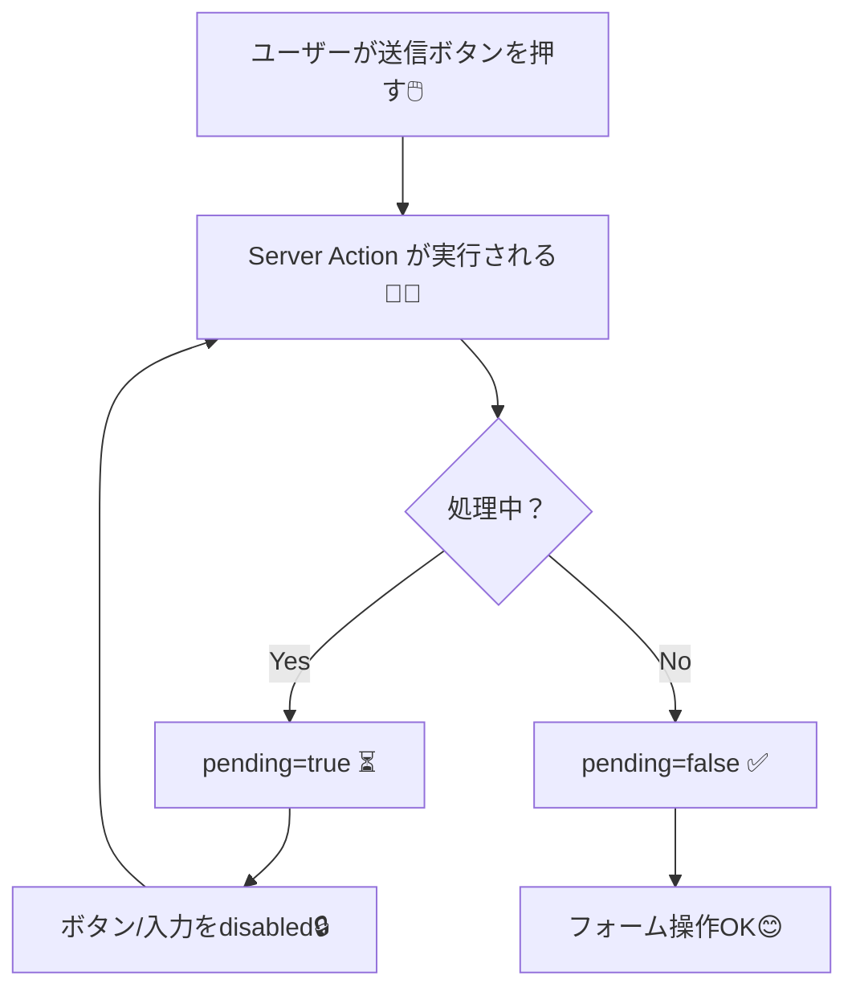

# 第145章：二重送信対策（連打防止）🖱️🚫✨

フォームって、回線が遅いと「送れてるのかな…？」って不安になって、ついボタン連打しがちだよね🥺
でもそれ、**同じ処理が2回走ってデータが2個できる**みたいな事故につながるの…！💥

この章では **Server Actions のフォーム**で、**二重送信を起こしにくくする基本セット**を作るよ〜😊🧁
（結論：**UIで連打できないようにする**＋**サーバー側でも保険**が最強！🛡️）

---

## 1) 二重送信って何が困るの？😵‍💫

* TODOが2個追加される📌📌
* お問い合わせが2通届く📮📮
* （怖い例）決済・注文が2回走る💳💥

なので、**「送信中は押せない」**を作るのが第一歩だよ✅

---

## 2) まずは王道：`useFormStatus` で送信中はボタンを無効化🧸⏳

`useFormStatus()` は、フォーム送信の状態（`pending` など）を取れるReactのHookだよ🧠
`pending === true` の間、**送信中**ってこと！ ([react.dev][1])
しかも Next.js の Server Actions フォームで使うのが定番✨ ([Next.js][2])

### ✅ 作るもの（イメージ）🎯

* 送信中：ボタンを `disabled` にする🔒
* 送信中：ラベルを「送信中…」にする⏳
* できれば：入力欄も操作できないようにする✋（保険）

---

### 実装例：`SubmitButton` を別コンポーネントにする（おすすめ）🍰

#### ① Server Action（サーバー側）🧑‍🍳

```ts
// app/actions/todo.ts
"use server";

export async function addTodo(formData: FormData) {
  const title = String(formData.get("title") ?? "").trim();

  if (!title) {
    // 本当はエラー表示もしたいけど、ここでは省略！
    return;
  }

  // ここでDB保存…など（例）
  // await db.todo.create({ data: { title } });

  // ダミーで少し待つ（送信中を体験しやすくする）
  await new Promise((r) => setTimeout(r, 800));
}
```

#### ② フォーム（クライアント側）🎮

```tsx
// app/todo/TodoForm.tsx
"use client";

import { useFormStatus } from "react-dom";
import { addTodo } from "../actions/todo";

function SubmitButton() {
  const { pending } = useFormStatus(); // pendingで送信中がわかる :contentReference[oaicite:2]{index=2}

  return (
    <button
      type="submit"
      disabled={pending}
      aria-disabled={pending}
      aria-busy={pending}
      style={{
        padding: "8px 12px",
        borderRadius: 8,
        opacity: pending ? 0.6 : 1,
        cursor: pending ? "not-allowed" : "pointer",
      }}
    >
      {pending ? "送信中…⏳" : "追加する➕"}
    </button>
  );
}

export default function TodoForm() {
  return (
    <form action={addTodo} style={{ display: "grid", gap: 8, maxWidth: 360 }}>
      <label style={{ display: "grid", gap: 4 }}>
        タイトル✍️
        <input
          name="title"
          placeholder="例：レポート提出📄"
          style={{ padding: 8, borderRadius: 8, border: "1px solid #ccc" }}
        />
      </label>

      <SubmitButton />
    </form>
  );
}
```

✅ これで、クリック連打はかなり防げるよ〜！🖱️🚫✨

---

## 3) もう一段かためる：フォーム全体も「送信中は触れない」🧤🔒

ボタンだけ無効化でも十分なことが多いけど、
体験としては「送信中は入力もいじれない」方が親切だったりするよ☺️🫶

`useFormStatus()` の `pending` を使って、`<fieldset disabled>` でまとめて無効化しちゃう作戦💡

```tsx
"use client";

import { useFormStatus } from "react-dom";
import { addTodo } from "../actions/todo";

function FormBody() {
  const { pending } = useFormStatus();

  return (
    <fieldset disabled={pending} style={{ border: 0, padding: 0, margin: 0 }}>
      <label style={{ display: "grid", gap: 4 }}>
        タイトル✍️
        <input
          name="title"
          placeholder="例：ゼミの資料づくり📚"
          style={{ padding: 8, borderRadius: 8, border: "1px solid #ccc" }}
        />
      </label>

      <button type="submit" style={{ padding: "8px 12px", borderRadius: 8 }}>
        {pending ? "送信中…⏳" : "追加する➕"}
      </button>
    </fieldset>
  );
}

export default function TodoForm() {
  return (
    <form action={addTodo} style={{ display: "grid", gap: 8, maxWidth: 360 }}>
      <FormBody />
    </form>
  );
}
```

---

## 4) 図解：送信中は “ロック🔒” がかかるイメージ🧠✨



---

## 5) さらに大事：サーバー側でも「保険」を持とう🛡️（超重要）

UIで連打を防げても、現実はこんなのがあるの👇🥺

* 回線リトライで同じ送信が再送される📶🔁
* 別タブ/別端末で同じ操作される🧑‍💻🧑‍💻
* 悪意ある直接リクエスト（UI関係ない）🧨

だから、作り込みたい機能（注文・登録など）では
**「同じ内容を2回処理しても1回分に落ち着く」＝冪等性（idempotency）** を意識すると強いよ💪 ([Leapcell][3])

やり方の例（かんたん順）👇

* DBに **ユニーク制約**をつける（同じキーは2回入らない）🔑
* “リクエストID” を送り、サーバーで「もう使ったIDなら無視」する🎫
* 内容をハッシュ化して「同じハッシュは弾く」🧾

この章では深掘りしないけど、**「UIロック＋サーバー保険」**は覚えておくと安心だよ🫶✨

---

## 6) ミニ練習🎮✨（3分）

1. 上の `setTimeout(800)` を `2000` にしてみる（送信中が見やすい）⏳
2. ボタンを連打してみる（押せなくなってたら成功🎉）
3. `fieldset disabled` 版にして、入力欄も触れないことを確認🔒😊

---

## 7) よくあるハマり集🪤（ここだけ見れば回避できるよ！）

* `useFormStatus()` を使うファイルに `"use client"` がない🎮❌
* `useFormStatus()` を **`form` の外**で呼んでて `pending` が効かない📦❌（フォームの子で使うのが基本） ([react.dev][1])
* `disabled` にしたのに見た目が変わらず「効いてる？」って不安になる😵‍💫 → `opacity` や文言で分かるようにするのがおすすめ✨

---

## まとめ🎀

* 二重送信は「よく起きる」し「地味に危ない」⚠️
* まずは `useFormStatus()` の `pending` で **送信中は押せない**を作る⏳🔒 ([react.dev][1])
* 余裕があれば `fieldset disabled` でフォーム全体もロック🧤
* 重要機能はサーバー側でも保険（冪等性）🛡️ ([Leapcell][3])

次からは、この“送信中ロック”をフォーム全部に標準装備していこうね😊✨

[1]: https://react.dev/reference/react-dom/hooks/useFormStatus?utm_source=chatgpt.com "useFormStatus"
[2]: https://nextjs.org/docs/app/guides/forms?utm_source=chatgpt.com "How to create forms with Server Actions"
[3]: https://leapcell.io/blog/streamlined-form-handling-and-validation-in-next-js-server-actions?utm_source=chatgpt.com "Streamlined Form Handling and Validation in Next.js ..."
