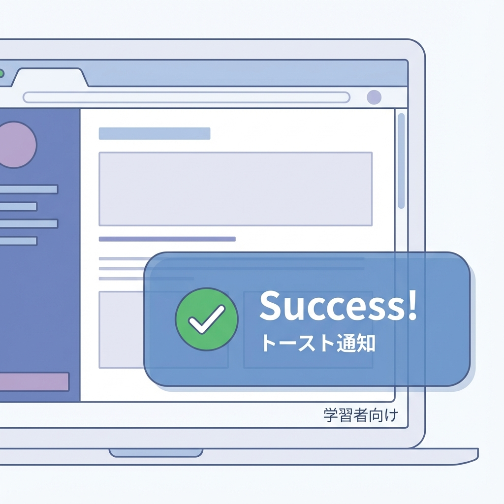
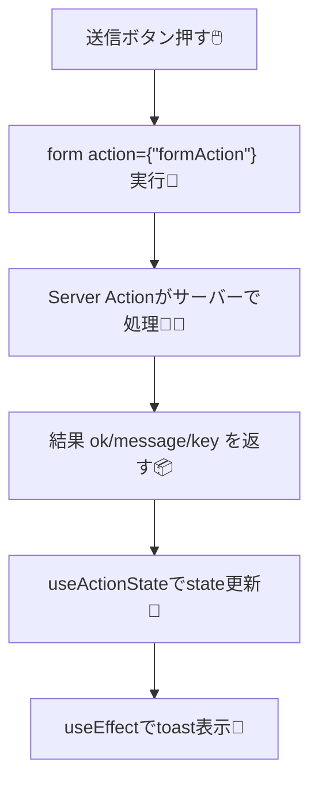

# 第146章：成功/失敗のトースト通知を付ける🔔

フォーム送信って、成功したのか失敗したのか分かりにくいと不安だよね🥺
そこで今回は **Server Actionsの結果に合わせて「トースト（ふわっと出る通知）」** を出して、体験を一気に良くするよ〜！🔔💖

---

## 今日はこれを作るよ🧁

* 送信成功 → ✅「できたよ！」トースト
* 送信失敗 → ❌「ごめん、失敗…」トースト
* **Server Actionsはサーバーで動く**ので、トースト表示は **クライアント側で**やるよ🙆‍♀️

`useActionState` は「state」「formに渡すaction」「pending（送信中か）」の3つが取れるよ。 ([React][1])

---

## ざっくり流れ図🗺️（これができれば勝ち！）





---

## Step 1：トーストライブラリを入れる🍞✨（sonner）

今回は軽くて人気な **sonner** を使うよ〜🔔

ターミナルで👇

```bash
npm i sonner
```

（sonnerは `<Toaster />` をどこかに置いて、`toast()` を呼ぶタイプだよ） ([Shadcn UI][2])

---

## Step 2：Toaster（通知の置き場所）をアプリに常設する🏠🔔

App Routerの `layout.tsx` は基本サーバー側だから、**ToasterはClient Componentに分けて置く**のが安全だよ🙆‍♀️

### `app/_components/ToasterProvider.tsx`

```tsx
"use client";

import { Toaster } from "sonner";

export function ToasterProvider() {
  return <Toaster position="top-right" richColors />;
}
```

### `app/layout.tsx`（末尾に追加）

```tsx
import type { ReactNode } from "react";
import { ToasterProvider } from "./_components/ToasterProvider";

export default function RootLayout({ children }: { children: ReactNode }) {
  return (
    <html lang="ja">
      <body>
        {children}
        <ToasterProvider />
      </body>
    </html>
  );
}
```

---

## Step 3：Server Actionは「結果を返す」だけにする📦🧑‍🍳

`useActionState` を使うと、Server Actionの引数が **(prevState, formData)** になるよ。 ([Next.js][3])
ここで **成功/失敗とメッセージ**を返すようにするのがポイント✨

### `app/actions/todo.ts`

```ts
"use server";

export type AddTodoState = {
  ok: boolean | null;     // null=初期状態
  message: string;
  key: number;            // トースト重複防止用
};

export async function addTodo(
  prevState: AddTodoState,
  formData: FormData
): Promise<AddTodoState> {
  const title = String(formData.get("title") ?? "").trim();

  if (!title) {
    return { ok: false, message: "タイトルが空だよ…🥲", key: Date.now() };
  }

  try {
    // 例：DB保存の代わりにちょい待つ（雰囲気）
    await new Promise((r) => setTimeout(r, 300));

    return { ok: true, message: `「${title}」を追加したよ🎉`, key: Date.now() };
  } catch {
    return { ok: false, message: "保存に失敗しちゃった…もう一回🙏", key: Date.now() };
  }
}
```

---

## Step 4：クライアント側で state を見てトースト出す🔔💖

Server Actionはサーバーで動くから、**toast.success / toast.error はクライアントで呼ぶ**よ😊
`useEffect` で state の変化を見て出すのが王道✨

※「同じstateで何回もトースト出ちゃう😭」を避けるために、`key` を返して **前回と違う時だけ出す**ようにするよ（このやり方よく使われるよ〜） ([Stack Overflow][4])

### `app/_components/TodoAddForm.tsx`

```tsx
"use client";

import { useActionState, useEffect, useRef } from "react";
import { toast } from "sonner";
import { addTodo, type AddTodoState } from "@/app/actions/todo";

const initialState: AddTodoState = { ok: null, message: "", key: 0 };

export function TodoAddForm() {
  const [state, formAction, pending] = useActionState(addTodo, initialState);
  const lastKeyRef = useRef(0);

  useEffect(() => {
    if (!state.key || state.key === lastKeyRef.current) return;
    lastKeyRef.current = state.key;

    if (state.ok) toast.success(state.message);
    else toast.error(state.message);
  }, [state]);

  return (
    <form action={formAction} style={{ display: "flex", gap: 8, alignItems: "center" }}>
      <input
        name="title"
        placeholder="TODOを入力…📝"
        style={{ padding: "8px 10px", border: "1px solid #ccc", borderRadius: 8 }}
      />
      <button
        type="submit"
        disabled={pending}
        style={{ padding: "8px 12px", border: "1px solid #ccc", borderRadius: 8 }}
      >
        {pending ? "送信中…⏳" : "追加➕"}
      </button>
    </form>
  );
}
```

---

## Step 5：ページに置いて動作チェック✅🎉

### `app/page.tsx`

```tsx
import { TodoAddForm } from "./_components/TodoAddForm";

export default function Page() {
  return (
    <main style={{ padding: 24 }}>
      <h1>TODO 追加🧸</h1>
      <TodoAddForm />
    </main>
  );
}
```

* 入力して送信 → ✅トースト🎉
* 空で送信 → ❌トースト🥲

---

## よくあるハマり集🪤（ここだけ押さえよ！）

* **トーストが出ない**

  * `<ToasterProvider />` を `layout.tsx` に置き忘れがち🥺
* **Server Action内で toast しようとする**

  * サーバーにはブラウザがないから無理だよ🙅‍♀️（結果を返して、クライアントでtoast！）
* **redirect() するとトースト出しづらい**

  * Server Actionで `redirect()` すると「結果state」を受け取りにくいことがあるよ。トースト出したいなら、まずは **redirectしない設計**でOK🙆‍♀️（慣れたら別パターンもできる！）

---

## できたらミニ課題🎀

* 成功トーストを「🎉 追加できたよ！」みたいに絵文字マシマシにする🤣
* 失敗トーストを「⚠️ もう一回だけお願い…！」みたいに優しくする🫶
* `position` を `"bottom-center"` に変えて好みチェック👀

---

この章は以上だよ〜！🔔✨

[1]: https://react.dev/reference/react/useActionState?utm_source=chatgpt.com "useActionState"
[2]: https://ui.shadcn.com/docs/components/sonner?utm_source=chatgpt.com "Sonner - Shadcn UI"
[3]: https://nextjs.org/docs/app/guides/forms?utm_source=chatgpt.com "How to create forms with Server Actions"
[4]: https://stackoverflow.com/questions/77816131/how-to-reset-the-state-returned-from-useformstate-in-react-js?utm_source=chatgpt.com "How to reset the state returned from useFormState in react ..."
