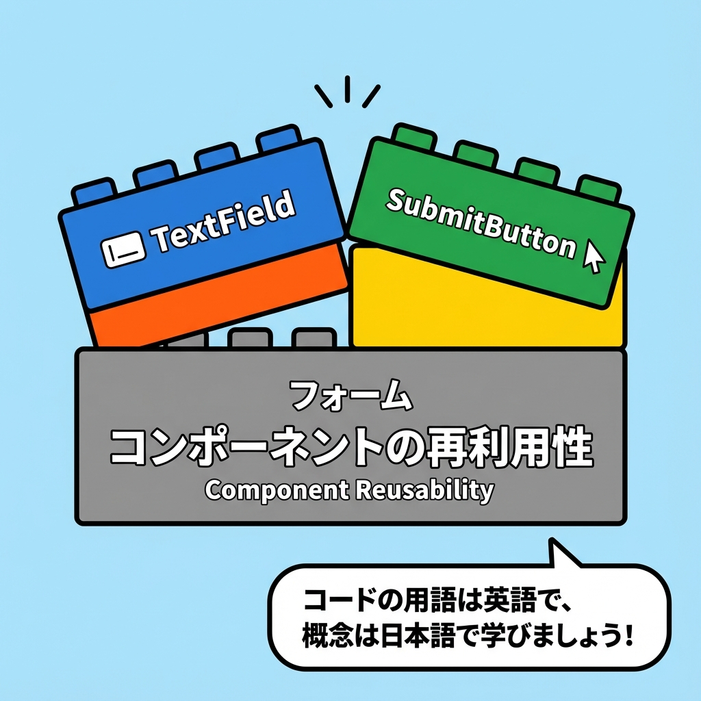
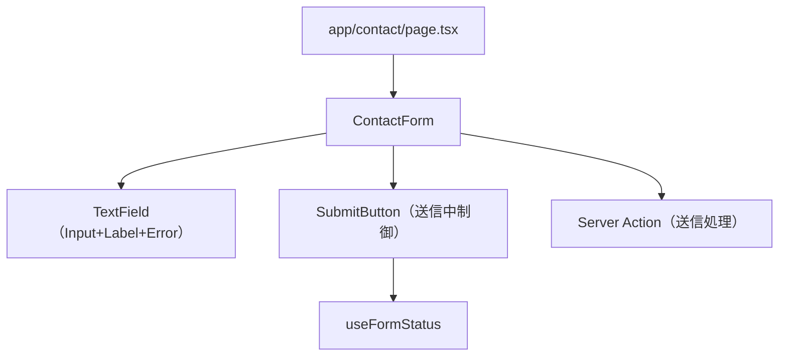
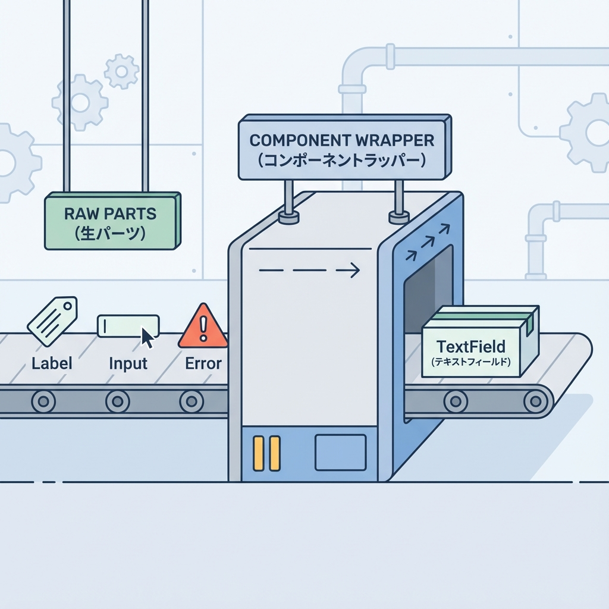

# 第147章：フォーム部品化：Input/Buttonを整える🧩

この章は「フォームを毎回いちから書かずに、キレイに使い回せる形にする」回だよ〜😊💗
InputとButtonを“ちゃんと部品”にして、見た目も使い心地もそろえるよ！🪄

---

## 今日のゴール🎯✨

* ✅ **Inputを部品化**して、ラベル・エラー表示・アクセシビリティを毎回セットにする🧸
* ✅ **Submitボタンを部品化**して、送信中は自動で「送信中…」＆押せない状態にする⏳🔒
* ✅ フォームのコードがスッキリして、増えても怖くない状態にする🧹✨

---

## なんで部品化するの？🤔🧩

フォームって、地味に毎回同じことやりがち👇😵‍💫

* ラベル付ける
* 入力欄の見た目整える
* エラー表示する
* 送信中はボタン無効にする

これを**部品に閉じ込める**と、ページ側は「何を並べたいか」だけ書けばOKになるよ〜😊🌸

---

## 全体の形（今回の設計イメージ）🗺️✨





---

## 1) フォルダ構成を作ろう📁✨

こんな感じで置くと迷子になりにくいよ😊

```txt
components/
  ui/
    TextField/
      TextField.tsx
      TextField.module.css
    SubmitButton/
      SubmitButton.tsx
      SubmitButton.module.css
app/
  contact/
    page.tsx
    actions.ts
```

---

## 2) TextField（Input+Label+Error）を作る🧩📝




### ✅ ポイント（ここが“整う”コツ）💡

* `label` と `id` をセットにして、クリックでフォーカスできるようにする👆✨
* エラーがあるときは `aria-invalid` を付ける（やさしい）🫶
* エラー文は `aria-describedby` で関連づける（読み上げにも強い）🎧✨

### `components/ui/TextField/TextField.tsx`

```tsx
import styles from "./TextField.module.css";

type Props = {
  id: string;
  name: string;
  label: string;
  type?: React.HTMLInputTypeAttribute;
  placeholder?: string;
  defaultValue?: string;
  required?: boolean;
  autoComplete?: string;
  error?: string;
};

export function TextField({
  id,
  name,
  label,
  type = "text",
  placeholder,
  defaultValue,
  required,
  autoComplete,
  error,
}: Props) {
  const errorId = `${id}-error`;
  const describedBy = error ? errorId : undefined;

  return (
    <div className={styles.field}>
      <label className={styles.label} htmlFor={id}>
        {label}
        {required ? <span className={styles.required}> *</span> : null}
      </label>

      <input
        className={`${styles.input} ${error ? styles.inputError : ""}`}
        id={id}
        name={name}
        type={type}
        placeholder={placeholder}
        defaultValue={defaultValue}
        required={required}
        autoComplete={autoComplete}
        aria-invalid={error ? true : undefined}
        aria-describedby={describedBy}
      />

      {error ? (
        <p className={styles.error} id={errorId} role="alert">
          {error}
        </p>
      ) : null}
    </div>
  );
}
```

### `components/ui/TextField/TextField.module.css`

```css
.field {
  display: grid;
  gap: 6px;
}

.label {
  font-size: 14px;
}

.required {
  color: #d33;
}

.input {
  padding: 10px 12px;
  border: 1px solid #bbb;
  border-radius: 10px;
  outline: none;
}

.input:focus {
  border-color: #333;
}

.inputError {
  border-color: #d33;
}

.error {
  font-size: 13px;
  color: #d33;
}
```

---

## 3) SubmitButton（送信中を自動制御）を作る⏳🔘✨

Server Actionsのフォームだと、送信中を知るのに `useFormStatus()` が便利だよ！
ただしこれはフックなので **Client Component** にする必要あり👇

### `components/ui/SubmitButton/SubmitButton.tsx`

```tsx
"use client";

import { useFormStatus } from "react-dom";
import styles from "./SubmitButton.module.css";

type Props = {
  children: React.ReactNode;
  pendingText?: string;
};

export function SubmitButton({ children, pendingText = "送信中…" }: Props) {
  const { pending } = useFormStatus();

  return (
    <button className={styles.button} type="submit" disabled={pending}>
      {pending ? pendingText : children}
    </button>
  );
}
```

### `components/ui/SubmitButton/SubmitButton.module.css`

```css
.button {
  padding: 10px 14px;
  border: none;
  border-radius: 12px;
  background: #111;
  color: #fff;
  cursor: pointer;
}

.button:disabled {
  opacity: 0.6;
  cursor: not-allowed;
}
```

---

## 4) 使ってみよう（お問い合わせフォーム例）📮✨

ここでは「TextFieldとSubmitButtonを組み合わせて、ページ側をスッキリさせる」のが目的だよ😊🌸
（送信処理はダミーでOK！）

### `app/contact/actions.ts`（Server Action）🧑‍🍳

```ts
"use server";

export type ContactState = {
  errors: {
    name?: string;
    email?: string;
  };
  message?: string;
};

export async function sendContact(
  _prev: ContactState,
  formData: FormData
): Promise<ContactState> {
  const name = String(formData.get("name") ?? "").trim();
  const email = String(formData.get("email") ?? "").trim();

  const errors: ContactState["errors"] = {};
  if (name.length < 2) errors.name = "名前は2文字以上がいいかも…🥺";
  if (!email.includes("@")) errors.email = "メールの形式がちょっと変かも…📧💦";

  if (Object.keys(errors).length > 0) {
    return { errors };
  }

  // 本当はここでDB保存やメール送信などするよ✉️✨
  return { errors: {}, message: "送信できたよ〜！ありがとう😊💗" };
}
```

### `app/contact/page.tsx`（フォーム表示）🧾✨

```tsx
import { useActionState } from "react";
import { sendContact, type ContactState } from "./actions";
import { TextField } from "@/components/ui/TextField/TextField";
import { SubmitButton } from "@/components/ui/SubmitButton/SubmitButton";

const initialState: ContactState = { errors: {} };

function ContactForm() {
  const [state, action] = useActionState(sendContact, initialState);

  return (
    <form action={action} style={{ display: "grid", gap: 14, maxWidth: 420 }}>
      <TextField
        id="name"
        name="name"
        label="お名前"
        placeholder="例）さくら"
        required
        error={state.errors.name}
        autoComplete="name"
      />

      <TextField
        id="email"
        name="email"
        label="メール"
        type="email"
        placeholder="例）sakura@example.com"
        required
        error={state.errors.email}
        autoComplete="email"
      />

      <SubmitButton pendingText="送信してるよ…⏳">送信する📨</SubmitButton>

      {state.message ? (
        <p style={{ padding: 10, border: "1px solid #bbb", borderRadius: 12 }}>
          {state.message}
        </p>
      ) : null}
    </form>
  );
}

export default function Page() {
  return (
    <main style={{ padding: 24 }}>
      <h1 style={{ fontSize: 22, marginBottom: 12 }}>お問い合わせ📮</h1>
      <ContactForm />
    </main>
  );
}
```

---

## よくあるつまずきポイント集🪤😵‍💫

* **ラベル押してもフォーカスしない**
  → `label htmlFor="id"` と `input id="id"` が一致してるかチェック👀✅

* **SubmitButtonで `useFormStatus` が使えない！**
  → ファイル先頭に `"use client"` が必要だよ〜🧠⚡

* **エラー文が“どの入力のエラー？”って分かりづらい**
  → `aria-describedby` を付けると、やさしさ爆上がり🫶✨

---

## ミニ課題（5〜15分）🧪💗

1. `TextField` を参考にして `TextAreaField` を作ってみよう📝✨
2. `SubmitButton` に `variant`（primary / ghost）を付けて、見た目を切り替えられるようにしてみよう🎨✨

---

これでフォームが一気に“プロっぽく整理された感じ”になるよ〜😊💫
次からフォーム増えても、ページ側はスッキリのままいける👍✨
