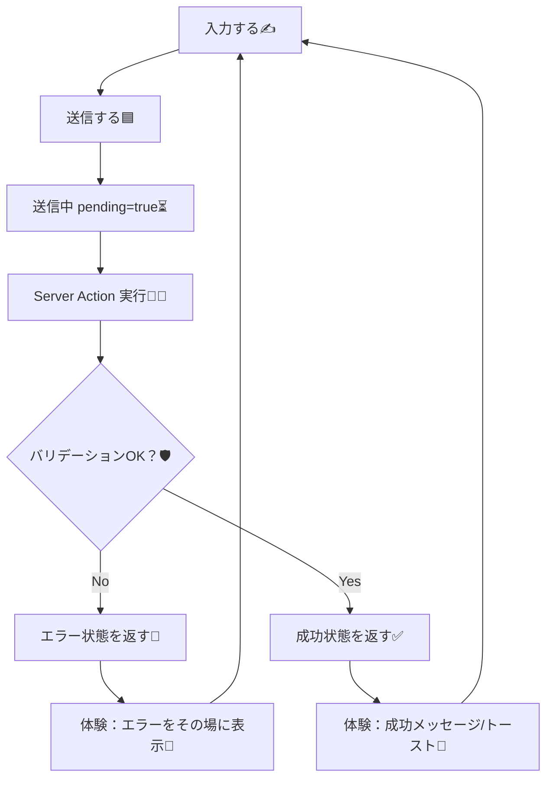
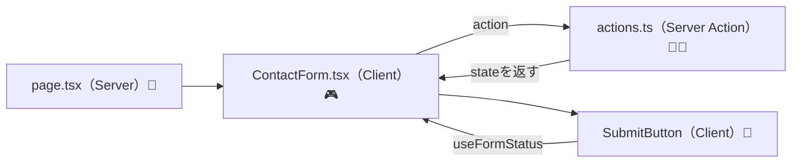
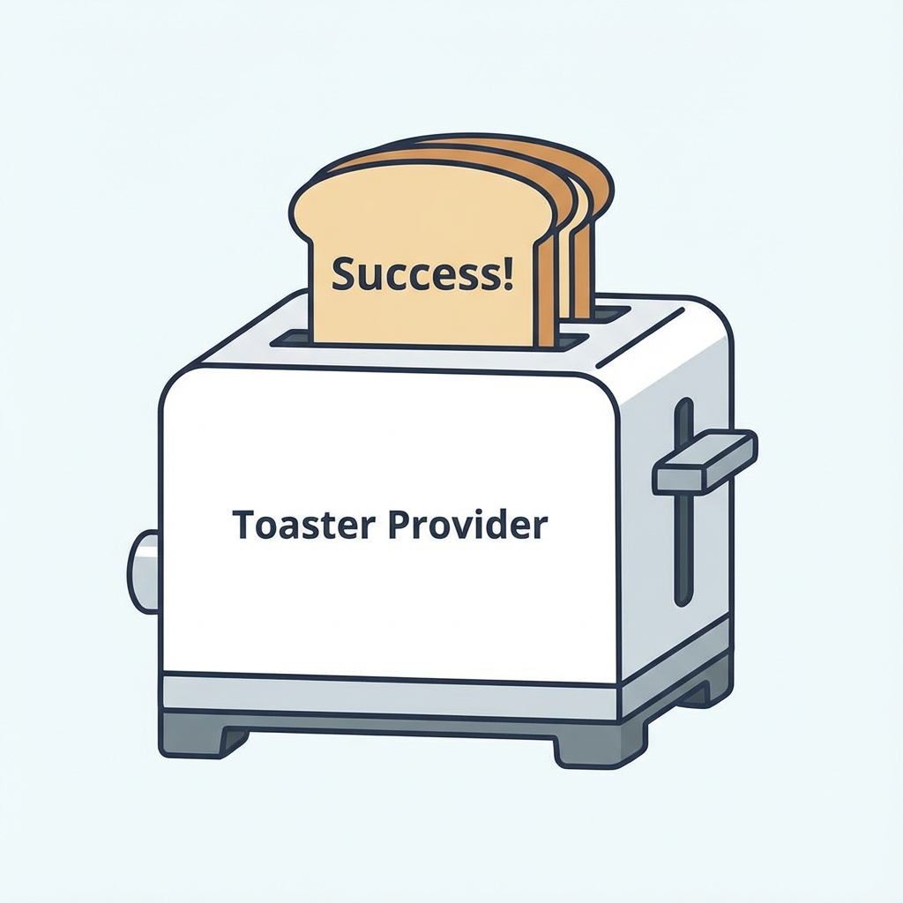

# 第148章：復習：フォームは“状態＋体験”セットで作る🫶

この章は「フォーム、なんとなく動いた！」から一段上がって、**“気持ちよく使えるフォーム”**に仕上げる復習回だよ〜☺️🌸

---

## 今日のゴール🎯✨

フォームを作るときに、毎回この2つをセットで考えられるようになること👇

* **状態（State）**：今なにが起きてる？（入力、送信中、成功、失敗…）🧠
* **体験（UX）**：ユーザーが気持ちよく使える？（待てる、迷わない、安心する…）🫶

---

## 1) フォームの「状態」ってなに？🧠🧩

最低限これだけは持っておくと強いよ〜👇

* 入力値（name/email/message…）✍️
* 送信中か（pending）⏳
* 成功したか（ok）✅
* エラー（全体 or フィールドごと）🧯
* 成功/失敗メッセージ（画面に出す用）💬

React 19 の `useActionState` を使うと、**Server Actionの戻り値（状態）をそのまま受け取れる**のが超便利だよ✨ ([React][1])

---

## 2) フォームの「体験」ってなに？🫶🎀

状態があっても、体験が弱いとこうなりがち👇😵‍💫

* 送信してるのか分からない（無限に連打）🖱️🖱️🖱️
* どこが間違いか分からない（イラッ）😠
* 成功したのに「成功した？」って不安（信用できない）🥺

なので、体験としてはこういうのをセットで作るのがおすすめ👇

* 送信中はボタンを無効化＆文言を変える（例：送信中…）⏳
* エラーは**その場**に出す（フィールドの下が最強）👀
* 成功時はメッセージで安心させる（できれば自動で消える）🎉
* 入力はできるだけ維持（でも成功時はリセットしたい時もある）🧼

---

## 図解：フォームの「状態→体験」フロー🧾➡️🫶




---

## 3) 2025の王道：`<form action={...}>` + Server Actions 🍵✨

Next.js のガイドでも、**`<form>` の `action` に Server Actions を渡す**のが基本ルートになってるよ🧾✨ ([Next.js][2])

* Server Action（サーバーで動く関数）には `"use server"` を付ける🧑‍🍳 ([Next.js][3])
* フォーム送信は裏側で POST になって、安全にサーバー処理へ行ける🛰️ ([Next.js][3])
* 送信状態は `useFormStatus` でフォーム内から取れる（props渡し地獄から解放）🎁✨ ([React][4])

---

## 図解：コンポーネント構成のイメージ🧱✨



---

# 4) ミニ実装：復習用「お問い合わせフォーム」作ろう📮🌸

## 作るファイル📁✨

* `app/ch148-form/page.tsx`
* `app/ch148-form/ContactForm.tsx`
* `app/ch148-form/actions.ts`

---

## (1) Server Action：状態を返す（成功/失敗/フィールドエラー）🧑‍🍳🧯

```ts
// app/ch148-form/actions.ts
'use server'

export type ActionState = {
  ok: boolean
  message: string
  fieldErrors?: {
    name?: string
    email?: string
    body?: string
  }
}

const initialState: ActionState = { ok: false, message: '' }
export { initialState }

function isEmailLike(v: string) {
  return /^[^\s@]+@[^\s@]+\.[^\s@]+$/.test(v)
}

export async function sendContact(prev: ActionState, formData: FormData): Promise<ActionState> {
  const name = String(formData.get('name') ?? '').trim()
  const email = String(formData.get('email') ?? '').trim()
  const body = String(formData.get('body') ?? '').trim()

  const fieldErrors: NonNullable<ActionState['fieldErrors']> = {}

  if (name.length === 0) fieldErrors.name = 'お名前は必須だよ〜🥺'
  if (email.length === 0) fieldErrors.email = 'メールは必須だよ〜📩'
  else if (!isEmailLike(email)) fieldErrors.email = 'メールの形がちょっと変かも…？😵'
  if (body.length < 10) fieldErrors.body = '本文は10文字以上あると安心✨'

  if (Object.keys(fieldErrors).length > 0) {
    return { ok: false, message: '入力をチェックしてね🧯', fieldErrors }
  }

  // 本来はここでDB保存やメール送信などをするよ📦📨
  // 今回は「成功体験」用にメッセージだけ返す🎉
  return { ok: true, message: '送信ありがとう〜！ちゃんと受け取ったよ🎉' }
}
```

ポイント：`useActionState` を使う時、アクション関数は **(prevState, formData)** みたいに「前の状態」を最初に受け取る形になるよ🧠 ([React][1])

---

## (2) Client Form：状態をUI（体験）に変換する🎮➡️🫶




```tsx
// app/ch148-form/ContactForm.tsx
'use client'

import { useActionState, useEffect, useState } from 'react'
import { useFormStatus } from 'react-dom'
import { initialState, sendContact, type ActionState } from './actions'

function SubmitButton() {
  const { pending } = useFormStatus()
  return (
    <button type="submit" disabled={pending} style={{ padding: 10, borderRadius: 8 }}>
      {pending ? '送信中…⏳' : '送信する📮'}
    </button>
  )
}

export default function ContactForm() {
  const [state, formAction] = useActionState(sendContact, initialState)

  // “体験”として：成功/失敗メッセージを少ししたら消す（軽トースト風）🍞✨
  const [toast, setToast] = useState<ActionState | null>(null)

  useEffect(() => {
    if (!state.message) return
    setToast(state)
    const t = setTimeout(() => setToast(null), 2500)
    return () => clearTimeout(t)
  }, [state])

  const fe = state.fieldErrors ?? {}

  return (
    <div style={{ maxWidth: 520, display: 'grid', gap: 12 }}>
      <h1>第148章フォーム復習📮✨</h1>

      {toast && (
        <div
          aria-live="polite"
          style={{
            padding: 12,
            borderRadius: 10,
            border: '1px solid #ddd',
            background: toast.ok ? '#f4fff7' : '#fff4f4',
          }}
        >
          {toast.ok ? '✅ ' : '🧯 '}
          {toast.message}
        </div>
      )}

      <form action={formAction} style={{ display: 'grid', gap: 10 }}>
        <label style={{ display: 'grid', gap: 6 }}>
          <span>お名前🧑‍🎓</span>
          <input name="name" placeholder="例）さくら" style={{ padding: 10, borderRadius: 8 }} />
          {fe.name && <small style={{ color: '#b00020' }}>{fe.name}</small>}
        </label>

        <label style={{ display: 'grid', gap: 6 }}>
          <span>メール📩</span>
          <input name="email" placeholder="example@mail.com" style={{ padding: 10, borderRadius: 8 }} />
          {fe.email && <small style={{ color: '#b00020' }}>{fe.email}</small>}
        </label>

        <label style={{ display: 'grid', gap: 6 }}>
          <span>本文📝</span>
          <textarea name="body" rows={5} placeholder="10文字以上でお願い🙏" style={{ padding: 10, borderRadius: 8 }} />
          {fe.body && <small style={{ color: '#b00020' }}>{fe.body}</small>}
        </label>

        <SubmitButton />
      </form>

      <p style={{ opacity: 0.8 }}>
        💡コツ：<b>エラーは“その場”</b>、送信中は<b>待てるUI</b>、成功は<b>安心できるメッセージ</b>✨
      </p>
    </div>
  )
}
```

* `useFormStatus()` はフォーム内部の送信中状態（pending）を取れて便利だよ〜✨ ([React][4])
* 「状態」を受け取って、「体験」に落とし込む（disabled / エラー表示 / 成功メッセージ）って感じ🫶

---

## (3) ページ：Server → Client を置くだけ🧊➡️🎮

```tsx
// app/ch148-form/page.tsx
import ContactForm from './ContactForm'

export default function Page() {
  return (
    <main style={{ padding: 24 }}>
      <ContactForm />
    </main>
  )
}
```

---

## (4) 起動して確認✅🌈

VS Code のターミナル（PowerShellでOK）で👇

```bash
npm run dev
```

ブラウザで👇

* `http://localhost:3000/ch148-form`

---

# 5) 第148章まとめ：フォームの黄金チェックリスト✅🫶

作るたびにこれ見て〜✨

* [ ] 送信中が分かる？（ボタン文言＆disabled）⏳
* [ ] 連打できない？（二重送信対策）🖱️🚫
* [ ] エラーは「どこがダメ？」が一瞬で分かる？👀🧯
* [ ] 成功したら「成功した！」って安心できる？🎉
* [ ] サーバー側でもバリデーションしてる？🛡️
* [ ] （必要なら）成功後のデータ更新：`revalidatePath` など検討🧊🔁 ([Next.js][5])

---

# 6) ミニ練習（おすすめ）💪🌸

できそうなのから1個でOKだよ〜😊

1. **成功したらフォームを空にする**🧼

   * ヒント：React 19 の `<form action>` は自動リセットの挙動があるけど、状況次第で自前リセットも使うよ✨ ([React][4])

2. **“全体エラー”と“フィールドエラー”を分ける**🧯

   * 例：全体エラー＝「送信に失敗したよ」
   * フィールド＝「メールの形式が違うよ」

3. **楽観的UI（useOptimistic）を体験する**✨

   * 送信した瞬間に「送信済みっぽく見せる」→失敗なら戻す、みたいなやつ🍬 ([React][4])

---

次の章以降でCRUDが広がっていくと、フォームが増えてくるからね📈
第148章の「状態＋体験」の型を持ってると、どのフォームもブレなくなるよ〜🫶✨

[1]: https://react.dev/reference/react/useActionState "useActionState – React"
[2]: https://nextjs.org/docs/app/guides/forms "Guides: Forms | Next.js"
[3]: https://nextjs.org/docs/app/getting-started/updating-data "Getting Started: Updating Data | Next.js"
[4]: https://react.dev/blog/2024/12/05/react-19 "React v19 – React"
[5]: https://nextjs.org/docs/app/api-reference/functions/revalidatePath?utm_source=chatgpt.com "Functions: revalidatePath"
