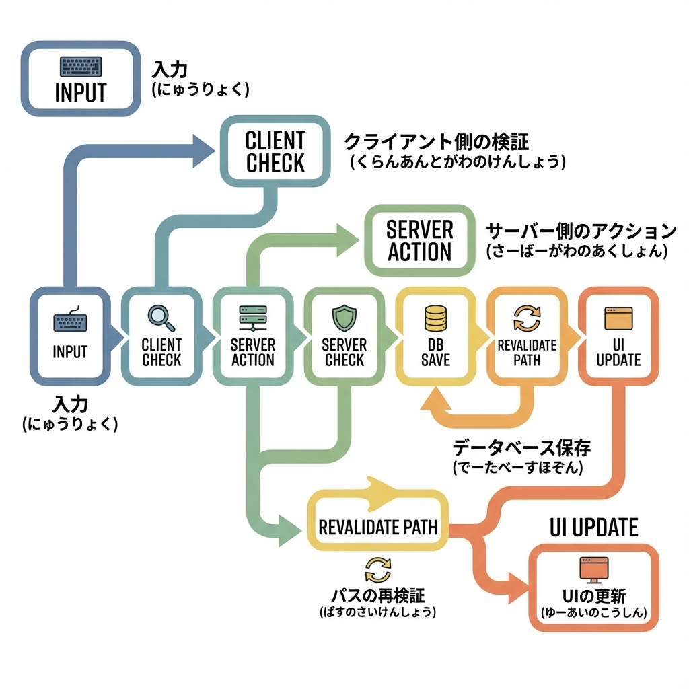
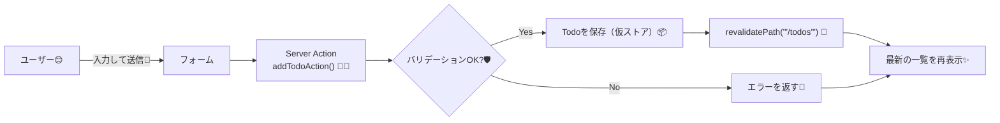

# 第149章：ミニ課題：TODO CRUDのうち「追加」が完成🏗️

この章では、**TODOの「追加」だけ**を、**Server Actions + フォーム**で完成させます😊✨
（保存先はまず“仮ストア”でOK！あとでDBに置き換えられる形にするよ〜🧱）

---

## この章でできるようになること🎯✨

* TODOを入力して **追加できる** ➕
* 空文字や長すぎを **サーバー側でバリデーション** 🛡️
* 送信中はボタンを **押せない＆表示が変わる** ⏳
* 追加後に一覧が **更新されて見える** 🔁✨（`revalidatePath`）

※ `useActionState` は React のフックで、フォーム送信の結果（state）を受け取れます ([React][1])
※ `useFormStatus` は `react-dom` から使って、送信中（pending）を取れます ([React][2])
※ Next.js のフォーム×Server Actions の考え方はこちらのガイドに沿ってます ([Next.js][3])
※ `revalidatePath` は Server Function（Server Action）から呼べます ([Next.js][4])

---

## しくみ図（追加ボタンを押したら何が起きる？）🧠💡





---

## 1) 作るファイルたち📁✨

次の4つを作ります（フォルダはなければ作ってね😉）

* `lib/todoStore.ts`（仮ストア）
* `app/todos/actions.ts`（Server Action）
* `app/todos/AddTodoForm.tsx`（フォーム：Client）
* `app/todos/page.tsx`（一覧表示：Server）

---

## 2) 仮ストア（メモリ保存）を作る📦📝

`lib/todoStore.ts` を作って、これを貼り付けてね👇
（※開発中の練習用！サーバー再起動で消えるよ。でも今はそれでOK😊）

```ts
export type Todo = {
  id: string;
  title: string;
  createdAt: number;
};

const g = globalThis as unknown as { __todoStore?: Todo[] };

// HMR（開発中の自動更新）でもなるべく残るように globalThis に置く
const todos = g.__todoStore ?? (g.__todoStore = []);

export function getTodos(): Todo[] {
  // 新しい順にして返す
  return [...todos].sort((a, b) => b.createdAt - a.createdAt);
}

export function addTodo(title: string): Todo {
  const todo: Todo = {
    id: crypto.randomUUID(),
    title,
    createdAt: Date.now(),
  };
  todos.push(todo);
  return todo;
}
```

---

## 3) Server Action（追加処理）を作る🧑‍🍳➕

`app/todos/actions.ts` を作って、これ👇

ポイントはここ💡

* ファイル先頭に `"use server"`
* **1個目の引数が prevState**（`useActionState` 用） ([React][1])
* 追加後に `revalidatePath("/todos")` 🔁 ([Next.js][4])

```ts
"use server";

import { addTodo } from "@/lib/todoStore";
import { revalidatePath } from "next/cache";

export type AddTodoState = {
  ok: boolean;
  message: string;
  fieldErrors?: { title?: string };
};

export const initialState: AddTodoState = {
  ok: false,
  message: "",
};

export async function addTodoAction(
  prevState: AddTodoState,
  formData: FormData
): Promise<AddTodoState> {
  const title = String(formData.get("title") ?? "").trim();

  // ✅ サーバー側バリデーション（絶対やる🛡️）
  if (!title) {
    return {
      ok: false,
      message: "タイトルが空だよ〜🥺",
      fieldErrors: { title: "何か文字を入れてね🙏" },
    };
  }

  if (title.length > 50) {
    return {
      ok: false,
      message: "ちょっと長いかも！50文字までにしてね✂️",
      fieldErrors: { title: "50文字までだよ〜🙂" },
    };
  }

  addTodo(title);

  // ✅ 一覧ページを更新（キャッシュを無効化して最新を出す）
  revalidatePath("/todos");

  return {
    ok: true,
    message: "追加できたよ🎉",
  };
}
```

---

## 4) フォーム（Client Component）を作る📮✨

`app/todos/AddTodoForm.tsx` を作ってね👇
送信中の表示は `useFormStatus()` で作るよ〜⏳ ([React][2])

```tsx
"use client";

import { useEffect, useRef } from "react";
import { useActionState } from "react";
import { useFormStatus } from "react-dom";
import { addTodoAction, initialState } from "./actions";

function SubmitButton() {
  const { pending } = useFormStatus();

  return (
    <button
      type="submit"
      disabled={pending}
      style={{
        padding: "10px 14px",
        borderRadius: 10,
        border: "1px solid #ccc",
        cursor: pending ? "not-allowed" : "pointer",
        fontWeight: 700,
      }}
    >
      {pending ? "追加中…⏳" : "追加➕"}
    </button>
  );
}

export default function AddTodoForm() {
  const [state, formAction] = useActionState(addTodoAction, initialState);
  const formRef = useRef<HTMLFormElement>(null);

  // ✅ 成功したら入力欄をリセット
  useEffect(() => {
    if (state.ok) formRef.current?.reset();
  }, [state.ok]);

  return (
    <form
      ref={formRef}
      action={formAction}
      style={{
        display: "grid",
        gap: 10,
        padding: 14,
        border: "1px solid #eee",
        borderRadius: 12,
      }}
    >
      <label style={{ display: "grid", gap: 6 }}>
        <span style={{ fontWeight: 700 }}>やること📝</span>
        <input
          name="title"
          placeholder="例：レポート出す📄"
          aria-invalid={state.fieldErrors?.title ? true : undefined}
          style={{
            padding: 10,
            borderRadius: 10,
            border: "1px solid #ccc",
          }}
        />
      </label>

      {state.fieldErrors?.title && (
        <p style={{ margin: 0, color: "crimson" }}>
          {state.fieldErrors.title}
        </p>
      )}

      {state.message && (
        <p
          aria-live="polite"
          style={{
            margin: 0,
            color: state.ok ? "green" : "crimson",
            fontWeight: 700,
          }}
        >
          {state.message}
        </p>
      )}

      <SubmitButton />
    </form>
  );
}
```

---

## 5) `/todos` ページ（一覧表示）を作る📄✨

`app/todos/page.tsx` を作って、これ👇
ここは **Server Component** のままでOKだよ😊

```tsx
import AddTodoForm from "./AddTodoForm";
import { getTodos } from "@/lib/todoStore";

export default function TodosPage() {
  const todos = getTodos();

  return (
    <main style={{ maxWidth: 720, margin: "40px auto", padding: 16 }}>
      <h1 style={{ fontSize: 28, fontWeight: 900, margin: 0 }}>
        TODO（追加できる版）📝✨
      </h1>

      <p style={{ opacity: 0.75 }}>
        下のフォームから追加してみてね😊（空はNG！）
      </p>

      <section style={{ marginTop: 16 }}>
        <AddTodoForm />
      </section>

      <hr style={{ margin: "24px 0" }} />

      <section>
        <h2 style={{ fontSize: 18, fontWeight: 900 }}>いまのTODO📌</h2>

        {todos.length === 0 ? (
          <p style={{ marginTop: 12 }}>
            まだ何もないよ〜😊 まず1つ追加してみよ！
          </p>
        ) : (
          <ul style={{ marginTop: 12, paddingLeft: 18 }}>
            {todos.map((t) => (
              <li key={t.id} style={{ marginBottom: 8 }}>
                {t.title}{" "}
                <span style={{ opacity: 0.6, fontSize: 12 }}>
                  ({new Date(t.createdAt).toLocaleString("ja-JP")})
                </span>
              </li>
            ))}
          </ul>
        )}
      </section>
    </main>
  );
}
```

---

## 6) 動作チェック✅🎉

1. `npm run dev` で起動🚀
2. ブラウザで `http://localhost:3000/todos` を開く🌈
3. 追加してみる➕

   * 空で送る → エラー🥺
   * ちゃんと入れる → 追加🎉
   * 送信中 → ボタンが「追加中…⏳」になる

---

## よくあるつまずきポイント🪤（ここ見ればだいたい勝てる✌️）

* **フォームが動かない**
  → `AddTodoForm.tsx` の先頭に `"use client"` がある？（超大事！）
* **pending がずっと false**
  → `useFormStatus()` を呼んでるコンポーネントが `<form>` の“中”にいる？ ([React][2])
* **追加しても一覧が変わらない**
  → `revalidatePath("/todos")` のパスがページと一致してる？ ([Next.js][4])
* **`@/` が解決できない**
  → `import ... from "@/..."` を相対パスに直してOK！（環境で違うときある🙂）

---

## ミニ挑戦（できたら強い💪✨）※追加だけの範囲でOK！

* 入力が成功したら、メッセージを **3秒後に消す** ⏲️
* 50文字じゃなく **30文字制限** にしてみる✂️
* プレースホルダーを自分好みにする🎀

---

これで **TODOの「追加」完成〜！** 🎉📝
次のCRUD（編集・削除）に広げる土台が、もうできてるよ😉✨

[1]: https://react.dev/reference/react/useActionState "useActionState – React"
[2]: https://react.dev/reference/react-dom/hooks/useFormStatus "useFormStatus – React"
[3]: https://nextjs.org/docs/app/guides/forms "Guides: Forms | Next.js"
[4]: https://nextjs.org/docs/app/api-reference/functions/revalidatePath "Functions: revalidatePath | Next.js"
