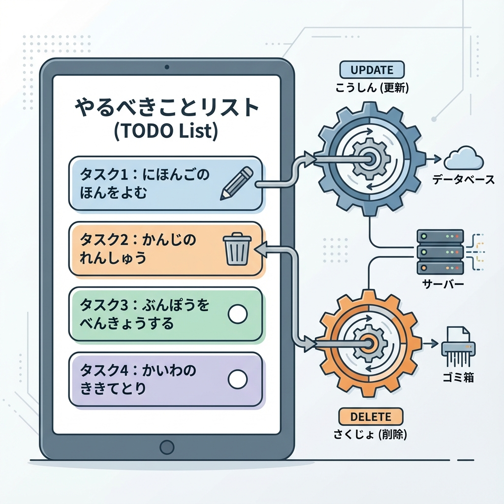
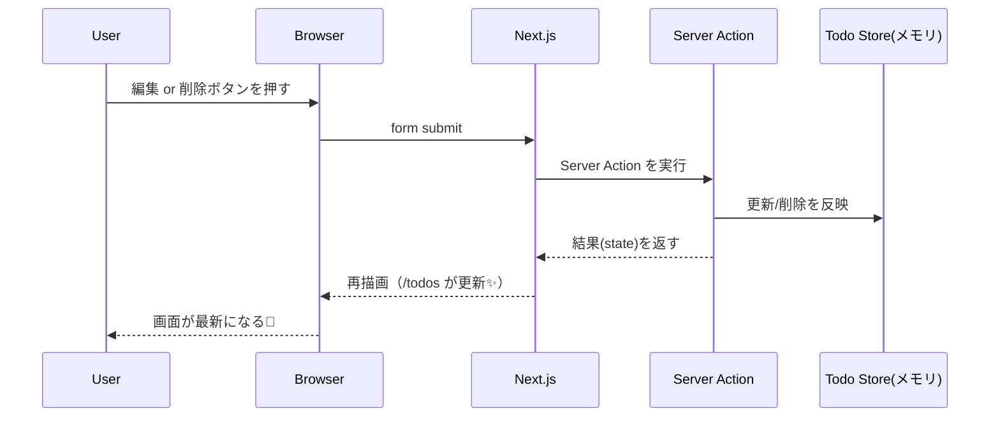
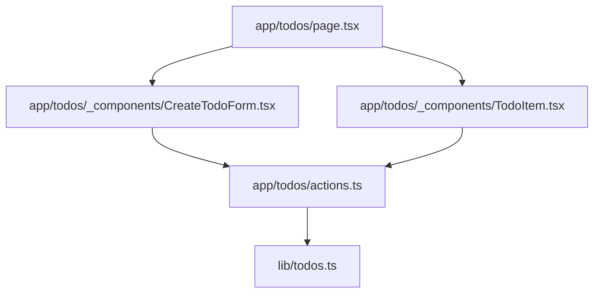
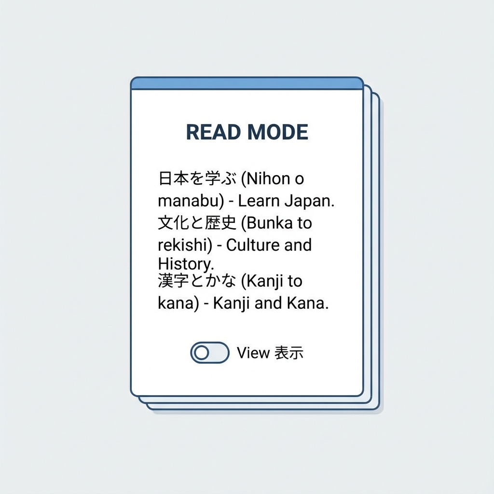

# 第150章：ミニ課題：編集・削除にもActionsを広げる✏️🗑️

今回は、**Server Actionsで「編集」「削除」まで**できるようにして、TODOを「ちゃんとCRUDっぽく」仕上げるよ〜！🥳💪
（※DBはまだ入れない想定なので、今回は**メモリ保存**で学習します🧠✨）

---

## 今日のゴール🎯✨

* ✅ TODOを**編集（Update）**できる
* ✅ TODOを**削除（Delete）**できる
* ✅ 送信中はボタンが**押せない**（二重送信防止）🖱️🚫
* ✅ 失敗したら**優しくエラー表示**🧯💕

---

## 全体の流れ（図解）🧭✨





---

## フォルダ構成（今回の完成形）📁✨



---

## 1) メモリ保存の「仮TODOストア」を作る🧠📦

> これは学習用だよ！本番では次のDB章でちゃんと永続化するよ〜🗃️✨

**`lib/todos.ts`** を作ってね👇

```ts
export type Todo = { id: string; title: string; createdAt: number };

declare global {
  // eslint-disable-next-line no-var
  var __todos: Todo[] | undefined;
}

const getStore = (): Todo[] => {
  if (!globalThis.__todos) globalThis.__todos = [];
  return globalThis.__todos;
};

export function listTodos(): Todo[] {
  return [...getStore()].sort((a, b) => b.createdAt - a.createdAt);
}

export function createTodo(title: string): Todo {
  const todo: Todo = { id: crypto.randomUUID(), title, createdAt: Date.now() };
  getStore().push(todo);
  return todo;
}

export function updateTodo(id: string, title: string): Todo | null {
  const store = getStore();
  const t = store.find((x) => x.id === id);
  if (!t) return null;
  t.title = title;
  return t;
}

export function removeTodo(id: string): boolean {
  const store = getStore();
  const before = store.length;
  globalThis.__todos = store.filter((x) => x.id !== id);
  return globalThis.__todos.length !== before;
}
```

---

## 2) Server Actions（追加・編集・削除）を用意する🧑‍🍳✨

**`app/todos/actions.ts`** を作ってね👇
（ここが今回のメイン！✏️🗑️✨）

```ts
"use server";

import { createTodo, updateTodo, removeTodo } from "@/lib/todos";
import { revalidatePath } from "next/cache";

export type TodoActionState = {
  ok: boolean;
  message?: string;
  fieldErrors?: { title?: string };
};

const normalizeTitle = (v: unknown) => String(v ?? "").trim();

export async function addTodoAction(
  _prevState: TodoActionState,
  formData: FormData
): Promise<TodoActionState> {
  const title = normalizeTitle(formData.get("title"));

  if (title.length === 0) {
    return { ok: false, fieldErrors: { title: "空っぽはダメだよ〜🥺" } };
  }
  if (title.length > 60) {
    return { ok: false, fieldErrors: { title: "ちょい長いかも！60文字以内で✨" } };
  }

  createTodo(title);
  revalidatePath("/todos");
  return { ok: true, message: "追加できたよ🎉" };
}

export async function updateTodoAction(
  _prevState: TodoActionState,
  formData: FormData
): Promise<TodoActionState> {
  const id = String(formData.get("id") ?? "");
  const title = normalizeTitle(formData.get("title"));

  if (!id) return { ok: false, message: "IDが見つからないよ…🫠" };
  if (title.length === 0) {
    return { ok: false, fieldErrors: { title: "空っぽはダメだよ〜🥺" } };
  }
  if (title.length > 60) {
    return { ok: false, fieldErrors: { title: "ちょい長いかも！60文字以内で✨" } };
  }

  const updated = updateTodo(id, title);
  if (!updated) return { ok: false, message: "そのTODOが見つからない…🫥" };

  revalidatePath("/todos");
  return { ok: true, message: "更新できたよ✏️✨" };
}

export async function deleteTodoAction(formData: FormData): Promise<void> {
  const id = String(formData.get("id") ?? "");
  if (!id) return;

  removeTodo(id);
  revalidatePath("/todos");
}
```

---

## 3) 画面：/todos ページを作る📝✨

**`app/todos/page.tsx`** を作ってね👇

```tsx
import { listTodos } from "@/lib/todos";
import CreateTodoForm from "./_components/CreateTodoForm";
import TodoItem from "./_components/TodoItem";

export default function TodosPage() {
  const todos = listTodos();

  return (
    <main style={{ padding: 24, maxWidth: 720, margin: "0 auto" }}>
      <h1>TODO 📝</h1>
      <p>Server Actionsで 追加・編集・削除までやっちゃうよ〜✨</p>

      <CreateTodoForm />

      <ul style={{ listStyle: "none", padding: 0, marginTop: 16 }}>
        {todos.map((t) => (
          <li
            key={t.id}
            style={{
              border: "1px solid #ddd",
              borderRadius: 12,
              padding: 12,
              marginBottom: 12,
            }}
          >
            <TodoItem todo={t} />
          </li>
        ))}
      </ul>
    </main>
  );
}
```

---

## 4) 追加フォーム（useActionStateで優しく）➕💕

**`app/todos/_components/CreateTodoForm.tsx`**

```tsx
"use client";

import { useActionState } from "react";
import { addTodoAction, type TodoActionState } from "../actions";
import SubmitButton from "./SubmitButton";

const initialState: TodoActionState = { ok: false };

export default function CreateTodoForm() {
  const [state, action] = useActionState(addTodoAction, initialState);

  return (
    <form action={action} style={{ display: "flex", gap: 8, alignItems: "flex-start" }}>
      <div style={{ flex: 1 }}>
        <input
          name="title"
          placeholder="TODOを入力…✍️"
          aria-label="todo title"
          style={{ width: "100%", padding: 10, borderRadius: 10, border: "1px solid #ccc" }}
        />

        {state.fieldErrors?.title && (
          <p style={{ marginTop: 6, color: "crimson" }}>{state.fieldErrors.title}</p>
        )}

        {state.message && (
          <p style={{ marginTop: 6, color: state.ok ? "green" : "crimson" }}>{state.message}</p>
        )}
      </div>

      <SubmitButton label="追加➕" pendingLabel="追加中…⏳" />
    </form>
  );
}
```

---

## 5) 送信中ボタン（useFormStatus）⏳🔒

**`app/todos/_components/SubmitButton.tsx`**

```tsx
"use client";

import { useFormStatus } from "react-dom";

export default function SubmitButton({
  label,
  pendingLabel,
  danger,
}: {
  label: string;
  pendingLabel: string;
  danger?: boolean;
}) {
  const { pending } = useFormStatus();

  return (
    <button
      type="submit"
      disabled={pending}
      style={{
        padding: "10px 14px",
        borderRadius: 10,
        border: "1px solid #ccc",
        background: danger ? "#ffe5e5" : "#f6f6f6",
        cursor: pending ? "not-allowed" : "pointer",
      }}
    >
      {pending ? pendingLabel : label}
    </button>
  );
}
```

---

## 6) 各TODOの「編集＆削除」UIを作る✏️🗑️✨（ここが本題！）




**`app/todos/_components/TodoItem.tsx`**

```tsx
"use client";

import { useEffect, useRef, useState } from "react";
import { useActionState } from "react";
import type { Todo } from "@/lib/todos";
import { updateTodoAction, type TodoActionState, deleteTodoAction } from "../actions";
import SubmitButton from "./SubmitButton";

const initialState: TodoActionState = { ok: false };

export default function TodoItem({ todo }: { todo: Todo }) {
  const [isEditing, setIsEditing] = useState(false);

  const [state, updateAction] = useActionState(updateTodoAction, initialState);

  // 「成功した瞬間だけ」編集モードを閉じる用（連続編集でも困らない✨）
  const prevOkRef = useRef(false);
  useEffect(() => {
    if (!prevOkRef.current && state.ok) setIsEditing(false);
    prevOkRef.current = state.ok;
  }, [state.ok]);

  return (
    <div style={{ display: "grid", gap: 10 }}>
      {!isEditing ? (
        <div style={{ display: "flex", gap: 8, alignItems: "center", justifyContent: "space-between" }}>
          <span style={{ fontSize: 16 }}>{todo.title}</span>

          <div style={{ display: "flex", gap: 8 }}>
            <button
              type="button"
              onClick={() => setIsEditing(true)}
              style={{
                padding: "8px 12px",
                borderRadius: 10,
                border: "1px solid #ccc",
                background: "#f6f6f6",
                cursor: "pointer",
              }}
            >
              編集✏️
            </button>

            <form action={deleteTodoAction}>
              <input type="hidden" name="id" value={todo.id} />
              <SubmitButton label="削除🗑️" pendingLabel="削除中…⏳" danger />
            </form>
          </div>
        </div>
      ) : (
        <form action={updateAction} style={{ display: "grid", gap: 8 }}>
          <input type="hidden" name="id" value={todo.id} />

          <input
            name="title"
            defaultValue={todo.title}
            style={{ width: "100%", padding: 10, borderRadius: 10, border: "1px solid #ccc" }}
          />

          {state.fieldErrors?.title && <p style={{ marginTop: -2, color: "crimson" }}>{state.fieldErrors.title}</p>}
          {state.message && (
            <p style={{ marginTop: -2, color: state.ok ? "green" : "crimson" }}>{state.message}</p>
          )}

          <div style={{ display: "flex", gap: 8 }}>
            <SubmitButton label="保存💾" pendingLabel="保存中…⏳" />
            <button
              type="button"
              onClick={() => setIsEditing(false)}
              style={{
                padding: "10px 14px",
                borderRadius: 10,
                border: "1px solid #ccc",
                background: "#f6f6f6",
                cursor: "pointer",
              }}
            >
              キャンセル🙅‍♀️
            </button>
          </div>
        </form>
      )}

      <small style={{ opacity: 0.7 }}>id: {todo.id.slice(0, 8)}…</small>
    </div>
  );
}
```

---

## 動作確認✅✨（Windows）

1. ターミナルで起動🏃‍♀️💨

   ```bash
   npm run dev
   ```
2. ブラウザで開く🌐
   `http://localhost:3000/todos`
3. ✅ 追加 ➕
4. ✅ 編集 ✏️ → 保存 💾
5. ✅ 削除 🗑️（削除中…が出るよ⏳）

---

## よくあるハマり🪤😵‍💫

* **`<button>` の type を書かないと submit になる**ことがあるよ！
  → 編集開始ボタンは `type="button"` にしてあるのがポイント✅
* Server Actionsは**ブラウザAPI（window等）触れない**よ〜🚫🌐
* 今回のストアは**メモリ**だから、サーバー再起動で消えるよ🫠（学習用！）

---

## ミニ課題🎓✨（やってみて！）

1. **削除に確認を入れてみよう**🗑️⚠️

* 「本当に消す？」を `confirm()` で出したい
* でも `confirm()` はブラウザAPIなので**Client側で**やる必要あり！
  ヒント：削除フォームの `onSubmit` で止める🖱️✨

2. **編集時に“未入力なら保存ボタン無効”**にしてみよう✏️🚫

* `onChange` で入力を見て、空なら保存できないようにする（Client側）

3. （余裕あれば💪）**編集をモーダル風**にしてみよう🪄✨

* 画面の上にふわっと編集フォームを出すイメージ！

---

これで **Server Actionsで「追加・編集・削除」まで完走🎉**だよ〜！
次のDB章に行く前の「手応え」めっちゃ大事なので、ぜひ触って遊んでね🥰🫶✨
