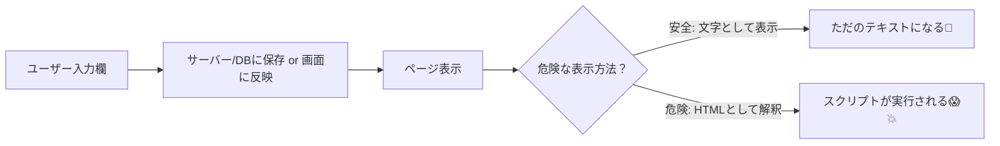

# 第151章：XSSってなに？（ユーザー入力は信用しない）🧨

## この章でわかること🎯

* XSS（クロスサイト・スクリプティング）って何が怖いの？😱
* 「ユーザー入力」をそのまま画面に出すと何が起きる？💥
* Next.js（React）で**安全に表示する基本ルール**✅

---

## まず結論（今日の合言葉）🔑✨

**「ユーザー入力は信用しない」**
たとえ悪気のない入力でも、**攻撃用の文字列**が混ざる前提で作ろうね🧸🛡️

---

## XSSってなに？🧨

**XSS = 悪い人が“入力欄”にスクリプト（JavaScript）を仕込んで、あなたのページ上で動かす攻撃**だよ💣

たとえば、コメント欄や検索欄に変な文字列を入れられて、ページ上で実行されちゃう…みたいな感じ😵‍💫

---

## 何が起きるの？（被害イメージ）😱🍪

XSSが起きると、例えばこんなことがされる可能性があるよ👇

* ログイン状態の情報（Cookieなど）を盗まれるかも🍪💦
* 勝手に操作（投稿、購入、設定変更）されるかも🤖🖱️
* 偽フォームを表示してパスワードを入力させる、など🎣😨

---

## XSSが起きる流れ（図でイメージ）🧠📌




---

## ありがちな誤解🤔

### ✅ Reactは基本“安全寄り”だよ🫶

React（JSX）は、普通にこう表示する限り **基本的に文字列をエスケープ**してくれるよ✨

例：コメントを普通に表示（基本OK）👇

```tsx
export default function Page() {
  const comment = '';
  return <p>{comment}</p>; // これは「文字」として表示される（基本OK）
}
```

この場合、ブラウザは「HTMLとして実行」じゃなくて「文字として表示」になることが多いよ😊

---

## でも…ここからが危ないゾーン😱（XSSが起きやすい場所）

### ☠️ 危険その1：`dangerouslySetInnerHTML` を使う

名前からして危険そうでしょ🙅‍♀️💦
**“この文字列をHTMLとして解釈してね”**って頼む機能だよ。

ダメな例（XSSになりやすい）👇

```tsx
// app/xss-demo/page.tsx
export default async function Page({
  searchParams,
}: {
  searchParams: Promise<{ q?: string }>;
}) {
  const { q: rawQ } = await searchParams;
  const q = rawQ ?? "";

  return (
    <main>
      <h1>XSSデモ（危険例）😱</h1>

      {/* これは危険：ユーザー入力をHTMLとして解釈させてる */}
      <div dangerouslySetInnerHTML={{ __html: q }} />
    </main>
  );
}
```

例えば URL の `?q=` に、攻撃っぽい文字列を入れられると…💥
（例）`` みたいなものが実行される可能性があるよ😨

---

## 安全な書き方（まずはこれでOK）✅💞

### ✅ ルール：ユーザー入力は“文字として”表示する

```tsx
// app/xss-demo-safe/page.tsx
export default async function Page({
  searchParams,
}: {
  searchParams: Promise<{ q?: string }>;
}) {
  const { q: rawQ } = await searchParams;
  const q = rawQ ?? "";

  return (
    <main>
      <h1>安全な表示例🙂✨</h1>

      {/* OK：文字として表示 */}
      <p>あなたの入力：{q}</p>
    </main>
  );
}
```

---

## 「どうしてもHTMLを表示したい」時は？😵‍💫

たとえば「ブログ本文がHTMLで保存されてる」とかね📝
その場合でも、**ユーザー入力（または外部から来る本文）をそのままHTMLで表示するのはNG**🙅‍♀️

やるなら最低限こう考える感じ👇

* **許可するタグを絞る（allowlist）** 🧼
* **サニタイズ（危険な要素を除去）** 🧽
* できれば**サーバー側でサニタイズしてから保存/返す**🧊

※この章では「まず避ける」がゴールでOKだよ😊（サニタイズ実装は次の章以降で強化しよ💪）

---

## 今日から使える！XSS予防チェックリスト✅🛡️

* [ ] ユーザー入力を **`dangerouslySetInnerHTML` に入れてない？** 🙅‍♀️
* [ ] 入力値をそのまま **HTML文字列として組み立ててない？** 🧱💥
* [ ] 入力値を **URL（`href`）や属性に直入れ**してない？（変なスキーム混入注意）🔗⚠️
* [ ] 「表示は文字として」が基本になってる？🙂

---

## ミニ練習（5分）🧪✨

1. `app/xss-demo-safe/page.tsx` を作って、URLの `?q=` を変えて表示を確認してみよう😊
2. つぎに、同じ内容を `dangerouslySetInnerHTML` で表示するページも作って、違いを見てみよう👀
   （※学習目的だけでね！本番では絶対やらないでね🙅‍♀️💦）

---

## まとめ🎀

* XSSは「入力に混ぜたスクリプトを、ページ上で動かす」攻撃😱
* Reactは基本エスケープしてくれるけど、**HTMLとして解釈させた瞬間に危険度が跳ねる**💥
* 迷ったら：**ユーザー入力は“文字として表示”**🙂🛡️

次の章で、危険な `dangerouslySetInnerHTML` の扱い方をもう一段だけ深掘りしていくよ〜！📘✨
