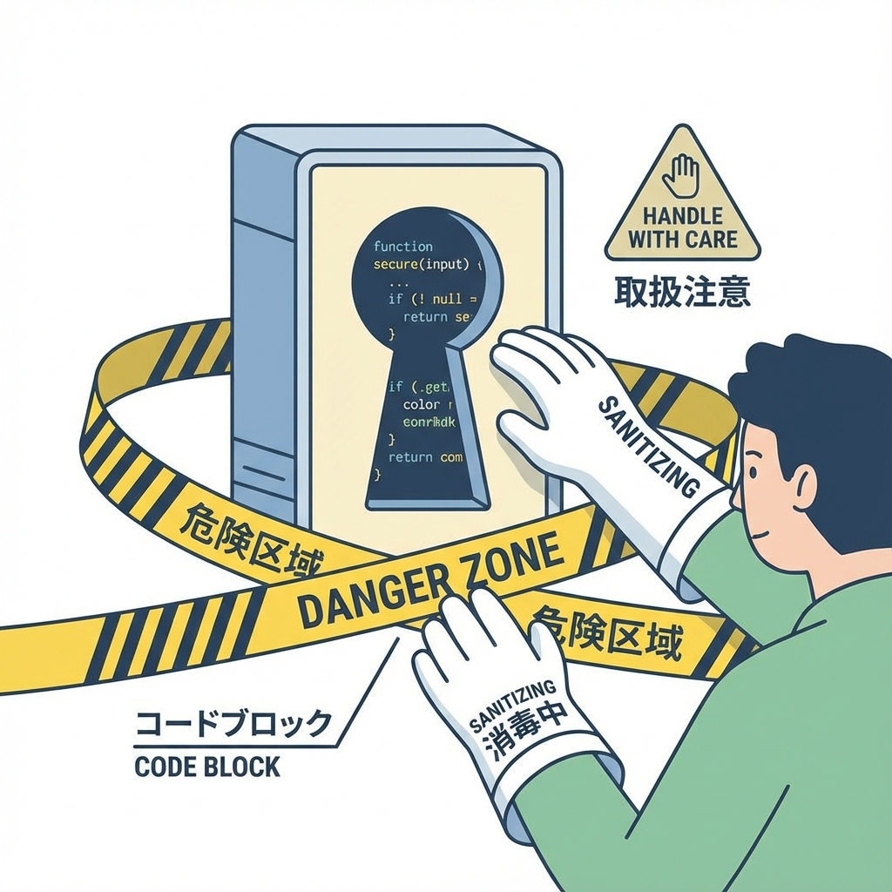

# 第152章：dangerouslySetInnerHTML は最終手段🙅

React（Next.js）には、HTML文字列をそのままDOMに突っ込むための仕組みがあるんだけど…
それが **`dangerouslySetInnerHTML`** だよ😵‍💫💣
名前に “dangerously（危険）” って入ってるの、ガチ理由があるの…！

---

## 1) `dangerouslySetInnerHTML` ってなに？🤔

普通、Reactは **文字列を安全に表示** してくれるよね✨
たとえば `<script>` とか入ってても「ただの文字」として扱う感じ。

でも `dangerouslySetInnerHTML` を使うと、**文字列をHTMLとして解釈して表示**しちゃうの🧨
つまり…悪意あるHTMLが混ざってたら、**XSS** の事故が起きる可能性があるよ😭

---

## 2) どれくらい危ないの？（XSSのイメージ）😱🕷️

XSS（クロスサイトスクリプティング）は、ざっくり言うと…

* 誰かが入力した「文章」に見せかけて
* `<script>` などの悪いコードを混ぜて
* あなたのサイト上で動かしてしまう攻撃

って感じ💥
ログインCookieを盗まれたり、勝手に操作されたり、いろいろヤバいことが起きる😇

---

## 3) 図解：どこで事故る？🧠📨



名前からして危険そうでしょ🙅‍♀️💦```mermaid
flowchart LR
  A["外部から来たHTML文字列<br/>CMS/ユーザー入力/DB"] --> B{"サニタイズした？🧼"}
  B -->|"No 🙅"| C["XSS事故💥<br/>悪意あるscript等が混入"]
  B -->|"Yes ✅"| D["安全寄りのHTML<br/>許可タグだけ残す"]
  D --> E["dangerouslySetInnerHTMLで表示"]
  E --> F["ブラウザに描画🌈"]
```

ポイントはこれ👇
**「dangerouslySetInnerHTMLが悪い」というより、”中身が信用できない”のが一番ヤバい** 😵‍💫

---

## 4) 絶対やっちゃダメ例🙅‍♀️💥（ユーザー入力を直で表示）

```tsx
export default async function Page({ searchParams }: { searchParams: Promise<{ q?: string }> }) {
  const { q } = await searchParams;
  const raw = q ?? ""; // URLから来た文字列（誰でも好きに入れられる）
  return <div dangerouslySetInnerHTML={{ __html: raw }} />;
}
```

これ、URLに `?q=` とか入れられたら…😱
（ブラウザや条件によるけど）**「実行される可能性がある」**のが問題なの💣

---

## 5) まずの代替案：HTMLとして表示しない🙆‍♀️✨

「HTMLを表示したい」って思っても、実は **ただ文章として表示でOK** なこと多いよ📝💕

```tsx
export default function Page() {
  const raw = "<b>太字</b>にしたい！";
  return <p>{raw}</p>; // ただの文字として表示（安全寄り）✅
}
```

---

## 6) どうしても必要なときの王道：サニタイズしてから使う🧼✅

たとえば「CMSの記事本文がHTMLで保存されてる」みたいなときは、現実的に必要なことある🥲
その場合は **サニタイズ（危険な要素を除去）** してから使うのが基本だよ🧼✨

### 6-1) 例：`sanitize-html` をサーバー側で使う（わかりやすい！）🧠🛡️

インストール👇（PowerShell/ターミナルでOK）

```bash
npm i sanitize-html
```

使い方例👇（Server ComponentでもOKな書き方）

```tsx
import sanitizeHtml from "sanitize-html";

export default function Page() {
  const rawHtml =
    `<p>こんにちは🐣</p>
     `;

  const safeHtml = sanitizeHtml(rawHtml, {
    allowedTags: ["p", "b", "strong", "i", "em", "a", "ul", "ol", "li", "br"],
    allowedAttributes: {
      a: ["href", "target", "rel"],
    },
    allowedSchemes: ["http", "https", "mailto"],
  });

  return (
    <article>
      <h1>記事</h1>
      <div dangerouslySetInnerHTML={{ __html: safeHtml }} />
    </article>
  );
}
```

ここ大事👇✨

* **許可するタグを絞る**（これ超重要！）🔒
* `onerror` みたいなイベント属性は **許可しない** 🙅
* `javascript:` みたいな変なURLスキームも **弾く** 🚫

---

## 7) さらに良い選択肢：Markdownから“安全寄りに”表示する📘✨

「記事本文」なら **Markdownで保存して**、表示時にReactでレンダリングする方が安全になりやすいよ😊💕

たとえば `react-markdown` を使う（HTMLは基本エスケープされる設定が多い）などが定番！
※ただし設定次第でHTMLを通せちゃうので、**設定は慎重に**ね⚠️🧠

---

## 8) ミニ練習🎀（3分でOK）

次のどっちが安全寄りか、見分けてみてね👀✨

* A：`<div dangerouslySetInnerHTML={{ __html: userText }} />`
* B：`<p>{userText}</p>`

答え：**B** ✅（文字として表示するだけなので安全寄り）🎉

---

## 9) まとめ💖（覚えるのはこれだけ！）

* `dangerouslySetInnerHTML` は **最終手段** 🙅‍♀️💣
* **ユーザー入力・外部データをそのまま入れない**（事故る）😱
* どうしても使うなら

  * **サニタイズする**🧼✅
  * **許可タグ/属性を最小に絞る**🔒
* 可能なら **Markdown運用** など別ルートに逃げるのが勝ち🏃‍♀️✨

必要なら次は、「じゃあ *どのタグまで許可する？*」とか「Markdown運用にするならどう設計する？」も一緒に決めようね😊🌸
