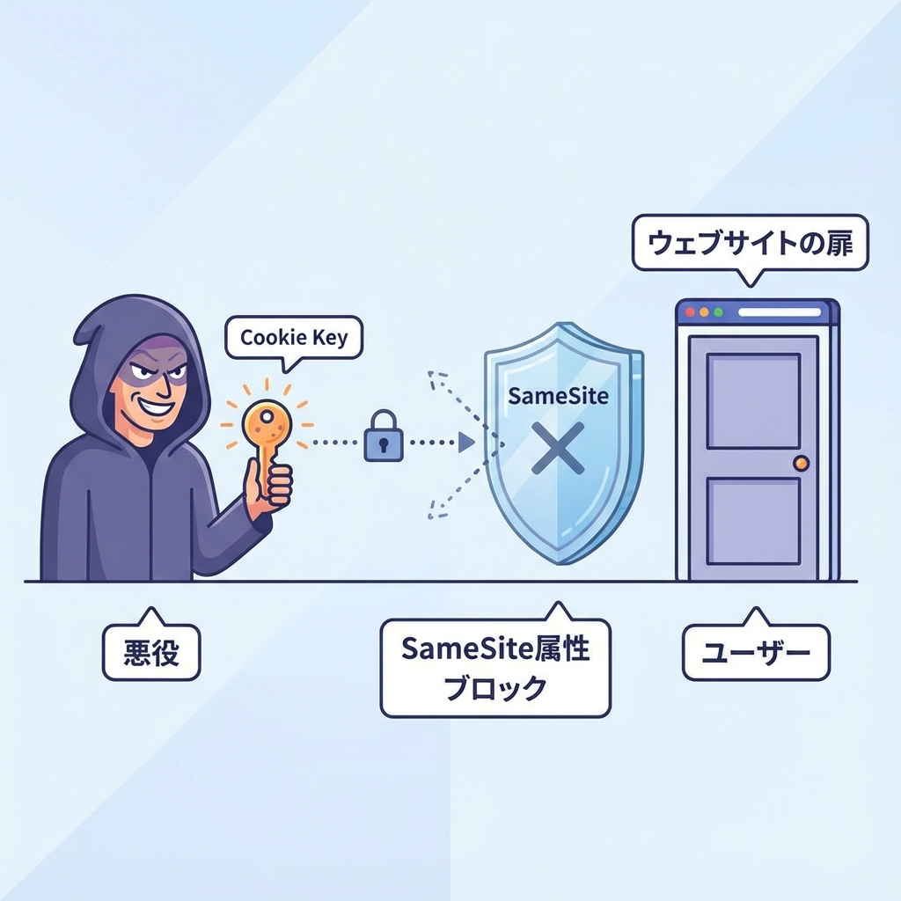
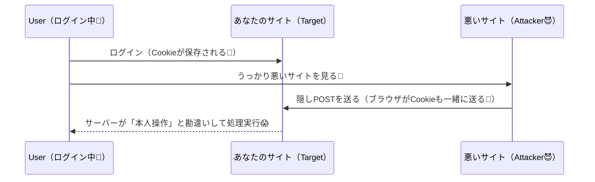
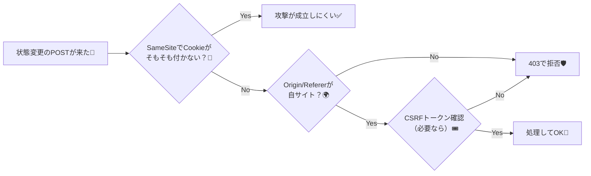

# 第153章：CSRFのざっくり（クッキー認証の時に意識）🍪

## 今日のゴール🎯✨

* CSRFが「どんな事故」なのかをイメージできる👀
* 「クッキー認証のときに特に注意⚠️」な理由がわかる🍪
* Next.jsでの“ざっくり対策セット”を持ち帰れる🧰✅

---

## CSRFってなに？🤔

CSRF（Cross-Site Request Forgery）は、**ログイン中のあなた**を利用して、**別サイトから勝手にリクエストを飛ばされる攻撃**だよ〜😱
ブラウザは「ログイン用クッキー🍪」を自動で送っちゃうことがあるから、サーバーが「本人の操作だ！」って勘違いしやすいのがポイント🥲
（定義イメージはOWASPやMDNがわかりやすいよ）([OWASP Foundation][1])

---

## いつ危ないの？（ここ大事）⚠️🍪

特に危ないのはこんなとき👇

* **ログイン状態をクッキーで持ってる**（セッションCookieなど）🍪
* **“状態が変わる操作”**がある（追加、更新、削除、購入、送金…）🧾💸
* その操作が **外部サイトからでも実行できちゃう形**になってる（対策が薄い）😵

逆に、**表示するだけ（GETで読むだけ）**のAPIは、CSRFというよりは別の論点になりやすいよ（とはいえ設計は大事）📖✨

---

## 図でイメージ！CSRFの典型パターン🧠🧨（Mermaid）





---

## 防ぎ方の基本セット🧰🛡️（Next.js視点も混ぜるよ）

### 1) SameSite Cookie を理解する🍪✨

Cookieには `SameSite` って属性があって、**別サイト由来のリクエストにCookieを付けにくく**できるよ💪

* `Strict`：かなり強い（基本“同一サイト”だけ）🧱
* `Lax`：実用バランス型（多くのCSRFを減らせる）⚖️
* `None`：クロスサイトでも送る（＝CSRF的には弱い）※`Secure`必須になりがち🔓→🔐

MDNも「SameSiteがCSRFの軽減に役立つ」って説明してるよ([MDN Web Docs][2])

---

### 2) Server Actions は“何もしなくてOK”ではないけど、かなり守られてる🛡️✨

Next.jsのガイドでも、Server Actionsは`<form>`から呼べるぶんCSRFの話題が出るけど、**POSTのみ**＆**現代ブラウザのSameSiteデフォルト**などで「多くのケースで防ぎやすい」って整理がされてるよ([Next.js][3])
さらにNext.js側で **`Origin` と `Host`（や `X-Forwarded-Host`）の照合**なども追加防御として触れられてるよ([Next.js][4])

ただし…👇

* `SameSite=None` を使う必要が出た
* 外部ドメインから叩けるAPIを作った
* 古い環境・特殊な構成
  みたいなときは、**追加の対策を検討**しよ〜⚠️

---

### 3) Route Handler（自作API）は自分でガードしよう🚪🧤

Route Handlerは自由度が高いぶん、**自分で“入口チェック”**を入れるのが安心だよ😊
Next.jsでは `headers()` / `cookies()` をRoute Handlerで読めるよ、って公式にも載ってる📌([nextjs.im][5])

#### まず最小：Originチェック（同一オリジン以外は403）🚫

「外部サイトからの“勝手POST”を通しにくくする」第一歩！🛡️

```ts
// app/api/todos/route.ts
import { headers } from "next/headers";

async function isSameOrigin(request: Request) {
  const h = await headers();
  const origin = h.get("origin");
  if (!origin) return false; // Originが無いなら厳しめに落とす（方針でOK）

  const expectedOrigin = new URL(request.url).origin;
  return origin === expectedOrigin;
}

export async function POST(request: Request) {
  if (!(await isSameOrigin(request))) {
    return Response.json({ error: "CSRFの疑いがあるので拒否しました🛡️" }, { status: 403 });
  }

  // ✅ ここから下に “追加/更新/削除” などの処理を書く
  return Response.json({ ok: true });
}
```

> メモ📝：`Origin`が無いケースもあるので、「`Referer`も見る」「許可オリジンをリスト化する」など、運用に合わせて強化できるよ〜（Next.jsの考え方でも“Origin確認”が追加防御として語られてる）([Next.js][4])

---

### 4) もっと堅くするなら：CSRFトークン🎟️✨

「トークンを持ってる人だけOK」にする王道対策もあるよ！

* サーバーが**予測できないトークン**を発行🎲
* フォーム送信時にそのトークンを一緒に送る📨
* サーバーで一致確認✅

この方向性はOWASPのチートシートや、Webセキュリティ解説（PortSwigger）でも定番として紹介されてるよ([OWASP Cheat Sheet Series][6])

---

## まとめ：この章の“合言葉”🍪🛡️✨

* **CSRFは「ログインCookieの自動送信」を悪用される事故**😱([OWASP Foundation][1])
* **SameSiteはかなり効く**けど、構成次第で追加対策も必要🍪([MDN Web Docs][2])
* **Server Actionsは守りがある前提でも、油断せず設計する**🧠([Next.js][3])
* **自作API（Route Handler）はOriginチェックからでOK**→必要ならトークンへ🎟️([nextjs.im][5])

---

## おまけ：防御の全体像を1枚で🗺️✨（Mermaid）



[1]: https://owasp.org/www-community/attacks/csrf?utm_source=chatgpt.com "Cross Site Request Forgery (CSRF)"
[2]: https://developer.mozilla.org/en-US/docs/Web/HTTP/Guides/Cookies?utm_source=chatgpt.com "Using HTTP cookies - MDN Web Docs - Mozilla"
[3]: https://nextjs.org/docs/app/guides/data-security?utm_source=chatgpt.com "Guides: Data Security"
[4]: https://nextjs.org/blog/security-nextjs-server-components-actions?utm_source=chatgpt.com "How to Think About Security in Next.js"
[5]: https://en.nextjs.im/docs/app/building-your-application/routing/route-handlers?utm_source=chatgpt.com "Route Handlers | Next.js English"
[6]: https://cheatsheetseries.owasp.org/cheatsheets/Cross-Site_Request_Forgery_Prevention_Cheat_Sheet.html?utm_source=chatgpt.com "Cross-Site Request Forgery Prevention Cheat Sheet"
