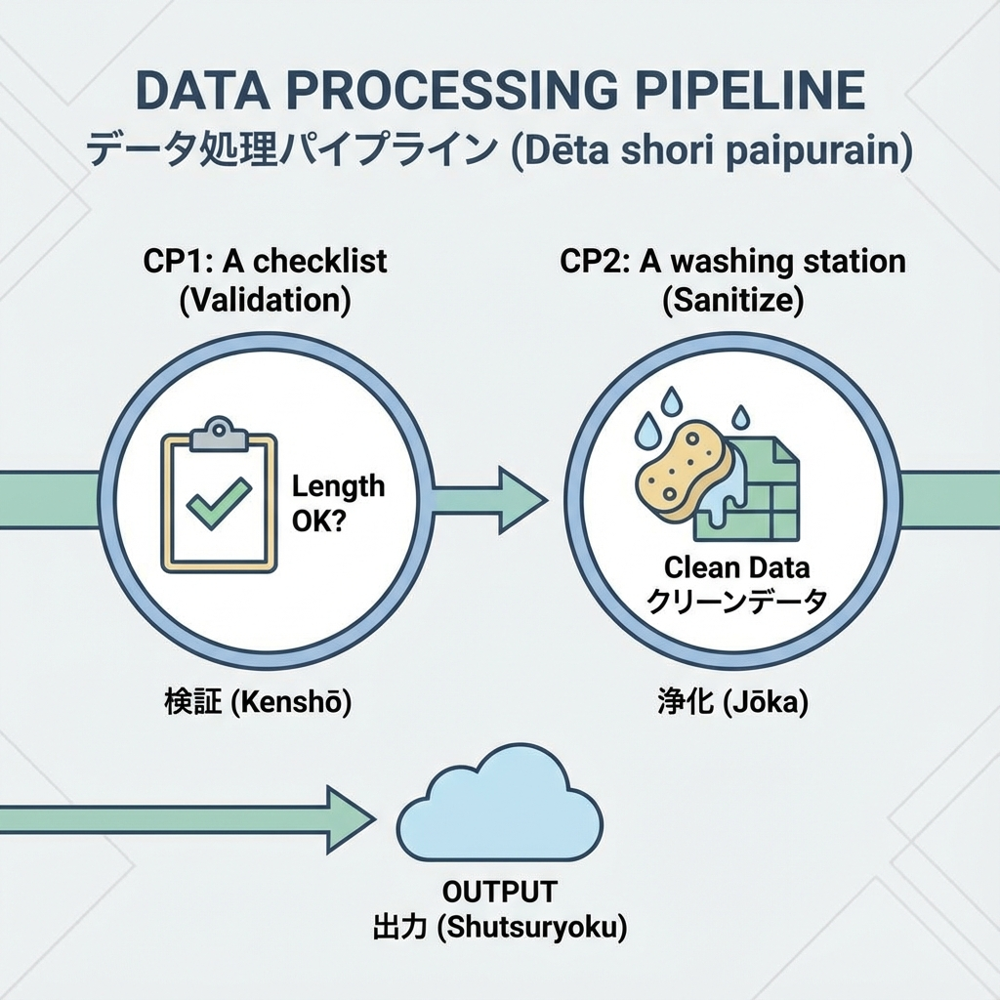
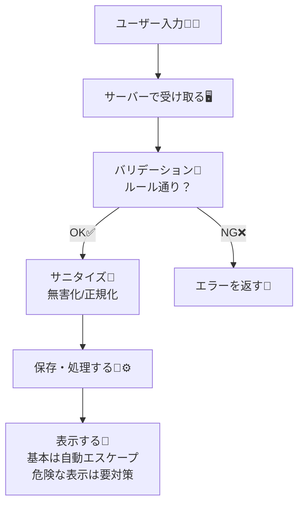

# 第154章：入力のサニタイズとバリデーションの役割分担🧼

この章は「ユーザー入力って怖い…🥲」を「やること決まってれば大丈夫😌」に変える回だよ〜！💪🌸
ポイントは **サニタイズ** と **バリデーション** をごちゃ混ぜにしないこと！🧠✨

---

## 1) 今日のゴール🎯

* ✅ **バリデーション**＝「入力がルール通りか？」を判定できる
* ✅ **サニタイズ**＝「危険になりそうなものを無害化/正規化」できる
* ✅ Next.js（Server Actions / Route Handler）での置き場所が分かる

---

## 2) まず結論：役割分担はこう！📌✨

* **バリデーション（validate）** 🧾
  「この入力、仕様どおり？」を判定する係
  例）文字数、必須、メール形式、数値範囲、enum など

* **サニタイズ（sanitize）** 🧼
  「この入力、危険にならない？」を無害化/正規化する係
  例）前後の空白削除、改行/制御文字の除去、HTMLの無害化（必要なときだけ）

**超大事🔥：バリデーションは “サーバー側で必須”**
クライアント側は「UXを良くするおまけ」だよ〜🙂💕

---

## 3) 図でイメージを固定しよ🧠🫧（Mermaid）





---

## 4) よくある例で理解する💡✨

### バリデーションの例🧾

* 名前：1〜30文字
* メール：メール形式
* 年齢：0〜120
* パスワード：8文字以上、など

👉 「仕様に合ってるか」をチェックするだけ！
**ここでは危険な文字を削る必要はない**（削るのはサニタイズ側）🙅‍♀️

### サニタイズの例🧼

* `trim()` で前後の空白を除去
* 変な制御文字を消す（コピペで混ざるやつ😵）
* **HTMLを受け取る場合だけ**、許可タグ以外を除去（例：`<script>` など）🧨🚫

---

## 5) Next.js ではどこでやる？🏠🛡️

* **Server Actions**：フォーム送信の入口なので超おすすめ🥰📨
* **Route Handlers（app/api/...）**：APIとして受ける入口🎯
* **どちらでも共通**：
  ✅「受け取ったらまずサーバーでバリデーション」→ ✅必要ならサニタイズ

---

## 6) 実装例：Server Actions で「バリデーション→サニタイズ」📮✨

### 6-1) ライブラリ入れる（例）

```bash
npm i zod sanitize-html
```

### 6-2) バリデーション（Zod）を書く🧾

`src/lib/validation.ts`

```ts
import { z } from "zod";

export const contactSchema = z.object({
  name: z
    .string()
    .min(1, "お名前は必須だよ🙂")
    .max(30, "お名前は30文字までだよ🙂"),
  email: z
    .string()
    .min(1, "メールは必須だよ🙂")
    .email("メール形式じゃないかも🥺"),
  message: z
    .string()
    .min(1, "メッセージは必須だよ🙂")
    .max(1000, "メッセージは1000文字までだよ🙂"),
});

export type ContactInput = z.infer<typeof contactSchema>;
```

### 6-3) “軽いサニタイズ” を用意🧼（まずはこれでOK）

`src/lib/sanitize.ts`

```ts
export function sanitizeText(input: string): string {
  // 1) 前後の空白を除去
  const trimmed = input.trim();

  // 2) 目に見えない制御文字を除去（改行やタブは残したいなら調整OK）
  // ここでは「危険になりやすい制御文字」をざっくり消す例
  const withoutControls = trimmed.replace(/[\u0000-\u0008\u000B\u000C\u000E-\u001F\u007F]/g, "");

  // 3) 正規化（見た目が似てる文字の揺れ対策の入口）
  return withoutControls.normalize("NFKC");
}
```

### 6-4) Server Action 側で「まずバリデーション→必要ならサニタイズ」✨

`src/app/contact/actions.ts`

```ts
"use server";

import sanitizeHtml from "sanitize-html";
import { contactSchema } from "@/lib/validation";
import { sanitizeText } from "@/lib/sanitize";

type ActionState =
  | { ok: true }
  | { ok: false; fieldErrors?: Record<string, string[]>; formError?: string };

export async function submitContact(_prev: ActionState, formData: FormData): Promise<ActionState> {
  // 1) 生の入力を取り出す（ここはまだ信用しない🙅‍♀️）
  const raw = {
    name: String(formData.get("name") ?? ""),
    email: String(formData.get("email") ?? ""),
    message: String(formData.get("message") ?? ""),
  };

  // 2) バリデーション（仕様どおり？）
  const parsed = contactSchema.safeParse(raw);
  if (!parsed.success) {
    return { ok: false, fieldErrors: parsed.error.flatten().fieldErrors };
  }

  // 3) サニタイズ（無害化/正規化）
  //    普通のテキストなら trim/normalize みたいな軽いのでOKなことが多いよ🙂
  const safeName = sanitizeText(parsed.data.name);
  const safeEmail = sanitizeText(parsed.data.email);

  //    「HTMLを許可する」入力のときだけ、タグの許可リストでサニタイズするのがコツ🧼✨
  //    今回messageは基本テキスト想定だけど、例として載せるね（HTMLを許可しないなら不要！）
  const safeMessage = sanitizeHtml(sanitizeText(parsed.data.message), {
    allowedTags: [],        // タグを許可しない＝HTMLは全部テキスト扱いにする
    allowedAttributes: {},  // 属性もなし
  });

  // 4) ここで保存/通知など（DBやメール送信）📩
  // await db.contact.create({ data: { name: safeName, email: safeEmail, message: safeMessage } });

  return { ok: true };
}
```

---

## 7) 超よくある誤解3つ😵‍💫→こう考える！

### 誤解①：サニタイズすればバリデーションいらない？🙅‍♀️

**いらないはダメ！**
サニタイズは「無害化」、バリデーションは「仕様チェック」🧼🧾
どっちも役割が違うよ！

### 誤解②：クライアントでチェックしてるからOK？🙅‍♀️

**サーバーで必須！**
ブラウザのチェックは簡単に回避できるよ〜😇

### 誤解③：Reactは勝手に安全にしてくれるから何もしない？😌

Reactは基本エスケープしてくれるけど、
`dangerouslySetInnerHTML` を使うと一気に危険になるよ🧨
**使うなら「HTMLサニタイズ済み」だけ**にしてね🙏✨

---

## 8) 今日のミニチェックリスト✅🧼🧾

* ✅ サーバー側で `safeParse` してる？
* ✅ NGのときは丁寧にエラーを返せてる？🥺
* ✅ サニタイズは「必要な分だけ」やってる？（やりすぎ注意⚠️）
* ✅ HTMLを表示するなら、許可タグ方式でサニタイズしてる？

---

## 9) 練習ミッション🎮✨

1. `name` を「2文字以上」に変えてみよ🙂
2. `message` に `<script>alert(1)</script>` を入れて送ってみて、保存される内容がどうなるか観察👀🧪
3. `allowedTags: []` を `allowedTags: ["b", "i", "br"]` にして、「太字だけ許可」みたいに変えてみよ💄✨（※表示側で `dangerouslySetInnerHTML` を使うなら特に注意！）

---

この章のまとめ🎀
**バリデーション＝仕様チェック🧾 / サニタイズ＝無害化🧼**
入口（Server Actions / API）でちゃんと分けると、セキュリティが一気に安定するよ〜🛡️✨
