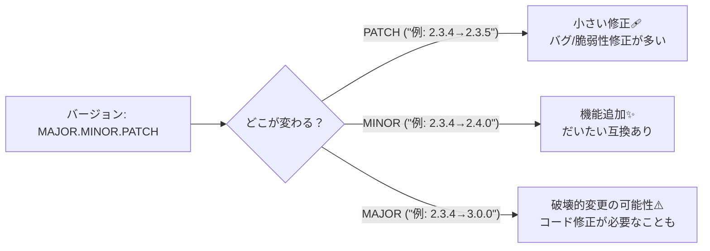
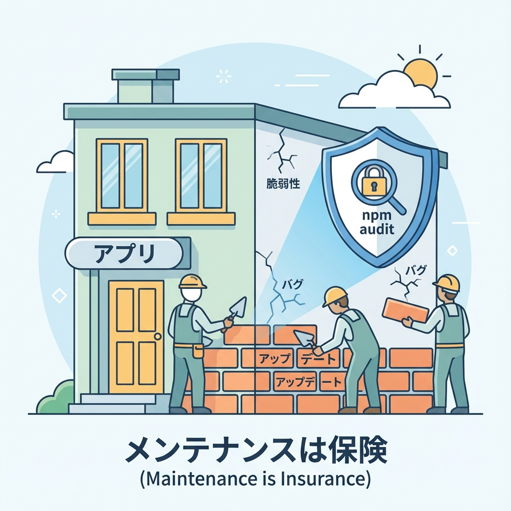
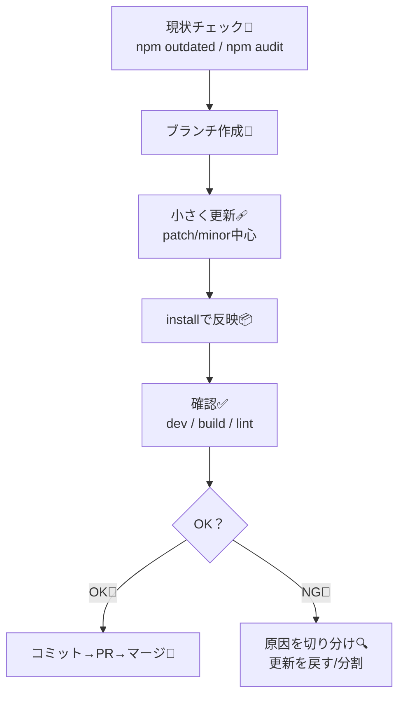

# 第155章：依存関係アップデートは“怖い”じゃなく“保険”🔁

Next.jsの開発って、`next` や `react` だけじゃなくて、たくさんのライブラリ（依存関係）でできてるよね☺️
この依存関係、放置すると「知らないうちに危ない穴（脆弱性）」が残ったり、将来まとめて更新して地獄…になりがち🥺💦
だから、**こまめにアップデート＝保険**なんだよ〜！💪✨

---

## 1) 依存関係アップデートで何が“守られる”の？🧯✨

* 🔐 **セキュリティ修正**（これが最重要！）
* 🐛 **バグ修正**（謎の不具合が消えることも）
* ⚡ **パフォーマンス改善**
* 🧩 **将来のアップデートがラクになる**（溜めるほど怖い）

実際にNext.jsはセキュリティアップデート記事で「パッチ版に上げてね」と促すことがあるよ📣（RSC周りの脆弱性の話など） ([Next.js][1])

---

## 2) アップデートの“種類”をざっくり理解しよ🧠🎯（SemVer）

バージョンってだいたい `MAJOR.MINOR.PATCH`（例：`2.3.4`）で動くよ〜💡 ([npmドキュメント][2])



**気持ちの優先度**はこんな感じ👇

* ✅ PATCH：わりと安心（でも動作確認はする）
* ✅ MINOR：だいたいOK（でも変更点チラ見）
* ⚠️ MAJOR：別枠（時間ある時に、1個ずつ丁寧に）

---

## 3) “保険っぽい”更新フロー（失敗しにくい手順）🧸🔁





---

## 4) 実践コマンド（npmだけでOK）💻✨

### 4-1) まず「古いのある？」を確認👀

* `npm outdated` は「更新できる依存関係あるよ〜」を見つけるコマンドだよ ([npmドキュメント][3])

```bash
npm outdated
```

### 4-2) セキュリティ的に危ないのある？🔐

* `npm audit` は依存関係を監査して、脆弱性をチェックするよ ([npmドキュメント][4])
  （しかも `package-lock.json` の依存ツリーを使って調べる仕組みだよ） ([npmドキュメント][5])

```bash
npm audit
```

### 4-3) まずは“安全寄り”に直す🩹

```bash
npm audit fix
```

> ⚠️ `--force` は強引にメジャー更新が混ざることがあるから、初心者のうちは基本ナシでOK🙅‍♀️（やるなら別ブランチで！）

### 4-4) いまの指定範囲内で更新（わりと安全）🔁

`npm update` は **semverの範囲を尊重して**更新するよ ([npmドキュメント][6])

```bash
npm update
```

---

## 5) “package.json自体”を最新にしたい時（ncu）🧰✨

`npm update` は「今のバージョン指定の範囲内」が基本。
「package.jsonに書いてる範囲ごと最新に寄せたい！」なら **npm-check-updates（ncu）** が便利だよ〜！ ([npm][7])

```bash
npx npm-check-updates
npx npm-check-updates -u
npm install
```

* `npx` ならグローバルインストール無しで使えてラク😆💡
* ただし **メジャー更新が混ざりやすい** ので、1回で全部やらずに「重要なやつから」がおすすめ🧸

---

## 6) “絶対やる”動作確認チェック✅✨

更新したら、最低これだけで安心感が爆上がりするよ〜！🥹💕

```bash
npm run dev
npm run build
npm run lint
```

* `dev`：普段の画面が動く？
* `build`：本番ビルド通る？（ここ超大事！）
* `lint`：型/書き方の事故ない？

---

## 7) 自動で保険をかける（Dependabot）🤖🛡️

「更新、忘れちゃう…🥺」ってなるので、**GitHub Dependabot** でPRを自動で作ってもらうのが強いよ✨
Dependabotは依存関係の更新（通常更新やセキュリティ更新）をPRとして出してくれる仕組みだよ ([GitHub Docs][8])

---

## まとめ：今日のゴール🎯💖

* 依存関係アップデート＝**怖いイベント**じゃなくて、**小さくやる保険**🔁🛡️
* まずはこの2つを習慣化でOK！

  * `npm outdated` で古いのチェック👀 ([npmドキュメント][3])
  * `npm audit` で危ないのチェック🔐 ([npmドキュメント][4])
* こまめにやるほど、未来の自分が助かるよ〜！🥳✨

[1]: https://nextjs.org/blog/security-update-2025-12-11?utm_source=chatgpt.com "Next.js Security Update: December 11, 2025"
[2]: https://docs.npmjs.com/about-semantic-versioning/?utm_source=chatgpt.com "About semantic versioning"
[3]: https://docs.npmjs.com/cli/v8/commands/npm-outdated/?utm_source=chatgpt.com "npm-outdated"
[4]: https://docs.npmjs.com/auditing-package-dependencies-for-security-vulnerabilities/?utm_source=chatgpt.com "Auditing package dependencies for security vulnerabilities"
[5]: https://docs.npmjs.com/cli/v9/commands/npm-audit?utm_source=chatgpt.com "npm-audit"
[6]: https://docs.npmjs.com/cli/v7/commands/npm-update/?utm_source=chatgpt.com "npm-update"
[7]: https://www.npmjs.com/package/npm-check-updates?utm_source=chatgpt.com "npm-check-updates"
[8]: https://docs.github.com/en/code-security/dependabot/working-with-dependabot/managing-pull-requests-for-dependency-updates?utm_source=chatgpt.com "Managing pull requests for dependency updates"
