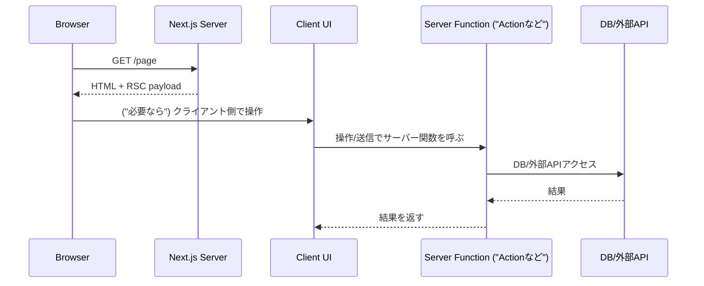
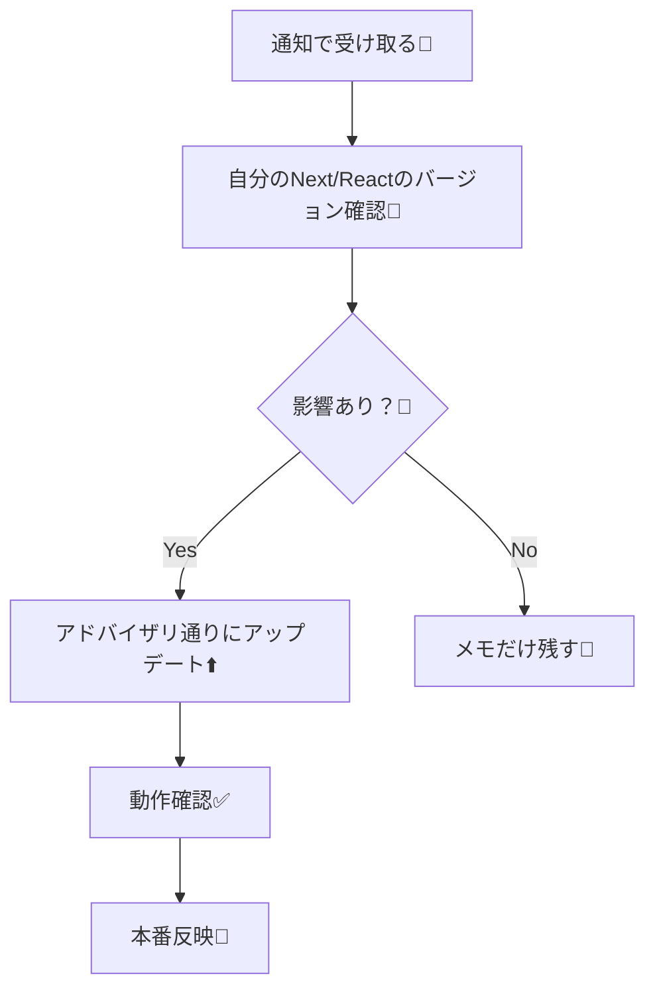

# 第156章：RSC/Server Functions周りの脆弱性情報は必ず追う🧯

この章はひとことで言うと…
**「RSC（React Server Components）や Server Functions（Server Actions含む）は、“新しめで攻撃されやすい境界”だから、脆弱性情報を“通知で受け取れる状態”にしておこうね」**って話だよ〜！📣✨

---

## 1) なんでここだけ“必ず追う”なの？🥺🧠

RSCやServer Functionsは、ざっくり言うと **「サーバー側に“実行される入口”が増える仕組み」** なのね🚪🖥️
だから、もし仕組みに穴があると **サーバー側でヤバいことが起きる** 可能性が出るの…😱

実際に **2025年12月に、RSCまわりで“未認証のRCE（リモートコード実行）”が出て、即アップデート推奨** っていうレベルのものが公式から出てるよ。([React][1])
さらに追加の問題（DoSやソース露出）も続けて告知されていて、「追ってないと置いてかれる」感じになりやすいの🥲([Next.js][2])
（しかも公開後すぐ悪用が観測された、というレポートもあるよ）([Amazon Web Services, Inc.][3])

---

## 2) まずこれだけ！RSC / Server Functions の“境界”イメージ🌉✨


* **RSC**：ページの一部がサーバーで組み立てられて、クライアントへ送られる仕組み🧊📦
* **Server Functions（Server Actionsなど）**：フォーム送信や操作で、クライアントからサーバー側の関数を呼べる仕組み🧑‍🍳➡️🖥️

図にするとこんな感じだよ👇



この「C→F」の部分が“入口”になりやすいから、**RSC/Server Functions系の脆弱性は特に速攻で追う価値が高い**って感じ！🧯💨

---

## 3) 追うべき情報源セット（ここだけ見ればOK）📌🔔

最低ラインはこの4つにしよ〜！✨

1. **React公式ブログ（特にRSC関連のSecurity記事）**
   例：RSCの重大脆弱性の告知が出たよ（CVE付きで詳細あり）([React][1])
2. **Next.js公式ブログのSecurity Update / CVE記事**
   「影響あるNext.jsバージョン」「直すべきバージョン」「やること」がまとまってることが多いよ([Next.js][4])
3. **GitHubの Next.js リポジトリ Security Advisories**
   まとまって一覧で見られる！([GitHub][5])
4. **Dependabot alerts（GitHub）＋通知設定**
   “気づける仕組み”を作るのが最強🥳（週1メールとかもできる）([GitHub Docs][6])

おまけ（ローカルでサクッと確認）

* **npm audit**：依存関係の既知の脆弱性チェック🕵️‍♀️([npmドキュメント][7])

---

## 4) “追う”をラクにするテンプレ（通知→判断→対応）🧠✅

「読むぞ！」って気合じゃなくて、**流れを固定**しよ〜😆



ポイントはここ👇

* **「影響あり？」を確認するために、普段から自分のバージョンが分かる状態**にしておくのが大事💡
* アドバイザリによっては「未パッチで稼働してたならシークレットをローテーションしてね」みたいな追加指示があることもあるよ([Next.js][4])

---

## 5) Windowsでできる“いつもの点検コマンド”🪟💻

プロジェクトのフォルダで（PowerShellでもOK）👇

```bash
npm audit
```

自動で直せるものは👇（ただし大きく変わりそうなら差分を見てね⚠️）

```bash
npm audit fix
```

CIで「重大以上が出たら落とす」もできるよ👇（チーム運用だと便利✨）
※`--audit-level`は“失敗ライン”の指定だよ〜([npmドキュメント][7])

```bash
npm audit --audit-level=high
```

---

## 6) ありがちな落とし穴（この章で覚えておくと強い）🪤😵

* **「Server Functionsがソースを返しちゃう」系の事故**
  Next.jsのSecurity Updateでは、特定条件で **Server Functionsの“コンパイル済みソース”が返る可能性** が説明されてるよ。
  さらに「コードに直書きした秘密情報が混ざると露出しうる」って話も出てる…こわい🥶([Next.js][2])
  👉 対策の方向性：**秘密は環境変数で持つ**、**“直書き”しない**（詳しくは後半でやるやつ！）🔒✨

* **「RSCは使ってないつもり」でも影響することがある**
  React側の告知でも「Server Function endpointを自分で作ってなくても、RSC対応なら影響し得る」って書かれてるよ([React][1])
  👉 対策：**“使ってないから関係ない”って決めつけない**で、アドバイザリの「Affected / Not affected」を読む📖

---

## 7) ミニ課題🎓✨（10分でできる！）

1. 自分のNext.jsプロジェクトで、ルートに `SECURITY-WATCH.md` を作る📝
2. そこにこれを書く（コピペOK）👇

* React公式ブログ（Security）を見る
* Next.js公式ブログ（Security Update / CVE）を見る
* GitHub Security Advisories（vercel/next.js）を見る
* Dependabot alerts をONにして、通知を週1にする

Dependabot通知の設定は公式手順があるよ（週次ダイジェストもできる）([GitHub Docs][6])

---

ここまでできたら、第156章クリア〜！🎉🧯✨
「通知で気づける状態」さえ作れたら、セキュリティは一気にラクになるよ〜😆🔔

[1]: https://react.dev/blog/2025/12/03/critical-security-vulnerability-in-react-server-components "Critical Security Vulnerability in React Server Components – React"
[2]: https://nextjs.org/blog/security-update-2025-12-11 "Next.js Security Update: December 11, 2025 | Next.js"
[3]: https://aws.amazon.com/jp/blogs/news/china-nexus-cyber-threat-groups-rapidly-exploit-react2shell-vulnerability-cve-2025-55182/?utm_source=chatgpt.com "React2Shell 脆弱性 (CVE-2025-55182) に対する中国関連脅威 ..."
[4]: https://nextjs.org/blog/CVE-2025-66478 "Security Advisory: CVE-2025-66478 | Next.js"
[5]: https://github.com/vercel/next.js/security/advisories "Security Advisories · vercel/next.js · GitHub"
[6]: https://docs.github.com/en/code-security/dependabot/dependabot-alerts/configuring-notifications-for-dependabot-alerts?utm_source=chatgpt.com "Configuring notifications for Dependabot alerts"
[7]: https://docs.npmjs.com/cli/v8/commands/npm-audit/ "npm-audit | npm Docs"
