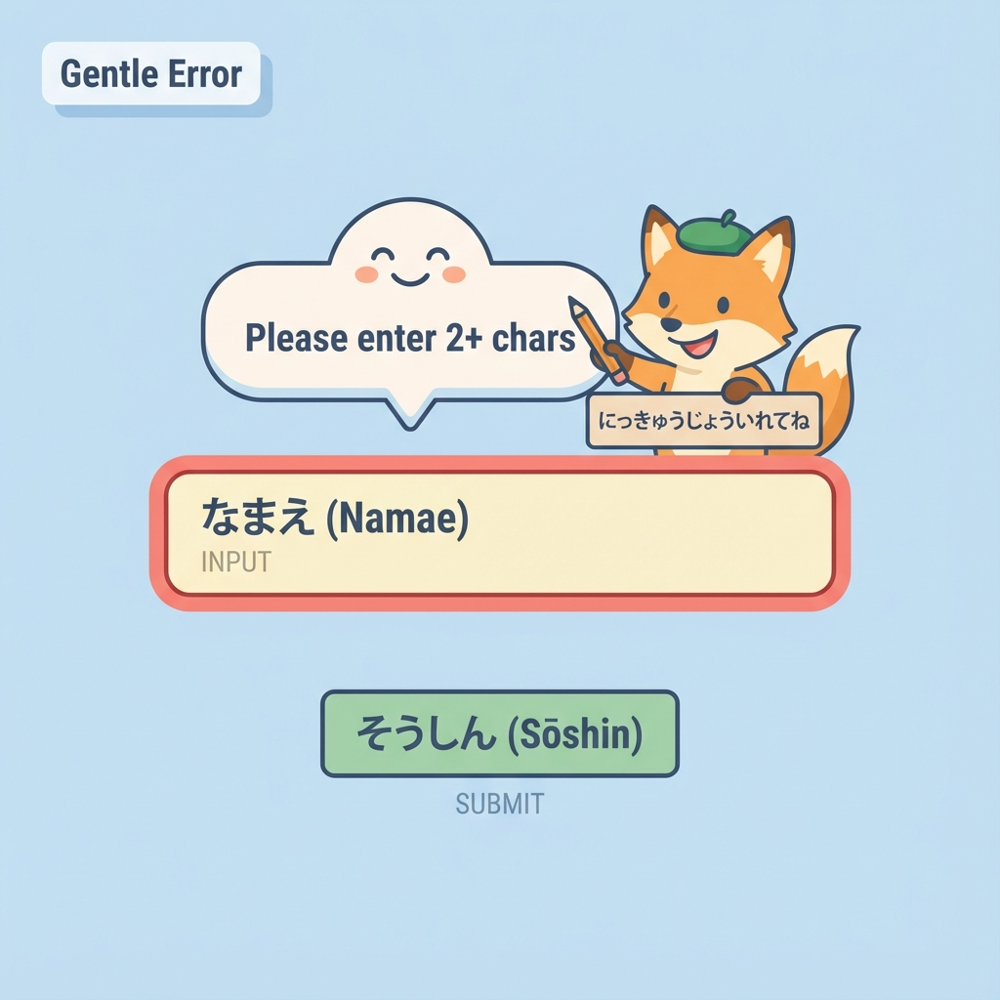
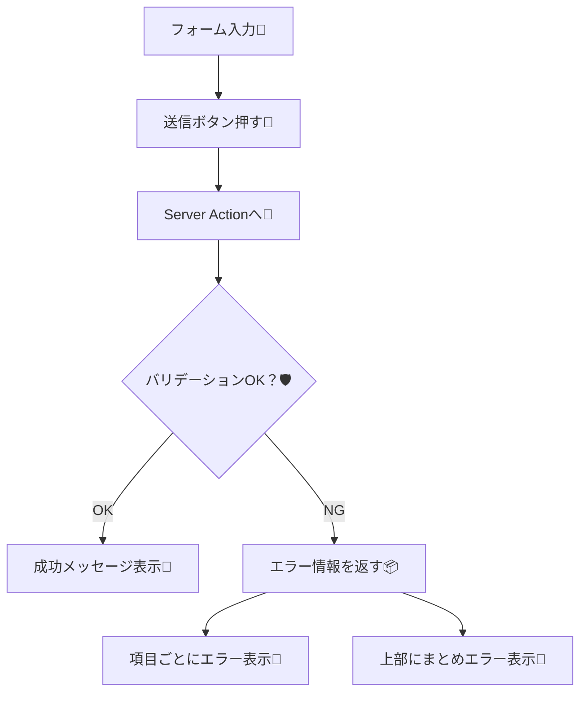

# 第157章：練習：バリデーション失敗を丁寧に表示する🧩

この章では、**フォーム送信 → サーバーでバリデーション → 失敗したら“やさしく”エラー表示**までを、Next.js（App Router）+ Server Actions で作っていくよ〜😊✨
「間違えた人を責めないUI」って、地味だけどアプリの印象がめっちゃ良くなる…！🥹🫶

---

## この章のゴール🎯✨

* サーバー側で入力チェック（バリデーション）できる🛡️
* 失敗したときに

  * **どこがダメか**（項目ごと）
  * **何をすればいいか**（短いメッセージ）
    を表示できる📌😊
* 送信中UI（ボタン無効化など）も付けられる⏳🔘

---

## 今回作るもの📮💬

「お問い合わせミニフォーム」

* 名前（必須・2文字以上）👩‍🎓
* メール（必須・形式チェック）✉️
* 内容（必須・10文字以上）📝
* 失敗したら、それぞれの下にエラー表示＆上にまとめ表示✨

---

## 全体の流れ（図解）🗺️





---

## 手順1：Zodを入れる（入力チェック係）🧪📦

プロジェクトのターミナルで👇（PowerShellでもOK）

```bash
npm i zod
```

---

## 手順2：Server Action（サーバー側バリデーション）を作る🧑‍🍳🛡️


`app/actions/contact.ts` を作って、これを書いてね👇

```ts
// app/actions/contact.ts
"use server";

import { z } from "zod";

const ContactSchema = z.object({
  name: z
    .string()
    .trim()
    .min(2, "お名前は2文字以上でお願いします🙏"),
  email: z
    .string()
    .trim()
    .email("メールアドレスの形式がちがうかも…！✉️"),
  message: z
    .string()
    .trim()
    .min(10, "内容は10文字以上でお願いします📝"),
});

export type ContactActionState = {
  ok: boolean;
  // 項目ごとのエラー（なければ undefined）
  fieldErrors?: Partial<Record<"name" | "email" | "message", string>>;
  // フォーム全体のエラー（例：サーバー障害など）
  formError?: string;
  // 成功メッセージ
  successMessage?: string;
};

export async function submitContact(
  prevState: ContactActionState,
  formData: FormData
): Promise<ContactActionState> {
  const raw = {
    name: String(formData.get("name") ?? ""),
    email: String(formData.get("email") ?? ""),
    message: String(formData.get("message") ?? ""),
  };

  const result = ContactSchema.safeParse(raw);

  // ❌ バリデーション失敗
  if (!result.success) {
    const zodError = result.error.flatten();

    return {
      ok: false,
      fieldErrors: {
        name: zodError.fieldErrors.name?.[0],
        email: zodError.fieldErrors.email?.[0],
        message: zodError.fieldErrors.message?.[0],
      },
      formError: "入力を確認して、もう一度送ってね☺️",
    };
  }

  // ✅ 本来はここでDB保存やメール送信などをする（今回は省略）
  // 例：await saveToDb(result.data)

  return {
    ok: true,
    successMessage: "送信ありがとう〜！届いたよ🎉📮",
  };
}
```

ポイント💡

* **必ずサーバーでチェック**するよ（ブラウザ側だけだと抜け道があるからね…！🛡️😵‍💫）
* エラーは「項目ごと」と「全体メッセージ」に分けると丁寧✨

---

## 手順3：フォームUI（エラー表示つき）を作る🧩💅

`components/ContactForm.tsx` を作ってね👇

```tsx
// components/ContactForm.tsx
"use client";

import { useActionState, useEffect, useMemo, useRef } from "react";
import { submitContact, type ContactActionState } from "@/app/actions/contact";
import { useFormStatus } from "react-dom";

const initialState: ContactActionState = { ok: false };

function SubmitButton() {
  const { pending } = useFormStatus();

  return (
    <button
      type="submit"
      disabled={pending}
      style={{
        padding: "10px 14px",
        borderRadius: 10,
        border: "1px solid #ddd",
        cursor: pending ? "not-allowed" : "pointer",
      }}
    >
      {pending ? "送信中…⏳" : "送信する📮"}
    </button>
  );
}

export default function ContactForm() {
  const [state, action] = useActionState(submitContact, initialState);

  // どこにフォーカスさせるか（最初のエラー項目へ）🎯
  const nameRef = useRef<HTMLInputElement>(null);
  const emailRef = useRef<HTMLInputElement>(null);
  const messageRef = useRef<HTMLTextAreaElement>(null);

  const firstErrorKey = useMemo(() => {
    const fe = state.fieldErrors;
    if (!fe) return null;
    if (fe.name) return "name";
    if (fe.email) return "email";
    if (fe.message) return "message";
    return null;
  }, [state.fieldErrors]);

  useEffect(() => {
    if (!state.ok && firstErrorKey) {
      if (firstErrorKey === "name") nameRef.current?.focus();
      if (firstErrorKey === "email") emailRef.current?.focus();
      if (firstErrorKey === "message") messageRef.current?.focus();
    }
  }, [state.ok, firstErrorKey]);

  const hasErrors =
    !state.ok &&
    (state.formError ||
      state.fieldErrors?.name ||
      state.fieldErrors?.email ||
      state.fieldErrors?.message);

  return (
    <div style={{ maxWidth: 520, padding: 16 }}>
      <h2 style={{ fontSize: 20, marginBottom: 10 }}>お問い合わせ📮✨</h2>

      {/* 上部のまとめメッセージ（やさしい案内） */}
      {hasErrors && (
        <div
          role="alert"
          style={{
            padding: 12,
            borderRadius: 12,
            border: "1px solid #f2c",
            marginBottom: 12,
          }}
        >
          <div style={{ fontWeight: 700 }}>ちょっとだけ確認お願い🙏</div>
          <div style={{ marginTop: 6 }}>{state.formError ?? "入力を見直してね☺️"}</div>
        </div>
      )}

      {/* 成功メッセージ */}
      {state.ok && state.successMessage && (
        <div
          role="status"
          style={{
            padding: 12,
            borderRadius: 12,
            border: "1px solid #7ad",
            marginBottom: 12,
          }}
        >
          {state.successMessage}
        </div>
      )}

      <form action={action} noValidate style={{ display: "grid", gap: 12 }}>
        <div>
          <label htmlFor="name" style={{ display: "block", marginBottom: 6 }}>
            お名前👩‍🎓
          </label>
          <input
            id="name"
            name="name"
            ref={nameRef}
            aria-invalid={Boolean(state.fieldErrors?.name)}
            aria-describedby={state.fieldErrors?.name ? "name-error" : undefined}
            placeholder="例）さくら"
            style={{
              width: "100%",
              padding: "10px 12px",
              borderRadius: 10,
              border: "1px solid #ddd",
            }}
          />
          {state.fieldErrors?.name && (
            <div id="name-error" role="alert" style={{ marginTop: 6 }}>
              ⚠️ {state.fieldErrors.name}
            </div>
          )}
        </div>

        <div>
          <label htmlFor="email" style={{ display: "block", marginBottom: 6 }}>
            メール✉️
          </label>
          <input
            id="email"
            name="email"
            type="email"
            ref={emailRef}
            aria-invalid={Boolean(state.fieldErrors?.email)}
            aria-describedby={state.fieldErrors?.email ? "email-error" : undefined}
            placeholder="example@mail.com"
            style={{
              width: "100%",
              padding: "10px 12px",
              borderRadius: 10,
              border: "1px solid #ddd",
            }}
          />
          {state.fieldErrors?.email && (
            <div id="email-error" role="alert" style={{ marginTop: 6 }}>
              ⚠️ {state.fieldErrors.email}
            </div>
          )}
        </div>

        <div>
          <label htmlFor="message" style={{ display: "block", marginBottom: 6 }}>
            内容📝
          </label>
          <textarea
            id="message"
            name="message"
            ref={messageRef}
            aria-invalid={Boolean(state.fieldErrors?.message)}
            aria-describedby={state.fieldErrors?.message ? "message-error" : undefined}
            placeholder="10文字以上でお願い…！✨"
            rows={5}
            style={{
              width: "100%",
              padding: "10px 12px",
              borderRadius: 10,
              border: "1px solid #ddd",
              resize: "vertical",
            }}
          />
          {state.fieldErrors?.message && (
            <div id="message-error" role="alert" style={{ marginTop: 6 }}>
              ⚠️ {state.fieldErrors.message}
            </div>
          )}
        </div>

        <div style={{ display: "flex", gap: 10, alignItems: "center" }}>
          <SubmitButton />
          <span style={{ opacity: 0.7 }}>ゆっくりで大丈夫だよ〜☺️🌸</span>
        </div>
      </form>
    </div>
  );
}
```

やさしさポイント🫶

* **上にまとめエラー** → 何が起きたかすぐ分かる📌
* **項目の下に具体エラー** → どこ直すか分かる🧩
* **最初のエラーにフォーカス** → 迷子にならない🎯
* `aria-*` を付けて、読み上げにも優しく✨🧑‍🦽

---

## 手順4：ページに置く🏠✨

`app/page.tsx` でフォームを表示するよ👇

```tsx
// app/page.tsx
import ContactForm from "@/components/ContactForm";

export default function Page() {
  return (
    <main style={{ padding: 24 }}>
      <ContactForm />
    </main>
  );
}
```

---

## 動作チェック✅😆

1. `npm run dev` で起動🌈
2. 名前を空、メールを変、内容を短くして送信📮
3. それぞれの下に ⚠️ が出れば成功🎉
4. ちゃんと入れて送ると成功メッセージ🎊

---

## 仕上げのコツ（丁寧さのテンプレ）🧁✨

エラー文言は、だいたいこの型が最強だよ👇😊

* ❌「不正です」「エラー」みたいに冷たい
* ✅「〜を入れてね」「〜だと助かる🙏」みたいに**次の行動が分かる**

例🍀

* 「メール形式が違うかも」✉️
* 「10文字以上でお願い」📝
* 「入力を確認してもう一度」☺️

---

## ミニ課題（やってみよ）💪✨

できたらさらに強くなる🔥

1. **名前に上限**を付けてみて（例：20文字まで）✂️
   ヒント👇

```ts
z.string().trim().min(2, "...").max(20, "お名前は20文字まででお願い🙏")
```

2. **フォーム全体エラー**を「サーバーが混んでる想定」で出してみて🚧
   ヒント：サーバー側でわざとこう返す👇

```ts
return { ok: false, formError: "今ちょっと混み合ってるみたい…！少し待ってからもう一回🙏" };
```

---

ここまでできたら、第157章クリアだよ〜！🎉🧩
次の章（ログイン必須ページの直接アクセス対策🚪）に進む準備もバッチリ😊✨
