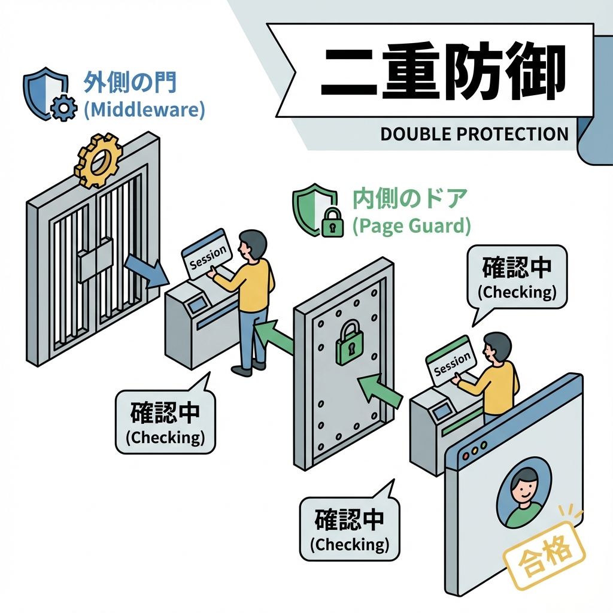
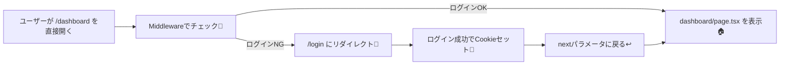

# 第158章：練習：ログイン必須ページの“直接アクセス”対策🚪

ここでは「URLを直接打ってアクセスされても、ちゃんと守れる」ログイン必須ページを作るよ〜😊💪
ポイントは **“クライアントで隠す”じゃなくて、“サーバー側で止める”** こと！🧠✨

---

## まず結論：直接アクセス対策はこの2枚ガードが安心🛡️🛡️

* **① Middlewareで入口チェック**（先に止める）🧤
* **② ページ側でもサーバーでチェック**（万が一の保険）🏠🔍

これで「抜け道」になりやすいパターンを潰せるよ！👍

---

## 図解：アクセスされたときの流れ🧭





---

## 今日作るもの（ミニ構成）🍀

* `/login`：ログイン（ダミーでOK）して **Cookieをセット** 🍪
* `/dashboard`：**ログイン必須** のページ（直アクセス防止）🔐
* `middleware.ts`：`/dashboard` へのアクセスを入口でガード🧤

> 今回は分かりやすさ優先で「Cookieに `session=ok` が入ってたらログイン中」みたいな簡易版でいくよ〜😄
> （本物の認証は後の章で強化できる✨）

---

## Step 1：Server Actionでログイン/ログアウトを作る🍪✨

`app/login/actions.ts` を作ってね👇

```ts
"use server";

import { cookies } from "next/headers";
import { redirect } from "next/navigation";

export async function loginAction(formData: FormData) {
  const email = String(formData.get("email") ?? "");
  const password = String(formData.get("password") ?? "");
  const nextPath = String(formData.get("next") ?? "/dashboard");

  // ✅ ここは練習用：入力があればログイン成功にしちゃう
  if (!email || !password) {
    // 本当はエラー表示したいけど、158章は「ガード」が主役なので簡易でOK😊
    redirect(`/login?next=${encodeURIComponent(nextPath)}`);
  }

  // ✅ Cookieセット（練習用）
  cookies().set("session", "ok", {
    httpOnly: true,
    sameSite: "lax",
    path: "/",
    // 本番は secure: true にするのが基本（https前提）🔒
  });

  redirect(nextPath);
}

export async function logoutAction() {
  cookies().delete("session");
  redirect("/login");
}
```

---

## Step 2：ログインページを作る `/login` 🚪💕

`app/login/page.tsx` を作ってね👇

```tsx
import { loginAction } from "./actions";

type Props = {
  searchParams: Promise<{ next?: string }>;
};

export default async function LoginPage({ searchParams }: Props) {
  const { next } = await searchParams;
  const nextPath = next ?? "/dashboard";

  return (
    <main style={{ padding: 24 }}>
      <h1>ログイン😊🔑</h1>
      <p>（練習用なので、適当に入力してOKだよ〜✍️✨）</p>

      <form action={loginAction} style={{ display: "grid", gap: 12, maxWidth: 360 }}>
        <input type="hidden" name="next" value={nextPath} />

        <label>
          メール📧
          <input name="email" placeholder="a@example.com" style={{ width: "100%", padding: 8 }} />
        </label>

        <label>
          パスワード🔒
          <input
            name="password"
            type="password"
            placeholder="password"
            style={{ width: "100%", padding: 8 }}
          />
        </label>

        <button type="submit" style={{ padding: 10 }}>
          ログインする✨
        </button>
      </form>
    </main>
  );
}
```

---

## Step 3：ログイン必須ページ `/dashboard` を作る（ページ側ガード）🏠🔐

ここが大事！✨
**ページ自体がサーバーでCookieを確認して、ダメなら即リダイレクト**するよ🚦

`app/dashboard/page.tsx` を作ってね👇

```tsx
import { cookies } from "next/headers";
import { redirect } from "next/navigation";
import { logoutAction } from "../login/actions";

export default async function DashboardPage() {
  const cookieStore = await cookies();
  const session = cookieStore.get("session")?.value;

  // ✅ ②ページ側ガード：直アクセスでもここで止められる
  if (session !== "ok") {
    redirect("/login?next=/dashboard");
  }

  return (
    <main style={{ padding: 24 }}>
      <h1>ダッシュボード🏠✨</h1>
      <p>ログインできてる人だけ見れるページだよ〜😆🔐</p>

      <form action={logoutAction}>
        <button type="submit" style={{ padding: 10 }}>
          ログアウト🚪
        </button>
      </form>
    </main>
  );
}
```

---

## Step 4：middleware.ts で入口ガード（直アクセスの第一防衛線）🧤🛡️

プロジェクト直下に `middleware.ts` を作成👇

```ts
import type { NextRequest } from "next/server";
import { NextResponse } from "next/server";

export function middleware(req: NextRequest) {
  const { pathname } = req.nextUrl;

  // ✅ /dashboard 配下を全部守る（/dashboard, /dashboard/settings など）
  if (pathname.startsWith("/dashboard")) {
    const session = req.cookies.get("session")?.value;

    if (session !== "ok") {
      const loginUrl = req.nextUrl.clone();
      loginUrl.pathname = "/login";
      loginUrl.searchParams.set("next", pathname);
      return NextResponse.redirect(loginUrl);
    }
  }

  return NextResponse.next();
}

// ✅ middlewareを当てる範囲（最小にするのがコツ！）
export const config = {
  matcher: ["/dashboard/:path*"],
};
```

---

## 動作チェック（ここまでできたら勝ち🏁🎉）

1. `npm run dev` で起動🌈
2. **シークレット（または別ブラウザ）**で `/dashboard` を開く🕵️‍♀️
   → ✅ `/login?next=/dashboard` に飛べばOK🚪✨
3. ログインフォームに適当入力して送信✍️
   → ✅ `/dashboard` に戻って表示されればOK🏠🎉
4. ログアウト🚪
   → ✅ `/login` に戻って、もう一回 `/dashboard` 直アクセスしても弾かれればOK🔐

---

## よくあるNG例（これだけは避けてね🙅‍♀️💦）

* **NG：Client Componentの `useEffect()` で「ログインしてないなら戻す」**
  → これだと「一瞬見えたり」「API叩けたり」しがち😵
  ✅ 正解は **Middleware / Server側で止める** だよ！

---

## ミニ追加課題（余裕あったら✨）🎯

「ページは守れてるけど、APIは…？」ってなることあるよね😳
なので `/api/secret` も守ってみよう！

`app/api/secret/route.ts`

```ts
import { cookies } from "next/headers";

export async function GET() {
  const cookieStore = await cookies();
  const session = cookieStore.get("session")?.value;

  if (session !== "ok") {
    return Response.json({ error: "Unauthorized" }, { status: 401 });
  }

  return Response.json({ secret: "ここはログイン中だけ見れる😎✨" });
}
```

---

これで「URL直打ち」でも破れにくい、ログイン必須ページの基本ガード完成だよ〜！😆🛡️✨
