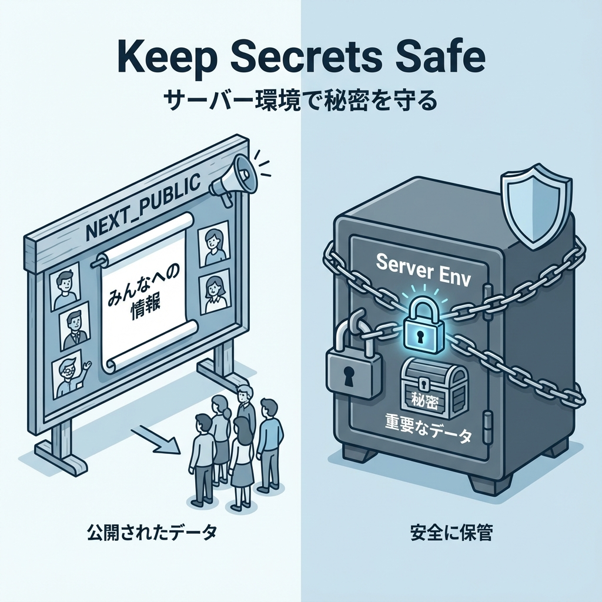
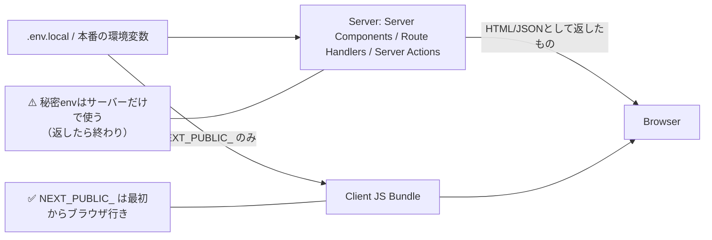

# 第159章：練習：環境変数の漏えいを防ぐ（公開/非公開の区別）🔒

今日は「**環境変数（env）をうっかり漏らさない**」練習をするよ〜！🥹🫶
Next.jsは便利だけど、**設定ミスすると秘密がブラウザに出ちゃう**ことがあるの…！😱💦

---

## この章のゴール🎯

* ✅ **公開してOKなenv** と **絶対に秘密なenv** を区別できる
* ✅ Next.jsで「秘密がクライアントに出ない」書き方ができる
* ✅ 「漏れてないかチェック」までできる🔍✨

---

## まず覚えるルール3つ📌（ここ超重要！）

1. **`NEXT_PUBLIC_` が付いたenvはブラウザに配信される（＝公開）** 🌍
2. **秘密（APIキーなど）は `NEXT_PUBLIC_` を付けない** 🔑❌
3. **サーバーで読んでも、画面に表示したら漏えい（HTMLに乗る）** 🫣💥

---

## 図でイメージしよ〜🧠🪄（公開/非公開の流れ）





---

## ハンズオン🧪：公開envと秘密envを分けて使ってみる💡

### 0) `.env.local` を用意する🔧

プロジェクト直下に `.env.local` を作って、こう書いてね👇（値は例だよ〜）

```dotenv
NEXT_PUBLIC_SITE_TITLE="Campus TODO 🌸"
PAYMENT_API_KEY="sk_test_123456789_secret"
```

> 📝 **envを変えたら `npm run dev` は再起動**してね！（反映されないこと多いよ〜）🔁✨

---

## 1) envを「public用」「server用」で分ける📦✨

### `src/env/public.ts`（公開OKだけ）

```ts
export const publicEnv = {
  siteTitle: process.env.NEXT_PUBLIC_SITE_TITLE ?? "My App",
} as const;
```

### `src/env/server.ts`（秘密だけ：クライアントに絶対持っていかせない）

```ts
import "server-only";

export const serverEnv = {
  paymentApiKey: process.env.PAYMENT_API_KEY ?? "",
} as const;

if (!serverEnv.paymentApiKey) {
  // 開発中は気づけるように、空ならエラーにしちゃうのもアリ👍
  console.warn("⚠️ PAYMENT_API_KEY が未設定だよ！");
}
```

`import "server-only";` を入れると、**うっかりクライアント側からimportしたときに事故りにくく**なるよ🛡️✨（好き！）

---

## 2) 公開envを「クライアントコンポーネント」で表示してみる🌸

### `app/_components/SiteTitle.tsx`

```tsx
"use client";

import { publicEnv } from "@/env/public";

export function SiteTitle() {
  return (
    <h1 style={{ fontSize: 24, fontWeight: 700 }}>
      {publicEnv.siteTitle} 🎀
    </h1>
  );
}
```

---

## 3) 秘密envは「サーバーだけ」で使って、結果だけ返す🔐

### API（Route Handler）を作る：`app/api/secure/route.ts`

「秘密キーが設定されてるか」だけ返すよ（キー自体は絶対返さない！）🙅‍♀️🔑

```ts
import { NextResponse } from "next/server";
import { serverEnv } from "@/env/server";

export async function GET() {
  const configured = serverEnv.paymentApiKey.length > 0;

  return NextResponse.json({
    configured,
    message: configured ? "OK! 🔐" : "未設定だよ…🥲",
  });
}
```

---

## 4) クライアントから安全にチェックしてみる👀✨

### `app/_components/SecretCheckClient.tsx`

```tsx
"use client";

import { useEffect, useState } from "react";

type ApiResponse = {
  configured: boolean;
  message: string;
};

export function SecretCheckClient() {
  const [data, setData] = useState<ApiResponse | null>(null);

  useEffect(() => {
    fetch("/api/secure")
      .then((r) => r.json())
      .then((json: ApiResponse) => setData(json))
      .catch(() => setData({ configured: false, message: "取得失敗…😵‍💫" }));
  }, []);

  if (!data) return <p>確認中…⏳</p>;

  return (
    <p>
      サーバー秘密キーの状態：{" "}
      <b>{data.configured ? "設定済み✅" : "未設定❌"}</b> / {data.message}
    </p>
  );
}
```

---

## 5) ページに置く🏠✨（Server Component）

### `app/page.tsx`

```tsx
import { SiteTitle } from "./_components/SiteTitle";
import { SecretCheckClient } from "./_components/SecretCheckClient";

export default function Page() {
  return (
    <main style={{ padding: 24, lineHeight: 1.8 }}>
      <SiteTitle />

      <hr style={{ margin: "16px 0" }} />

      <p>このページは「env漏えいしない練習」だよ〜🫶🔒</p>
      <SecretCheckClient />

      <p style={{ marginTop: 16 }}>
        ※ 秘密キーはサーバー側でだけ使って、ブラウザには出さないのが正解✨
      </p>
    </main>
  );
}
```

---

## 🚨 絶対やっちゃダメ集（ここ試験に出る）😱🧨

### ❌ 1) 秘密envに `NEXT_PUBLIC_` を付ける

```dotenv
NEXT_PUBLIC_PAYMENT_API_KEY="sk_test_..."
```

これ、**そのままブラウザに配られる**可能性が高いよ…！終わり！😭💥

### ❌ 2) クライアントで秘密envを読もうとする

```tsx
"use client";
console.log(process.env.PAYMENT_API_KEY);
```

秘密は「ブラウザで見えていい」世界じゃないよ〜🙅‍♀️🔑

### ❌ 3) サーバーで読んだ秘密を“返す/表示する”

```ts
return NextResponse.json({ key: serverEnv.paymentApiKey }); // ←即アウト😇
```

---

## 漏れてないかチェックする🔍✨（Windows向け）

`PAYMENT_API_KEY` の値（例：`sk_test_123456789_secret`）が、ビルド成果物に混ざってないか探すよ！

### PowerShellで探す🪟

```powershell
npm run build
Get-ChildItem .next\static -Recurse -Filter *.js | Select-String -Pattern "sk_test_123456789_secret"
```

* ✅ **何も出なければOK** 🎉
* ❌ 出たらどこかで漏れてる！（`NEXT_PUBLIC_` や、クライアントimport事故を疑う）😱

---

## 仕上げチェックリスト✅🔒

* [ ] 公開していいものだけ `NEXT_PUBLIC_` にした？🌍
* [ ] 秘密キーを **画面/JSON/ログ** に出してない？🙅‍♀️
* [ ] 秘密を読むモジュールは `server-only` を入れた？🛡️
* [ ] `.env.local` をGitに入れてない？（基本入れない！）🫣
* [ ] ビルド後に `.next/static` を検索しても秘密が出ない？🔍✨

---

## ミニ課題🎓✨（この章の練習）

* `/api/secure` のレスポンスに
  `hint: "configured"` みたいな **安全な情報だけ**を足してみてね😊
* 逆に、**秘密そのものを返したらどう危険か**を言葉で説明してみてね🧠💬

---

ここまでできたら、envの「公開/非公開」かなり強いよ〜！🥳🔒✨
