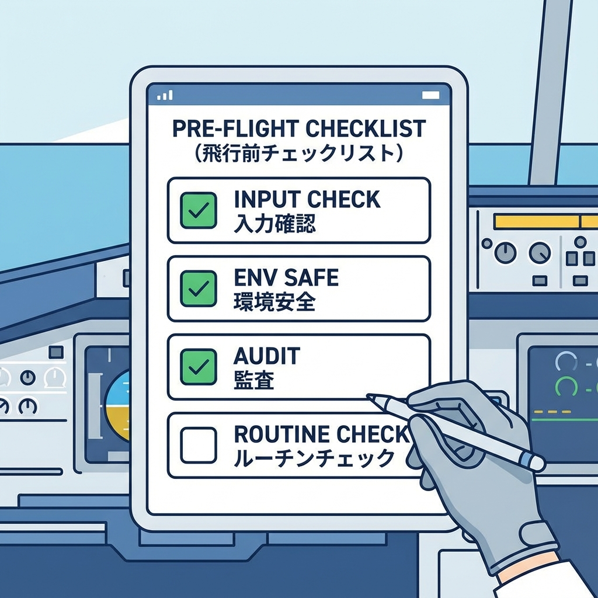
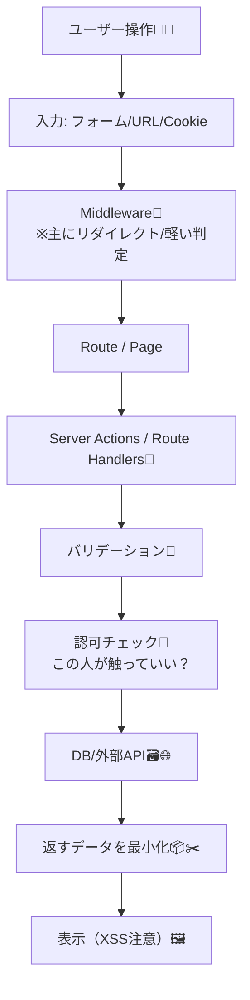

# 第160章：復習：セキュリティは“毎回ちょい意識”が最強💪

ここまで来たあなた、えらすぎる〜！🎓💕
この章は「難しい技」じゃなくて、**毎回ちょっとだけ意識して事故を防ぐ習慣**をまとめる回だよ😊🌸

---

## 今日のゴール🎯✨

* セキュリティを「イベント」じゃなく「習慣」にする🧠🔁
* Next.jsで特に事故りやすいポイントを、チェック項目にできる✅📝
* “今の自分”でもできる、最小ルーティンを持ち帰る🏠✨

---

## “毎回ちょい意識”って、こういうことだよ🫶

セキュリティって「完璧」を目指すとしんどい…🥲
だからおすすめはこれ👇

> **「作るたびに、同じ小さな確認をする」**
> → これだけで事故率がぐっと下がるよ📉✨

Next.jsはServer ComponentsやServer Actionsで「サーバー寄り」になるぶん、**データの扱い方の前提が変わる**のがポイントだよ〜！🧊🔄 ([Next.js][1])

---

## まずはこれだけ覚えて💡 セキュリティの“5つの質問”🖐️🛡️

### ① 入力は信用してない？🧨

* フォーム、URLパラメータ、Cookie、外部API…ぜんぶ「怪しい」前提😈
* **サーバー側でバリデーション**する（ここ超大事）🛡️

### ② 表示で危ないことしてない？🖼️

* JSXは基本エスケープしてくれるから安全寄り☺️
* でも **`dangerouslySetInnerHTML` は最終手段**だよ🙅‍♀️💥（やるならサニタイズ必須） ([React][2])

### ③ 「見えていいデータ」だけ返してる？🫣

* APIやServer Actionsで、**必要なものだけ返す**（丸ごと返し禁止）📦✂️

### ④ 権限チェックを“どこで”やってる？🚪

* Middlewareは便利だけど、**それだけに頼らない**（UXの門番くらいに）🧤
* 本命は **データに触れる場所（Server Actions / Route Handlers / DBアクセス層）で毎回チェック**🔒 ([Next.js][3])

### ⑤ 秘密（env）と依存関係、放置してない？🔐📦

* `NEXT_PUBLIC_` が付く環境変数は**ブラウザに出る**＝秘密にしちゃダメ🙅‍♀️ ([Next.js][4])
* 依存関係は **`npm audit`** で定期点検🩺（放置が一番こわい） ([docs.npmjs.com][5])

---

## 図解：Next.jsの“守る場所”のイメージ🛡️🧱



「どこで守るか」が分かると迷子にならないよ😊🗺️



---

## “毎回ちょい意識”チェックリスト✅📝（コピペOK）

開発の区切り（機能1個できた時）に、これだけ見る👀✨

* [ ] **入力はサーバーでバリデーション**した？🧼
* [ ] **認可（この人OK？）をデータアクセス前に**入れた？🔑
* [ ] **`dangerouslySetInnerHTML` 使ってない？**（使うならサニタイズ）🙅‍♀️ ([React][2])
* [ ] **返すデータが多すぎない？**（不要な情報返してない？）📦✂️
* [ ] **`.env.local` に秘密置いた？ `NEXT_PUBLIC_` に置いてない？**🔐 ([Next.js][4])
* [ ] **CSP/セキュリティヘッダー**を意識した？🧱（最小でOK） ([Next.js][6])
* [ ] **`npm audit`** をたまに回した？🩺 ([docs.npmjs.com][7])

---

## ミニ演習💻✨：30秒セキュリティ点検コマンドを作ろう🧪🎀

WindowsのターミナルでOKだよ〜🪟💕

### ① package.json に “点検コマンド”を用意✅

（すでにあったら追加しなくてOK！）

```json
{
  "scripts": {
    "check:security": "npm audit",
    "check:all": "npm run lint && npm run check:security"
  }
}
```

* `npm audit` は依存関係の脆弱性チェックだよ🩺📦 ([docs.npmjs.com][5])
* 余裕が出たら、月1で回すだけでもかなり違う🔁✨

---

## ミニ演習💻✨：ヘッダーで“ガード感”を出す🧱🛡️

Next.jsは `next.config.js` でレスポンスヘッダーを付けられるよ📬 ([Next.js][8])
さらにCSP（Content Security Policy）も大事な防御になるよ🧱✨ ([Next.js][6])

※下は「最小の雰囲気サンプル」だよ（アプリ要件で調整してね）😊

```js
// next.config.js
/** @type {import('next').NextConfig} */
const nextConfig = {
  async headers() {
    return [
      {
        source: "/(.*)",
        headers: [
          { key: "X-Content-Type-Options", value: "nosniff" },
          { key: "Referrer-Policy", value: "strict-origin-when-cross-origin" },
          { key: "X-Frame-Options", value: "DENY" }
        ],
      },
    ];
  },
};

module.exports = nextConfig;
```

---

## よくある“うっかり事故”あるある🐣💥（回避ワード付き）

* 「`NEXT_PUBLIC_` にAPIキー入れちゃった😇」
  → **それ、ブラウザに出る前提**だよ！秘密はサーバー側のenvへ🔐 ([Next.js][4])
* 「認証してるからOKでしょ？でDB返しすぎ」
  → **最小のデータだけ返す**（プロフィール全部返さない）📦✂️
* 「Middlewareで守ってるから安心」
  → **データに触る場所でも認可チェック**が本命だよ🔑 ([Next.js][3])
* 「`dangerouslySetInnerHTML` 便利〜！」
  → 原則NG🙅‍♀️（使うなら信頼できる/サニタイズ済みだけ） ([React][2])

---

## 1分クイズ⏱️🎓✨（答えは下👇）

1. `NEXT_PUBLIC_` が付く環境変数はどこで読める？🌐
2. `dangerouslySetInnerHTML` が危ない理由は？🧨
3. 権限チェックは「どこでやる」のが一番大事？🔑

**答え🎀**

1. ブラウザ側にもバンドルされ得る＝秘密は置いちゃダメだよ🔐 ([Next.js][4])
2. HTMLをそのまま注入できて、XSSの入口になりやすいからだよ🧨 ([React][2])
3. **データに触れる直前（Server Actions / Route Handlers / DBアクセス）**が最重要だよ🔒 ([Next.js][3])

---

## 今日のまとめ🎁✨

* セキュリティは「一撃必殺」じゃなくて **小さい確認の積み重ね**🔁🛡️
* Next.jsはサーバー寄りだからこそ、**データアクセス前の認可＆バリデーション**が超大事🔑🧼 ([Next.js][1])
* 迷ったらこの合言葉👇
  **「入力は疑う・出力は慎重・秘密は出さない・依存は点検」**💪✨

[1]: https://nextjs.org/docs/app/guides/data-security?utm_source=chatgpt.com "Guides: Data Security"
[2]: https://react.dev/reference/react-dom/components/common?utm_source=chatgpt.com "Common components (e.g. <div>)"
[3]: https://nextjs.org/docs/app/guides/authentication?utm_source=chatgpt.com "Guides: Authentication"
[4]: https://nextjs.org/docs/pages/guides/environment-variables?utm_source=chatgpt.com "Guides: Environment Variables"
[5]: https://docs.npmjs.com/auditing-package-dependencies-for-security-vulnerabilities/?utm_source=chatgpt.com "Auditing package dependencies for security vulnerabilities"
[6]: https://nextjs.org/docs/app/guides/content-security-policy?utm_source=chatgpt.com "Guides: Content Security Policy"
[7]: https://docs.npmjs.com/cli/v9/commands/npm-audit?utm_source=chatgpt.com "npm-audit"
[8]: https://nextjs.org/docs/app/api-reference/config/next-config-js/headers?utm_source=chatgpt.com "next.config.js: headers"
